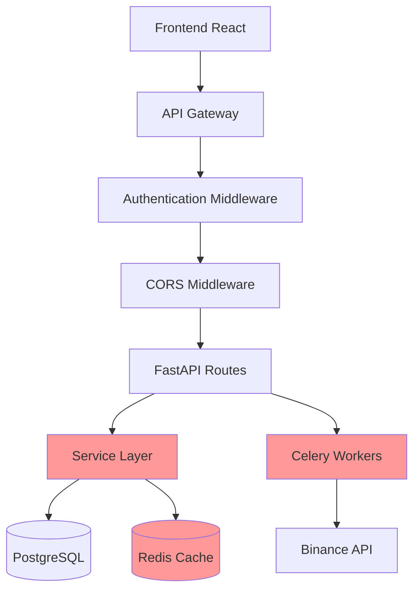

# TradeBot Dokümantasyon İnceleme ve Eksiklik Analizi

## Genel Bakış

Bu analiz, TradeBot projesinin mevcut dokümantasyonunu inceleyerek eksik olan, tamamlanmayan veya yetersiz dokümante edilen alanları belirlemektedir. Proje, cryptocurrency trading bot'u olarak geliştirilmiş full-stack bir uygulamadır ve kapsamlı bir dokümantasyon yapısına sahiptir.

## Mevcut Dokümantasyon Yapısı

### Güçlü Yönler

- **Kapsamlı API Dokümantasyonu**: Tüm endpoint'ler detaylı olarak dokümante edilmiş
- **Aşamalı Geliştirme Planı**: MVP'den gelişmiş özelliklere kadar net roadmap
- **Teknik Stack ve Deployment**: Teknoloji seçimleri ve deployment stratejisi açık
- **Database Şeması**: Veritabanı ilişkileri ve migration'lar dokümante
- **Güvenlik Rehberi**: Temel güvenlik prensipler belirtilmiş

## Eksik ve Yetersiz Dokümante Edilen Alanlar

### 1. Sistem Mimarisi ve Bileşen Etkileşimleri

**Eksik:**

- **Middleware Pipeline**: CORS, authentication, error handling middleware'lerin detaylı dokümantasyonu
- **Service Layer Architecture**: `BacktestService` gibi service sınıfların mimari dokümantasyonu
- **Cache Layer**: `DataCache` sınıfının cache stratejileri ve performans optimizasyonları
- **Real-time Communication**: SSE (Server-Sent Events) implementasyonu ve WebSocket entegrasyonu
- **State Management**: Frontend Zustand store yapısı ve data flow



### 2. Error Handling ve Logging Strategy

**Eksik:**

- **Centralized Error Handling**: Global exception handler'ların ve error response formatlarının dokümantasyonu
- **Logging Architecture**: Structured logging, log levels, ve monitoring entegrasyonu
- **Error Recovery**: Automatic retry mechanisms ve fallback strategies
- **Frontend Error Boundaries**: React error handling ve user feedback mechanisms

| Komponenet | Mevcut Durum | Eksik Alan |
|------------|--------------|------------|
| Backend Error Handling | Temel HTTP exceptions | Centralized error mapper, error codes |
| Frontend Error Handling | Basic try-catch | Error boundaries, user feedback |
| Logging Strategy | Console logging | Structured logging, log aggregation |
| Monitoring | - | APM integration, metrics collection |

### 3. Testing Strategy ve Quality Assurance

**Eksik:**

- **Comprehensive Testing Documentation**: Unit, integration, ve e2e test stratejileri
- **Test Environment Setup**: Test database configuration ve mock services
- **Performance Testing**: Load testing procedures ve benchmarking
- **Security Testing**: Penetration testing ve vulnerability assessment guidelines

```mermaid
pyramid
    title Testing Pyramid
    "E2E Tests" : 20
    "Integration Tests" : 30
    "Unit Tests" : 50
```

### 4. Deployment ve DevOps

**Eksik:**

- **CI/CD Pipeline**: GitHub Actions workflows ve automated deployment
- **Environment Configuration**: Development, staging, production environment differences
- **Backup and Recovery**: Database backup strategies ve disaster recovery procedures
- **Monitoring ve Alerting**: Production monitoring setup ve alerting rules
- **Scaling Strategies**: Horizontal scaling ve load balancing configuration

### 5. Developer Experience ve Contribution Guidelines

**Eksik:**

- **Development Workflow**: Branch strategy, code review process, commit conventions
- **IDE Setup**: VSCode/PyCharm configuration, debugging setup
- **Local Development**: Hot reload, development tools, debugging procedures
- **Contribution Guidelines**: Pull request templates, coding standards, issue templates

### 6. Advanced Features Implementation

**Eksik:**

- **Algorithm Implementation**: Trading strategy algorithms ve indicator calculations
- **WebSocket Integration**: Real-time price feeds ve bot status updates
- **Background Job Processing**: Celery task queue management ve job scheduling
- **Data Validation**: Pydantic schemas ve validation rules
- **API Rate Limiting**: Request throttling ve abuse prevention

### 7. User Experience ve Frontend Architecture

**Eksik:**

- **Component Architecture**: React component hierarchy ve design patterns
- **State Management Flow**: Zustand store interactions ve side effects
- **UI/UX Guidelines**: Design system, component library, accessibility
- **Responsive Design**: Mobile compatibility ve responsive breakpoints

### 8. Security Implementation Details

**Eksik:**

- **JWT Implementation**: Token refresh, blacklisting, ve security headers
- **Encryption Details**: Fernet key management ve rotation procedures
- **Input Validation**: Data sanitization ve SQL injection prevention
- **API Security**: Rate limiting, CORS configuration, authentication flows

### 9. Data Management ve Analytics

**Eksik:**

- **Data Pipeline**: Historical data collection ve processing workflows
- **Analytics Implementation**: Performance metrics calculation ve reporting
- **Data Retention**: Data archiving strategies ve compliance requirements
- **Backup Strategies**: Database backup automation ve recovery testing

### 10. Production Operations

**Eksik:**

- **Health Checks**: Service health monitoring ve availability checks
- **Performance Monitoring**: Application performance metrics ve optimization
- **Log Management**: Log rotation, aggregation, ve analysis tools
- **Incident Response**: Error notification systems ve troubleshooting guides

## Öncelikli Dokümantasyon İhtiyaçları

### Yüksek Öncelik

1. **System Architecture Diagram**: Tüm bileşenlerin etkileşim diyagramı
2. **Error Handling Documentation**: Centralized error management strategy
3. **Testing Guidelines**: Comprehensive testing framework documentation
4. **Development Workflow**: Local setup ve contribution guidelines

### Orta Öncelik

5. **Performance Optimization**: Caching strategies ve optimization guidelines
6. **Security Implementation**: Detailed security measures documentation
7. **Monitoring Setup**: Production monitoring ve alerting configuration
8. **API Rate Limiting**: Request throttling implementation

### Düşük Öncelik

9. **Advanced Features**: WebSocket ve real-time features
10. **Analytics Dashboard**: Reporting ve analytics implementation
11. **Mobile Optimization**: Responsive design guidelines
12. **Internationalization**: Multi-language support documentation

## Dokümantasyon Standardizasyonu

### Eksik Standartlar

- **Code Documentation**: Docstring conventions ve inline commenting
- **API Documentation**: OpenAPI/Swagger specification completeness
- **README Templates**: Component-level README files
- **Change Log**: Version history ve breaking changes documentation

### Önerilen İyileştirmeler

- **Interactive Documentation**: Swagger UI ile live API testing
- **Video Tutorials**: Setup ve development workflow video guides
- **FAQ Section**: Common issues ve troubleshooting
- **Best Practices**: Code style guides ve architectural decisions

## Sonuç

TradeBot projesi güçlü bir dokümantasyon temeline sahip olmakla birlikte, özellikle sistem mimarisi, error handling, testing strategy ve production operations alanlarında önemli eksiklikler bulunmaktadır. Bu alanların dokümante edilmesi, projenin maintainability, developer experience ve production readiness açısından kritik önem taşımaktadır.
