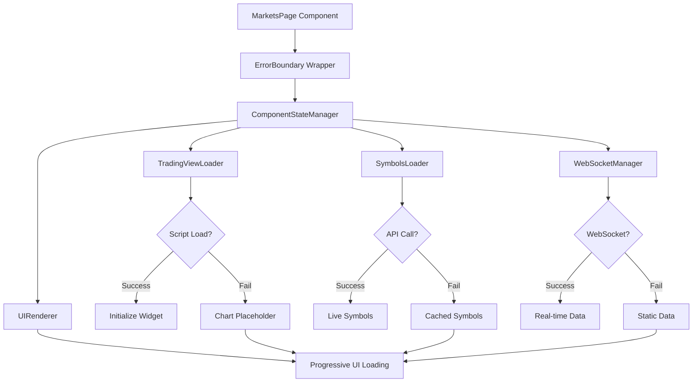
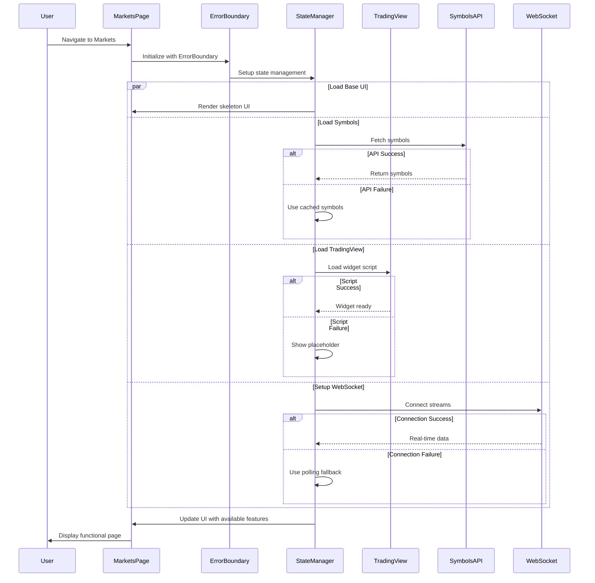

# Markets Page Error Resilience Enhancement

## Overview

The Markets page experiences intermittent white screen failures preventing users from accessing market data, TradingView charts, and real-time trading information. This enhancement implements comprehensive error handling, fallback mechanisms, and resilience patterns to ensure consistent page functionality.

**Target Component**: `frontend/src/pages/Markets/MarketsPage.jsx`

**Problem**: Page renders blank screen after initial successful loads due to external dependency failures

**Solution**: Multi-layered error resilience with graceful degradation patterns

## Architecture

### Current Component Dependencies

| Dependency | Type | Failure Risk | Current Handling |
|------------|------|--------------|------------------|
| TradingView Widget | External Script | High | None |
| Binance WebSocket | Real-time Stream | Medium | Basic retry |
| Symbols API | REST Endpoint | Medium | Error throwing |
| LocalStorage | Browser API | Low | No fallback |

### Failure Point Analysis

**External Dependencies**

- TradingView script loading from s3.tradingview.com
- Multiple WebSocket streams (Binance, Coinbase)
- Backend API endpoints for symbol data

**Component State Vulnerabilities**

- Unhandled promise rejections
- Missing error boundaries
- State management race conditions
- Memory leaks from persistent connections

### Error Resilience Architecture



### Resilience Patterns

**Circuit Breaker Pattern**

- Monitor failure rates for external dependencies
- Auto-switch to fallback modes when thresholds exceeded
- Periodic health checks for recovery

**Graceful Degradation**

- Core UI always loads regardless of external failures
- Enhanced features added progressively as dependencies succeed
- Clear visual indicators for degraded functionality

### Component Structure Enhancement

**Error Boundary Implementation**

```
MarketsPageErrorBoundary
├── FallbackUI (Error State)
├── RetryMechanism
└── MarketsPage (Protected Component)
    ├── ComponentStateProvider
    ├── TradingViewSection
    │   ├── WidgetLoader
    │   ├── ChartPlaceholder
    │   └── RetryButton
    ├── SymbolsSection
    │   ├── SymbolsLoader
    │   ├── CachedSymbols
    │   └── StaticFallback
    └── MarketDataSection
        ├── WebSocketManager
        ├── ConnectionStatus
        └── StaticDataFallback
```

**State Management Pattern**

```
ComponentState {
  loading: LoadingStates,
  errors: ErrorCollection,
  features: FeatureAvailability,
  fallbacks: FallbackData,
  retryCount: number
}
```

**Progressive Loading Strategy**

| Phase | Component | Fallback | Retry Logic |
|-------|-----------|----------|-------------|
| 1 | Base UI | Always succeeds | N/A |
| 2 | Symbols API | Cached data | Exponential backoff |
| 3 | TradingView | Static placeholder | Manual retry |
| 4 | WebSocket | Polling fallback | Automatic reconnect |

### Data Flow Architecture



### Error Handling Implementation

**Component State Interface**

```
MarketPageState {
  ui: {
    loading: boolean,
    error: string | null,
    retryCount: number
  },
  features: {
    tradingView: 'loading' | 'ready' | 'failed',
    symbols: 'loading' | 'loaded' | 'cached' | 'static',
    webSocket: 'connecting' | 'connected' | 'disconnected',
    realTimeData: boolean
  },
  fallbacks: {
    symbolsCache: Symbol[],
    lastKnownData: MarketData,
    staticConfig: StaticMarketConfig
  }
}
```

**Retry Strategy Pattern**

| Component | Initial Retry | Max Retries | Backoff Strategy |
|-----------|---------------|-------------|------------------|
| Symbols API | Immediate | 3 | Exponential (1s, 2s, 4s) |
| TradingView | Manual | User-triggered | N/A |
| WebSocket | Auto | Infinite | Linear (5s intervals) |

## Testing

### Unit Testing Focus

- Error boundary catch and recovery
- State management transitions
- Fallback data handling
- Retry mechanism logic

### Integration Testing Scenarios

| Scenario | Expected Behavior | Success Criteria |
|----------|------------------|------------------|
| API Timeout | Show cached symbols | Page remains functional |
| TradingView Blocked | Display placeholder | Chart section shows fallback |
| WebSocket Failure | Polling mode active | Data updates continue |
| Complete Network Loss | Static mode | Basic UI remains usable |

### Error Recovery Validation

- Manual retry button functionality
- Automatic reconnection behavior
- State persistence across failures
- User experience during degraded modes
