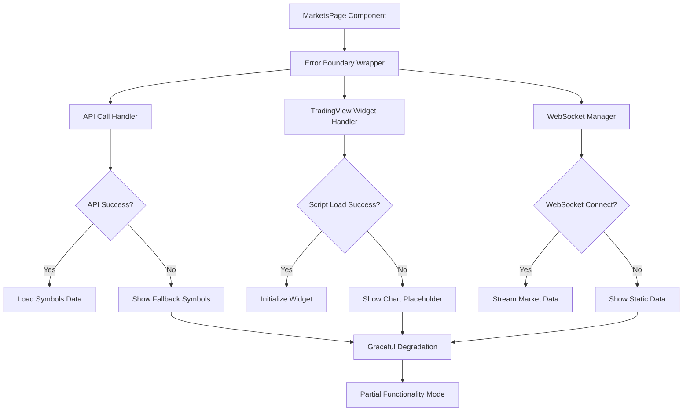

# Markets Page White Screen Issue Fix

## Overview

The Markets page (Piyasalar sekmesi) is experiencing a white screen issue where the page fails to load properly after initially working correctly. This is a critical frontend bug that prevents users from accessing real-time market data, charts, and trading information.

## Problem Analysis

### Current Issue

- **Symptom**: Markets page shows blank/white screen instead of the expected interface
- **Impact**: Users cannot access market data, TradingView charts, order books, or trade tapes
- **User Report**: "Piyasalar sekmesi istediğim gibi çalışmıyor ilk yaptığımda çalışma sorunu yoktu daha sonra ise sadece beyaz ekran geliyor"

### Component Architecture Analysis

The MarketsPage component has several complex dependencies:

- **TradingView Widget**: External script loading from s3.tradingview.com
- **WebSocket Connections**: Multiple real-time data streams (Binance, Coinbase)
- **Symbol Data**: API calls to backend for trading symbols
- **Local Storage**: Favorites and watchlist persistence
- **Dynamic State Management**: Multiple useState hooks for different data streams

## Root Cause Investigation

### Potential Failure Points

1. **TradingView Script Loading Failure**
   - External script dependency from s3.tradingview.com
   - CSP (Content Security Policy) restrictions
   - Network connectivity issues

2. **API Endpoint Failures**
   - `/api/v1/symbols/spot` endpoint errors
   - Authentication token issues
   - Backend service unavailability

3. **WebSocket Connection Failures**
   - Binance WebSocket stream connection issues
   - Coinbase WebSocket connection problems
   - Network firewall blocking WebSocket protocols

4. **JavaScript Runtime Errors**
   - Unhandled exceptions causing component crash
   - Memory leaks from WebSocket connections
   - State management conflicts

5. **Browser Compatibility Issues**
   - localStorage access restrictions
   - WebSocket support limitations
   - TradingView widget compatibility

## Solution Architecture

### Error Handling Enhancement



### Component Resilience Strategy

1. **Progressive Loading**: Load core UI first, then enhance with real-time features
2. **Fallback Mechanisms**: Provide static data when dynamic sources fail
3. **Error Boundaries**: Catch and handle component crashes gracefully
4. **Retry Logic**: Implement automatic retry for failed API calls and connections
5. **User Feedback**: Show meaningful error messages and loading states

## Implementation Strategy

### Phase 1: Error Detection and Logging

**Enhanced Error Logging**

- Add comprehensive try-catch blocks around critical operations
- Implement console debugging for development mode
- Add error state management for user feedback

**Component Health Monitoring**

- Track TradingView widget initialization status
- Monitor WebSocket connection states
- Log API response success/failure rates

### Phase 2: Fallback Implementation

**TradingView Widget Fallback**

- Implement static chart placeholder when TradingView fails
- Add manual retry mechanism for widget loading
- Provide alternative chart visualization options

**Symbols API Fallback**

- Use cached symbols data when API fails
- Implement static symbol list as ultimate fallback
- Add retry mechanism with exponential backoff

**WebSocket Fallback**

- Show last known data when WebSocket disconnects
- Implement periodic REST API polling as fallback
- Add connection status indicators

### Phase 3: User Experience Enhancement

**Loading States**

- Add skeleton screens for loading states
- Implement progressive content loading
- Show specific loading messages for different operations

**Error Recovery**

- Add "Retry" buttons for failed operations
- Implement automatic background retry for critical features
- Provide manual refresh options

## Technical Implementation

### Error Boundary Component

```javascript
class MarketsPageErrorBoundary extends React.Component {
  constructor(props) {
    super(props);
    this.state = { hasError: false, error: null };
  }

  static getDerivedStateFromError(error) {
    return { hasError: true, error };
  }

  componentDidCatch(error, errorInfo) {
    console.error('MarketsPage Error:', error, errorInfo);
  }

  render() {
    if (this.state.hasError) {
      return <MarketsPageFallback onRetry={() => window.location.reload()} />;
    }
    return this.props.children;
  }
}
```

### Enhanced State Management

```javascript
const [componentState, setComponentState] = useState({
  loading: true,
  error: null,
  tradingViewReady: false,
  symbolsLoaded: false,
  webSocketConnected: false
});
```

### Improved Error Handling Pattern

```javascript
const handleApiCall = async (apiFunction, fallbackData) => {
  try {
    const result = await apiFunction();
    return { success: true, data: result };
  } catch (error) {
    console.error('API call failed:', error);
    return { success: false, data: fallbackData, error };
  }
};
```

## Testing Strategy

### Functional Testing

- Test Markets page loading under various network conditions
- Verify fallback mechanisms when external services fail
- Test error recovery and retry functionality

### Integration Testing

- Test TradingView widget initialization across browsers
- Verify WebSocket connection handling
- Test API endpoint error responses

### User Acceptance Testing

- Verify user experience during network interruptions
- Test loading states and error messages
- Confirm functionality with and without real-time data

## Monitoring and Maintenance

### Error Tracking

- Implement client-side error logging
- Monitor TradingView widget load success rates
- Track WebSocket connection stability

### Performance Monitoring

- Monitor component render performance
- Track memory usage for WebSocket connections
- Monitor API response times

### User Feedback Collection

- Add user-reportable error functionality
- Collect browser and environment information for debugging
- Implement usage analytics for feature adoption

## Deployment Strategy

### Development Phase

1. Implement error boundaries and logging
2. Add fallback mechanisms for critical features
3. Test extensively in development environment

### Staging Phase

1. Deploy to staging environment
2. Conduct thorough testing with production-like data
3. Validate error handling under stress conditions

### Production Deployment

1. Deploy during low-traffic hours
2. Monitor error rates and user feedback
3. Have rollback plan ready for immediate issues

## Success Metrics

### Technical Metrics

- **Error Rate Reduction**: Target <1% page load failures
- **Load Time Improvement**: Target <3 seconds for initial page load
- **WebSocket Stability**: Target >95% connection success rate

### User Experience Metrics

- **User Satisfaction**: Measured through feedback and usage analytics
- **Feature Adoption**: Monitor usage of Markets page features
- **Support Tickets**: Reduction in white screen related issues

## Risk Assessment

### High Risk

- **External Dependencies**: TradingView and external APIs beyond our control
- **Browser Compatibility**: Varying WebSocket and localStorage support

### Medium Risk

- **Performance Impact**: Additional error handling may impact page load times
- **Code Complexity**: Increased complexity from fallback mechanisms

### Low Risk

- **Data Accuracy**: Fallback data may be less current than real-time streams

## Conclusion

This comprehensive fix addresses the Markets page white screen issue through a multi-layered approach focusing on error resilience, fallback mechanisms, and user experience enhancement. The solution ensures that users always have access to market functionality, even when external dependencies fail, while providing clear feedback about system status and recovery options.
