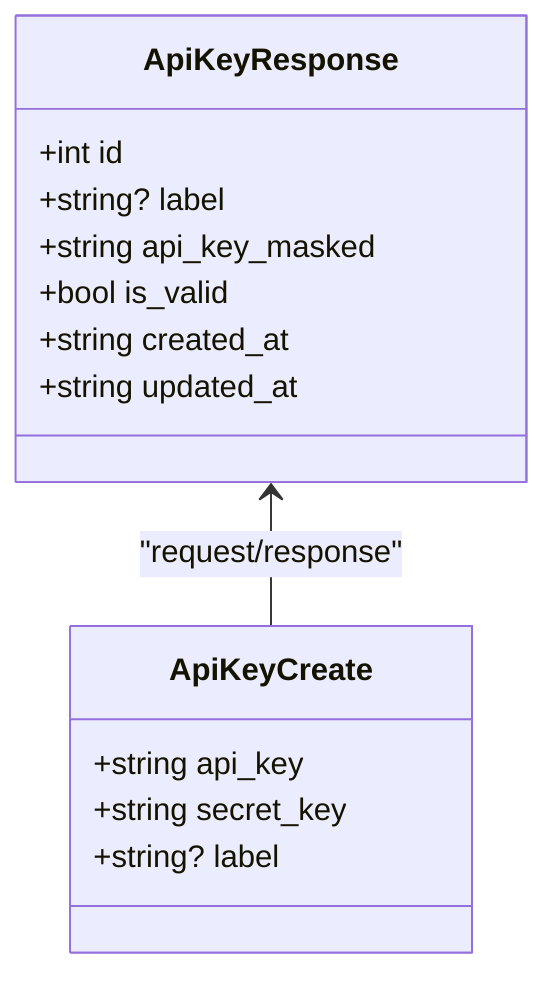
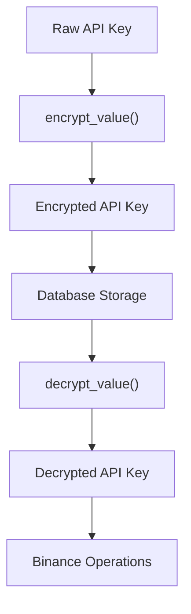
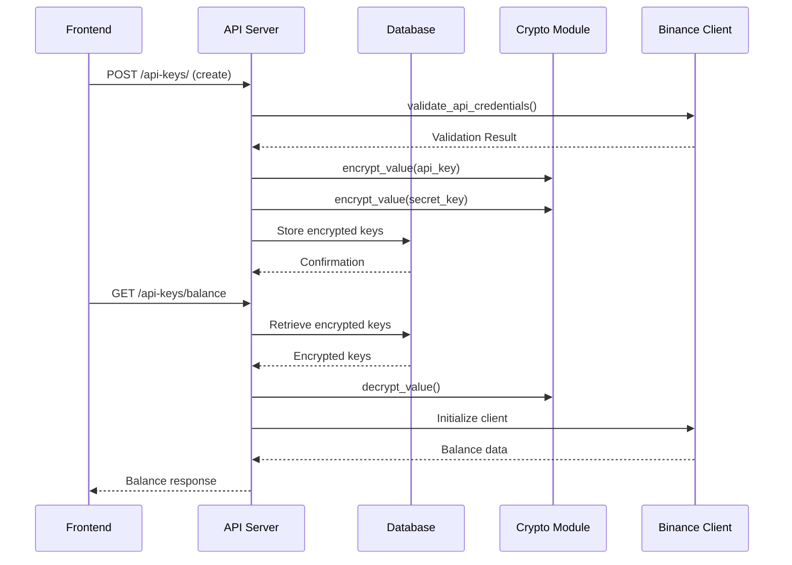
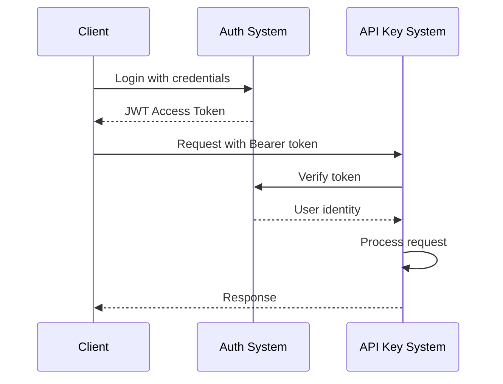

# API Key Management API

<cite>
**Referenced Files in This Document**   
- [api_key.py](file://app/api/routes/api_key.py)
- [api_key.py](file://app/schemas/api_key.py)
- [api_key.py](file://app/models/api_key.py)
- [crypto.py](file://app/core/crypto.py)
- [binance_client.py](file://app/core/binance_client.py)
- [auth.py](file://app/dependencies/auth.py)
- [bot_config.py](file://app/models/bot_config.py)
</cite>

## Table of Contents
1. [Introduction](#introduction)
2. [API Endpoints](#api-endpoints)
3. [Request/Response Formats](#requestresponse-formats)
4. [Security Implementation](#security-implementation)
5. [Database Schema](#database-schema)
6. [Integration with Trading System](#integration-with-trading-system)
7. [Authentication and Authorization](#authentication-and-authorization)
8. [Error Handling](#error-handling)
9. [Usage Examples](#usage-examples)
10. [Frontend Integration](#frontend-integration)

## Introduction
The API Key Management system provides secure CRUD operations for managing encrypted Binance API keys. This documentation covers the endpoints, data formats, security mechanisms, and integration points for the `/api-keys` API. The system allows users to create, retrieve, and delete their Binance API credentials with robust security measures including AES encryption, JWT authentication, and permission validation.

The API key management is a critical component of the trading system, serving as the bridge between user accounts and Binance exchange functionality. Each user can store one encrypted API key pair that is used for executing trades, retrieving balances, and managing positions.

**Section sources**
- [api_key.py](file://app/api/routes/api_key.py#L17-L90)

## API Endpoints
The API Key Management system exposes the following endpoints for managing Binance API credentials:

### POST /api/v1/api-keys/
Creates a new encrypted API key for the authenticated user. The system validates the API credentials with Binance before storing them.

### GET /api/v1/api-keys/me
Retrieves the current user's API key information with masked API key display. Returns 404 if no API key exists.

### DELETE /api/v1/api-keys/me
Deletes the current user's API key and all associated bot configurations. This operation is irreversible.

**Section sources**
- [api_key.py](file://app/api/routes/api_key.py#L17-L90)

## Request/Response Formats
This section details the request and response formats for API key operations.

### Request Format for Creating API Keys
```json
{
  "api_key": "string",
  "secret_key": "string",
  "label": "string (optional)"
}
```

### Response Format for API Key Operations
```json
{
  "id": 0,
  "label": "string",
  "api_key_masked": "string",
  "is_valid": true,
  "created_at": "string",
  "updated_at": "string"
}
```

The response includes a masked version of the API key (first 4 and last 4 characters visible) for security purposes, while the secret key is never exposed in responses.



**Diagram sources**
- [api_key.py](file://app/schemas/api_key.py#L6-L44)

## Security Implementation
The system implements multiple layers of security to protect sensitive API credentials.

### Encryption Mechanism
API keys are encrypted using AES encryption via the Fernet symmetric encryption scheme before being stored in the database. The encryption key is managed through environment variables, with strict requirements in production environments.



**Diagram sources**
- [crypto.py](file://app/core/crypto.py#L17-L23)

### Key Storage and Retrieval
The encryption process uses the `cryptography.fernet` library to ensure secure storage of API credentials. In production environments, the Fernet key must be provided via the `FERNET_KEY` environment variable, preventing hardcoded keys.

When retrieving API keys for trading operations, the system decrypts the stored credentials only when needed and keeps them in memory for the minimal required time.

**Section sources**
- [crypto.py](file://app/core/crypto.py#L1-L24)

## Database Schema
The API key data is stored in the `api_keys` table with the following structure:

```mermaid
erDiagram
API_KEYS {
int id PK
int user_id FK
string encrypted_api_key
string encrypted_secret_key
string? label
boolean is_valid
timestamp created_at
timestamp updated_at
}
USERS {
int id PK
string email
string hashed_password
boolean is_active
}
BOT_CONFIGS {
int id PK
int api_key_id FK
string name
string symbol
}
API_KEYS ||--o{ USERS : "belongs to"
API_KEYS ||--o{ BOT_CONFIGS : "used by"
```

**Diagram sources**
- [api_key.py](file://app/models/api_key.py#L5-L16)
- [bot_config.py](file://app/models/bot_config.py#L30-L58)

## Integration with Trading System
The API key management system integrates with the trading functionality through the Binance client wrapper.

### Binance Client Integration
When trading operations require API access, the system retrieves the encrypted credentials from the database, decrypts them, and initializes the Binance client wrapper.



**Diagram sources**
- [api_key.py](file://app/api/routes/api_key.py#L92-L152)
- [binance_client.py](file://app/core/binance_client.py#L18-L35)

### Bot Configuration Relationship
Each API key can be associated with multiple bot configurations. When an API key is deleted, all linked bot configurations are also removed to maintain data integrity.

**Section sources**
- [api_key.py](file://app/api/routes/api_key.py#L70-L89)
- [bot_config.py](file://app/models/bot_config.py#L30-L58)

## Authentication and Authorization
The API key management system implements strict authentication and authorization controls.

### JWT Authentication
All endpoints require JWT authentication using Bearer tokens. The system validates the token and extracts the user identity before processing any requests.



**Diagram sources**
- [auth.py](file://app/dependencies/auth.py#L20-L36)
- [jwt.py](file://app/core/jwt.py#L38-L44)

### Authorization Checks
The system implements the following authorization rules:
- Users can only access their own API key
- Only active users can manage API keys
- Each user can have only one API key at a time
- API key creation requires valid Binance credentials

**Section sources**
- [auth.py](file://app/dependencies/auth.py#L38-L41)
- [api_key.py](file://app/api/routes/api_key.py#L20-L23)

## Error Handling
The system provides comprehensive error handling for API key operations.

### Common Error Responses
- **400 Bad Request**: Invalid API credentials, duplicate API key, or validation errors
- **401 Unauthorized**: Invalid or missing JWT token
- **404 Not Found**: No API key found for the user
- **403 Forbidden**: Inactive user account
- **500 Internal Server Error**: Binance connectivity issues

When API credentials are invalid, the system returns detailed error messages from Binance's API, including specific error codes and suggestions for resolution.

**Section sources**
- [api_key.py](file://app/api/routes/api_key.py#L35-L45)
- [binance_client.py](file://app/core/binance_client.py#L52-L67)

## Usage Examples
This section provides practical examples of API key management operations.

### Creating a New API Key
To create a new API key, send a POST request with your Binance API credentials:

```http
POST /api/v1/api-keys/
Authorization: Bearer <jwt_token>
Content-Type: application/json

{
  "api_key": "your_binance_api_key",
  "secret_key": "your_binance_secret_key",
  "label": "Main Account"
}
```

The system will validate the credentials with Binance, encrypt them, and store them securely.

### Retrieving API Key Information
To retrieve your API key information:

```http
GET /api/v1/api-keys/me
Authorization: Bearer <jwt_token>
```

The response will include the masked API key and other metadata, but never the secret key.

**Section sources**
- [api_key.py](file://app/api/routes/api_key.py#L17-L68)

## Frontend Integration
The API key management system is integrated with the frontend application through dedicated components and services.

### Frontend Components
The `ApiKeysPage.jsx` component provides a user interface for managing API keys, including:
- Form for adding new API keys
- Display of existing API key (masked)
- Confirmation dialog for deletion
- Error and success messaging

### API Service Integration
The frontend uses an API service to communicate with the backend, handling JWT authentication and response processing. When a user adds an API key, the frontend collects the credentials and sends them securely to the backend for validation and storage.

**Section sources**
- [ApiKeysPage.jsx](file://frontend/src/pages/ApiKeys/ApiKeysPage.jsx#L1-L89)
- [api.js](file://frontend/src/services/api.js)