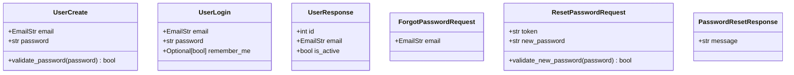
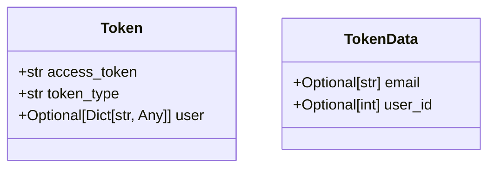
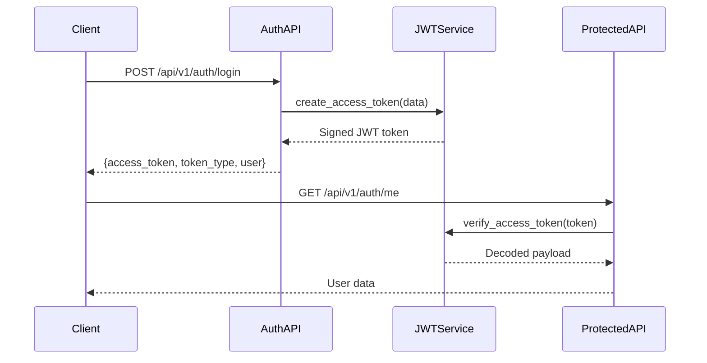
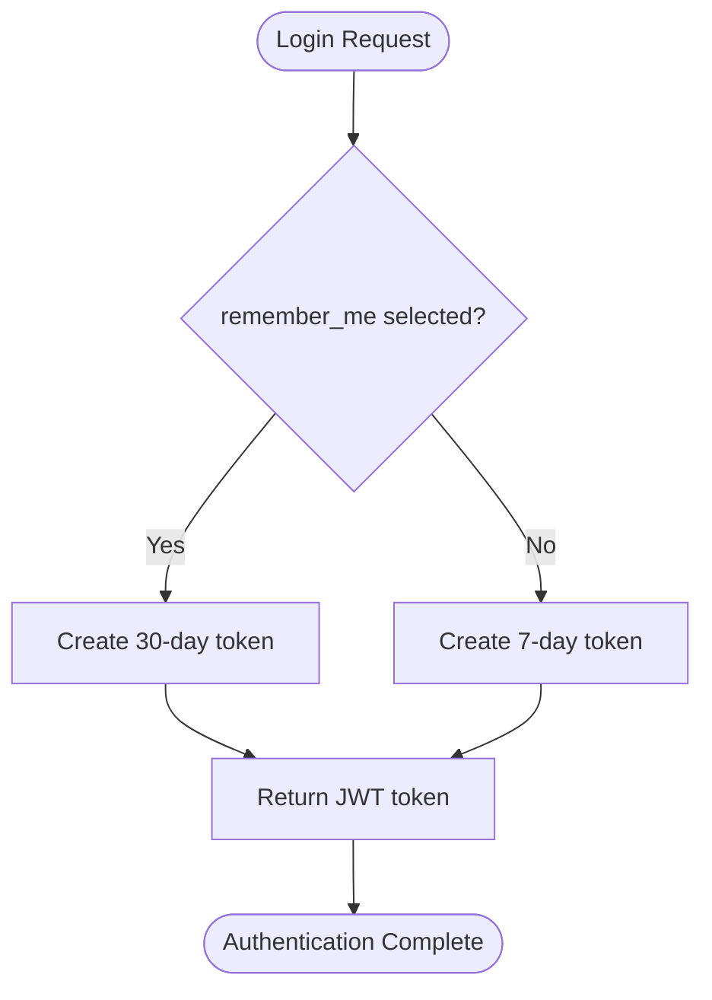
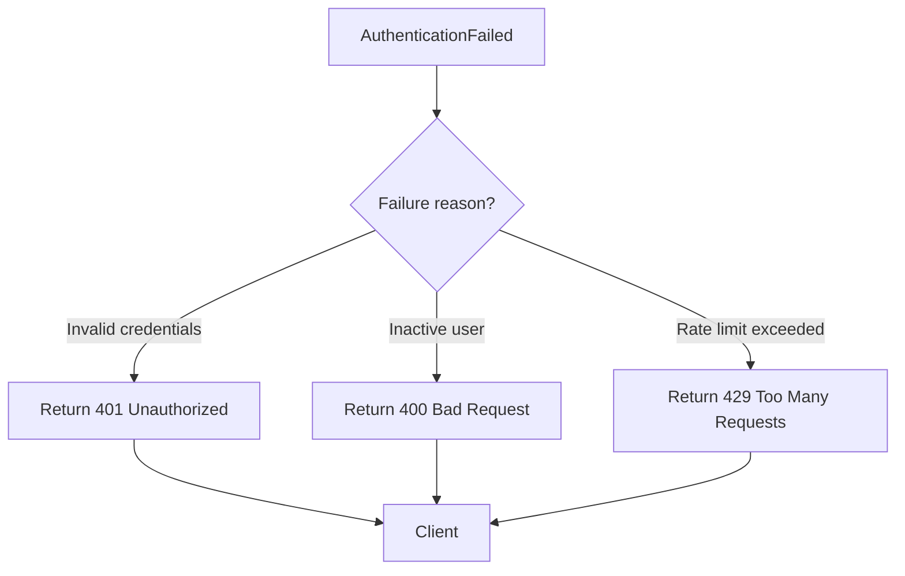
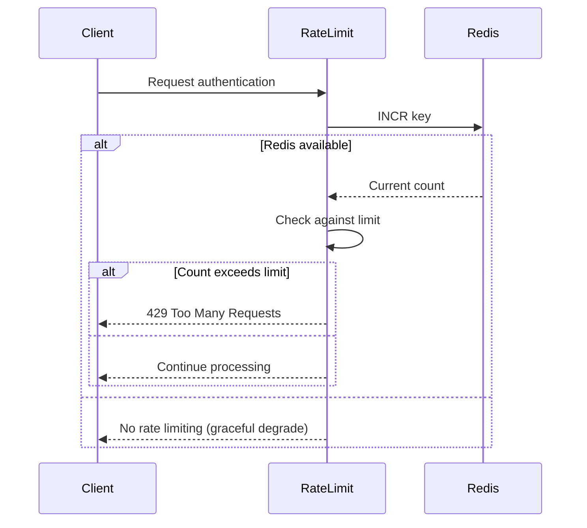
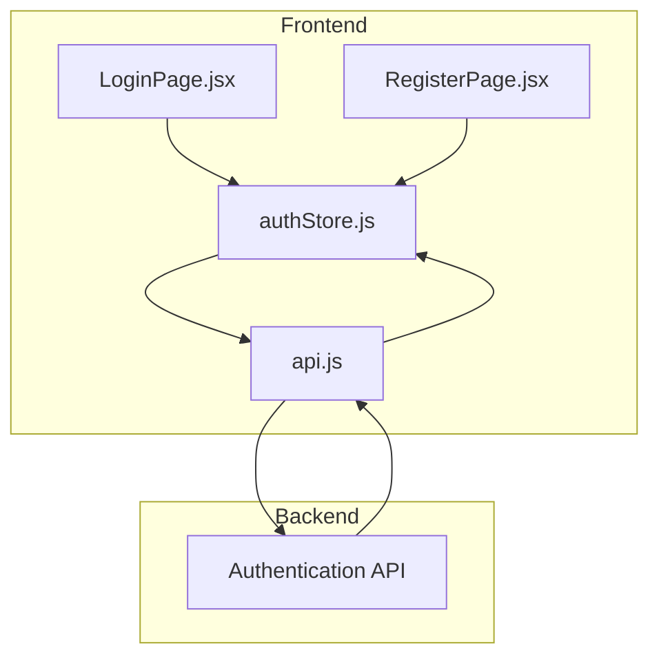
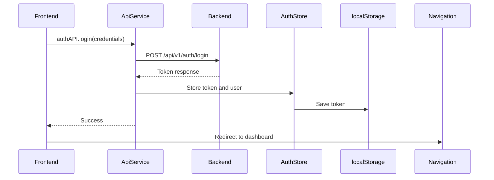
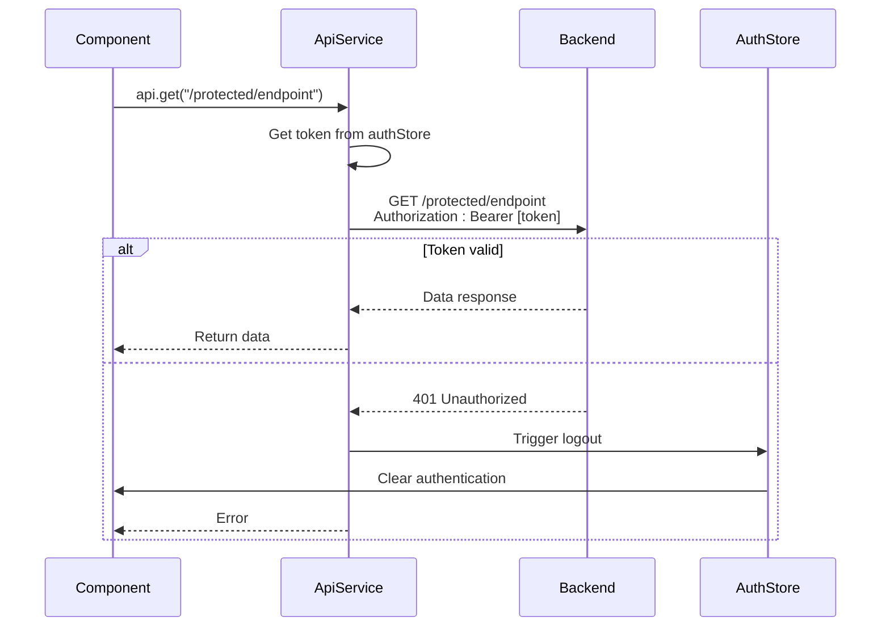

# Authentication API

<cite>
**Referenced Files in This Document**   
- [auth.py](file://app/api/routes/auth.py)
- [user.py](file://app/schemas/user.py)
- [token.py](file://app/schemas/token.py)
- [jwt.py](file://app/core/jwt.py)
- [security.py](file://app/core/security.py)
- [rate_limit.py](file://app/core/rate_limit.py)
- [authStore.js](file://frontend/src/store/authStore.js)
- [api.js](file://frontend/src/services/api.js)
- [LoginPage.jsx](file://frontend/src/pages/Auth/LoginPage.jsx)
- [RegisterPage.jsx](file://frontend/src/pages/Auth/RegisterPage.jsx)
- [ResetPasswordPage.jsx](file://frontend/src/pages/Auth/ResetPasswordPage.jsx)
</cite>

## Table of Contents
1. [Introduction](#introduction)
2. [Authentication Endpoints](#authentication-endpoints)
3. [Request/Response Schemas](#requestresponse-schemas)
4. [JWT Authentication Mechanism](#jwt-authentication-mechanism)
5. [Token Expiration and Refresh Strategy](#token-expiration-and-refresh-strategy)
6. [Error Handling](#error-handling)
7. [Rate Limiting](#rate-limiting)
8. [Frontend Integration](#frontend-integration)
9. [Security Best Practices](#security-best-practices)
10. [Client Implementation Examples](#client-implementation-examples)

## Introduction
The Authentication API provides secure user management functionality for the TradeBot application. This API handles user registration, login, password reset, and token-based authentication using JWT (JSON Web Tokens). The system implements robust security measures including password complexity validation, rate limiting, and secure token management. The authentication endpoints are designed to work seamlessly with both the backend services and frontend components, providing a secure and user-friendly experience.

## Authentication Endpoints

### Registration Endpoint
The registration endpoint allows new users to create an account in the system.

**Endpoint**: `POST /api/v1/auth/register`  
**Description**: Creates a new user account with the provided email and password.  
**Request Schema**: `UserCreate`  
**Response Schema**: `UserResponse`  
**Status Codes**:
- 201 Created: User successfully registered
- 409 Conflict: Email already registered

**Section sources**
- [auth.py](file://app/api/routes/auth.py#L19-L30)
- [user.py](file://app/schemas/user.py#L4-L17)

### Login Endpoint
The login endpoint authenticates users and issues JWT tokens for subsequent requests.

**Endpoint**: `POST /api/v1/auth/login`  
**Description**: Authenticates user credentials and returns an access token. Supports "Remember Me" functionality for extended sessions.  
**Request Schema**: `UserLogin`  
**Response Schema**: `Token`  
**Status Codes**:
- 200 OK: Authentication successful
- 401 Unauthorized: Invalid credentials
- 400 Bad Request: Inactive user

**Section sources**
- [auth.py](file://app/api/routes/auth.py#L32-L60)
- [user.py](file://app/schemas/user.py#L19-L22)

### User Profile Endpoint
The profile endpoint retrieves the authenticated user's information.

**Endpoint**: `GET /api/v1/auth/me`  
**Description**: Returns the current authenticated user's profile information. Requires valid JWT token in Authorization header.  
**Response Schema**: `UserResponse`  
**Status Codes**:
- 200 OK: User data retrieved successfully
- 401 Unauthorized: Invalid or missing token

**Section sources**
- [auth.py](file://app/api/routes/auth.py#L62-L64)

### Password Reset Endpoints
The password reset functionality consists of two endpoints for secure password recovery.

#### Forgot Password
**Endpoint**: `POST /api/v1/auth/forgot-password`  
**Description**: Initiates password reset process by sending a reset link to the user's email.  
**Request Schema**: `ForgotPasswordRequest`  
**Response Schema**: `PasswordResetResponse`  
**Status Codes**:
- 200 OK: Reset request processed
- 429 Too Many Requests: Rate limit exceeded

#### Reset Password
**Endpoint**: `POST /api/v1/auth/reset-password`  
**Description**: Completes password reset process using the provided token and new password.  
**Request Schema**: `ResetPasswordRequest`  
**Response Schema**: `PasswordResetResponse`  
**Status Codes**:
- 200 OK: Password successfully reset
- 400 Bad Request: Invalid or expired token
- 422 Unprocessable Entity: Password validation failed

**Section sources**
- [auth.py](file://app/api/routes/auth.py#L67-L176)
- [user.py](file://app/schemas/user.py#L33-L53)

## Request/Response Schemas

### User Schemas
The following schemas define the structure of user-related data in requests and responses.

**Diagram sources**
- [user.py](file://app/schemas/user.py#L4-L53)

### Token Schema
The token schema defines the structure of the authentication response.

**Diagram sources**
- [token.py](file://app/schemas/token.py#L4-L11)

## JWT Authentication Mechanism
The system implements JWT-based authentication for secure user sessions. When a user successfully logs in, the server generates a JWT token containing user information and signs it with a secret key. This token is then included in the response and must be sent in the Authorization header for subsequent requests.

The JWT token contains the following claims:
- `sub`: User's email address (subject)
- `user_id`: User's database ID
- `exp`: Token expiration timestamp

The token is verified on each authenticated request using the `verify_access_token` function, which decodes the token and validates its signature and expiration. The system uses HS256 algorithm for token signing, with the secret key configured via the `SECRET_KEY` environment variable.

**Diagram sources**
- [auth.py](file://app/api/routes/auth.py#L32-L60)
- [jwt.py](file://app/core/jwt.py#L19-L44)

**Section sources**
- [jwt.py](file://app/core/jwt.py#L1-L45)
- [auth.py](file://app/api/routes/auth.py#L20-L60)

## Token Expiration and Refresh Strategy
The authentication system implements a flexible token expiration strategy with two different durations based on user preference:

- **Standard Session**: 7 days (10080 minutes) - Default duration for regular login
- **Remember Me**: 30 days (43200 minutes) - Extended duration when "Remember Me" option is selected

The token expiration is configured through environment variables:
- `ACCESS_TOKEN_EXPIRE_MINUTES`: Controls standard token duration
- `REMEMBER_ME_EXPIRE_MINUTES`: Controls extended token duration

When the `remember_me` flag is included in the login request, the system generates a token with the extended expiration period. This allows users to remain authenticated for longer periods on trusted devices while maintaining shorter sessions for regular logins.

**Diagram sources**
- [jwt.py](file://app/core/jwt.py#L19-L34)
- [auth.py](file://app/api/routes/auth.py#L46-L50)

**Section sources**
- [jwt.py](file://app/core/jwt.py#L14-L17)
- [auth.py](file://app/api/routes/auth.py#L46-L50)

## Error Handling
The authentication API implements comprehensive error handling to provide meaningful feedback while maintaining security.

### Common Error Codes
- **401 Unauthorized**: Invalid credentials or missing/invalid token
- **403 Forbidden**: Not used in current implementation
- **409 Conflict**: Email already registered during registration
- **422 Unprocessable Entity**: Validation errors in request data
- **429 Too Many Requests**: Rate limit exceeded
- **500 Internal Server Error**: Unexpected server errors

### Security Considerations
The system follows security best practices in error handling:
- Generic error messages for authentication failures to prevent email enumeration
- Same response for non-existent and existing users in password reset to prevent account discovery
- Detailed validation errors only for client-side validation

**Section sources**
- [auth.py](file://app/api/routes/auth.py#L41-L44)
- [auth.py](file://app/api/routes/auth.py#L84-L86)

## Rate Limiting
The authentication system implements rate limiting to protect against brute force attacks and abuse.

### Rate Limiting Rules
- **Login by IP**: Maximum 5 attempts per minute per IP address
- **Login by Email**: Maximum 10 attempts per hour per email address
- **Password Reset by IP**: Maximum 5 attempts per minute per IP address
- **Password Reset by Email**: Maximum 3 attempts per hour per email address

The rate limiting is implemented using Redis as a backend for tracking request counts. If Redis is unavailable, the system gracefully degrades to no rate limiting, ensuring availability while reducing security.

**Diagram sources**
- [rate_limit.py](file://app/core/rate_limit.py#L22-L32)
- [auth.py](file://app/api/routes/auth.py#L34-L37)

**Section sources**
- [rate_limit.py](file://app/core/rate_limit.py#L1-L43)
- [auth.py](file://app/api/routes/auth.py#L34-L38)

## Frontend Integration
The authentication system is integrated with frontend components to provide a seamless user experience.

### LoginPage.jsx
The login page component handles user authentication with the following features:
- Email and password input with client-side validation
- "Remember Me" checkbox for extended sessions
- Password visibility toggle
- Error handling and display
- Integration with authStore for token management

### RegisterPage.jsx
The registration page component handles new user registration with:
- Email and password input with validation
- Password confirmation field
- Success state with automatic redirect
- Error handling for duplicate emails

### Authentication Store
The authStore manages authentication state across the application:
- Stores user data and JWT token
- Persists authentication state in localStorage
- Provides login and logout functionality
- Handles token restoration on page refresh

**Diagram sources**
- [LoginPage.jsx](file://frontend/src/pages/Auth/LoginPage.jsx)
- [RegisterPage.jsx](file://frontend/src/pages/Auth/RegisterPage.jsx)
- [authStore.js](file://frontend/src/store/authStore.js)
- [api.js](file://frontend/src/services/api.js)

**Section sources**
- [LoginPage.jsx](file://frontend/src/pages/Auth/LoginPage.jsx#L1-L207)
- [RegisterPage.jsx](file://frontend/src/pages/Auth/RegisterPage.jsx#L1-L219)
- [authStore.js](file://frontend/src/store/authStore.js#L1-L69)

## Security Best Practices
The authentication system implements multiple security best practices to protect user data and prevent common vulnerabilities.

### Password Security
- Passwords are hashed using bcrypt algorithm
- Minimum 12-character password requirement
- Password complexity requirements:
  - At least one lowercase letter
  - At least one uppercase letter
  - At least one digit
  - At least one special character
- Same validation rules applied to registration and password reset

### Token Security
- JWT tokens are signed with a secure secret key
- Tokens include expiration timestamps
- "Remember Me" tokens have longer expiration but still limited duration
- Tokens are transmitted over HTTPS in production

### Input Validation
- Email validation using Pydantic's EmailStr type
- Comprehensive password validation on both client and server
- Protection against email enumeration attacks
- Rate limiting to prevent brute force attacks

### Additional Security Measures
- User activation status check
- Secure token storage in localStorage with XSS protection considerations
- Automatic logout on authentication failure
- Console logging of authentication events (in development mode)

**Section sources**
- [security.py](file://app/core/security.py#L7-L15)
- [user.py](file://app/schemas/user.py#L8-L16)
- [auth.py](file://app/api/routes/auth.py#L43-L44)

## Client Implementation Examples

### JavaScript Login Implementation
The following example demonstrates how to implement login functionality in a JavaScript client:

**Diagram sources**
- [api.js](file://frontend/src/services/api.js#L248-L250)
- [LoginPage.jsx](file://frontend/src/pages/Auth/LoginPage.jsx#L24-L40)

### Token Handling in API Requests
The system automatically includes the authentication token in subsequent requests:

**Diagram sources**
- [api.js](file://frontend/src/services/api.js#L47-L49)
- [api.js](file://frontend/src/services/api.js#L221-L232)

**Section sources**
- [api.js](file://frontend/src/services/api.js#L1-L375)
- [authStore.js](file://frontend/src/store/authStore.js#L11-L16)