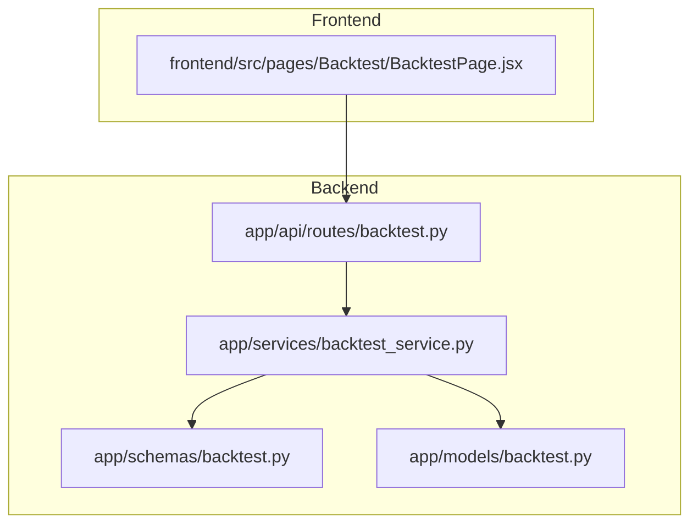
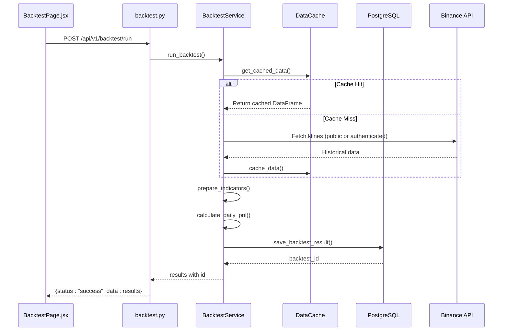
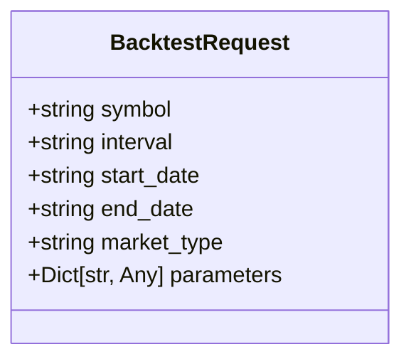
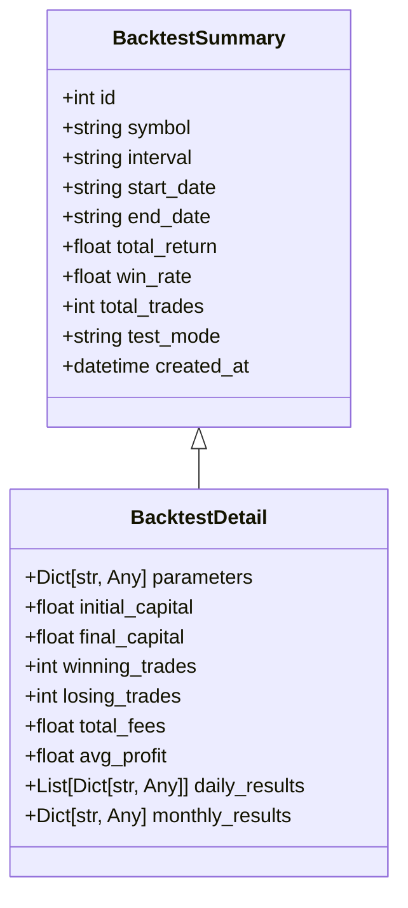
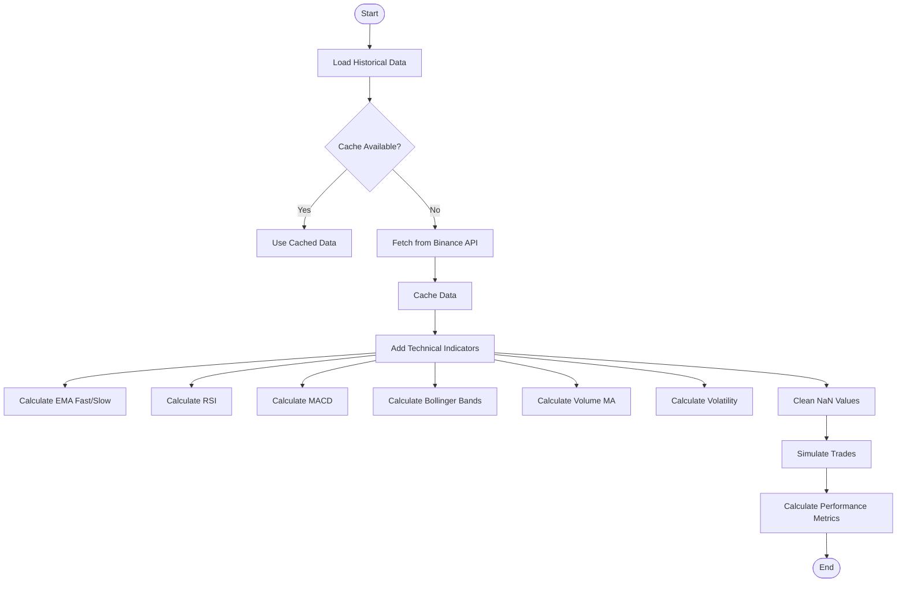
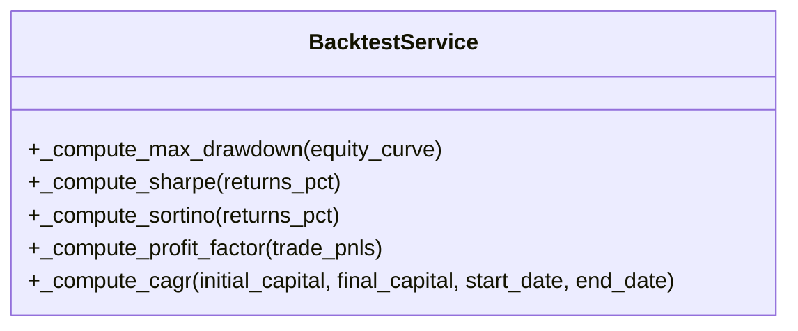
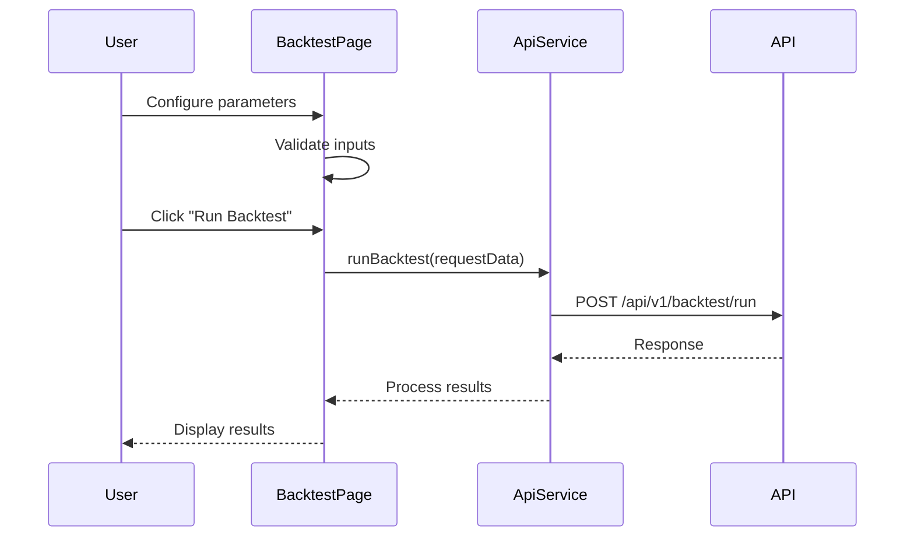
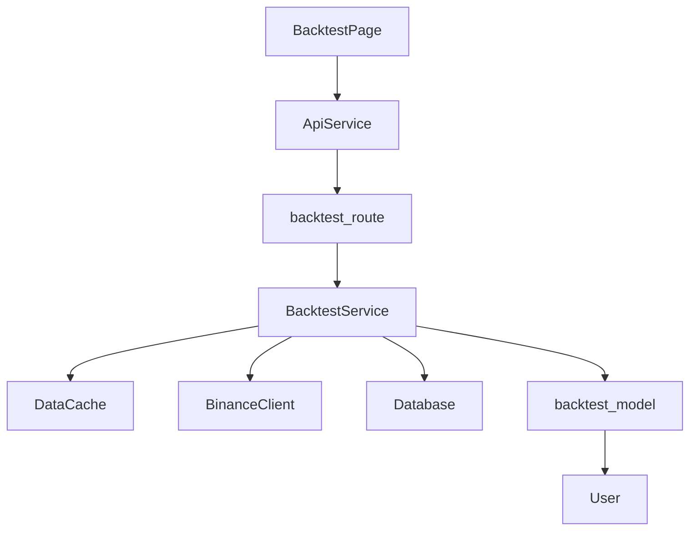

# Backtesting API

<cite>
**Referenced Files in This Document**   
- [backtest.py](file://app/api/routes/backtest.py)
- [backtest_service.py](file://app/services/backtest_service.py)
- [BacktestPage.jsx](file://frontend/src/pages/Backtest/BacktestPage.jsx)
- [backtest.py](file://app/schemas/backtest.py)
- [backtest.py](file://app/models/backtest.py)
</cite>

## Table of Contents
1. [Introduction](#introduction)
2. [Project Structure](#project-structure)
3. [Core Components](#core-components)
4. [Architecture Overview](#architecture-overview)
5. [Detailed Component Analysis](#detailed-component-analysis)
6. [Dependency Analysis](#dependency-analysis)
7. [Performance Considerations](#performance-considerations)
8. [Troubleshooting Guide](#troubleshooting-guide)
9. [Conclusion](#conclusion)

## Introduction
The Backtesting API enables users to simulate trading strategies using historical market data from Binance without executing real trades. This document details the endpoints for creating, retrieving, and deleting backtests, along with request and response schemas, supported parameters, and integration with frontend components. The system leverages cached historical klines to improve performance and supports both spot and futures market types.

## Project Structure
The backtesting functionality is organized across backend and frontend components. The backend resides in the `app` directory with dedicated modules for routes, services, models, and schemas. The frontend implementation is located in the `frontend` directory, specifically within the Backtest page components.

**Diagram sources**
- [backtest.py](file://app/api/routes/backtest.py)
- [backtest_service.py](file://app/services/backtest_service.py)
- [BacktestPage.jsx](file://frontend/src/pages/Backtest/BacktestPage.jsx)

**Section sources**
- [backtest.py](file://app/api/routes/backtest.py)
- [backtest_service.py](file://app/services/backtest_service.py)
- [BacktestPage.jsx](file://frontend/src/pages/Backtest/BacktestPage.jsx)

## Core Components
The core components of the Backtesting API include the route handler, service layer, data models, and frontend interface. These components work together to process backtest requests, execute simulations using historical data, and return performance metrics.

**Section sources**
- [backtest.py](file://app/api/routes/backtest.py#L1-L352)
- [backtest_service.py](file://app/services/backtest_service.py#L1-L800)
- [backtest.py](file://app/schemas/backtest.py#L1-L45)

## Architecture Overview
The Backtesting API follows a layered architecture with clear separation between presentation, business logic, and data access layers. The frontend initiates requests through API calls, which are handled by FastAPI routes. These routes delegate to the BacktestService, which orchestrates data retrieval, strategy execution, and result persistence.

**Diagram sources**
- [backtest.py](file://app/api/routes/backtest.py#L26-L74)
- [backtest_service.py](file://app/services/backtest_service.py#L24-L800)
- [BacktestPage.jsx](file://frontend/src/pages/Backtest/BacktestPage.jsx#L231-L262)

## Detailed Component Analysis

### Backtest Request Processing
The backtest request processing flow handles validation, simulation execution, and result persistence. It supports various strategy parameters and market conditions.

#### Request Schema

**Diagram sources**
- [backtest.py](file://app/api/routes/backtest.py#L18-L25)

#### Response Schema

**Diagram sources**
- [backtest.py](file://app/schemas/backtest.py#L15-L45)

### Strategy Execution Engine
The strategy execution engine processes historical data, applies technical indicators, and simulates trades based on entry signals.

#### Technical Indicators Processing

**Diagram sources**
- [backtest_service.py](file://app/services/backtest_service.py#L346-L443)

### Performance Metrics Calculation
The system calculates various performance metrics to evaluate strategy effectiveness.

**Diagram sources**
- [backtest_service.py](file://app/services/backtest_service.py#L444-L512)

### Frontend Integration
The frontend component provides a user interface for configuring and launching backtests.

**Diagram sources**
- [BacktestPage.jsx](file://frontend/src/pages/Backtest/BacktestPage.jsx#L231-L262)

**Section sources**
- [BacktestPage.jsx](file://frontend/src/pages/Backtest/BacktestPage.jsx#L1-L800)
- [backtest.py](file://app/api/routes/backtest.py#L26-L74)

## Dependency Analysis
The Backtesting API has well-defined dependencies between components, ensuring loose coupling and high cohesion.

**Diagram sources**
- [backtest.py](file://app/api/routes/backtest.py)
- [backtest_service.py](file://app/services/backtest_service.py)
- [BacktestPage.jsx](file://frontend/src/pages/Backtest/BacktestPage.jsx)

**Section sources**
- [backtest.py](file://app/api/routes/backtest.py#L11-L15)
- [backtest_service.py](file://app/services/backtest_service.py#L19-L23)

## Performance Considerations
The Backtesting API implements several performance optimizations:

1. **Caching**: Historical klines are cached to avoid repeated API calls
2. **Rate Limiting**: Public API requests include delays to comply with rate limits
3. **Data Processing**: Pandas and NumPy are used for efficient data manipulation
4. **Memory Management**: Large datasets are processed in chunks when possible

The system also provides cache management endpoints to clear or inspect cached data, allowing users to control resource usage.

**Section sources**
- [backtest_service.py](file://app/services/backtest_service.py#L27-L40)
- [backtest.py](file://app/api/routes/backtest.py#L76-L121)

## Troubleshooting Guide
Common issues and their solutions:

1. **Cache Misses**: Ensure the cache directory exists and is writable
2. **API Rate Limits**: The system automatically handles rate limiting with delays
3. **Missing Data**: The system falls back to sample data generation when Binance API is unavailable
4. **Authentication Issues**: Verify API keys are properly configured in the database

The system logs detailed information about each operation, including cache status, data source, and processing progress.

**Section sources**
- [backtest_service.py](file://app/services/backtest_service.py#L262-L269)
- [backtest.py](file://app/api/routes/backtest.py#L69-L74)

## Conclusion
The Backtesting API provides a comprehensive solution for simulating trading strategies using historical market data. It supports both spot and futures markets, offers detailed performance metrics, and integrates seamlessly with the frontend interface. The architecture emphasizes performance through caching and efficient data processing, while maintaining flexibility for various strategy configurations.