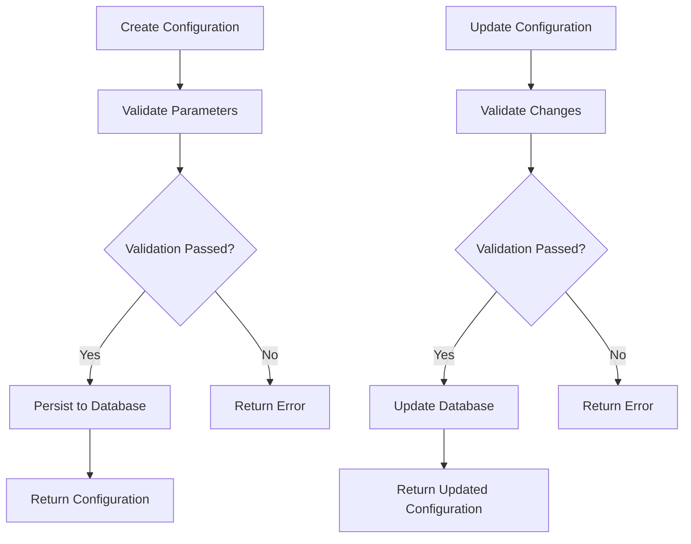

# Bot Configuration API

<cite>
**Referenced Files in This Document**   
- [bot_config.py](file://app/api/routes/bot_config.py)
- [bot_config.py](file://app/models/bot_config.py)
- [bot_config.py](file://app/schemas/bot_config.py)
- [BotCreatePage.jsx](file://frontend/src/pages/Bots/BotCreatePage.jsx)
- [BotEditPage.jsx](file://frontend/src/pages/Bots/BotEditPage.jsx)
- [devlog_auth_backend.md](file://devlog_auth_backend.md)
- [bot_runner.py](file://app/api/routes/bot_runner.py)
- [bot_state.py](file://app/api/routes/bot_state.py)
</cite>

## Table of Contents
1. [Introduction](#introduction)
2. [API Endpoints](#api-endpoints)
3. [Request/Response Schemas](#requestresponse-schemas)
4. [Parameter Validation Rules](#parameter-validation-rules)
5. [Market Type and Leverage Configuration](#market-type-and-leverage-configuration)
6. [Frontend Integration](#frontend-integration)
7. [Configuration Validation and Persistence](#configuration-validation-and-persistence)
8. [Error Handling](#error-handling)
9. [Example Usage](#example-usage)

## Introduction
The Bot Configuration API provides a complete interface for managing trading bot configurations within the system. It supports full CRUD operations for bot configurations, including advanced strategy parameters such as EMA/RSI settings, risk management controls, and market-specific configurations for both spot and futures trading. The API ensures proper validation of trading parameters like stop-loss, take-profit, position sizing, and leverage settings before persistence. Configurations are user-isolated and linked to Binance API keys for secure trading operations.

**Section sources**
- [bot_config.py](file://app/api/routes/bot_config.py#L1-L54)
- [devlog_auth_backend.md](file://devlog_auth_backend.md#L78-L111)

## API Endpoints
The Bot Configuration API exposes standard RESTful endpoints for managing bot configurations at the `/api/v1/bot-configs` base path. All endpoints require authentication and enforce user ownership of resources.

### Create Bot Configuration
- **Endpoint**: `POST /api/v1/bot-configs`
- **Description**: Creates a new bot configuration for the authenticated user
- **Response**: Returns the created configuration with assigned ID and timestamps
- **Status**: 201 Created on success

### List Bot Configurations
- **Endpoint**: `GET /api/v1/bot-configs`
- **Description**: Retrieves all bot configurations belonging to the authenticated user
- **Response**: Returns an array of configuration objects
- **Status**: 200 OK

### Get Specific Configuration
- **Endpoint**: `GET /api/v1/bot-configs/{config_id}`
- **Description**: Retrieves a specific bot configuration by ID
- **Response**: Returns the configuration object if found and owned by the user
- **Status**: 200 OK on success, 404 Not Found if configuration doesn't exist or is not accessible

### Update Configuration
- **Endpoint**: `PUT /api/v1/bot-configs/{config_id}`
- **Description**: Updates an existing bot configuration
- **Response**: Returns the updated configuration
- **Status**: 200 OK on success, 404 Not Found if configuration doesn't exist or is not accessible

### Delete Configuration
- **Endpoint**: `DELETE /api/v1/bot-configs/{config_id}`
- **Description**: Deletes a bot configuration
- **Response**: No content
- **Status**: 204 No Content on success, 404 Not Found if configuration doesn't exist or is not accessible

**Section sources**
- [bot_config.py](file://app/api/routes/bot_config.py#L1-L54)

## Request/Response Schemas
The API uses Pydantic models to define the structure of request and response payloads, ensuring type safety and proper validation.

### BotConfigBase
The base model contains all common fields for bot configurations:

```json
{
  "name": "string",
  "symbol": "string",
  "timeframe": "string",
  "is_active": "boolean",
  "initial_capital": "number",
  "daily_target_perc": "number",
  "max_daily_loss_perc": "number",
  "position_size_perc": "number",
  "position_size_fixed": "number",
  "stop_loss_perc": "number",
  "take_profit_perc": "number",
  "trailing_stop_perc": "number",
  "trailing_stop_active": "boolean",
  "ema_fast": "integer",
  "ema_slow": "integer",
  "rsi_period": "integer",
  "rsi_oversold": "integer",
  "rsi_overbought": "integer",
  "max_daily_trades": "integer",
  "check_interval_seconds": "integer",
  "api_key_id": "integer",
  "strategy": "string",
  "ema_period": "integer",
  "custom_ema_fast": "integer",
  "custom_ema_slow": "integer",
  "custom_rsi_period": "integer",
  "custom_rsi_oversold": "integer",
  "custom_rsi_overbought": "integer",
  "custom_stop_loss": "number",
  "custom_take_profit": "number",
  "custom_trailing_stop": "number",
  "position_type": "string",
  "transfer_amount": "number",
  "auto_transfer_funds": "boolean",
  "leverage": "integer"
}
```

### BotConfigCreate
Extends BotConfigBase for creation operations. All fields follow the same structure as the base model.

### BotConfigUpdate
Extends BotConfigBase for update operations, allowing partial updates of configuration properties.

### BotConfigResponse
Extends BotConfigBase with additional metadata fields:
- **id**: Unique identifier for the configuration
- **created_at**: Timestamp of creation in ISO format
- **updated_at**: Timestamp of last update in ISO format

The response model includes a serializer to format datetime fields as ISO strings.

**Section sources**
- [bot_config.py](file://app/schemas/bot_config.py#L5-L82)
- [bot_config.py](file://app/models/bot_config.py#L8-L58)

## Parameter Validation Rules
The API enforces strict validation rules for all trading parameters to ensure safe and effective bot operation.

### Required Fields
The following fields are required for all operations:
- **name**: Minimum 3 characters
- **symbol**: Trading pair identifier
- **timeframe**: Candlestick interval
- **stop_loss_perc**: Stop loss percentage (positive value)
- **take_profit_perc**: Take profit percentage (positive value)
- **ema_fast**: Fast EMA period (positive integer)
- **ema_slow**: Slow EMA period (positive integer)
- **rsi_period**: RSI calculation period (positive integer)
- **rsi_oversold**: RSI oversold threshold
- **rsi_overbought**: RSI overbought threshold

### Numeric Constraints
- **stop_loss_perc**: Minimum 0.1%, maximum 10%
- **take_profit_perc**: Minimum 0.1%, maximum 20%
- **trailing_stop_perc**: Minimum 0.1%, maximum 5%
- **check_interval_seconds**: Minimum 30 seconds, maximum 3600 seconds (1 hour)
- **max_daily_trades**: Minimum 1, maximum 100 (optional field)
- **position_size_perc**: Minimum 0.1%, maximum 100%

### EMA/RSI Strategy Parameters
- **custom_ema_fast**: Minimum 3, maximum 50 (default: 8)
- **custom_ema_slow**: Minimum 10, maximum 200 (default: 21)
- **custom_rsi_period**: Minimum 5, maximum 50 (default: 7)
- **custom_rsi_oversold**: Minimum 20, maximum 40 (default: 35)
- **custom_rsi_overbought**: Minimum 60, maximum 80 (default: 65)

**Section sources**
- [bot_config.py](file://app/schemas/bot_config.py#L48-L62)
- [BotCreatePage.jsx](file://frontend/src/pages/Bots/BotCreatePage.jsx#L347-L390)

## Market Type and Leverage Configuration
The API supports both spot and futures trading with specific configuration options for each market type.

### Position Type
The `position_type` field determines the trading mode:
- **spot**: Traditional spot trading
- **futures**: Futures/leverage trading

This setting affects the trading behavior and available configuration options.

### Leverage Settings
For futures trading, the API supports configurable leverage through the `leverage` field:
- **Range**: 1x to 125x
- **Default**: 10x
- **Validation**: Must be an integer between 1 and 125 inclusive

The leverage setting is only applicable when `position_type` is set to "futures". For spot trading, leverage is ignored.

### Position and Fund Management
Additional fields support advanced position and fund management:
- **transfer_amount**: Specific amount to transfer (null for full balance)
- **auto_transfer_funds**: Whether to automatically transfer funds between wallets
- **position_type**: "spot" or "futures" to determine trading mode

These settings enable automated fund transfers between Spot and Futures wallets based on the selected trading mode.

**Section sources**
- [bot_config.py](file://app/schemas/bot_config.py#L43-L47)
- [bot_config.py](file://app/models/bot_config.py#L47-L50)
- [BotCreatePage.jsx](file://frontend/src/pages/Bots/BotCreatePage.jsx#L347-L372)

## Frontend Integration
The Bot Configuration API is integrated with frontend components for creating and editing bot configurations.

### BotCreatePage.jsx
The `BotCreatePage` component provides a multi-step form for creating new bot configurations:
- **Step 1**: Basic bot information including name, position type, and symbol selection
- **Step 2**: Technical indicator settings for EMA and RSI parameters
- **Step 3**: Risk management configuration for stop-loss, take-profit, and trailing stop
- **Step 4**: Fund management settings including auto-transfer and position sizing

The component includes a searchable dropdown for symbol selection that dynamically loads available trading pairs based on the selected position type (spot or futures).

### BotEditPage.jsx
The `BotEditPage` component allows users to modify existing bot configurations:
- Loads the current configuration from the API
- Pre-fills form fields with existing values
- Maintains the same multi-step interface as the creation page
- Handles the PUT request to update the configuration

Both components include comprehensive form validation and error handling, with specific validation rules enforced both on the frontend and backend.

**Section sources**
- [BotCreatePage.jsx](file://frontend/src/pages/Bots/BotCreatePage.jsx#L1-L800)
- [BotEditPage.jsx](file://frontend/src/pages/Bots/BotEditPage.jsx#L1-L800)

## Configuration Validation and Persistence
Bot configurations undergo validation before being persisted to the database.

### Validation Process
All incoming configuration data is validated against the Pydantic schema before processing:
- Field types are checked and converted as necessary
- Required fields are verified
- Value constraints are enforced (minimum/maximum values)
- Business rules are applied (e.g., fast EMA < slow EMA)

Validation occurs at both the API layer and database model level to ensure data integrity.

### Database Persistence
Configurations are stored in the `bot_configs` table with the following characteristics:
- **User isolation**: Each configuration is linked to a user ID
- **API key association**: Configurations reference a specific Binance API key
- **Timestamps**: Creation and update times are automatically recorded
- **Relationships**: Configurations have relationships with bot states and trades

The database schema includes appropriate indexes for query performance, particularly on user_id and api_key_id fields.

### Relationship with Bot State
Each bot configuration has a one-to-one relationship with a bot state:
- The state tracks the current status (running, stopped, etc.)
- State updates are performed through the `/api/v1/bot-states/{bot_config_id}` endpoint
- When a bot is started, its state is updated to "pending" and then "running"
- When a bot is stopped, its state is updated to "stopped"



**Diagram sources**
- [bot_config.py](file://app/api/routes/bot_config.py#L1-L54)
- [bot_state.py](file://app/api/routes/bot_state.py#L1-L30)

## Error Handling
The API implements comprehensive error handling for various failure scenarios.

### Common Error Responses
- **401 Unauthorized**: Missing or invalid authentication token
- **404 Not Found**: Configuration does not exist or is not accessible to the user
- **422 Unprocessable Entity**: Validation error with specific field details
- **500 Internal Server Error**: Unexpected server error

### Validation Error Details
When validation fails, the API returns detailed error information including:
- The specific field that failed validation
- The validation rule that was violated
- A descriptive error message

Frontend components display these errors inline with the corresponding form fields, providing immediate feedback to users.

### Market-Specific Constraints
The API enforces Binance API constraints for different market types:
- Futures trading requires valid leverage settings
- Symbol availability differs between spot and futures markets
- Rate limits are applied according to Binance API rules

These constraints are validated before configuration persistence to prevent runtime errors during bot operation.

**Section sources**
- [bot_config.py](file://app/api/routes/bot_config.py#L29-L50)
- [test_bot_config.py](file://tests/test_bot_config.py#L60-L81)

## Example Usage
The following examples demonstrate common operations with the Bot Configuration API.

### Creating a Bot Configuration
```json
POST /api/v1/bot-configs
{
  "name": "BTC/USDT EMA Cross",
  "symbol": "BTCUSDT",
  "timeframe": "1h",
  "position_type": "futures",
  "leverage": 10,
  "stop_loss_perc": 2.0,
  "take_profit_perc": 3.0,
  "ema_fast": 12,
  "ema_slow": 26,
  "rsi_period": 14,
  "rsi_oversold": 30,
  "rsi_overbought": 70,
  "custom_ema_fast": 8,
  "custom_ema_slow": 21,
  "custom_rsi_period": 7,
  "custom_rsi_oversold": 35,
  "custom_rsi_overbought": 65,
  "custom_stop_loss": 0.5,
  "custom_take_profit": 1.5,
  "custom_trailing_stop": 0.3,
  "auto_transfer_funds": true,
  "api_key_id": 1
}
```

### Retrieving a Configuration
```json
GET /api/v1/bot-configs/1
{
  "id": 1,
  "name": "BTC/USDT EMA Cross",
  "symbol": "BTCUSDT",
  "timeframe": "1h",
  "position_type": "futures",
  "leverage": 10,
  "stop_loss_perc": 2.0,
  "take_profit_perc": 3.0,
  "ema_fast": 12,
  "ema_slow": 26,
  "rsi_period": 14,
  "rsi_oversold": 30,
  "rsi_overbought": 70,
  "created_at": "2025-05-23T10:30:00Z",
  "updated_at": "2025-05-23T10:30:00Z",
  "user_id": 1,
  "api_key_id": 1
}
```

### Updating a Configuration
```json
PUT /api/v1/bot-configs/1
{
  "name": "BTC/USDT EMA Cross Updated",
  "stop_loss_perc": 1.5,
  "take_profit_perc": 3.5,
  "leverage": 15
}
```

These examples illustrate the complete lifecycle of bot configuration management, from creation through modification to eventual deletion.

**Section sources**
- [test_bot_config.py](file://tests/test_bot_config.py#L33-L64)
- [bot_config.py](file://app/api/routes/bot_config.py#L12-L17)