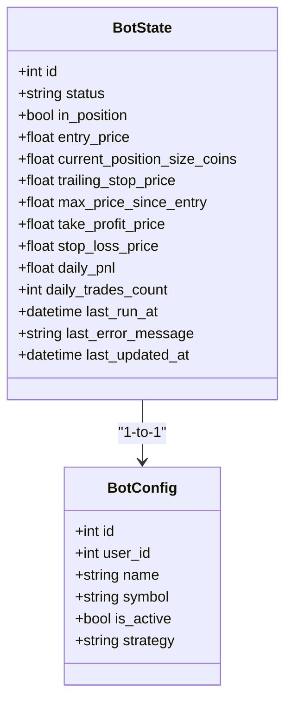
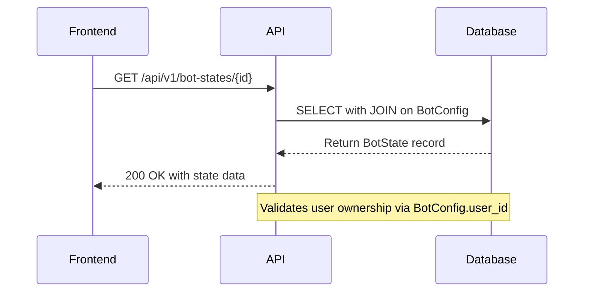
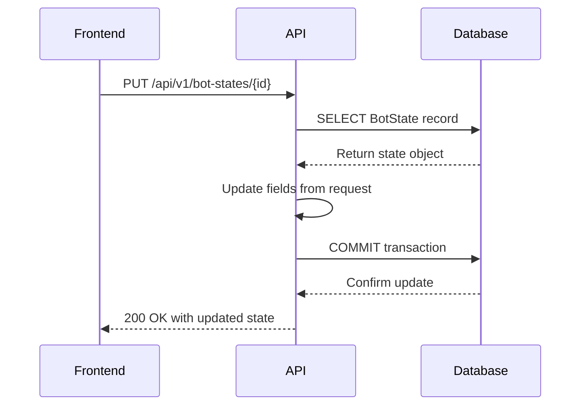
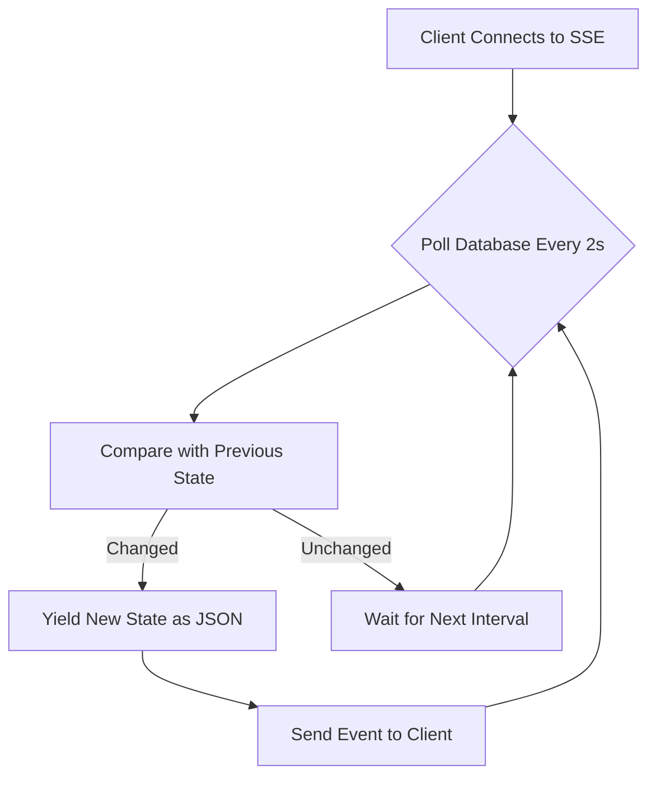
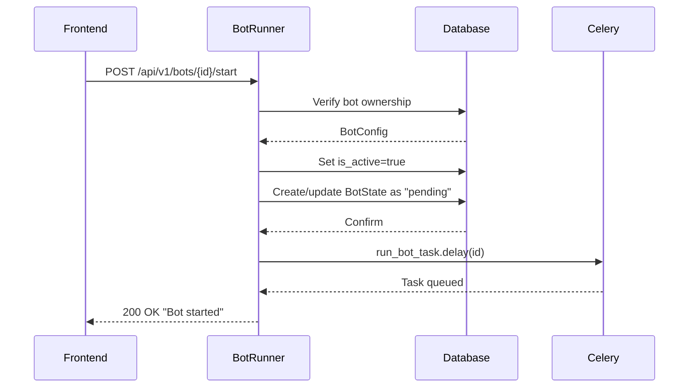
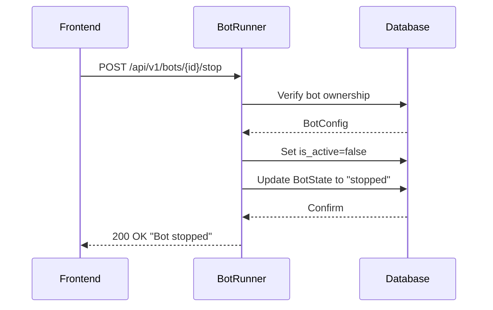
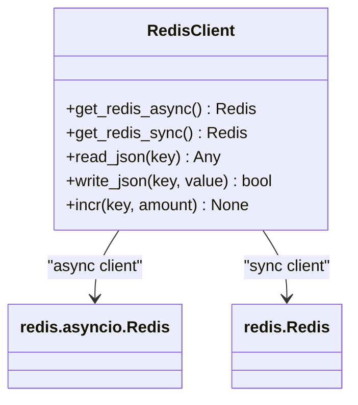

# Bot State Management API

<cite>
**Referenced Files in This Document**   
- [bot_state.py](file://app/api/routes/bot_state.py)
- [bot_runner.py](file://app/api/routes/bot_runner.py)
- [bot_state.py](file://app/models/bot_state.py)
- [bot_tasks.py](file://app/core/bot_tasks.py)
- [redis_client.py](file://app/core/redis_client.py)
- [main.py](file://app/main.py)
</cite>

## Table of Contents
1. [Introduction](#introduction)
2. [Bot State Model](#bot-state-model)
3. [API Endpoints](#api-endpoints)
4. [State Synchronization](#state-synchronization)
5. [Bot Lifecycle Management](#bot-lifecycle-management)
6. [Race Condition Prevention](#race-condition-prevention)
7. [Redis Integration](#redis-integration)
8. [Edge Cases and Recovery](#edge-cases-and-recovery)

## Introduction
The Bot State Management API provides endpoints for controlling the lifecycle of trading bots, including start, stop, and status retrieval operations. The system maintains real-time state synchronization between frontend and backend components, ensuring consistent visibility into bot operations. The API integrates with the BotRunner service and uses Redis for state caching, while preventing race conditions during concurrent requests through database-level concurrency guards.

**Section sources**
- [bot_state.py](file://app/api/routes/bot_state.py#L1-L30)
- [bot_runner.py](file://app/api/routes/bot_runner.py#L1-L55)

## Bot State Model
The BotState model represents the current operational status of a trading bot, storing key metrics and control parameters in the database. The model is defined as a one-to-one relationship with BotConfig, using the bot configuration ID as its primary key.



**Diagram sources**
- [bot_state.py](file://app/models/bot_state.py#L4-L22)
- [bot_config.py](file://app/models/bot_config.py#L5-L59)

The state model includes the following key fields:
- **status**: Current operational status of the bot (stopped, pending, running, error)
- **in_position**: Boolean indicating whether the bot currently holds a market position
- **entry_price**: Price at which the current position was entered
- **daily_pnl**: Daily profit and loss value in quote currency
- **daily_trades_count**: Number of trades executed today
- **last_run_at**: Timestamp of the last bot execution
- **last_error_message**: Error message from the most recent failed operation
- **last_updated_at**: Timestamp of the last state update (automatically managed by database)

**Section sources**
- [bot_state.py](file://app/models/bot_state.py#L4-L22)

## API Endpoints
The Bot State Management API provides RESTful endpoints for retrieving and updating bot state information.

### GET /api/v1/bot-states/{bot_config_id}
Retrieves the current state of a specific bot configuration. The endpoint performs authorization checks to ensure the requesting user owns the bot configuration.



**Diagram sources**
- [bot_state.py](file://app/api/routes/bot_state.py#L11-L17)

### PUT /api/v1/bot-states/{bot_config_id}
Updates the state of a specific bot configuration with partial updates (patch semantics). Only provided fields are updated, leaving others unchanged.



**Diagram sources**
- [bot_state.py](file://app/api/routes/bot_state.py#L20-L30)

**Section sources**
- [bot_state.py](file://app/api/routes/bot_state.py#L1-L30)

## State Synchronization
The system provides real-time state synchronization between frontend and backend through Server-Sent Events (SSE), enabling live updates without polling.

### Status Streaming Endpoint
The `/api/v1/bots/{bot_config_id}/status-stream` endpoint provides a continuous stream of bot status updates, pushing changes to connected clients as they occur.



**Diagram sources**
- [main.py](file://app/main.py#L72-L92)

The streaming response includes essential state information:
- status: Current bot status
- in_position: Position status
- entry_price: Current position entry price
- daily_pnl: Daily profit and loss
- daily_trades_count: Number of trades today
- last_updated_at: Timestamp of last update

Frontend components use this stream to maintain real-time UI updates, as demonstrated in the BotDetailPage component which subscribes to status changes and refreshes the display accordingly.

**Section sources**
- [main.py](file://app/main.py#L72-L92)
- [BotDetailPage.jsx](file://frontend/src/pages/Bots/BotDetailPage.jsx#L29-L76)

## Bot Lifecycle Management
The BotRunner service manages the complete lifecycle of trading bots, coordinating state changes with Celery task execution.

### Start Operation
The start operation initializes a bot for execution by updating its state and triggering a Celery task.



**Diagram sources**
- [bot_runner.py](file://app/api/routes/bot_runner.py#L13-L35)

### Stop Operation
The stop operation halts a running bot by updating its configuration and state.



**Diagram sources**
- [bot_runner.py](file://app/api/routes/bot_runner.py#L38-L54)

**Section sources**
- [bot_runner.py](file://app/api/routes/bot_runner.py#L1-L55)

## Race Condition Prevention
The system implements multiple mechanisms to prevent race conditions during concurrent bot operations.

### Database-Level Concurrency Control
The `run_bot_task` Celery task uses PostgreSQL's `SELECT FOR UPDATE NOWAIT` to implement a concurrency guard, preventing multiple workers from processing the same bot simultaneously.

```python
# Concurrency guard in run_bot_task
locked_state = session.query(BotState).filter(BotState.id == bot_config_id).with_for_update(nowait=True).one_or_none()
```

When a worker attempts to acquire a lock on a bot state that is already locked by another worker, it receives an OperationalError and gracefully skips the run, preventing duplicate executions.

### Atomic State Transitions
All state transitions are performed within database transactions, ensuring atomicity. The BotRunner endpoints update both BotConfig.is_active and BotState.status in a single transaction, preventing inconsistent states.

### Daily Reset Coordination
The system includes a daily reset task that coordinates state cleanup across all bots at midnight UTC, preventing conflicts during the reset process.

```mermaid
flowchart TD
A[Daily Reset Task] --> B[Begin Transaction]
B --> C[Reset daily_trades_count to 0]
C --> D[Reset daily_pnl to 0]
D --> E[Clear last_error_message]
E --> F[Set status to "stopped"]
F --> G[Reactivate inactive bots]
G --> H[Commit Transaction]
```

**Diagram sources**
- [bot_tasks.py](file://app/core/bot_tasks.py#L79-L109)

**Section sources**
- [bot_tasks.py](file://app/core/bot_tasks.py#L122-L518)

## Redis Integration
The system uses Redis for caching and real-time communication, enhancing performance and responsiveness.

### Redis Client Management
The redis_client module provides singleton access to both synchronous and asynchronous Redis connections, used throughout the application.



**Diagram sources**
- [redis_client.py](file://app/core/redis_client.py#L1-L129)

The integration supports:
- JSON serialization for complex data structures
- TTL-based expiration for cached data
- Atomic counter operations for metrics
- Both synchronous and asynchronous access patterns

**Section sources**
- [redis_client.py](file://app/core/redis_client.py#L1-L129)

## Edge Cases and Recovery
The system handles various edge cases to ensure reliability and data consistency.

### Stale State Handling
The system addresses stale state scenarios through multiple mechanisms:
- The daily reset task automatically resets daily counters and reactivates bots at midnight UTC
- The status streaming endpoint includes the last_updated_at timestamp, allowing clients to detect stale data
- Database constraints ensure referential integrity between BotConfig and BotState

### System Restart Recovery
After system restarts, the system recovers gracefully:
- Bot states persist in the database, maintaining their last known status
- The daily reset task ensures consistent state initialization
- Celery's task acknowledgment settings (task_acks_late=True) prevent task loss during worker restarts

### Error State Management
When errors occur during bot execution, the system captures detailed error information:
- The run_bot_task updates BotState with error status and message
- Database transactions ensure atomic error state updates
- The last_error_message field preserves diagnostic information for troubleshooting

```mermaid
flowchart TD
A[Error During Execution] --> B{Error Type}
B --> |API Key Decrypt| C[Set status: "error (api key decrypt failed)"]
B --> |Binance Client Init| D[Set status: "error (binance client init)"]
B --> |Price Fetch| E[Set status: "error (price fetch)"]
C --> F[Store error message]
D --> F
E --> F
F --> G[Update last_updated_at]
G --> H[Commit to Database]
```

**Diagram sources**
- [bot_tasks.py](file://app/core/bot_tasks.py#L156-L185)

**Section sources**
- [bot_tasks.py](file://app/core/bot_tasks.py#L79-L109)
- [bot_tasks.py](file://app/core/bot_tasks.py#L156-L185)