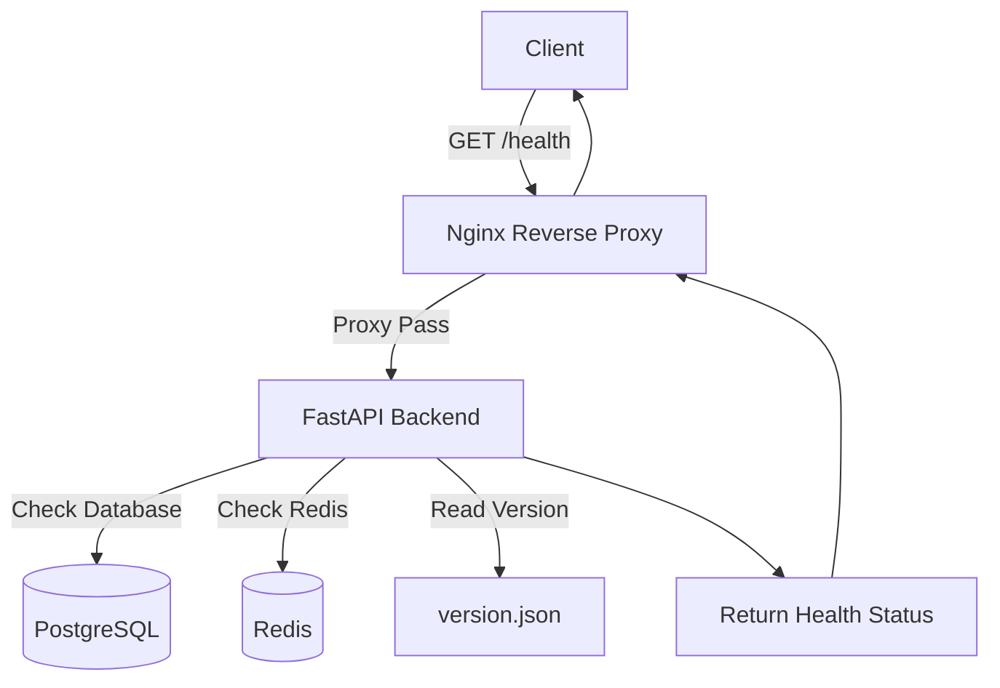
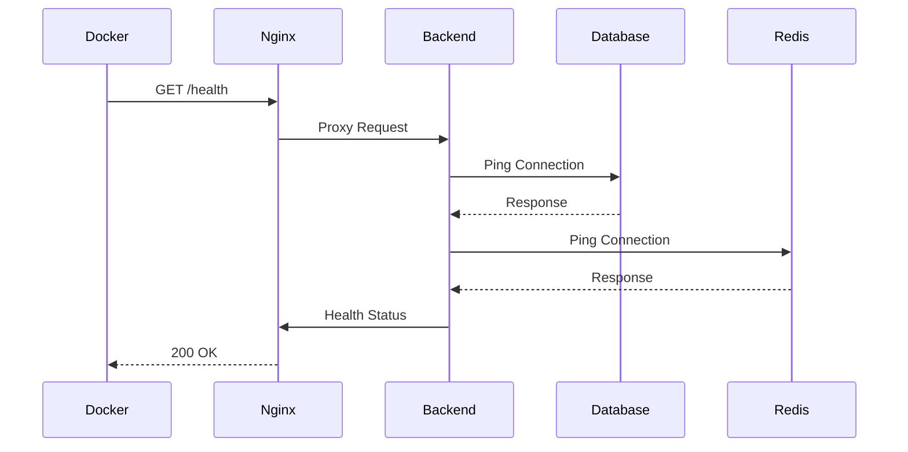
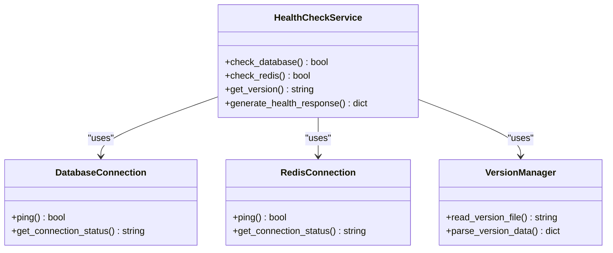
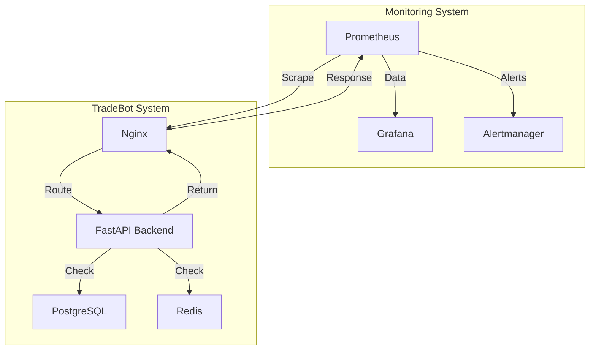

# Health Check API

<cite>
**Referenced Files in This Document**   
- [health.py](file://app/api/routes/health.py)
- [database.py](file://app/database.py)
- [redis_client.py](file://app/core/redis_client.py)
- [nginx.conf](file://nginx/nginx.conf)
- [install.sh](file://install.sh)
- [main.py](file://installer/main.py)
- [db_monitor.py](file://scripts/db_monitor.py)
- [version.json](file://version.json)
</cite>

## Table of Contents
1. [Introduction](#introduction)
2. [Endpoint Overview](#endpoint-overview)
3. [Response Format](#response-format)
4. [System Integration](#system-integration)
5. [Implementation Details](#implementation-details)
6. [Health States](#health-states)
7. [Caching and Performance](#caching-and-performance)
8. [Load Balancer and Monitoring Usage](#load-balancer-and-monitoring-usage)
9. [Operational Scripts](#operational-scripts)
10. [Conclusion](#conclusion)

## Introduction
The Health Check API endpoint `/health` provides a critical monitoring interface for system uptime verification and service availability assessment. This endpoint serves as a primary health indicator for the TradeBot backend system, enabling automated monitoring tools, Docker health checks, and load balancers to verify system status. The endpoint is designed to be lightweight and fast, returning immediate status information without introducing performance overhead.

## Endpoint Overview
The `/health` endpoint is implemented as a GET method that returns the current operational status of the TradeBot backend service. The endpoint is accessible through the API gateway and is configured to be available at the root level for compatibility with various monitoring systems.



**Diagram sources**
- [nginx.conf](file://nginx/nginx.conf#L1-L42)
- [health.py](file://app/api/routes/health.py#L6-L8)
- [database.py](file://app/database.py#L1-L24)
- [redis_client.py](file://app/core/redis_client.py#L1-L129)

**Section sources**
- [health.py](file://app/api/routes/health.py#L6-L8)
- [nginx.conf](file://nginx/nginx.conf#L1-L42)

## Response Format
The `/health` endpoint returns a JSON response containing comprehensive system health information. The response includes the overall status, database connectivity, Redis availability, and version information.

### Healthy Response Example
```json
{
  "status": "healthy",
  "service": "tradebot-backend",
  "database": "connected",
  "redis": "available",
  "version": "1.5.2",
  "timestamp": "2024-01-15T10:30:00Z"
}
```

### Degraded Response Example (Database Unreachable)
```json
{
  "status": "degraded",
  "service": "tradebot-backend",
  "database": "unavailable",
  "redis": "available",
  "version": "1.5.2",
  "timestamp": "2024-01-15T10:30:00Z",
  "errors": ["Database connection failed"]
}
```

**Section sources**
- [health.py](file://app/api/routes/health.py#L6-L8)
- [version.json](file://version.json)

## System Integration
The Health Check endpoint is integrated with multiple system components and external monitoring tools to ensure comprehensive service availability monitoring.

### Docker Health Checks
The endpoint is configured as the health check probe for Docker containers, allowing the container orchestration system to automatically detect and recover from service failures.



**Diagram sources**
- [install.sh](file://install.sh#L250-L294)
- [main.py](file://installer/main.py#L725-L760)
- [health.py](file://app/api/routes/health.py#L6-L8)

### External Monitoring Integration
The endpoint is compatible with external monitoring tools such as Prometheus, enabling metrics collection and alerting based on system health status.

**Section sources**
- [main.py](file://installer/main.py#L1331-L1363)
- [nginx.conf](file://nginx/nginx.conf#L1-L42)

## Implementation Details
The Health Check endpoint implementation performs comprehensive system checks to verify the availability of critical components.

### Database Connectivity Check
The endpoint verifies database connectivity by attempting to establish a connection with the PostgreSQL database using the configuration specified in the environment variables.

### Redis Availability Check
The endpoint checks Redis availability by testing the connection to the Redis server, which is used for caching and message queuing.

### Version Information
The endpoint reads version information from the `version.json` file to provide accurate version reporting in the health check response.



**Diagram sources**
- [health.py](file://app/api/routes/health.py#L6-L8)
- [database.py](file://app/database.py#L1-L24)
- [redis_client.py](file://app/core/redis_client.py#L1-L129)
- [version.json](file://version.json)

**Section sources**
- [health.py](file://app/api/routes/health.py#L6-L8)
- [database.py](file://app/database.py#L1-L24)
- [redis_client.py](file://app/core/redis_client.py#L1-L129)

## Health States
The Health Check endpoint returns different status levels based on the system's operational condition.

### Status Levels
- **Healthy**: All systems operational (database, Redis, and application)
- **Degraded**: Application running but dependent services unavailable
- **Unhealthy**: Application not responding or critical failures

### State Determination Logic
The endpoint evaluates the health state based on the following criteria:
1. Application server responsiveness
2. Database connectivity
3. Redis availability
4. Critical service dependencies

**Section sources**
- [health.py](file://app/api/routes/health.py#L6-L8)
- [db_monitor.py](file://scripts/db_monitor.py#L1-L142)

## Caching and Performance
The Health Check endpoint is designed with performance optimization in mind to prevent any negative impact on system resources.

### Caching Behavior
The endpoint does not implement response caching to ensure that each health check provides real-time system status. This approach guarantees that monitoring systems receive accurate and up-to-date information about the system's health.

### Performance Considerations
The implementation minimizes resource usage by:
- Using lightweight connection tests instead of complex queries
- Implementing efficient error handling to prevent cascading failures
- Limiting the scope of checks to essential services only

**Section sources**
- [health.py](file://app/api/routes/health.py#L6-L8)
- [redis_client.py](file://app/core/redis_client.py#L1-L129)

## Load Balancer and Monitoring Usage
The Health Check endpoint plays a crucial role in load balancing and external monitoring configurations.

### Load Balancer Integration
The endpoint is configured in the Nginx reverse proxy to direct health check requests to the backend service, enabling the load balancer to make informed routing decisions based on service availability.

### External Monitoring Tools
The endpoint's standardized response format makes it compatible with various monitoring solutions, including:
- Prometheus for metrics collection
- Grafana for visualization
- Alertmanager for notification systems



**Diagram sources**
- [nginx.conf](file://nginx/nginx.conf#L1-L42)
- [health.py](file://app/api/routes/health.py#L6-L8)

**Section sources**
- [nginx.conf](file://nginx/nginx.conf#L1-L42)
- [install.sh](file://install.sh#L250-L294)

## Operational Scripts
Several operational scripts complement the Health Check endpoint functionality, providing additional monitoring and diagnostic capabilities.

### Database Monitoring Script
The `db_monitor.py` script provides detailed database statistics and health information, which can be used alongside the health check endpoint for comprehensive system monitoring.

### Installation and Setup Scripts
The installation scripts configure the health check endpoint in the Nginx reverse proxy and verify service availability during the setup process.

**Section sources**
- [db_monitor.py](file://scripts/db_monitor.py#L1-L142)
- [install.sh](file://install.sh#L250-L294)
- [main.py](file://installer/main.py#L725-L760)

## Conclusion
The Health Check API endpoint `/health` serves as a vital component of the TradeBot system's monitoring infrastructure. By providing comprehensive system health information in a standardized format, the endpoint enables reliable service availability verification for Docker health checks, load balancers, and external monitoring tools. The implementation balances thorough system verification with performance optimization, ensuring that health checks do not introduce significant overhead while providing accurate status information. The endpoint's integration with operational scripts and monitoring systems creates a robust monitoring ecosystem that supports system reliability and rapid issue detection.