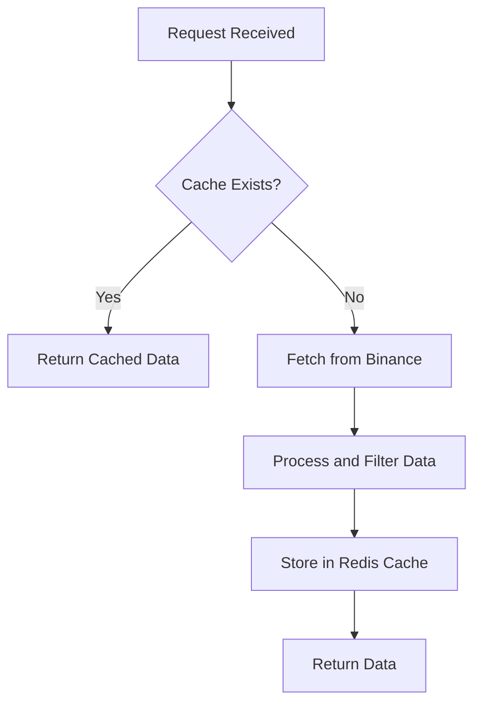
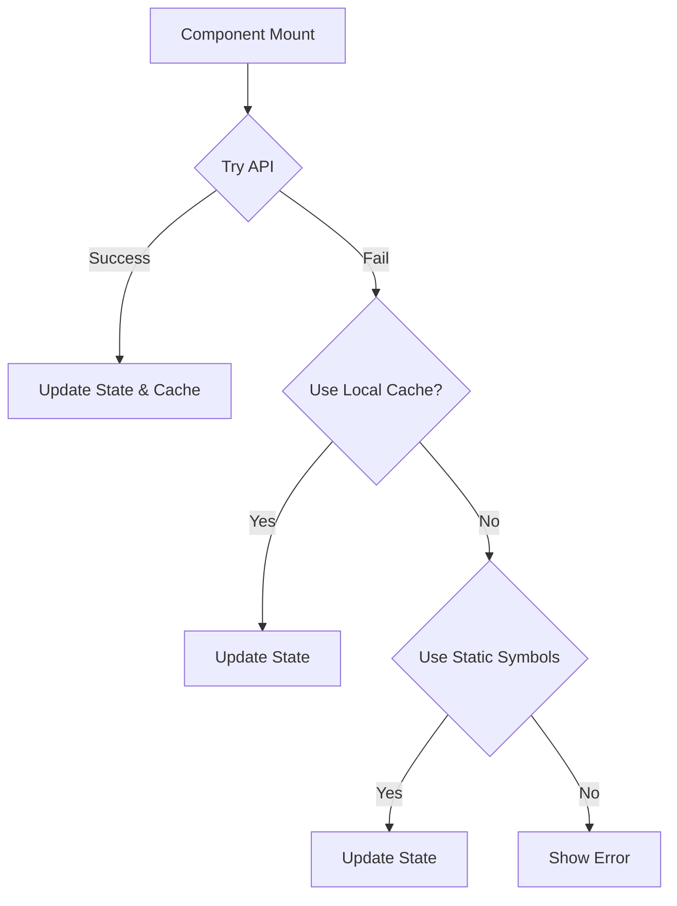

# Market Data API

<cite>
**Referenced Files in This Document**   
- [symbols.py](file://app/api/routes/symbols.py)
- [binance_client.py](file://app/core/binance_client.py)
- [redis_client.py](file://app/core/redis_client.py)
- [SymbolsLoader.jsx](file://frontend/src/components/Markets/SymbolsLoader.jsx)
- [MarketsPage.jsx](file://frontend/src/pages/Markets/MarketsPage.jsx)
- [api.js](file://frontend/src/services/api.js)
- [cache_warmup_tasks.py](file://app/core/cache_warmup_tasks.py)
</cite>

## Table of Contents
1. [Introduction](#introduction)
2. [API Endpoints](#api-endpoints)
3. [Response Schema](#response-schema)
4. [Caching Strategy](#caching-strategy)
5. [Rate Limiting and Resilience](#rate-limiting-and-resilience)
6. [UI Integration](#ui-integration)
7. [Polling Guidance](#polling-guidance)
8. [Error Handling and Fallbacks](#error-handling-and-fallbacks)

## Introduction
The Market Data API provides cryptocurrency market information from Binance, specifically focusing on trading pairs denominated in USDT for both spot and futures markets. The API endpoints are designed to efficiently retrieve available symbols, their metadata, and market status while minimizing direct calls to the Binance API through a multi-layered caching strategy. This documentation covers the `/symbols` endpoints, their response structure, caching mechanisms using Redis, rate limiting considerations, and integration with the frontend components.

**Section sources**
- [symbols.py](file://app/api/routes/symbols.py#L34-L248)

## API Endpoints
The Market Data API exposes two primary endpoints for retrieving cryptocurrency trading pairs:

- **GET /api/v1/symbols/spot**: Retrieves all active spot trading pairs with USDT as the quote asset.
- **GET /api/v1/symbols/futures**: Retrieves all active futures trading pairs with USDT as the quote asset.

Both endpoints are accessible without authentication, though authenticated users with valid Binance API keys can influence the data source priority. The endpoints return a list of symbols sorted by popularity, with major cryptocurrencies like BTC, ETH, and BNB prioritized at the top of the list.

```mermaid
flowchart TD
A[Client Request] --> B{Market Type}
B --> |spot| C[/api/v1/symbols/spot]
B --> |futures| D[/api/v1/symbols/futures]
C --> E[Check Redis Cache]
D --> E
E --> F[Fetch from Binance API]
F --> G[Apply Filters and Sorting]
G --> H[Store in Redis]
H --> I[Return Response]
```

**Diagram sources **
- [symbols.py](file://app/api/routes/symbols.py#L52-L247)

**Section sources**
- [symbols.py](file://app/api/routes/symbols.py#L52-L247)

## Response Schema
The response from both `/spot` and `/futures` endpoints follows a consistent JSON structure. The data includes the market type, a list of symbols with their details, and a count of the returned symbols.

```json
{
  "status": "success",
  "data": {
    "market_type": "spot",
    "symbols": [
      {
        "symbol": "BTCUSDT",
        "baseAsset": "BTC",
        "quoteAsset": "USDT",
        "status": "TRADING"
      },
      {
        "symbol": "ETHUSDT",
        "baseAsset": "ETH",
        "quoteAsset": "USDT",
        "status": "TRADING"
      }
    ],
    "count": 2
  }
}
```

The `symbols` array contains objects with the following properties:
- **symbol**: The trading pair symbol (e.g., BTCUSDT).
- **baseAsset**: The base cryptocurrency (e.g., BTC).
- **quoteAsset**: The quote currency, which is always USDT in this context.
- **status**: The market status of the symbol, typically "TRADING".

The list is filtered to include only active USDT pairs and is sorted to prioritize popular cryptocurrencies.

**Section sources**
- [symbols.py](file://app/api/routes/symbols.py#L52-L247)

## Caching Strategy
The Market Data API employs a robust caching strategy using Redis to minimize direct calls to the Binance API and reduce the risk of hitting rate limits. The caching mechanism operates on multiple levels with a defined fallback strategy.

### Cache Flow
When a request is received, the system first checks the Redis cache for a pre-existing list of symbols. If a valid cache entry is found (cache hit), it is returned immediately. If no cache entry exists (cache miss), the system proceeds to fetch the data from Binance.



**Diagram sources **
- [symbols.py](file://app/api/routes/symbols.py#L58-L67)
- [redis_client.py](file://app/core/redis_client.py#L37-L59)

### Cache Keys and TTL
The system uses distinct Redis keys for spot and futures symbols to prevent data collision:
- **SPOT_SYMBOLS_CACHE_KEY**: `cache:symbols:spot:v1`
- **FUTURES_SYMBOLS_CACHE_KEY**: `cache:symbols:futures:v1`

The Time-To-Live (TTL) for the cache is configurable via environment variables:
- **SPOT_SYMBOLS_CACHE_TTL_SECONDS**: Default 300 seconds (5 minutes)
- **FUTURES_SYMBOLS_CACHE_TTL_SECONDS**: Default 300 seconds (5 minutes)

Additionally, the system maintains a "last good" cache (`SPOT_SYMBOLS_CACHE_LAST_GOOD_KEY`, `FUTURES_SYMBOLS_CACHE_LAST_GOOD_KEY`) which stores the most recently successful response. This is used as a fallback if the primary cache is unavailable and the Binance API cannot be reached.

### Cache Warmup
To ensure the cache is populated even before the first user request, a periodic Celery task runs to warm up the cache. The `warmup_spot_symbols_cache` and `warmup_futures_symbols_cache` tasks fetch data from the Binance public API and store it in Redis at regular intervals (default every 5 minutes). This proactive approach guarantees that the cache is almost always available, significantly improving response times and system resilience.

**Section sources**
- [symbols.py](file://app/api/routes/symbols.py#L58-L67)
- [redis_client.py](file://app/core/redis_client.py#L116-L127)
- [cache_warmup_tasks.py](file://app/core/cache_warmup_tasks.py#L37-L112)

## Rate Limiting and Resilience
The Market Data API implements a multi-faceted approach to handle rate limiting and ensure service resilience.

### Data Source Hierarchy
The system follows a strict hierarchy when fetching symbol data:
1. **User's Binance API Key (Testnet)**: If an authenticated user has provided API keys, the system first attempts to use them on the Binance testnet.
2. **User's Binance API Key (Mainnet)**: If the testnet call fails, it retries on the Binance mainnet.
3. **Public Binance API**: If no user API key is available or if the key-based calls fail, the system falls back to the public Binance API endpoints, which do not require authentication.

This hierarchy allows users with API keys to get potentially more personalized data while ensuring that the service remains available to all users through the public API.

### Retry and Backoff
For internal operations, the `BinanceClientWrapper` class implements a retry mechanism with exponential backoff for transient errors like rate limits (error code -1003) or connection issues. The number of retries and the base backoff delay are configurable via environment variables (`BINANCE_RETRY_MAX_ATTEMPTS`, `BINANCE_RETRY_BACKOFF_BASE`).

**Section sources**
- [binance_client.py](file://app/core/binance_client.py#L74-L96)
- [symbols.py](file://app/api/routes/symbols.py#L77-L103)

## UI Integration
The Market Data API is integrated into the frontend application through the `MarketsPage.jsx` component, which uses the `SymbolsLoader.jsx` component to manage the symbol data lifecycle.

### SymbolsLoader Component
The `SymbolsLoader` component orchestrates the retrieval and management of symbol data with a three-tiered fallback strategy:
1. **API First**: It first attempts to fetch symbols from the backend API.
2. **Local Storage Cache**: If the API call fails, it uses a cached version stored in the browser's `localStorage`.
3. **Static Fallback**: As a last resort, it falls back to a predefined list of static symbols.

The component also implements exponential backoff for retries and provides a circuit breaker pattern to prevent overwhelming the server during outages.



**Diagram sources **
- [SymbolsLoader.jsx](file://frontend/src/components/Markets/SymbolsLoader.jsx#L161-L210)

### MarketsPage Usage
The `MarketsPage` component uses the `SymbolsLoader` to populate its watchlist and trading pair selection. It dynamically loads the full list of symbols from the API on mount and uses this data to filter and display relevant trading pairs. The page also integrates real-time data from Binance WebSocket streams for price and order book information, using the symbol list to determine which pairs to subscribe to.

**Section sources**
- [SymbolsLoader.jsx](file://frontend/src/components/Markets/SymbolsLoader.jsx#L161-L210)
- [MarketsPage.jsx](file://frontend/src/pages/Markets/MarketsPage.jsx#L67-L82)

## Polling Guidance
For real-time applications, direct polling of the `/symbols` endpoint is not recommended. The symbol list changes infrequently (typically only when new trading pairs are added or removed by Binance), and the endpoint is cached for 5 minutes. Polling more frequently than the cache TTL provides no benefit and wastes resources.

Instead, applications should:
1. **Load Once on Startup**: Fetch the symbol list once when the application or page loads.
2. **Rely on Cache**: Trust the backend's caching mechanism to provide fresh data every 5 minutes.
3. **Handle Updates via Events**: If dynamic updates are critical, implement a server-sent event (SSE) or WebSocket mechanism to notify clients of symbol list changes, rather than polling.

For other market data like prices and order books, which change rapidly, use the Binance WebSocket streams (`wss://stream.binance.com:9443/ws`) directly for real-time updates with minimal latency.

**Section sources**
- [symbols.py](file://app/api/routes/symbols.py#L56-L57)
- [MarketsPage.jsx](file://frontend/src/pages/Markets/MarketsPage.jsx#L148-L180)

## Error Handling and Fallbacks
The system is designed with comprehensive error handling and multiple fallback layers to ensure high availability.

### Backend Fallbacks
On the backend, if all attempts to fetch data from Binance fail (including the public API), the system will return the "last good" cached response if available. This ensures that users continue to see a functional list of symbols even during temporary Binance API outages. If no "last good" cache exists, a 500 Internal Server Error is returned with a descriptive message.

### Frontend Fallbacks
The frontend implements its own layered fallback strategy:
1. **API Failure**: If the initial API call fails, it retries up to three times with exponential backoff.
2. **Cache Failure**: If the API is unreachable, it uses the `localStorage` cache.
3. **Static List**: If both the API and local cache fail, it displays a static list of the most popular symbols.

This multi-layered approach ensures that the user interface remains functional and provides a meaningful experience even under adverse network conditions.

**Section sources**
- [symbols.py](file://app/api/routes/symbols.py#L124-L134)
- [SymbolsLoader.jsx](file://frontend/src/components/Markets/SymbolsLoader.jsx#L171-L210)