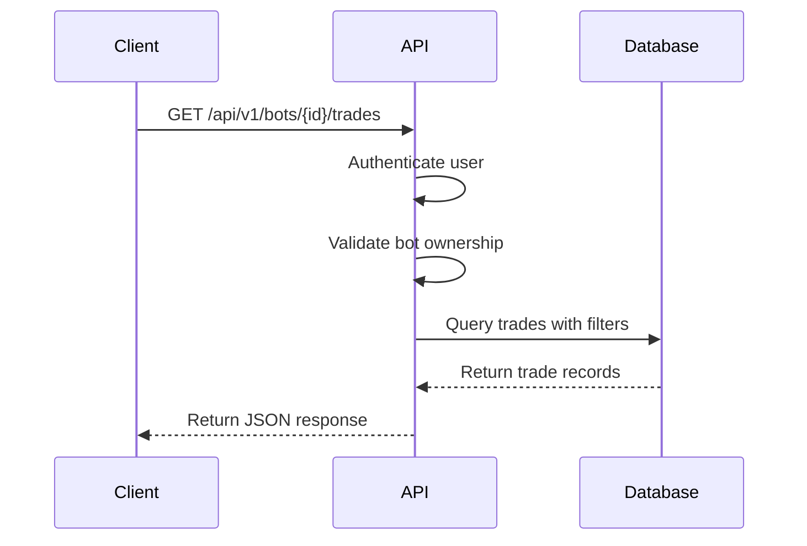
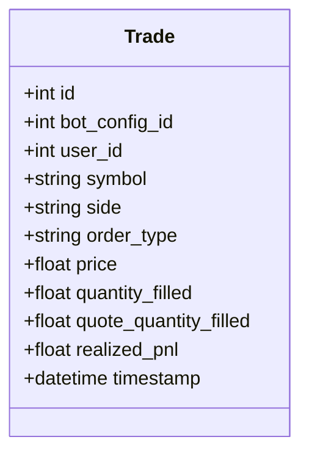
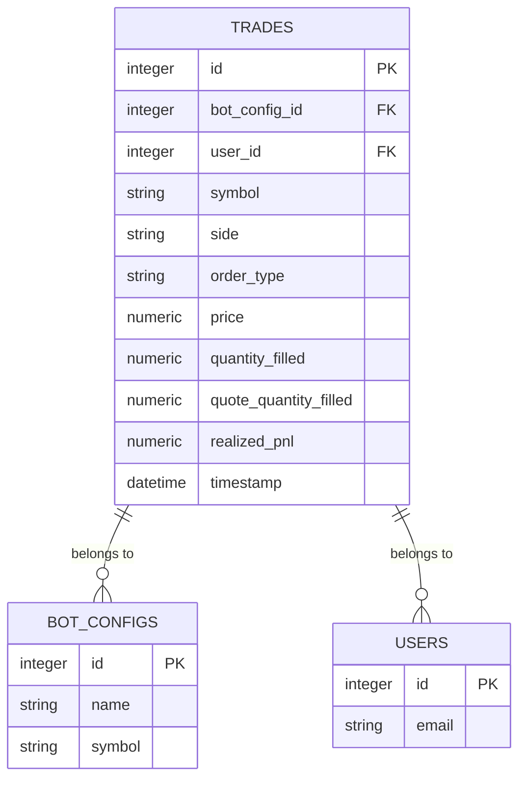

# Trading API

<cite>
**Referenced Files in This Document**   
- [bot_report.py](file://app/api/routes/bot_report.py)
- [trade.py](file://app/models/trade.py)
- [trade.py](file://app/schemas/trade.py)
- [BotTrades.jsx](file://frontend/src/pages/Bots/BotTrades.jsx)
- [BotPerformance.jsx](file://frontend/src/pages/Bots/BotPerformance.jsx)
</cite>

## Table of Contents
1. [Introduction](#introduction)
2. [Endpoint Overview](#endpoint-overview)
3. [Response Schema](#response-schema)
4. [Query Parameters](#query-parameters)
5. [Usage Examples](#usage-examples)
6. [Performance Considerations](#performance-considerations)
7. [Related Components](#related-components)

## Introduction
The Trading API provides read-only access to trade history and execution records generated by automated trading bots. This API endpoint serves as a reporting interface for retrieving trade data, with all trades being created by background tasks rather than direct API calls. The endpoint supports filtering, pagination, and sorting to efficiently retrieve trade records for analysis and display purposes.

**Section sources**
- [bot_report.py](file://app/api/routes/bot_report.py#L40-L79)

## Endpoint Overview
The `/api/v1/bots/{bot_config_id}/trades` endpoint retrieves trade records associated with a specific bot configuration. This is a GET operation that returns a list of trades with detailed execution information.



**Diagram sources**
- [bot_report.py](file://app/api/routes/bot_report.py#L40-L79)

**Section sources**
- [bot_report.py](file://app/api/routes/bot_report.py#L40-L79)

## Response Schema
The API returns an array of trade objects with the following properties:

| Field | Type | Description |
|-------|------|-------------|
| id | integer | Unique trade identifier |
| symbol | string | Trading pair (e.g., BTC/USDT) |
| side | string | Trade direction (BUY or SELL) |
| order_type | string | Order type (MARKET, OCO, etc.) |
| price | number | Executed price |
| quantity_filled | number | Quantity of base asset filled |
| quote_quantity_filled | number | Quantity of quote asset filled |
| realized_pnl | number | Realized profit and loss |
| timestamp | string | Trade execution time (ISO format) |



**Diagram sources**
- [trade.py](file://app/models/trade.py#L5-L25)

**Section sources**
- [trade.py](file://app/models/trade.py#L5-L25)
- [trade.py](file://app/schemas/trade.py#L5-L32)

## Query Parameters
The endpoint supports several query parameters for filtering and pagination:

| Parameter | Type | Required | Default | Description |
|---------|------|----------|---------|-------------|
| limit | integer | No | 50 | Number of records to return (1-200) |
| offset | integer | No | 0 | Number of records to skip |
| side | string | No | None | Filter by trade side (BUY/SELL) |
| start_date | datetime | No | None | Filter trades after this date |
| end_date | datetime | No | None | Filter trades before this date |

All trades are sorted by timestamp in descending order (newest first).

**Section sources**
- [bot_report.py](file://app/api/routes/bot_report.py#L45-L50)

## Usage Examples
### Fetch Recent Trades
```http
GET /api/v1/bots/123/trades?limit=10&offset=0
```

### Filter by Date Range
```http
GET /api/v1/bots/123/trades?start_date=2023-01-01T00:00:00&end_date=2023-12-31T23:59:59
```

### Filter by Trade Side
```http
GET /api/v1/bots/123/trades?side=BUY&limit=100
```

The frontend implements virtualized scrolling for large trade datasets in the BotTrades component, improving performance when displaying hundreds of trades.

**Section sources**
- [bot_report.py](file://app/api/routes/bot_report.py#L57-L65)
- [BotTrades.jsx](file://frontend/src/pages/Bots/BotTrades.jsx#L84-L117)

## Performance Considerations
For optimal performance with large trade datasets:
- Use pagination with reasonable limit values (50-100)
- Apply date range filters to limit result sets
- The API automatically applies database indexing on bot_config_id and timestamp fields
- Trades are sorted by timestamp in descending order to prioritize recent activity
- The frontend implements virtualized rendering for trade lists exceeding 300 records

**Section sources**
- [bot_report.py](file://app/api/routes/bot_report.py#L65)
- [BotTrades.jsx](file://frontend/src/pages/Bots/BotTrades.jsx#L8-L10)

## Related Components
### BotPerformance.jsx
The BotPerformance component consumes trade data to calculate performance metrics such as total trades, realized PnL, and success rate. It combines trade data with bot configuration to provide comprehensive performance analysis.

### Trade Model
The Trade model in the backend defines the database schema and relationships. Trades are linked to bot configurations and users, with foreign key constraints ensuring data integrity.



**Diagram sources**
- [trade.py](file://app/models/trade.py#L5-L25)
- [BotPerformance.jsx](file://frontend/src/pages/Bots/BotPerformance.jsx#L23)

**Section sources**
- [BotPerformance.jsx](file://frontend/src/pages/Bots/BotPerformance.jsx#L23)
- [trade.py](file://app/models/trade.py#L5-L25)