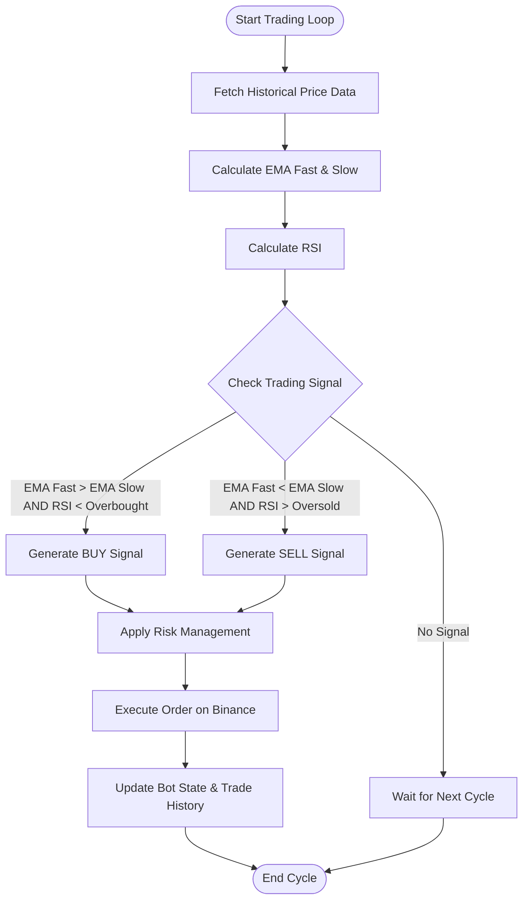
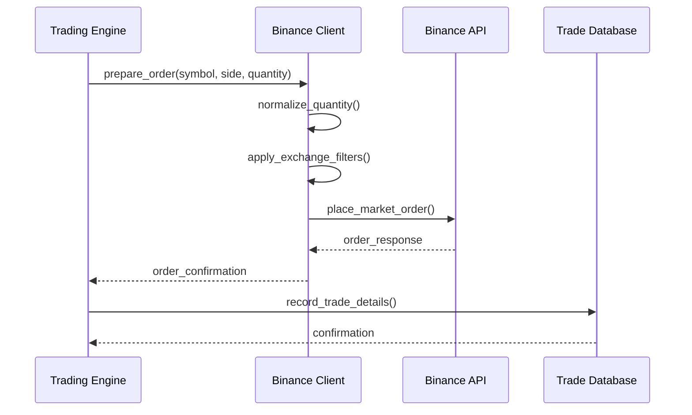
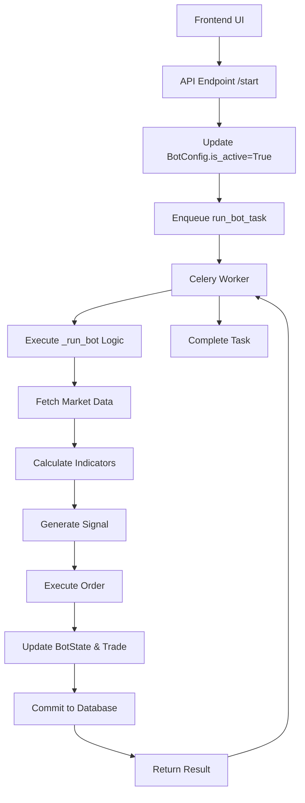
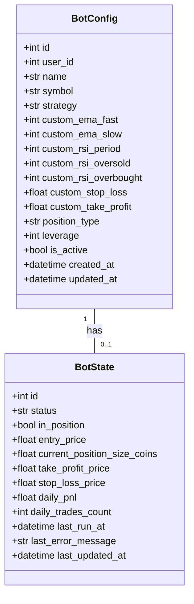

# Automated Trading System

<cite>
**Referenced Files in This Document**   
- [bot_tasks.py](file://app/core/bot_tasks.py)
- [bot_config.py](file://app/models/bot_config.py)
- [bot_state.py](file://app/models/bot_state.py)
- [trade.py](file://app/models/trade.py)
- [binance_client.py](file://app/core/binance_client.py)
- [bot_runner.py](file://app/api/routes/bot_runner.py)
</cite>

## Table of Contents
1. [Introduction](#introduction)
2. [Core Trading Engine Implementation](#core-trading-engine-implementation)
3. [EMA/RSI Strategy and Signal Generation](#emarsi-strategy-and-signal-generation)
4. [Order Execution on Binance](#order-execution-on-binance)
5. [API, Database, and Celery Task Integration](#api-database-and-celery-task-integration)
6. [Bot Configuration and State Management](#bot-configuration-and-state-management)
7. [Position Management and Order Types](#position-management-and-order-types)
8. [Error Handling and Common Issues](#error-handling-and-common-issues)
9. [Conclusion](#conclusion)

## Introduction
The Automated Trading System is a sophisticated platform designed to execute algorithmic trading strategies on the Binance exchange. This document focuses on the core trading functionality, detailing the implementation of the trading engine with an emphasis on the EMA/RSI strategy. The system leverages Celery for task scheduling, SQLAlchemy for database interactions, and a custom Binance client wrapper for exchange communication. It supports both spot and futures trading with configurable risk management parameters. The architecture is built around bot configurations that define trading parameters, with state management to track bot performance and trading activity. This documentation provides a comprehensive overview of how trading signals are generated, how orders are executed, and how the various components of the system interact to form a cohesive trading loop.

## Core Trading Engine Implementation

The core trading engine is implemented in the `bot_tasks.py` module as a Celery task. The engine operates on a scheduled basis, with the `run_bot_task_for_all` task triggering individual `run_bot_task` executions for each active bot configuration. Each bot runs within a concurrency-guarded transaction using database row-level locking to prevent race conditions. The engine initializes a Binance client using decrypted API credentials associated with the bot's configuration. It then retrieves the latest market data for the configured symbol and timeframe, currently set to 1-minute candles. The trading decision process begins by checking the bot's strategy type, with the primary focus on the "ema" strategy. The engine calculates technical indicators including Exponential Moving Averages (EMA) and Relative Strength Index (RSI) using historical price data. Based on these calculations and the bot's configured parameters, it determines whether to generate a BUY or SELL signal. Before executing any trade, the engine performs comprehensive risk management checks, including daily trade limits, loss thresholds, and profit targets. The entire trading loop is designed to be idempotent and fault-tolerant, with detailed error handling and logging throughout the process.

**Section sources**
- [bot_tasks.py](file://app/core/bot_tasks.py#L111-L124)
- [celery_app.py](file://app/core/celery_app.py#L26-L34)

## EMA/RSI Strategy and Signal Generation

The EMA/RSI strategy is implemented as the primary trading algorithm within the `bot_tasks.py` module. The strategy uses two Exponential Moving Averages with different periods (fast and slow) combined with the Relative Strength Index to generate trading signals. The implementation begins by retrieving the strategy parameters from the bot configuration, specifically `custom_ema_fast`, `custom_ema_slow`, and `custom_rsi_period`, with default values of 8, 21, and 7 periods respectively. The EMA calculation uses the standard formula with a smoothing factor of 2/(period+1), applied recursively to the closing prices. The RSI is calculated using the Wilder's smoothing method, comparing the average gains and losses over the specified period. A BUY signal is generated when the fast EMA crosses above the slow EMA and the RSI is below the overbought threshold (default 65), indicating potential upward momentum from an oversold condition. Conversely, a SELL signal is generated when the fast EMA crosses below the slow EMA and the RSI is above the oversold threshold (default 35), suggesting potential downward momentum from an overbought condition. The strategy also incorporates risk management parameters such as stop-loss, take-profit, and trailing stop percentages, which are used to calculate exit prices for position management.

**Diagram sources **
- [bot_tasks.py](file://app/core/bot_tasks.py#L251-L325)
- [bot_config.py](file://app/models/bot_config.py#L34-L40)

**Section sources**
- [bot_tasks.py](file://app/core/bot_tasks.py#L251-L325)
- [bot_config.py](file://app/models/bot_config.py#L34-L40)

## Order Execution on Binance

Order execution is handled through the `BinanceClientWrapper` class in the `binance_client.py` module, which provides a robust interface to the Binance API. When a trading signal is generated, the system first calculates the appropriate order quantity based on the bot's position sizing parameters, either as a fixed amount or a percentage of available capital. The quantity is then normalized according to Binance's symbol filters, including LOT_SIZE and MIN_NOTIONAL constraints, to ensure the order meets exchange requirements. For spot trading, market orders are placed directly using the Binance client's market order functions. For futures trading, the system first ensures the account is in isolated margin mode and one-way position mode before placing market orders. When executing SELL orders in spot trading, the system can place OCO (One-Cancels-the-Other) orders that combine take-profit and stop-loss levels to automate exit strategies. The client wrapper includes comprehensive error handling with retry logic for transient issues like rate limiting or network timeouts. After a successful order execution, the system records the trade details in the database, including the order ID, price, quantity, and realized PnL if applicable. The system also supports optional webhook notifications and email alerts to inform users of trade executions.

**Diagram sources **
- [bot_tasks.py](file://app/core/bot_tasks.py#L407-L426)
- [binance_client.py](file://app/core/binance_client.py#L275-L305)

**Section sources**
- [bot_tasks.py](file://app/core/bot_tasks.py#L407-L426)
- [binance_client.py](file://app/core/binance_client.py#L169-L221)

## API, Database, and Celery Task Integration

The trading system integrates API endpoints, database models, and Celery tasks to create a seamless trading loop. The API layer, implemented in `bot_runner.py`, provides endpoints to start and stop bots, which trigger the underlying Celery tasks. When a user starts a bot via the `/start` endpoint, the system updates the bot's `is_active` status in the database and enqueues a `run_bot_task` in Celery. The Celery scheduler, configured in `celery_app.py`, runs the `run_bot_task_for_all` task every minute, which in turn triggers individual bot tasks for all active configurations. The database models in the `models` package define the core entities: `BotConfig` stores the trading parameters, `BotState` tracks the current status and performance metrics, and `Trade` records all executed trades. These models are connected through SQLAlchemy relationships, allowing efficient querying and updates. The integration follows a clean separation of concerns, with the API handling user requests, the database persisting state, and Celery managing the asynchronous execution of trading logic. This architecture ensures that the trading engine can scale to handle multiple bots simultaneously while maintaining data consistency and system responsiveness.

**Diagram sources **
- [bot_runner.py](file://app/api/routes/bot_runner.py#L13-L36)
- [celery_app.py](file://app/core/celery_app.py#L26-L34)
- [bot_tasks.py](file://app/core/bot_tasks.py#L121-L124)

**Section sources**
- [bot_runner.py](file://app/api/routes/bot_runner.py#L13-L36)
- [celery_app.py](file://app/core/celery_app.py#L26-L34)
- [bot_config.py](file://app/models/bot_config.py#L5-L57)
- [bot_state.py](file://app/models/bot_state.py#L5-L22)
- [trade.py](file://app/models/trade.py#L5-L25)

## Bot Configuration and State Management

Bot configuration and state management are central to the trading system's operation, implemented through the `BotConfig` and `BotState` models. The `BotConfig` model, defined in `bot_config.py`, contains all the parameters that define a bot's behavior, including the trading symbol, strategy type, EMA periods, RSI thresholds, risk management settings, and position type (spot or futures). These configurations are created and modified through API endpoints and stored persistently in the database. The `BotState` model, defined in `bot_state.py`, tracks the runtime state of each bot, including its current status (running, stopped, error), position information, daily performance metrics, and last error messages. The state is updated after each trading cycle and serves as a concurrency control mechanism through row-level locking. The system uses a one-to-one relationship between `BotConfig` and `BotState`, ensuring that each configuration has a corresponding state record. This design allows for efficient state management and monitoring, with the API providing endpoints to retrieve the current state of any bot. The separation of configuration (what the bot should do) from state (what the bot is currently doing) enables flexible and reliable trading operations.

**Diagram sources **
- [bot_config.py](file://app/models/bot_config.py#L5-L57)
- [bot_state.py](file://app/models/bot_state.py#L5-L22)

**Section sources**
- [bot_config.py](file://app/models/bot_config.py#L5-L57)
- [bot_state.py](file://app/models/bot_state.py#L5-L22)

## Position Management and Order Types

Position management in the trading system is implemented through a combination of entry and exit strategies, with support for different order types based on the trading mode. For position entry, the system primarily uses market orders to ensure immediate execution at the current market price. The order quantity is determined by the bot's position sizing parameters, either as a fixed amount or a percentage of available capital, and is normalized to meet Binance's symbol filters. For position exit, the system implements multiple strategies depending on the trading mode. In spot trading, when a SELL signal is generated, the system can place an OCO (One-Cancels-the-Other) order that combines a take-profit limit order and a stop-loss market order, allowing for automated profit taking and loss limiting. In futures trading, the system places separate reduce-only orders for stop-loss and take-profit levels to ensure positions are closed without increasing exposure. The system also supports trailing stop functionality, where the stop-loss price is adjusted upward as the market price increases, locking in profits while allowing for further upside potential. All position management parameters are configurable through the bot configuration, allowing users to customize their risk-reward profiles.

**Section sources**
- [bot_tasks.py](file://app/core/bot_tasks.py#L330-L339)
- [binance_client.py](file://app/core/binance_client.py#L251-L273)

## Error Handling and Common Issues

The trading system implements comprehensive error handling to address common issues that may arise during operation. The `bot_tasks.py` module includes try-catch blocks around critical operations such as API key decryption, Binance client initialization, market data retrieval, and order execution. When an error occurs, the system updates the bot's state with an appropriate error message and status, allowing for monitoring and troubleshooting. Common issues include API key authentication failures, which are handled by validating credentials and providing descriptive error messages; network connectivity problems, which are mitigated through retry logic with exponential backoff; and order rejection due to insufficient funds or invalid parameters, which are caught and logged for review. The system also handles rate limiting by respecting Binance's rate limit headers and implementing polite delays when approaching usage thresholds. For database operations, the system uses transaction management with proper rollback procedures to maintain data consistency. Additionally, the system includes daily reset functionality that reactivates bots that may have been paused due to daily limits, ensuring continuous operation. These error handling mechanisms work together to create a robust and resilient trading system that can recover from transient issues and continue operation with minimal manual intervention.

**Section sources**
- [bot_tasks.py](file://app/core/bot_tasks.py#L155-L163)
- [bot_tasks.py](file://app/core/bot_tasks.py#L170-L177)
- [bot_tasks.py](file://app/core/bot_tasks.py#L222-L229)
- [binance_client.py](file://app/core/binance_client.py#L74-L96)

## Conclusion
The Automated Trading System provides a robust framework for algorithmic trading on Binance, combining technical analysis, risk management, and automated execution. The core trading engine, implemented in the `bot_tasks.py` module, uses an EMA/RSI strategy to generate trading signals based on configurable parameters. The system integrates seamlessly with Binance through a custom client wrapper that handles order execution, market data retrieval, and error management. The architecture leverages Celery for task scheduling and concurrency control, ensuring reliable operation of multiple trading bots. Database models for bot configuration and state management provide persistent storage and runtime tracking of trading activities. The system's modular design, with clear separation between API endpoints, business logic, and data persistence, enables scalability and maintainability. While the current implementation focuses on the EMA/RSI strategy, the architecture supports the addition of new trading strategies with minimal changes. Future enhancements could include support for additional technical indicators, advanced order types, and machine learning-based prediction models. The comprehensive error handling and monitoring capabilities ensure the system can operate reliably in production environments, making it a powerful tool for automated trading.