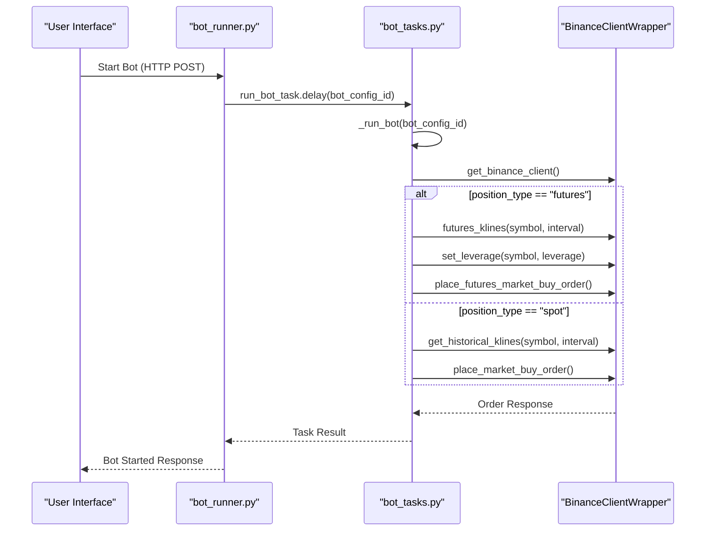

# Market Type Support

<cite>
**Referenced Files in This Document**   
- [bot_config.py](file://app/models/bot_config.py)
- [bot_tasks.py](file://app/core/bot_tasks.py)
- [binance_client.py](file://app/core/binance_client.py)
- [bot_runner.py](file://app/api/routes/bot_runner.py)
- [bot_config.py](file://app/schemas/bot_config.py)
- [107856acfca7_add_leverage_column_to_bot_configs.py](file://alembic/versions/107856acfca7_add_leverage_column_to_bot_configs.py)
</cite>

## Table of Contents
1. [Introduction](#introduction)
2. [Domain Model of Market Type Selection](#domain-model-of-market-type-selection)
3. [Core Components and Invocation Flow](#core-components-and-invocation-flow)
4. [Futures-Specific Configuration](#futures-specific-configuration)
5. [Fund Transfer Mechanisms](#fund-transfer-mechanisms)
6. [Common Issues and Best Practices](#common-issues-and-best-practices)
7. [Conclusion](#conclusion)

## Introduction
This document provides a comprehensive analysis of the market type support feature in the trading bot system, focusing on the implementation of spot and futures trading capabilities. The system uses the `position_type` parameter within the `BotConfig` model to determine the trading market, enabling distinct behaviors for spot and futures trading. This configuration impacts critical aspects such as leverage settings, margin modes, and fund transfers between Binance accounts. The documentation details the interaction between the `run_bot_task` function, the `BinanceClientWrapper`, and market-specific API methods, providing technical depth for developers while remaining accessible to beginners. It also addresses common operational issues and optimization strategies for both market types.

## Domain Model of Market Type Selection

The domain model for market type selection is centered around the `BotConfig` entity, which defines the trading behavior for each bot instance. The `position_type` field, with a default value of "spot", serves as the primary discriminator between spot and futures trading modes. This design allows users to configure their trading strategy at the bot level, ensuring that all subsequent operations align with the selected market type.

The implementation includes robust validation to ensure data integrity. The `BotConfig` schema enforces that `position_type` can only be "spot" or "futures", preventing invalid configurations. This validation occurs at both the database and API layers, providing a consistent user experience. The model also includes related parameters such as `leverage`, `auto_transfer_funds`, and `transfer_amount`, which are specifically relevant to futures trading but have sensible defaults for spot trading.

This domain model enables a flexible yet controlled trading environment where users can switch between market types without changing the core bot logic. The system automatically adapts its behavior based on the `position_type`, ensuring that appropriate API endpoints and trading parameters are used for each market.

**Section sources**
- [bot_config.py](file://app/models/bot_config.py#L46-L50)
- [bot_config.py](file://app/schemas/bot_config.py#L43-L62)

## Core Components and Invocation Flow

The trading system's architecture follows a clear invocation flow that begins with the `run_bot_task` function and progresses through the `BinanceClientWrapper` to market-specific API calls. This flow ensures that trading operations are executed correctly based on the configured market type.

When a user starts a bot through the API endpoint defined in `bot_runner.py`, the `start_bot` function triggers the `run_bot_task` Celery task. This task, defined in `bot_tasks.py`, initializes the trading process by retrieving the bot configuration and establishing a connection to the Binance API through the `BinanceClientWrapper`. The wrapper acts as an abstraction layer that handles authentication and provides a consistent interface to Binance's API.

The critical decision point occurs in the `_run_bot` function, where the `position_type` from the `BotConfig` determines the execution path. For futures trading, the system calls futures-specific methods such as `futures_klines` for price data and `futures_symbol_ticker` for current prices. For spot trading, it uses the standard spot API methods. This conditional branching ensures that the correct market-specific endpoints are used, maintaining the integrity of the trading operations.



**Diagram sources**
- [bot_runner.py](file://app/api/routes/bot_runner.py#L13-L36)
- [bot_tasks.py](file://app/core/bot_tasks.py#L121-L516)
- [binance_client.py](file://app/core/binance_client.py#L17-L572)

## Futures-Specific Configuration

Futures trading in the system requires specific configuration parameters that are not relevant to spot trading. The most critical of these is leverage, which is configured through the `leverage` field in the `BotConfig` model. This field has a default value of 10 and is validated to ensure it falls within the acceptable range of 1-125, as defined in the Binance API specifications.

The system automatically configures leverage when a futures bot starts. In the `_run_bot` function, after establishing the Binance client connection, the code checks if the `position_type` is "futures" and then calls the `set_leverage` method on the `BinanceClientWrapper`. This method uses Binance's `futures_change_leverage` API endpoint to set the desired leverage for the specified symbol. The implementation includes error handling to log any issues with leverage configuration, ensuring that problems are visible in the system logs.

Additionally, the system ensures that isolated margin mode is used for futures trading by calling the `ensure_isolated_margin` method. This security measure prevents cross-margin risks and aligns with best practices for futures trading. The `ensure_one_way_mode` method is also called to prevent hedging positions, which simplifies the trading logic and reduces risk.

These configurations are applied automatically when a futures bot starts, ensuring that the trading environment is properly set up before any trades are executed. This automation reduces the risk of human error and ensures consistent behavior across all futures trading bots.

```mermaid
flowchart TD
A[Bot Start] --> B{position_type == "futures"?}
B --> |Yes| C[Initialize Binance Client]
C --> D[Set Leverage]
D --> E[Ensure Isolated Margin]
E --> F[Ensure One-Way Mode]
F --> G[Execute Trading Logic]
B --> |No| H[Execute Spot Trading Logic]
```

**Diagram sources**
- [bot_tasks.py](file://app/core/bot_tasks.py#L193-L209)
- [binance_client.py](file://app/core/binance_client.py#L488-L532)

**Section sources**
- [bot_tasks.py](file://app/core/bot_tasks.py#L193-L209)
- [binance_client.py](file://app/core/binance_client.py#L488-L532)
- [bot_config.py](file://app/models/bot_config.py#L49-L50)

## Fund Transfer Mechanisms

The system includes automated fund transfer mechanisms between spot and futures accounts to support the configured trading strategy. This functionality is controlled by the `auto_transfer_funds` and `transfer_amount` fields in the `BotConfig` model. When `auto_transfer_funds` is enabled, the system will automatically transfer funds between accounts based on the `position_type`.

For futures trading, the system transfers funds from the spot account to the futures account using the `transfer_to_futures` method of the `BinanceClientWrapper`. This method calls Binance's `futures_account_transfer` API with type parameter 1 (spot to futures). The transfer amount can be specified explicitly through the `transfer_amount` field, or if not specified, the system transfers the available balance minus a safety margin (10 USDT for spot, 1 USDT for futures).

Conversely, for spot trading, funds are transferred from the futures account back to the spot account using the `transfer_to_spot` method with type parameter 2 (futures to spot). This bidirectional transfer capability ensures that funds are available in the correct account for the configured trading strategy.

The fund transfer process is integrated into the bot startup sequence and is executed before any trading operations begin. This ensures that sufficient funds are available in the appropriate account. The implementation includes error handling to log any transfer failures, allowing for troubleshooting and monitoring of the fund movement process.

**Section sources**
- [bot_tasks.py](file://app/core/bot_tasks.py#L42-L75)
- [binance_client.py](file://app/core/binance_client.py#L418-L444)

## Common Issues and Best Practices

Several common issues can arise when configuring and operating spot and futures trading bots. The most frequent problems relate to margin mode configuration and leverage settings. For futures trading, ensuring that isolated margin mode is properly set is critical. If the margin mode is not correctly configured, trades may fail or behave unexpectedly. The system addresses this by automatically calling `ensure_isolated_margin` when a futures bot starts, but users should verify that this operation succeeds by checking the logs.

Leverage configuration errors are another common issue. Setting leverage too high can increase risk exposure significantly, while setting it too low may not utilize the full potential of futures trading. The system validates leverage values between 1 and 125, with a default of 10, but users should carefully consider their risk tolerance when configuring this parameter. It's recommended to start with lower leverage values and gradually increase as confidence in the trading strategy grows.

Best practices for using the market type support feature include:
- Always testing new configurations in a test environment before deploying to production
- Monitoring the system logs for any errors related to margin mode or leverage configuration
- Using appropriate safety margins when configuring automatic fund transfers
- Regularly reviewing the performance of both spot and futures trading strategies to ensure they align with overall investment goals
- Implementing proper risk management parameters such as stop-loss and take-profit levels

For developers, it's important to understand that the system's design separates market-specific logic into distinct code paths, making it easier to maintain and extend. When adding new features, consider whether they should behave differently for spot versus futures trading, and use the existing pattern of conditional execution based on `position_type`.

**Section sources**
- [bot_tasks.py](file://app/core/bot_tasks.py#L193-L209)
- [binance_client.py](file://app/core/binance_client.py#L520-L532)
- [bot_config.py](file://app/models/bot_config.py#L48-L50)

## Conclusion
The market type support feature provides a robust framework for both spot and futures trading within the trading bot system. By using the `position_type` parameter in the `BotConfig` model, the system can dynamically adapt its behavior to the selected market, ensuring that appropriate API endpoints and trading parameters are used. The integration between the `run_bot_task` function, the `BinanceClientWrapper`, and market-specific methods creates a cohesive architecture that handles the complexities of both trading modes.

The implementation of leverage configuration and isolated margin mode for futures trading demonstrates attention to the specific requirements of derivatives trading, while the automated fund transfer mechanisms ensure that capital is available where needed. By following best practices and understanding the common issues associated with market type configuration, users can effectively leverage both spot and futures trading capabilities to meet their investment objectives.