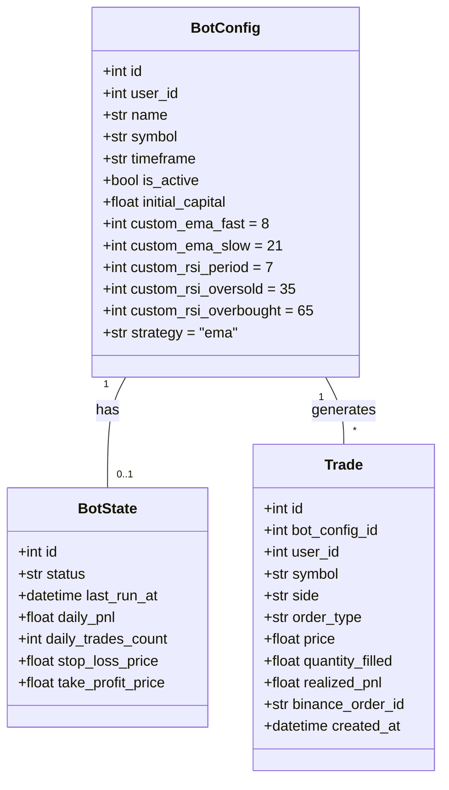
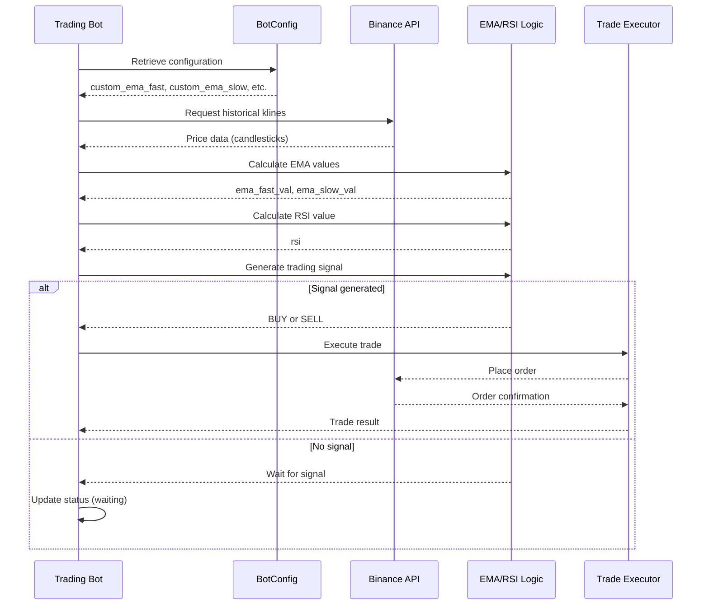

# Strategy Configuration

<cite>
**Referenced Files in This Document**   
- [bot_config.py](file://app/models/bot_config.py)
- [bot_tasks.py](file://app/core/bot_tasks.py)
- [bot_config.py](file://app/schemas/bot_config.py)
</cite>

## Table of Contents
1. [Introduction](#introduction)
2. [Core Components](#core-components)
3. [Strategy Parameters Domain Model](#strategy-parameters-domain-model)
4. [EMA/RSI Strategy Implementation](#emarsi-strategy-implementation)
5. [Configuration Parameters](#configuration-parameters)
6. [Parameter Optimization and Backtesting](#parameter-optimization-and-backtesting)
7. [Common Issues and Best Practices](#common-issues-and-best-practices)

## Introduction
This document provides comprehensive documentation for the EMA/RSI trading strategy configuration in the trading bot system. It explains the implementation of Exponential Moving Average (EMA) and Relative Strength Index (RSI) indicators, their mathematical foundations, and how they are used to generate trading signals. The document covers the configuration parameters available to users, their relationship to the BotConfig entity, and provides guidance on optimal parameter selection to avoid common pitfalls like overfitting.

## Core Components

The EMA/RSI trading strategy is implemented primarily in the `_run_bot` function within the `bot_tasks.py` file. This function orchestrates the entire trading decision process, including fetching market data, calculating technical indicators, generating trading signals, and executing trades. The strategy configuration is managed through the BotConfig model, which stores all user-defined parameters for the trading bot.

The system follows a modular architecture where the strategy logic is separated from the data access and trading execution components. This allows for flexible configuration and easy extension of trading strategies. The core components involved in the EMA/RSI strategy implementation include the BotConfig model for storing configuration, the bot_tasks module for executing the trading logic, and the Binance client wrapper for interacting with the exchange API.

**Section sources**
- [bot_tasks.py](file://app/core/bot_tasks.py#L125-L516)
- [bot_config.py](file://app/models/bot_config.py#L4-L57)

## Strategy Parameters Domain Model

The strategy parameters are modeled as part of the BotConfig entity in the application's domain model. This entity serves as the central configuration point for all trading bots and contains both basic and advanced strategy parameters. The domain model establishes a clear relationship between the bot configuration and its strategy parameters, ensuring type safety and data integrity.

The BotConfig model includes dedicated fields for EMA and RSI parameters, allowing users to customize the behavior of the trading strategy. These parameters are stored in the database and can be modified through the application's API. The model also includes validation rules to ensure that parameter values remain within reasonable bounds, preventing configuration errors that could lead to undesirable trading behavior.

The domain model supports both default values and user overrides, providing a balance between ease of use and flexibility. When a user creates a new bot configuration, the system initializes the strategy parameters with sensible defaults, which can then be adjusted according to the user's trading preferences and market conditions.

**Diagram sources**
- [bot_config.py](file://app/models/bot_config.py#L4-L57)

**Section sources**
- [bot_config.py](file://app/models/bot_config.py#L4-L57)
- [bot_config.py](file://app/schemas/bot_config.py#L5-L82)

## EMA/RSI Strategy Implementation

The EMA/RSI strategy implementation in the `_run_bot` function follows a systematic approach to generate trading signals based on technical analysis indicators. The strategy combines trend-following (EMA) and momentum (RSI) indicators to identify potential entry and exit points in the market.

The implementation begins by retrieving the user's custom parameters from the BotConfig entity. These parameters are used to configure the calculation of the EMA and RSI indicators. The system then fetches historical price data from the exchange, typically using 1-minute candles, to ensure timely and relevant market information.

For the EMA calculation, the system uses the standard exponential smoothing formula with a smoothing factor of 2/(period+1). The fast EMA (typically 8 periods) responds quickly to price changes, while the slow EMA (typically 21 periods) provides a longer-term trend reference. When the fast EMA crosses above the slow EMA, it generates a bullish signal, and when it crosses below, it generates a bearish signal.

The RSI calculation follows the conventional methodology, measuring the magnitude of recent price changes to evaluate overbought or oversold conditions. The system calculates the average gain and loss over the specified period (typically 7 periods) and uses these values to compute the Relative Strength (RS) and subsequently the RSI value. An RSI below the oversold threshold (typically 35) indicates potential buying opportunities, while an RSI above the overbought threshold (typically 65) suggests potential selling opportunities.

Trading signals are generated when both indicators align: a BUY signal is triggered when the fast EMA is above the slow EMA and the RSI is below the overbought level, indicating upward momentum in an oversold condition. Conversely, a SELL signal is generated when the fast EMA is below the slow EMA and the RSI is above the oversold level, indicating downward momentum in an overbought condition.

**Diagram sources**
- [bot_tasks.py](file://app/core/bot_tasks.py#L251-L324)

**Section sources**
- [bot_tasks.py](file://app/core/bot_tasks.py#L251-L324)

## Configuration Parameters

The EMA/RSI strategy provides several configurable parameters that allow users to customize the behavior of their trading bot. These parameters are defined in the BotConfig model and can be adjusted through the application's user interface or API.

The primary configuration parameters for the EMA/RSI strategy include:

- **custom_ema_fast**: The period for the fast Exponential Moving Average, typically set to 8. A shorter period makes the EMA more responsive to recent price changes.
- **custom_ema_slow**: The period for the slow Exponential Moving Average, typically set to 21. A longer period provides a smoother trend indication.
- **custom_rsi_period**: The lookback period for the RSI calculation, typically set to 7. This determines how many previous periods are considered when calculating the RSI.
- **custom_rsi_oversold**: The threshold below which the RSI is considered oversold, typically set to 35. When the RSI falls below this level, it may indicate a buying opportunity.
- **custom_rsi_overbought**: The threshold above which the RSI is considered overbought, typically set to 65. When the RSI rises above this level, it may indicate a selling opportunity.

These parameters work together to define the sensitivity and responsiveness of the trading strategy. For example, shorter EMA periods and a narrower RSI range (e.g., 30-70 instead of 35-65) make the strategy more sensitive to market movements, potentially generating more trading signals but also increasing the risk of false signals. Conversely, longer periods and wider ranges make the strategy more conservative, reducing the number of signals but potentially improving their quality.

The default values for these parameters have been selected based on common trading practices and backtesting results, providing a balanced starting point for users. However, optimal parameter values can vary significantly depending on the specific market conditions, trading pair, and timeframe being analyzed.

**Section sources**
- [bot_config.py](file://app/models/bot_config.py#L34-L39)
- [bot_tasks.py](file://app/core/bot_tasks.py#L253-L257)

## Parameter Optimization and Backtesting

Effective parameter optimization is crucial for developing a profitable trading strategy. The process involves systematically testing different parameter combinations to identify those that perform best on historical data. However, this must be done carefully to avoid overfitting, where the strategy performs well on historical data but fails to generalize to future market conditions.

The recommended approach to parameter optimization involves several steps:

1. **Define a reasonable parameter range**: Based on market knowledge and statistical analysis, establish realistic bounds for each parameter. For example, EMA periods between 5-20 for the fast EMA and 20-50 for the slow EMA.

2. **Use walk-forward optimization**: Instead of optimizing on the entire historical dataset, divide the data into multiple segments and optimize parameters on earlier segments, then test on subsequent segments. This helps ensure that the optimized parameters remain effective as market conditions evolve.

3. **Apply robustness testing**: After identifying promising parameter combinations, test their performance across different market regimes (bull, bear, sideways) and on out-of-sample data to verify their consistency.

4. **Consider multiple performance metrics**: Rather than optimizing for a single metric like total return, consider a combination of metrics including Sharpe ratio, maximum drawdown, win rate, and profit factor to ensure a balanced assessment of strategy performance.

Backtesting is an essential component of parameter optimization, allowing users to evaluate how a strategy would have performed in the past. The system provides backtesting capabilities through the backtest_service module, which simulates trading activity using historical price data. When conducting backtests, it's important to account for realistic trading conditions, including transaction costs, slippage, and order execution delays.

The backtesting process should include sensitivity analysis to understand how small changes in parameter values affect strategy performance. This helps identify parameter combinations that are robust to minor variations, reducing the risk of overfitting. Additionally, users should consider the economic rationale behind parameter choices rather than simply selecting values that performed best historically.

**Section sources**
- [bot_tasks.py](file://app/core/bot_tasks.py#L251-L324)
- [bot_config.py](file://app/models/bot_config.py#L34-L39)

## Common Issues and Best Practices

When configuring and optimizing the EMA/RSI trading strategy, users may encounter several common issues that can impact performance. Understanding these issues and following best practices can help improve the reliability and profitability of the trading bot.

One of the most significant challenges is overfitting, where parameters are excessively tuned to historical data, resulting in poor performance on new data. To mitigate this risk, users should:
- Limit the number of parameters being optimized simultaneously
- Use out-of-sample testing to validate parameter choices
- Apply regularization techniques or constraints on parameter values
- Consider the economic rationale behind parameter selections

Another common issue is curve-fitting to specific market conditions. A strategy that performs well in trending markets may fail in ranging markets, and vice versa. To address this, users should:
- Test strategies across multiple market regimes
- Consider adaptive parameters that can adjust to changing market volatility
- Implement risk management rules that account for different market conditions

Performance degradation over time is also a concern, as market dynamics evolve and previously effective strategies may become less profitable. To maintain strategy effectiveness, users should:
- Regularly review and update parameter values
- Monitor strategy performance metrics and adjust parameters as needed
- Implement automated re-optimization at regular intervals
- Stay informed about market developments that may affect strategy performance

Best practices for configuring the EMA/RSI strategy include:
- Starting with the default parameter values and making incremental adjustments
- Using longer backtesting periods to capture multiple market cycles
- Considering the trading timeframe when selecting parameter values (shorter periods for faster timeframes)
- Implementing proper risk management, including position sizing and stop-loss rules
- Monitoring strategy performance and being prepared to pause or adjust the bot when market conditions change significantly

By following these guidelines, users can develop a robust EMA/RSI trading strategy that is well-suited to their risk tolerance and trading objectives.

**Section sources**
- [bot_tasks.py](file://app/core/bot_tasks.py#L251-L324)
- [bot_config.py](file://app/models/bot_config.py#L34-L39)