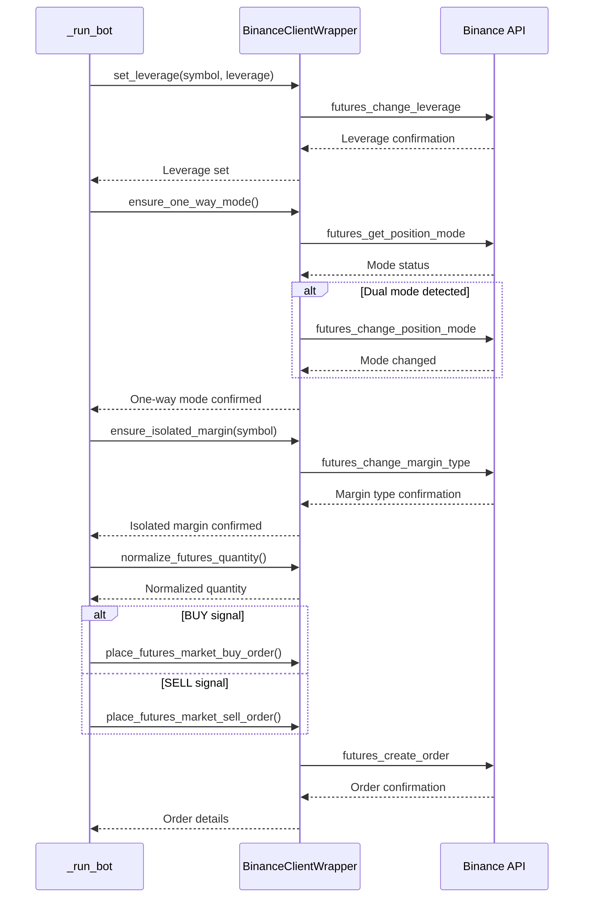
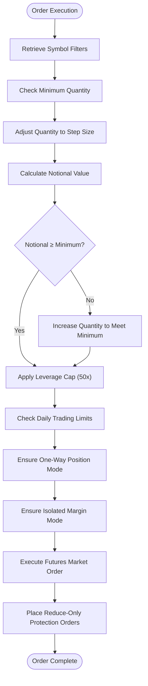
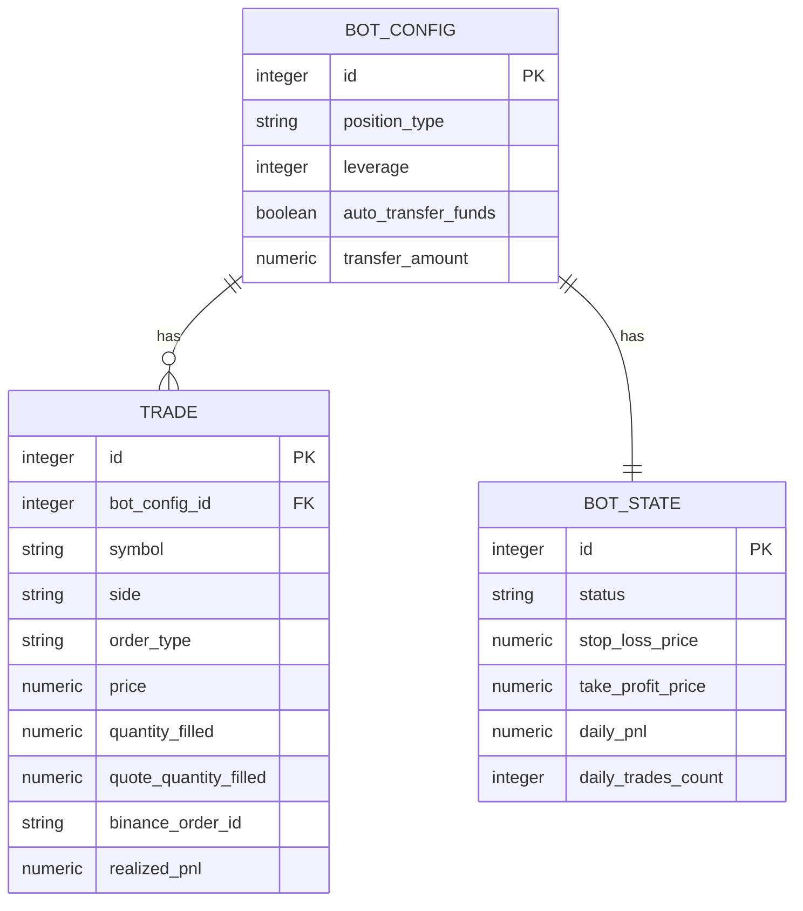

# Futures Orders

<cite>
**Referenced Files in This Document**   
- [binance_client.py](file://app/core/binance_client.py)
- [bot_tasks.py](file://app/core/bot_tasks.py)
- [bot_config.py](file://app/models/bot_config.py)
- [trade.py](file://app/models/trade.py)
</cite>

## Table of Contents
1. [Introduction](#introduction)
2. [Core Order Execution Methods](#core-order-execution-methods)
3. [Leverage and Margin Configuration](#leverage-and-margin-configuration)
4. [Order Placement Workflow](#order-placement-workflow)
5. [Quantity Normalization and Risk Controls](#quantity-normalization-and-risk-controls)
6. [Domain Model of Futures Orders](#domain-model-of-futures-orders)
7. [Common Issues and Error Handling](#common-issues-and-error-handling)
8. [Conclusion](#conclusion)

## Introduction
This document provides a comprehensive analysis of the futures order execution sub-feature focused on leveraged trading with isolated margin mode. It details the implementation of market order placement, leverage management, position mode configuration, and risk controls within the trading bot system. The documentation explains how futures orders are executed safely with proper quantity normalization, leverage constraints, and protection mechanisms while ensuring compatibility with Binance's futures trading requirements.

## Core Order Execution Methods

The `BinanceClientWrapper` class implements two primary methods for executing futures market orders: `place_futures_market_buy_order` and `place_futures_market_sell_order`. These methods serve as the core execution engine for entering and exiting futures positions in the trading system.

The `place_futures_market_buy_order` method creates a market buy order for a specified symbol and quantity, using Binance's futures API to execute the trade immediately at the best available price. Similarly, the `place_futures_market_sell_order` method creates a market sell order for closing or shorting positions. Both methods implement retry logic to handle transient API issues and include comprehensive error handling to ensure robust operation in production environments.

These methods are designed specifically for futures trading and differ from their spot trading counterparts by utilizing Binance's futures-specific endpoints. They form the foundation of the trading bot's execution capability, enabling rapid entry and exit from positions based on trading signals generated by various strategies.

**Section sources**
- [binance_client.py](file://app/core/binance_client.py#L458-L486)

## Leverage and Margin Configuration

The system implements a comprehensive leverage and margin management system to ensure safe futures trading operations. The `set_leverage` method in the `BinanceClientWrapper` class allows dynamic configuration of leverage for specific trading pairs, with built-in validation to ensure leverage values remain within acceptable bounds (1-125x).

Before executing any futures order, the system ensures proper margin and position mode configuration through two critical methods: `ensure_isolated_margin` and `ensure_one_way_mode`. The `ensure_isolated_margin` method configures the specified symbol to use isolated margin mode, which limits risk to the allocated margin for that specific position rather than the entire account balance. This provides crucial risk containment for individual trades.

The `ensure_one_way_mode` method verifies that the futures account is configured for one-way position mode, preventing the complexity and potential conflicts of hedge mode. This simplifies position management by ensuring only one position can exist per symbol at any time, making the trading logic more predictable and easier to manage.

**Section sources**
- [binance_client.py](file://app/core/binance_client.py#L488-L503)
- [binance_client.py](file://app/core/binance_client.py#L520-L543)

## Order Placement Workflow

The invocation relationship between the `_run_bot` function and the futures order methods follows a well-defined sequence that ensures proper risk management and configuration before order execution. When a trading signal is generated, the system first validates that futures trading is enabled and then proceeds through a series of safety checks before placing any orders.

The workflow begins with the `_run_bot` function, which serves as the main execution loop for trading bots. When a valid trading signal is detected, the function first sets the appropriate leverage for the trading pair using the `set_leverage` method. It then ensures the correct margin and position modes by calling `ensure_isolated_margin` and `ensure_one_way_mode` respectively.

Only after these configuration steps are successfully completed does the system proceed to normalize the order quantity and execute the trade. The normalized quantity is passed to either `place_futures_market_buy_order` or `place_futures_market_sell_order` depending on the trading signal direction. This sequential approach guarantees that all risk parameters are properly configured before capital is deployed.

**Diagram sources**
- [bot_tasks.py](file://app/core/bot_tasks.py#L396-L421)
- [binance_client.py](file://app/core/binance_client.py#L458-L486)

**Section sources**
- [bot_tasks.py](file://app/core/bot_tasks.py#L396-L421)

## Quantity Normalization and Risk Controls

The system implements sophisticated quantity normalization and risk control mechanisms to ensure compliance with exchange requirements and maintain safe trading practices. The `normalize_futures_quantity` method plays a crucial role in this process by adjusting the desired order quantity to meet Binance's trading rules.

This method retrieves the symbol's filters from the exchange, including minimum quantity, step size, and minimum notional value requirements. It then calculates a compliant quantity by ensuring the order meets the minimum size requirements and adheres to the specified step size increments. If the notional value (quantity × price) falls below the minimum threshold, the method increases the quantity appropriately.

A critical safety feature is the leverage cap implemented in the `_run_bot` function, which limits leverage to a maximum of 50x regardless of the user's configuration. This protective measure prevents excessive risk exposure that could lead to rapid liquidation. The system also implements daily trading limits, including maximum daily trades, loss limits, and profit targets, which help maintain disciplined risk management.

**Diagram sources**
- [binance_client.py](file://app/core/binance_client.py#L202-L220)
- [bot_tasks.py](file://app/core/bot_tasks.py#L396-L421)

**Section sources**
- [binance_client.py](file://app/core/binance_client.py#L202-L220)
- [bot_tasks.py](file://app/core/bot_tasks.py#L396-L421)

## Domain Model of Futures Orders

The domain model of futures orders in this system encompasses several key concepts that define how positions are managed and risks are controlled. The model centers around the relationship between entry orders and subsequent protection orders, with a focus on isolated margin and leverage effects.

When a futures position is opened through `place_futures_market_buy_order` or `place_futures_market_sell_order`, the margin requirement is determined by the position size and leverage. For example, with 10x leverage, only 10% of the position value needs to be posted as margin. The system stores these details in the `BotConfig` model, which includes fields for position type, leverage, and margin mode configuration.

After a successful entry order, the system automatically places reduce-only protection orders using the `place_futures_reduce_only_protections` method. These orders serve as stop-loss and take-profit mechanisms that can only reduce or close the existing position, preventing accidental position reversals. The protection orders are configured with the `reduceOnly` parameter set to true, ensuring they cannot increase the position size.

The `Trade` model captures all execution details, including the order type, price, quantity, and resulting PnL. This comprehensive record-keeping enables accurate performance tracking and risk analysis across trading sessions.

**Diagram sources**
- [bot_config.py](file://app/models/bot_config.py#L47-L51)
- [trade.py](file://app/models/trade.py#L13-L17)
- [bot_state.py](file://app/models/bot_state.py#L15-L16)

**Section sources**
- [bot_config.py](file://app/models/bot_config.py#L47-L51)
- [trade.py](file://app/models/trade.py#L13-L17)
- [bot_state.py](file://app/models/bot_state.py#L15-L16)

## Common Issues and Error Handling

The system addresses several common issues in futures trading through proactive error handling and safety mechanisms. Margin requirements are managed automatically by ensuring isolated margin mode is enabled before order placement, preventing margin-related order rejections.

Position mode conflicts are resolved by the `ensure_one_way_mode` method, which detects and corrects dual-side position mode settings that could interfere with the trading strategy. This prevents situations where conflicting long and short positions could exist simultaneously for the same symbol.

Leverage limits are enforced through both validation in the `set_leverage` method and the additional cap in the `_run_bot` function. The system handles leverage setting failures gracefully, logging errors without interrupting the overall trading operation.

Network and API issues are mitigated through the `_retry` mechanism, which implements exponential backoff for transient errors. This ensures temporary connectivity problems or rate limiting do not result in failed trades. The comprehensive logging system captures all order attempts and outcomes, facilitating troubleshooting and performance analysis.

**Section sources**
- [binance_client.py](file://app/core/binance_client.py#L73-L95)
- [binance_client.py](file://app/core/binance_client.py#L520-L543)

## Conclusion
The futures order execution system provides a robust framework for leveraged trading with isolated margin mode. By implementing a structured workflow that prioritizes risk management and configuration validation, the system ensures safe and reliable order execution. The integration of leverage controls, quantity normalization, and protection orders creates a comprehensive trading environment that balances performance with risk mitigation. This architecture enables both novice and experienced traders to engage in futures trading with confidence in the system's safety mechanisms and operational reliability.