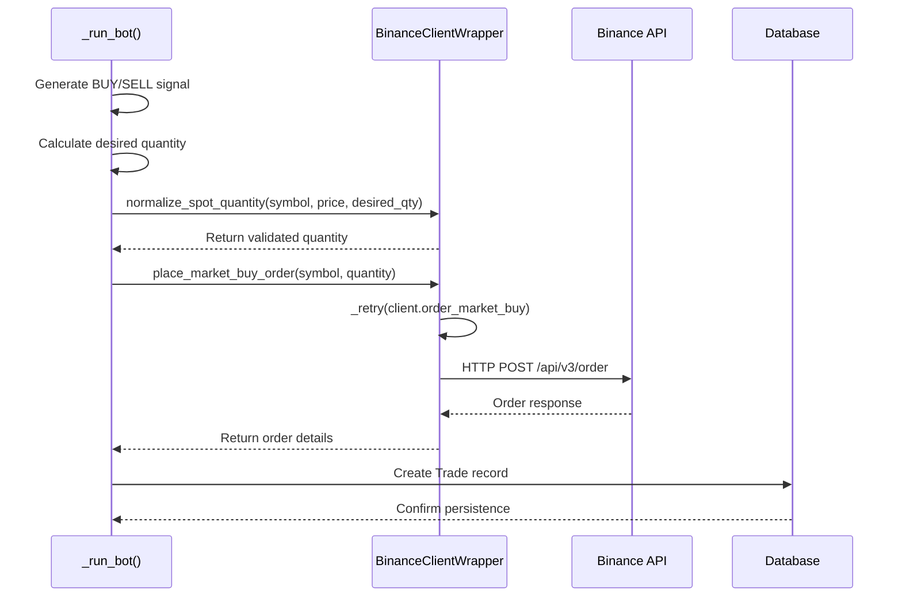
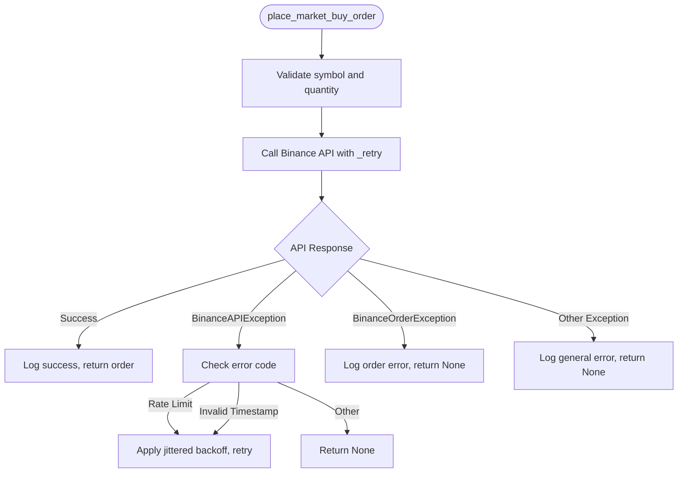
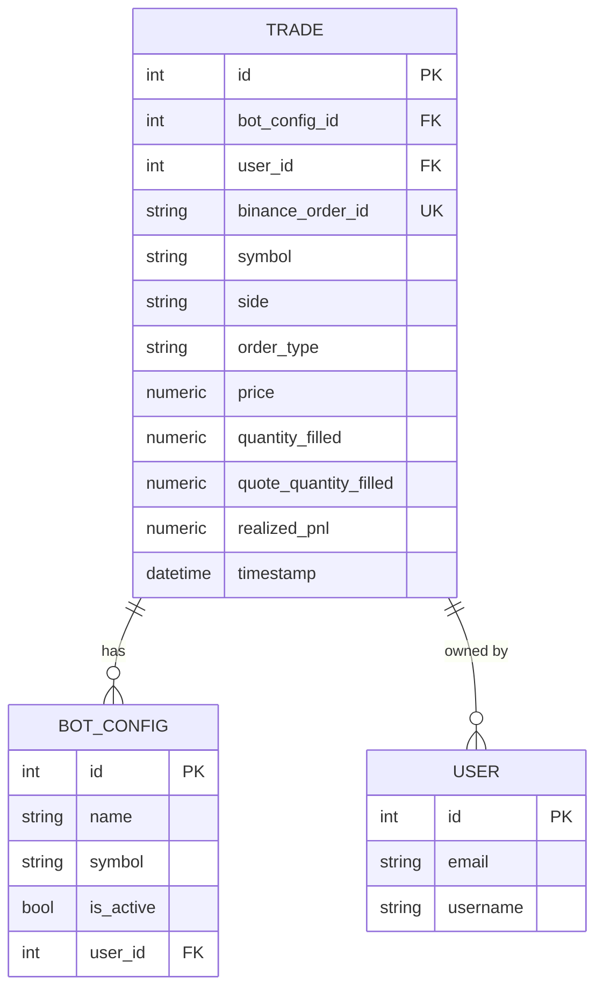

# Market Orders

<cite>
**Referenced Files in This Document**   
- [binance_client.py](file://app/core/binance_client.py)
- [bot_tasks.py](file://app/core/bot_tasks.py)
- [trade.py](file://app/models/trade.py)
</cite>

## Table of Contents
1. [Introduction](#introduction)
2. [Core Implementation](#core-implementation)
3. [Market Order Execution Flow](#market-order-execution-flow)
4. [Domain Model and Validation](#domain-model-and-validation)
5. [Error Handling and Retry Mechanisms](#error-handling-and-retry-mechanisms)
6. [Trade Persistence](#trade-persistence)
7. [Common Issues and Solutions](#common-issues-and-solutions)
8. [Performance Considerations](#performance-considerations)

## Introduction
This document provides a comprehensive analysis of the market order execution sub-feature in the trading bot system, focusing on immediate execution at the current market price. The implementation centers around the `place_market_buy_order` and `place_market_sell_order` methods in the `BinanceClientWrapper` class, which facilitate direct market access to the Binance exchange. These methods are integrated into the automated trading workflow through the `_run_bot` function in `bot_tasks.py`, where trading decisions are made based on technical indicators like EMA and RSI. The system ensures order quantities comply with exchange requirements through the `normalize_spot_quantity` function, which validates against Binance's LOT_SIZE and MIN_NOTIONAL filters. Market orders are executed with robust error handling, including retry mechanisms with exponential backoff for transient API issues, and the resulting trade information is persisted in the Trade model for historical tracking and performance analysis.

## Core Implementation

The market order functionality is implemented in the `BinanceClientWrapper` class, which serves as a wrapper around the Binance API client. The `place_market_buy_order` and `place_market_sell_order` methods provide a simplified interface for executing market orders, handling the underlying API complexity and error conditions. These methods are designed to be resilient, incorporating retry logic for common transient errors such as rate limits and network timeouts. The order quantity is pre-validated and normalized to ensure compliance with Binance's trading rules before the API call is made. The execution flow begins in the `_run_bot` function, where a trading strategy generates a BUY or SELL signal. The function then calculates the appropriate order size based on the bot's configuration, normalizes this quantity using `normalize_spot_quantity`, and invokes the corresponding market order method. Upon successful execution, the order details are captured and stored in the database, completing the trade lifecycle.

**Section sources**
- [binance_client.py](file://app/core/binance_client.py#L274-L304)
- [bot_tasks.py](file://app/core/bot_tasks.py#L125-L516)

## Market Order Execution Flow

**Diagram sources **
- [binance_client.py](file://app/core/binance_client.py#L274-L304)
- [bot_tasks.py](file://app/core/bot_tasks.py#L125-L516)

## Domain Model and Validation

The domain model for market orders involves several key components: price discovery, quantity validation, and handling of partial fills. Price discovery is achieved by calling `get_current_price`, which retrieves the latest ticker price from Binance. Quantity validation is critical to ensure orders meet exchange requirements. The `normalize_spot_quantity` method enforces Binance's LOT_SIZE and MIN_NOTIONAL filters by adjusting the requested quantity to the nearest valid step size and ensuring the total order value (notional) exceeds the minimum threshold. This method first retrieves the symbol's filters via `get_symbol_filters_spot`, then applies the LOT_SIZE filter to round the quantity and the MIN_NOTIONAL filter to prevent orders that are too small in value. If the calculated quantity fails to meet these criteria, the method returns `None`, preventing the placement of an invalid order. The system is designed to handle partial fills gracefully, as market orders are executed immediately against available liquidity, and the actual filled quantity is recorded in the Trade model.

**Section sources**
- [binance_client.py](file://app/core/binance_client.py#L182-L200)
- [binance_client.py](file://app/core/binance_client.py#L140-L150)

## Error Handling and Retry Mechanisms

The system implements comprehensive error handling for Binance API exceptions, with a focus on resilience and reliability. The `_retry` method in `BinanceClientWrapper` provides a generic retry mechanism with exponential backoff for transient errors. It specifically handles Binance API exceptions with codes -1003 (rate limit), -1015 (order rate limit), and -1021 (timestamp for this request was 1000ms ahead of the server's time) by applying a jittered backoff delay before retrying. For other exceptions, a generic retry with exponential backoff is applied. The market order methods themselves catch `BinanceOrderException` for order-specific errors (like insufficient balance) and general exceptions for unexpected issues, logging the error and returning `None` to indicate failure. This allows the calling `_run_bot` function to handle the failure gracefully, potentially adjusting its strategy or pausing execution. The retry mechanism is configurable via environment variables `BINANCE_RETRY_MAX_ATTEMPTS` and `BINANCE_RETRY_BACKOFF_BASE`, allowing operators to tune the behavior based on their network conditions and risk tolerance.

**Diagram sources **
- [binance_client.py](file://app/core/binance_client.py#L73-L95)
- [binance_client.py](file://app/core/binance_client.py#L274-L304)

**Section sources**
- [binance_client.py](file://app/core/binance_client.py#L73-L95)

## Trade Persistence

After a market order is successfully executed, the trade information is persisted in the database through the `Trade` model. The `_run_bot` function creates a new `Trade` instance, populating it with details from the order execution, including the bot configuration ID, user ID, symbol, side (BUY/SELL), order type (MARKET), execution price, filled quantity, and the Binance order ID. The `quantity_filled` and `quote_quantity_filled` fields capture the actual execution details, which may differ from the requested quantity in the case of partial fills. The `realized_pnl` field is calculated when a SELL order is executed, representing the profit or loss from the previous BUY order. This data is stored in the `trades` table, which has foreign key relationships to the `bot_configs` and `users` tables, enabling comprehensive reporting and analysis of trading performance. The persistence of trade data is critical for features like backtesting, performance reporting, and audit logging.

**Diagram sources **
- [trade.py](file://app/models/trade.py#L4-L25)
- [bot_tasks.py](file://app/core/bot_tasks.py#L125-L516)

## Common Issues and Solutions

Common issues in market order execution include insufficient balance, API rate limits, and network timeouts. Insufficient balance is handled by the Binance API, which returns a specific error code that is caught by the `BinanceOrderException` handler in the `place_market_buy_order` and `place_market_sell_order` methods. The calling `_run_bot` function can then respond by reducing the order size or pausing trading. API rate limits are mitigated by the `_retry` mechanism, which detects rate limit errors and applies an exponential backoff with jitter before retrying the request. This prevents the bot from being temporarily banned for excessive API calls. Network timeouts are also handled by the retry mechanism, which will retry the request a configurable number of times. For persistent network issues, the bot's status is updated in the database, and an error message is logged, allowing operators to investigate. The system also includes a concurrency guard using database row locks in the `_run_bot` function to prevent multiple instances of the same bot from running simultaneously, which could lead to over-trading and balance issues.

**Section sources**
- [binance_client.py](file://app/core/binance_client.py#L73-L95)
- [binance_client.py](file://app/core/binance_client.py#L274-L304)
- [bot_tasks.py](file://app/core/bot_tasks.py#L125-L516)

## Performance Considerations

Execution optimization and latency considerations are paramount for a trading bot. The system minimizes latency by using direct API calls to Binance and avoiding unnecessary processing. The `get_current_price` method uses a lightweight ticker endpoint to quickly obtain the latest price. The retry mechanism is designed to be efficient, with a base backoff time that can be tuned for the specific network environment. The use of a database session per bot run ensures that database operations are batched and committed efficiently. For high-frequency trading, further optimizations could include using WebSockets for real-time price updates instead of REST API calls, implementing a local cache for symbol filters to avoid repeated API calls, and using asynchronous I/O to parallelize operations. The current implementation prioritizes reliability and correctness over raw speed, making it suitable for strategies that operate on minute or longer timeframes. The logging and error handling are designed to have minimal impact on performance, with structured logging that can be easily filtered and analyzed.

**Section sources**
- [binance_client.py](file://app/core/binance_client.py#L118-L125)
- [bot_tasks.py](file://app/core/bot_tasks.py#L125-L516)