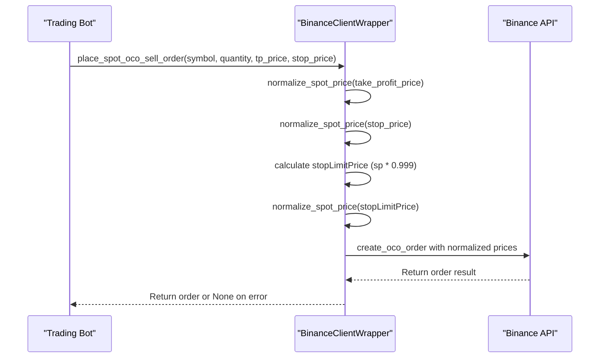
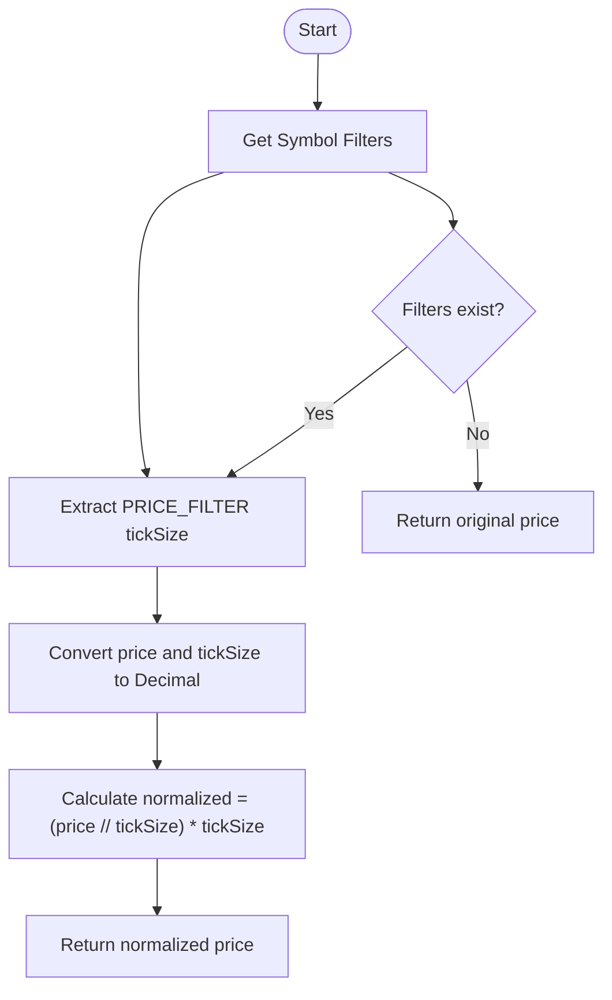
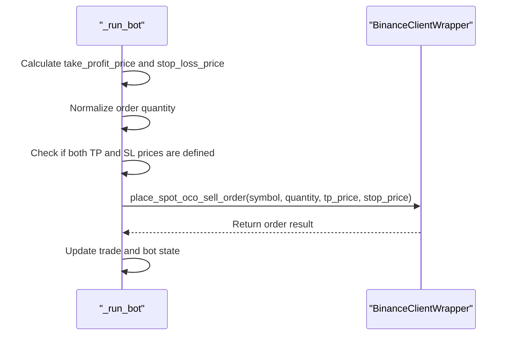

# OCO Orders

<cite>
**Referenced Files in This Document**   
- [binance_client.py](file://app/core/binance_client.py)
- [bot_tasks.py](file://app/core/bot_tasks.py)
</cite>

## Table of Contents
1. [Introduction](#introduction)
2. [Domain Model of OCO Orders](#domain-model-of-oco-orders)
3. [Implementation of place_spot_oco_sell_order Method](#implementation-of-place_spot_oco_sell_order-method)
4. [Price Normalization and Filtering](#price-normalization-and-filtering)
5. [Invocation Relationship with _run_bot Function](#invocation-relationship-with-_run_bot-function)
6. [Common Issues and Solutions](#common-issues-and-solutions)
7. [Conclusion](#conclusion)

## Introduction
This document provides a comprehensive analysis of the One-Cancels-the-Other (OCO) order execution sub-feature for spot trading within the trading bot system. The focus is on the implementation and usage of the `place_spot_oco_sell_order` method in the `BinanceClientWrapper` class, which enables simultaneous take-profit and stop-loss placement. This functionality allows traders to manage risk effectively by setting both profit targets and loss limits on a single position, with the assurance that execution of one order cancels the other. The document details the technical implementation, including price normalization, error handling, and integration with the main bot logic via the `_run_bot` function.

## Domain Model of OCO Orders
An OCO (One-Cancels-the-Other) order consists of two contingent orders: a take-profit limit order and a stop-loss stop-limit order. When one of these orders executes, the other is automatically canceled by the exchange. This mechanism ensures that only one of the two outcomes occurs, preventing conflicting trades. In the context of spot trading, this feature is used exclusively for SELL exits, allowing users to define both a target price for profit-taking and a threshold price to limit losses.

The relationship between the two orders is defined by their shared quantity and symbol, with independent price triggers. The take-profit order is a limit sell order placed above the current market price (for long positions), while the stop-loss order is a stop-limit sell order triggered when the price falls to a specified level. The stop-limit price is set slightly below the stop price to increase the likelihood of execution during volatile market conditions.

OCO orders support partial fills, where if the take-profit or stop-loss order is partially filled, the remaining quantity is canceled along with the opposing order. This behavior is managed by the Binance API and ensures that no unintended exposure remains after a partial execution.

**Section sources**
- [binance_client.py](file://app/core/binance_client.py#L250-L272)

## Implementation of place_spot_oco_sell_order Method
The `place_spot_oco_sell_order` method in the `BinanceClientWrapper` class is responsible for creating and submitting OCO sell orders to the Binance API. It accepts four parameters: the trading symbol, the order quantity, the take-profit price, and the stop-loss price. The method first normalizes both prices using the `normalize_spot_price` function to ensure compliance with the exchange's tick size requirements.

After price normalization, the method calculates the `stopLimitPrice` as 99.9% of the normalized stop price (`sp * 0.999`). This adjustment ensures that the stop-limit order is more likely to be executed once the stop price is hit, especially in fast-moving markets where slippage may occur. The calculated stop-limit price is then normalized again to meet the symbol's tick size constraints.

The method uses a retry mechanism (`_retry`) to handle transient API errors such as rate limiting or network issues. It calls the Binance client's `create_oco_order` function with the following parameters:
- `side`: 'SELL'
- `quantity`: normalized order quantity
- `price`: normalized take-profit price
- `stopPrice`: normalized stop price
- `stopLimitPrice`: calculated and normalized stop-limit price
- `stopLimitTimeInForce`: 'GTC' (Good Till Canceled)

Upon successful submission, the method logs the order details and returns the order response from the API. If an exception occurs during the process, it logs the error and returns `None`.

**Diagram sources **
- [binance_client.py](file://app/core/binance_client.py#L250-L272)

**Section sources**
- [binance_client.py](file://app/core/binance_client.py#L250-L272)

## Price Normalization and Filtering
Price normalization is a critical step in ensuring that order prices comply with Binance's trading rules. The `normalize_spot_price` method retrieves the symbol's price filter information using `get_symbol_filters_spot`, which includes the `tickSize` parameter. This value defines the minimum price increment allowed for the symbol. For example, if the tick size is 0.01, prices must be multiples of 0.01 (e.g., 100.00, 100.01).

The normalization process uses the `_round_price` static method, which converts the price and tick size to `Decimal` objects to avoid floating-point precision errors. It then divides the price by the tick size, takes the floor of the result, and multiplies back by the tick size to obtain the largest valid price less than or equal to the original price. This ensures that the price adheres to the exchange's requirements.

In addition to price normalization, the system also normalizes order quantities using `normalize_spot_quantity`, which considers the `LOT_SIZE` and `MIN_NOTIONAL` filters. The `LOT_SIZE` filter defines the minimum order size, step size, and maximum order size, while the `MIN_NOTIONAL` filter sets a minimum value (price × quantity) for the order. If the desired quantity does not meet these requirements, the method adjusts it accordingly or returns `None` if no valid quantity can be determined.

**Diagram sources **
- [binance_client.py](file://app/core/binance_client.py#L238-L244)
- [binance_client.py](file://app/core/binance_client.py#L182-L200)

**Section sources**
- [binance_client.py](file://app/core/binance_client.py#L238-L244)
- [binance_client.py](file://app/core/binance_client.py#L182-L200)

## Invocation Relationship with _run_bot Function
The `_run_bot` function in `bot_tasks.py` is the core execution loop for the trading bot. It evaluates market conditions, determines trading signals, and executes orders based on the configured strategy. When a SELL signal is generated and both take-profit and stop-loss prices are defined, the function invokes the `place_spot_oco_sell_order` method to place an OCO order for spot trading exits.

The invocation occurs within the EMA strategy branch of the `_run_bot` function. After calculating the take-profit and stop-loss prices based on the current price and user-defined percentages, the function checks whether the position type is spot trading. If so, and both prices are valid, it calls `place_spot_oco_sell_order` with the normalized order quantity, take-profit price, and stop-loss price. This integration allows the bot to automatically set profit targets and risk limits on every sell exit, enhancing risk management without requiring manual intervention.

For futures trading, the bot uses a different mechanism (`place_futures_reduce_only_protections`) to set stop-loss and take-profit orders, as futures markets have different order types and risk controls. This distinction ensures that each trading mode uses the most appropriate order execution strategy.

**Diagram sources **
- [bot_tasks.py](file://app/core/bot_tasks.py#L421-L425)

**Section sources**
- [bot_tasks.py](file://app/core/bot_tasks.py#L421-L425)

## Common Issues and Solutions
Several common issues can arise when working with OCO orders, particularly related to price filtering, insufficient balance, and market volatility.

**Price Filter Violations**: If the take-profit, stop-loss, or stop-limit price does not conform to the symbol's tick size, the exchange will reject the order. This is prevented by the `normalize_spot_price` method, which ensures all prices are rounded down to the nearest valid increment. Developers should always use normalized prices when constructing orders.

**Insufficient Balance**: The order quantity must be sufficient to meet the `MIN_NOTIONAL` requirement (typically 10 USDT on Binance). The `normalize_spot_quantity` method checks this condition and adjusts the quantity if necessary. If the available balance is too low to meet the minimum notional value, the method returns `None`, and the bot skips the order.

**Market Volatility**: During periods of high volatility, the stop price may be hit, but the stop-limit order may not execute if the market moves too quickly past the stop-limit price. To mitigate this risk, the system sets the stop-limit price slightly below the stop price (99.9% of stop price), increasing the chance of execution. However, this also means the order may fill at a worse price than expected.

**Partial Fills and Cancellations**: If an OCO order is partially filled, the remaining quantity is canceled along with the opposing order. The bot does not currently handle partial fills explicitly, but the exchange's OCO logic ensures that no unintended orders remain open. Future enhancements could include logging partial fills and adjusting position tracking accordingly.

**Error Handling**: The `place_spot_oco_sell_order` method includes comprehensive error handling, logging any exceptions that occur during order submission. Common errors include network issues, rate limiting, and invalid parameters. The retry mechanism helps recover from transient errors, while persistent failures are logged for debugging.

**Section sources**
- [binance_client.py](file://app/core/binance_client.py#L250-L272)
- [binance_client.py](file://app/core/binance_client.py#L182-L200)

## Conclusion
The OCO order implementation in the trading bot provides a robust mechanism for managing risk in spot trading by enabling simultaneous take-profit and stop-loss placement. The `place_spot_oco_sell_order` method handles price normalization, stop-limit price calculation, and API interaction with proper error handling and retry logic. Its integration with the `_run_bot` function ensures that risk parameters are automatically applied to every sell exit, improving the bot's reliability and performance. By addressing common issues such as price filtering and market volatility, the system provides a solid foundation for automated trading strategies.