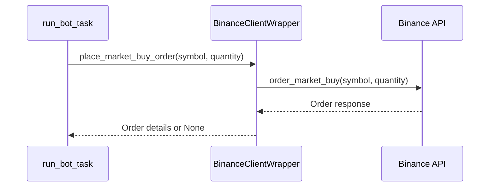
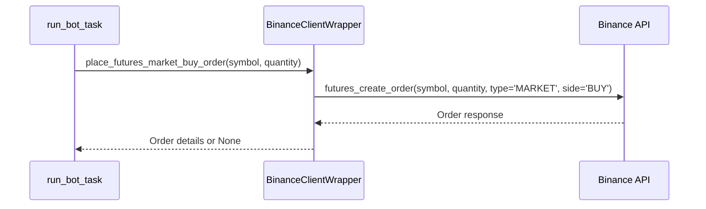

# Trade Execution

<cite>
**Referenced Files in This Document**   
- [binance_client.py](file://app/core/binance_client.py)
- [bot_tasks.py](file://app/core/bot_tasks.py)
- [trade.py](file://app/models/trade.py)
</cite>

## Table of Contents
1. [Introduction](#introduction)
2. [Order Placement Mechanics](#order-placement-mechanics)
3. [Market Order Execution](#market-order-execution)
4. [Spot and Futures Execution Differences](#spot-and-futures-execution-differences)
5. [Trade Model and Persistence](#trade-model-and-persistence)
6. [Quantity and Price Normalization](#quantity-and-price-normalization)
7. [Error Handling and Retry Mechanisms](#error-handling-and-retry-mechanisms)
8. [Common Issues and Solutions](#common-issues-and-solutions)
9. [Execution Optimization and Latency Considerations](#execution-optimization-and-latency-considerations)

## Introduction
This document provides a comprehensive analysis of the trade execution sub-feature in the trading bot system, focusing on order placement and execution mechanics. It details the implementation of market order execution for both spot and futures markets using the BinanceClientWrapper methods such as `place_market_buy_order`, `place_futures_market_buy_order`, and `place_spot_oco_sell_order`. The document explains the invocation relationship between the `run_bot_task` Celery task, the Binance API client, and the Trade model that records executed trades. It also covers order types, quantity validation, error handling for failed orders, and solutions for common issues like insufficient balance, API rate limits, and network timeouts.

**Section sources**
- [binance_client.py](file://app/core/binance_client.py#L18-L574)
- [bot_tasks.py](file://app/core/bot_tasks.py#L121-L518)
- [trade.py](file://app/models/trade.py#L5-L27)

## Order Placement Mechanics
The trade execution system is built around the `BinanceClientWrapper` class, which serves as a wrapper for the Binance API client. This wrapper provides methods for placing various types of orders, including market buy and sell orders for both spot and futures markets. The `run_bot_task` Celery task is responsible for executing the trading logic and invoking the appropriate order placement methods based on the bot's configuration and market conditions.

The `run_bot_task` function is triggered by the Celery scheduler and executes the `_run_bot` function, which contains the core trading logic. This function retrieves the bot configuration and API key from the database, initializes the Binance client, and then proceeds to execute trades based on the configured strategy. The trade execution process involves checking market conditions, calculating position sizes, and placing orders through the Binance API.

**Section sources**
- [bot_tasks.py](file://app/core/bot_tasks.py#L121-L123)
- [binance_client.py](file://app/core/binance_client.py#L274-L288)

## Market Order Execution
Market order execution is implemented through the `place_market_buy_order` and `place_market_sell_order` methods in the `BinanceClientWrapper` class. These methods use the Binance API's `order_market_buy` and `order_market_sell` functions to place market orders. The `place_market_buy_order` method takes a symbol and quantity as parameters and returns the order details if successful, or `None` if an error occurs.

The market order execution process includes retry logic to handle transient errors such as network timeouts or rate limit exceeded errors. The `_retry` method in the `BinanceClientWrapper` class implements exponential backoff with jitter to avoid overwhelming the API server. This retry mechanism is crucial for ensuring reliable order placement in a production environment.

**Diagram sources**
- [binance_client.py](file://app/core/binance_client.py#L274-L288)
- [bot_tasks.py](file://app/core/bot_tasks.py#L121-L123)

## Spot and Futures Execution Differences
The trade execution system supports both spot and futures markets, with distinct methods for each market type. For spot market execution, the `place_market_buy_order` and `place_market_sell_order` methods are used. For futures market execution, the `place_futures_market_buy_order` and `place_futures_market_sell_order` methods are used. These methods use the Binance API's `futures_create_order` function with the appropriate parameters for futures trading.

The futures execution process includes additional steps such as setting the leverage and margin type. The `set_leverage` method in the `BinanceClientWrapper` class is used to set the leverage for a futures position, and the `ensure_isolated_margin` method is used to ensure that the margin type is set to isolated margin. These steps are crucial for managing risk in futures trading.

**Diagram sources**
- [binance_client.py](file://app/core/binance_client.py#L458-L471)
- [bot_tasks.py](file://app/core/bot_tasks.py#L121-L123)

## Trade Model and Persistence
The Trade model is used to record executed trades in the database. It includes fields for the bot configuration ID, user ID, Binance order ID, symbol, side, order type, price, quantity filled, quote quantity filled, commission amount, commission asset, PnL, realized PnL, and timestamp. The Trade model is linked to the BotConfig and User models through foreign key relationships.

When a trade is executed, a new Trade record is created and saved to the database. This record includes the details of the executed order, such as the price, quantity, and commission. The Trade model also includes a relationship to the BotConfig model, which allows for easy retrieval of trade history for a specific bot configuration.

**Section sources**
- [trade.py](file://app/models/trade.py#L5-L27)
- [bot_tasks.py](file://app/core/bot_tasks.py#L436-L450)

## Quantity and Price Normalization
The trade execution system includes methods for normalizing order quantities and prices based on the symbol's filters. The `normalize_spot_quantity` and `normalize_futures_quantity` methods in the `BinanceClientWrapper` class are used to ensure that order quantities meet the minimum and step size requirements for a given symbol. These methods retrieve the symbol's filters from the Binance API and use them to calculate a valid order quantity.

The `normalize_spot_price` method is used to ensure that order prices meet the tick size requirements for a given symbol. This method retrieves the symbol's price filter from the Binance API and uses it to round the price to the nearest valid tick size. These normalization methods are crucial for ensuring that orders are valid and can be executed by the Binance API.

**Section sources**
- [binance_client.py](file://app/core/binance_client.py#L183-L221)
- [binance_client.py](file://app/core/binance_client.py#L239-L245)

## Error Handling and Retry Mechanisms
The trade execution system includes robust error handling and retry mechanisms to ensure reliable order placement. The `_retry` method in the `BinanceClientWrapper` class implements exponential backoff with jitter to handle transient errors such as network timeouts or rate limit exceeded errors. This method retries the API call up to a configurable number of times, with increasing delays between retries.

The order placement methods in the `BinanceClientWrapper` class include try-except blocks to handle specific exceptions such as `BinanceOrderException` and general exceptions. These exceptions are logged, and the methods return `None` if an error occurs. This error handling ensures that the trading bot can continue to operate even if individual orders fail.

**Section sources**
- [binance_client.py](file://app/core/binance_client.py#L74-L96)
- [binance_client.py](file://app/core/binance_client.py#L274-L288)

## Common Issues and Solutions
Common issues in trade execution include insufficient balance, API rate limits, and network timeouts. The trade execution system includes solutions for these issues to ensure reliable operation. For insufficient balance, the system checks the account balance before placing an order and only places the order if sufficient funds are available. For API rate limits, the system uses the `_retry` method with exponential backoff to handle rate limit exceeded errors. For network timeouts, the system uses the `_retry` method to retry the API call.

The system also includes a daily reset task that resets the bot's state and reactivates inactive bots. This task helps to ensure that bots are not stuck in an error state due to daily limits or other issues. The daily reset task is triggered by the Celery scheduler and runs once per day.

**Section sources**
- [bot_tasks.py](file://app/core/bot_tasks.py#L79-L109)
- [binance_client.py](file://app/core/binance_client.py#L74-L96)

## Execution Optimization and Latency Considerations
Execution optimization and latency considerations are crucial for high-frequency trading. The trade execution system includes several optimizations to reduce latency and improve performance. The use of the `_retry` method with exponential backoff helps to reduce the number of failed API calls and improve reliability. The normalization of order quantities and prices ensures that orders are valid and can be executed quickly.

The system also includes a cache for frequently accessed data such as symbol filters and account information. This cache reduces the number of API calls and improves performance. The use of Celery for task scheduling allows for parallel execution of multiple bots, which can improve overall throughput.

**Section sources**
- [binance_client.py](file://app/core/binance_client.py#L74-L96)
- [bot_tasks.py](file://app/core/bot_tasks.py#L121-L123)