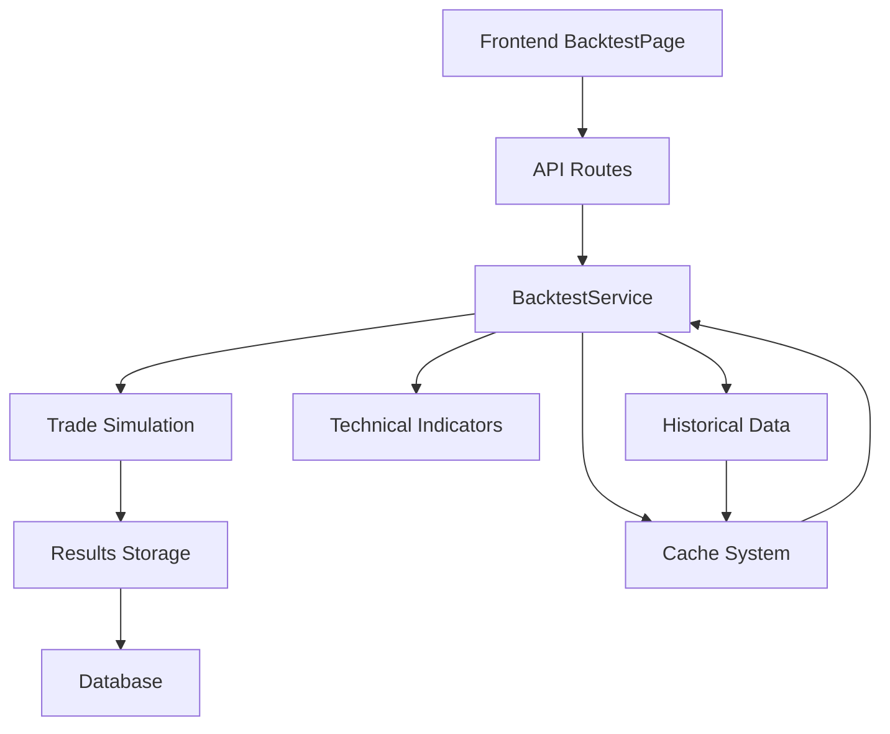
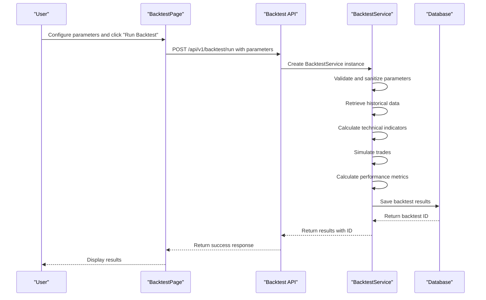

# Backtesting System

<cite>
**Referenced Files in This Document**   
- [backtest.py](file://app/api/routes/backtest.py)
- [backtest_service.py](file://app/services/backtest_service.py)
- [backtest.py](file://app/models/backtest.py)
- [backtest.py](file://app/schemas/backtest.py)
- [BacktestPage.jsx](file://frontend/src/pages/Backtest/BacktestPage.jsx)
- [api.js](file://frontend/src/services/api.js)
</cite>

## Table of Contents
1. [Introduction](#introduction)
2. [System Architecture](#system-architecture)
3. [Domain Model](#domain-model)
4. [Workflow Analysis](#workflow-analysis)
5. [Strategy Simulation Implementation](#strategy-simulation-implementation)
6. [Performance Metrics Calculation](#performance-metrics-calculation)
7. [Data Quality and Slippage Considerations](#data-quality-and-slippage-considerations)
8. [Frontend Interface](#frontend-interface)
9. [Conclusion](#conclusion)

## Introduction
The backtesting system enables users to simulate trading strategies using historical market data before deploying them in live trading environments. This comprehensive documentation details the implementation of the strategy simulation capabilities, covering the workflow from the frontend interface through API endpoints to the backtest_service.py implementation. The system processes strategy parameters, executes simulations, and generates performance results while addressing common issues such as data quality and slippage assumptions. The documentation provides sufficient technical depth for experienced developers while remaining accessible to beginners.

## System Architecture
The backtesting system follows a layered architecture with clear separation between frontend, API, and service layers. The workflow begins with the frontend BacktestPage component, which collects user inputs and sends requests to the backend API. The API routes handle authentication and forward requests to the BacktestService, which orchestrates the simulation process. Historical data is retrieved from Binance's public API or authenticated endpoints, processed with technical indicators, and used to simulate trades according to the specified strategy parameters.



**Diagram sources**
- [BacktestPage.jsx](file://frontend/src/pages/Backtest/BacktestPage.jsx)
- [backtest.py](file://app/api/routes/backtest.py)
- [backtest_service.py](file://app/services/backtest_service.py)

## Domain Model
The backtesting system's domain model centers around the Backtest entity, which stores all configuration parameters, simulation results, and metadata. The model captures both the input parameters for the simulation and the output performance metrics, providing a complete record of each backtest execution.

### Backtest Entity Structure
The Backtest model contains several key components:

**Configuration Parameters**
- symbol: Trading pair (e.g., BNBUSDT)
- interval: Candlestick interval (5m, 15m, 1h, etc.)
- start_date/end_date: Historical data range
- parameters: JSON field containing strategy-specific settings
- market_type: "spot" or "futures" trading

**Risk Management Parameters**
- initial_capital: Starting account balance
- risk_per_trade: Percentage of capital to risk per trade
- stop_loss: Percentage stop loss level
- take_profit: Percentage take profit level
- trailing_stop: Percentage trailing stop level
- max_daily_trades: Daily trade limit
- daily_target: Daily profit target percentage
- max_daily_loss: Daily maximum loss percentage

**Fee and Slippage Parameters**
- maker_fee: Fee rate for maker orders
- taker_fee: Fee rate for taker orders
- slippage_bps: Slippage in basis points

**Results and Performance Metrics**
- final_capital: Ending account balance
- total_return: Overall percentage return
- total_trades: Number of trades executed
- winning_trades/losing_trades: Trade outcomes
- win_rate: Percentage of winning trades
- total_fees: Cumulative fees paid
- avg_profit: Average profit per trade
- daily_results: Daily performance breakdown
- monthly_results: Monthly performance summary
- max_drawdown: Maximum peak-to-trough decline
- sharpe: Sharpe ratio
- sortino: Sortino ratio
- profit_factor: Profit factor ratio
- cagr: Compound annual growth rate

**Section sources**
- [backtest.py](file://app/models/backtest.py)
- [backtest.py](file://app/schemas/backtest.py)

## Workflow Analysis
The backtesting workflow follows a well-defined sequence from user interaction to result presentation. This section details the complete flow from the frontend interface through the backend processing to result storage and retrieval.

### Frontend to Backend Flow
The workflow begins when a user configures parameters on the BacktestPage and initiates a simulation. The frontend collects all strategy parameters, validates inputs, and sends a structured request to the backend API endpoint.



**Diagram sources**
- [BacktestPage.jsx](file://frontend/src/pages/Backtest/BacktestPage.jsx)
- [backtest.py](file://app/api/routes/backtest.py)
- [backtest_service.py](file://app/services/backtest_service.py)

### Data Retrieval Process
The system employs a multi-tiered approach to retrieve historical market data, prioritizing efficiency and reliability:

1. **Cache Check**: The system first checks if the requested data is available in the local cache
2. **Public API**: If not cached, it attempts to retrieve data from Binance's public API endpoints
3. **Authenticated API**: If public access fails, it uses the user's API keys for authenticated requests
4. **Sample Data**: As a final fallback, it generates realistic sample data for testing

The caching mechanism significantly improves performance by avoiding redundant API calls for previously requested data ranges.

**Section sources**
- [backtest_service.py](file://app/services/backtest_service.py)
- [backtest.py](file://app/api/routes/backtest.py)

## Strategy Simulation Implementation
The core of the backtesting system lies in the strategy simulation implementation, which processes historical data to simulate trading decisions and calculate performance metrics.

### Strategy Parameters Processing
The system processes strategy parameters through a comprehensive validation and sanitization process. All parameters are converted to appropriate data types and constrained within reasonable bounds to prevent invalid configurations. The parameters are organized into logical groups:

**Risk Management Parameters**
- initial_capital: Constrained to positive values
- daily_target: Limited to reasonable daily return expectations
- max_daily_loss: Prevents excessive risk exposure
- risk_per_trade: Controls position sizing
- max_daily_trades: Limits trading frequency

**Trade Execution Parameters**
- stop_loss: Defines maximum acceptable loss
- take_profit: Sets profit targets
- trailing_stop: Implements dynamic stop loss
- leverage: Controls position size in futures trading

**Technical Indicator Parameters**
- ema_fast/ema_slow: Configures EMA crossover strategy
- rsi_period: Sets RSI calculation period
- rsi_oversold/rsi_overbought: Defines RSI threshold levels

### Entry Signal Logic
The system implements a multi-factor entry signal logic that requires confirmation from multiple indicators before executing a trade. The entry conditions are based on a combination of trend, momentum, and volatility analysis:

**Primary Signals (at least 3 required)**
- Trend analysis: Price above both fast and slow EMAs
- RSI signal: RSI within oversold/overbought range
- MACD signal: Positive MACD histogram
- Bollinger Band signal: Price above middle band but below upper band
- Volume surge: Volume ratio greater than 1.2

**Confirmation Signals (at least 2 required)**
- Trend acceleration: Increasing EMA spread
- RSI rising: Momentum confirmation
- MACD rising: Increasing momentum
- Bollinger Band expansion: Increasing volatility
- Price momentum: Minimum 0.05% price increase
- Strong trend: EMA spread greater than 0.2%
- Volatility control: Current volatility below moving average

This multi-layered approach helps filter out false signals and improves the reliability of trade entries.

### Trade Execution Simulation
The trade simulation process follows a systematic approach to execute virtual trades based on the entry signals:

1. **Position Sizing**: Calculates position size based on risk_per_trade percentage and stop loss distance
2. **Margin Calculation**: Determines required margin based on leverage (futures) or full position value (spot)
3. **Fee Calculation**: Includes both commission and slippage costs
4. **Exit Logic**: Implements multiple exit conditions:
   - Take Profit: Price reaches take_profit level
   - Stop Loss: Price reaches stop_loss level
   - Trailing Stop: Price retraces by trailing_stop percentage from peak
   - End of Day: Position closed at end of trading day
5. **Capital Update**: Adjusts account balance based on trade outcome

The simulation respects daily trading limits, including maximum daily trades and daily profit/loss targets.

**Section sources**
- [backtest_service.py](file://app/services/backtest_service.py)
- [backtest.py](file://app/api/routes/backtest.py)

## Performance Metrics Calculation
The system calculates a comprehensive set of performance metrics to evaluate strategy effectiveness beyond simple profit/loss figures.

### Core Performance Metrics
The primary performance metrics provide a high-level overview of strategy performance:

**Return Metrics**
- total_return: Overall percentage return from initial to final capital
- cagr: Compound Annual Growth Rate, annualized return measure
- avg_profit: Average profit per trade

**Risk Metrics**
- max_drawdown: Maximum peak-to-trough decline, measuring worst-case loss
- win_rate: Percentage of winning trades
- profit_factor: Ratio of gross profits to gross losses

**Efficiency Metrics**
- sharpe: Sharpe ratio, return per unit of total risk
- sortino: Sortino ratio, return per unit of downside risk

### Advanced Metric Formulas
The system implements precise calculations for advanced performance metrics:

**Max Drawdown**
```python
def _compute_max_drawdown(equity_curve: List[float]) -> float:
    if not equity_curve:
        return 0.0
    peak = equity_curve[0]
    max_dd = 0.0
    for val in equity_curve:
        if val > peak:
            peak = val
        drawdown = (val - peak) / peak * 100.0
        if drawdown < max_dd:
            max_dd = drawdown
    return float(max_dd)
```

**Sharpe Ratio**
```python
def _compute_sharpe(returns_pct: List[float], periods_per_year: int = 252) -> float:
    if not returns_pct:
        return 0.0
    rets = np.array(returns_pct, dtype=float) / 100.0
    mu = np.mean(rets)
    sigma = np.std(rets, ddof=1) if len(rets) > 1 else 0.0
    if sigma == 0:
        return 0.0
    sharpe = (mu * periods_per_year) / (sigma * np.sqrt(periods_per_year))
    return float(sharpe)
```

**Sortino Ratio**
```python
def _compute_sortino(returns_pct: List[float], periods_per_year: int = 252) -> float:
    if not returns_pct:
        return 0.0
    rets = np.array(returns_pct, dtype=float) / 100.0
    downside = rets[rets < 0]
    ds_sigma = np.std(downside, ddof=1) if len(downside) > 1 else 0.0
    mu = np.mean(rets)
    if ds_sigma == 0:
        return 0.0
    sortino = (mu * periods_per_year) / (ds_sigma * np.sqrt(periods_per_year))
    return float(sortino)
```

**Profit Factor**
```python
def _compute_profit_factor(trade_pnls: List[float]) -> float:
    gains = sum(p for p in trade_pnls if p > 0)
    losses = -sum(p for p in trade_pnls if p < 0)
    if losses == 0:
        return float('inf') if gains > 0 else 0.0
    return float(gains / losses)
```

**CAGR**
```python
def _compute_cagr(initial_capital: float, final_capital: float, start_date: str, end_date: str) -> float:
    try:
        start = datetime.strptime(start_date, "%Y-%m-%d")
        end = datetime.strptime(end_date, "%Y-%m-%d")
        days = max((end - start).days, 1)
        years = days / 365.25
        if initial_capital <= 0 or years <= 0:
            return 0.0
        cagr = (final_capital / initial_capital) ** (1 / years) - 1
        return float(cagr * 100.0)
    except Exception:
        return 0.0
```

These metrics provide a comprehensive evaluation of strategy performance, considering both returns and risk characteristics.

**Section sources**
- [backtest_service.py](file://app/services/backtest_service.py)

## Data Quality and Slippage Considerations
The backtesting system addresses common issues related to data quality and slippage assumptions to provide more realistic performance estimates.

### Data Quality Management
The system implements several mechanisms to ensure data quality:

**Data Source Hierarchy**
1. **Cached Data**: Highest priority, fastest access
2. **Public API**: No authentication required, reliable for most use cases
3. **Authenticated API**: Higher rate limits, more reliable during peak times
4. **Sample Data**: Fallback for testing when API access is unavailable

**Data Validation**
- Checks for missing or incomplete candle data
- Validates OHLC (Open, High, Low, Close) logic
- Handles NaN and infinite values appropriately
- Ensures minimum data requirements for indicator calculations

**Caching Strategy**
The system employs an intelligent caching mechanism that stores historical data based on:
- Trading symbol
- Time interval
- Date range
- Market type (spot/futures)

This reduces API calls and improves performance for repeated backtests with similar parameters.

### Slippage and Fee Modeling
The system incorporates realistic assumptions about trading costs and market impact:

**Fee Structure**
- Maker fees: Lower fees for limit orders that add liquidity
- Taker fees: Higher fees for market orders that remove liquidity
- Default rates vary by market type (spot vs. futures)

**Slippage Assumptions**
- Configurable slippage in basis points (bps)
- Default assumption of 1 bps (0.01%)
- Can be adjusted based on market conditions and trading volume

**Cost Calculation**
The system calculates total trading costs as the sum of:
- Commission: Position size × fee rate
- Slippage cost: Position size × slippage rate
- Total fees: Commission + slippage cost

This comprehensive cost modeling provides more realistic performance estimates compared to simulations that ignore these factors.

**Section sources**
- [backtest_service.py](file://app/services/backtest_service.py)
- [backtest.py](file://app/api/routes/backtest.py)

## Frontend Interface
The frontend interface provides an intuitive user experience for configuring and running backtests, with comprehensive result visualization.

### Parameter Configuration
The BacktestPage component offers a comprehensive interface for configuring strategy parameters:

**Market Selection**
- Market type toggle (Spot/Futures)
- Searchable dropdown for trading pairs
- Dynamic symbol loading based on market type

**Date Range Selection**
- Calendar-based date pickers for start and end dates
- Quick selection buttons for common periods (1, 3, 6 months)
- Visual feedback showing selected date range duration

**Parameter Groups**
- Risk Management: Initial capital, daily targets, stop loss, take profit
- Technical Indicators: EMA periods, RSI settings
- Advanced Settings: Fees, slippage, leverage (futures only)

### Result Presentation
The system presents backtest results through multiple visualization methods:

**Summary Cards**
- Total Return: Overall percentage return with color coding
- Win Rate: Percentage of winning trades
- Total Trades: Number of executed trades
- Final Capital: Ending account balance

**Detailed Statistics**
- Breakdown of winning and losing trades
- Total fees paid
- Strategy parameters used
- Market type and leverage information

**Performance Charts**
- Monthly performance breakdown
- Equity curve visualization
- Trade-by-trade analysis

**Export Capabilities**
- Daily results CSV export
- Monthly summary CSV export
- Trade-by-trade details CSV export

The interface also includes cache management features, allowing users to view cache status, refresh cache information, and clear the cache when needed.

**Section sources**
- [BacktestPage.jsx](file://frontend/src/pages/Backtest/BacktestPage.jsx)
- [api.js](file://frontend/src/services/api.js)

## Conclusion
The backtesting system provides a comprehensive solution for simulating trading strategies using historical market data. The implementation follows a well-structured architecture with clear separation between frontend, API, and service layers. The system captures a wide range of strategy parameters and calculates comprehensive performance metrics, including advanced risk-adjusted returns. By incorporating realistic assumptions about fees, slippage, and market conditions, the system provides more accurate performance estimates than simple profit/loss calculations. The frontend interface offers an intuitive user experience with comprehensive parameter configuration and result visualization. The caching mechanism improves performance and reduces API load, while the fallback strategies ensure the system remains functional even when external data sources are unavailable. This robust implementation enables users to thoroughly evaluate trading strategies before deploying them in live trading environments.