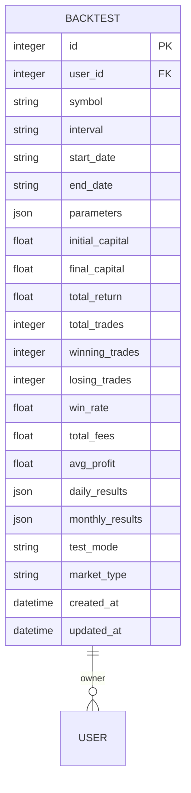
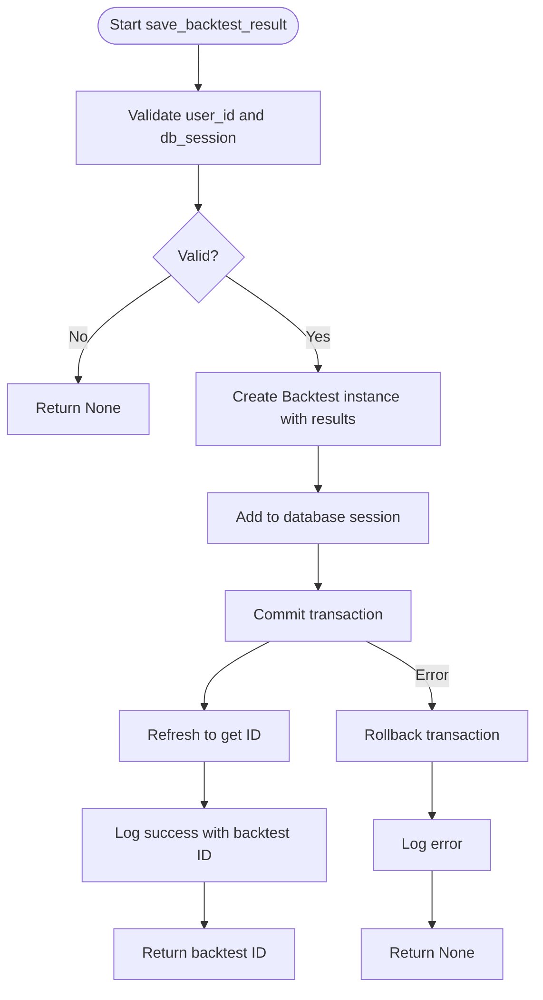
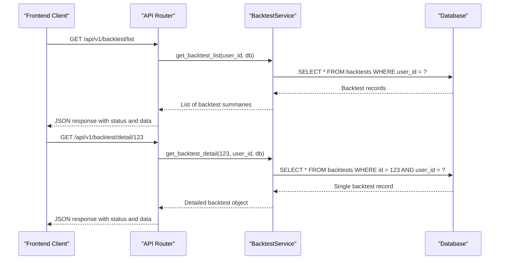
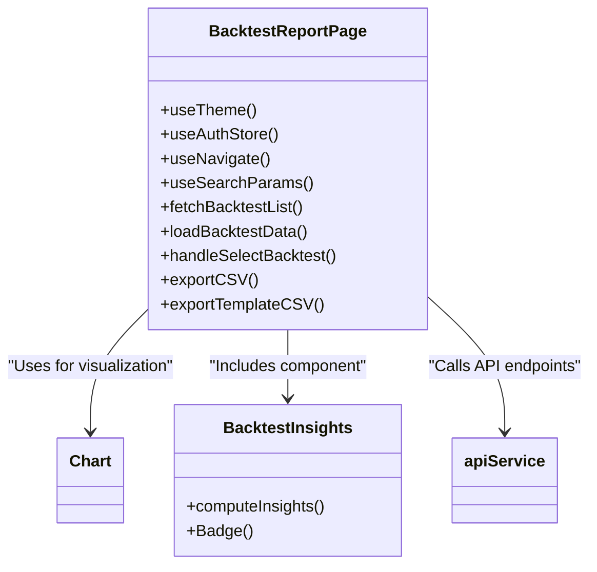
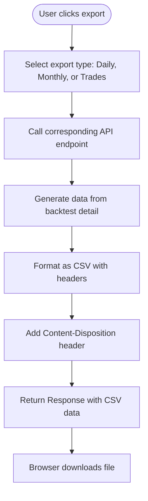
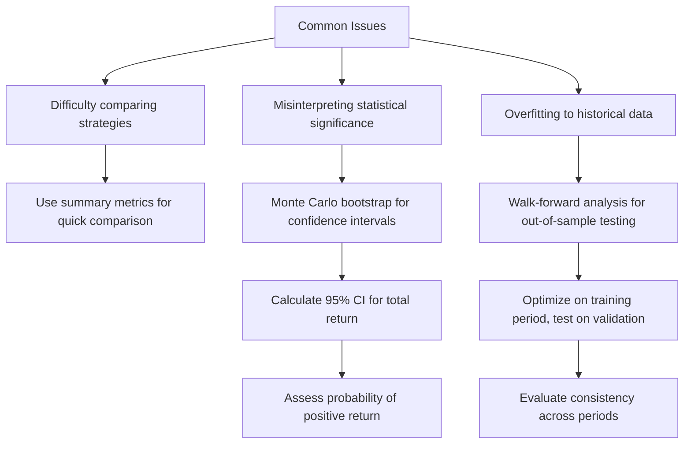

# Result Interpretation

<cite>
**Referenced Files in This Document**   
- [backtest.py](file://app/models/backtest.py)
- [backtest.py](file://app/schemas/backtest.py)
- [backtest.py](file://app/api/routes/backtest.py)
- [backtest_service.py](file://app/services/backtest_service.py)
- [BacktestReportPage.jsx](file://frontend/src/pages/Backtest/BacktestReportPage.jsx)
- [BacktestInsights.jsx](file://frontend/src/components/Backtest/BacktestInsights.jsx)
- [backtest_significance.py](file://scripts/backtest_significance.py)
</cite>

## Table of Contents
1. [Introduction](#introduction)
2. [Domain Model of Result Interpretation](#domain-model-of-result-interpretation)
3. [Data Persistence and Retrieval](#data-persistence-and-retrieval)
4. [API Endpoints for Result Access](#api-endpoints-for-result-access)
5. [Frontend Reporting and Visualization](#frontend-reporting-and-visualization)
6. [Export Functionality](#export-functionality)
7. [Common Issues and Solutions](#common-issues-and-solutions)
8. [Conclusion](#conclusion)

## Introduction
This document provides a comprehensive overview of the result interpretation sub-feature within the tradebot system. It details how backtest outcomes are structured, stored, retrieved, and presented to users for informed decision-making. The workflow spans from database persistence through API endpoints to the frontend reporting interface, enabling users to analyze performance over time. The implementation supports saving results via `save_backtest_result()`, retrieving them via `get_backtest_list()` and `get_backtest_detail()`, and downloading detailed CSV exports of daily, monthly, and trade-by-trade results. Additionally, it addresses common challenges such as comparing multiple strategies and misinterpreting statistical significance, offering solutions like Monte Carlo significance testing demonstrated in `backtest_significance.py`. This documentation is designed to be accessible to beginners while providing sufficient technical depth for experienced developers.

## Domain Model of Result Interpretation
The domain model for backtest result interpretation is centered around the `Backtest` entity, which encapsulates all relevant data from a backtesting session. This model defines the structure of stored backtest data, including both summary metrics and detailed results, ensuring a comprehensive representation of strategy performance.

**Diagram sources**
- [backtest.py](file://app/models/backtest.py#L6-L43)

**Section sources**
- [backtest.py](file://app/models/backtest.py#L1-L44)

## Data Persistence and Retrieval
The persistence and retrieval of backtest results are managed through a well-defined service layer that ensures data integrity and efficient access. The `BacktestService` class in the backend handles the core operations for saving and retrieving backtest data.

The `save_backtest_result()` method is responsible for persisting backtest results to the database. It creates a new `Backtest` instance with the provided results and commits it to the database session. This method ensures that all critical performance metrics and detailed results are stored for future analysis.

**Diagram sources**
- [backtest_service.py](file://app/services/backtest_service.py#L1023-L1062)

**Section sources**
- [backtest_service.py](file://app/services/backtest_service.py#L1023-L1062)

## API Endpoints for Result Access
The system exposes a set of RESTful API endpoints under the `/api/v1/backtest` prefix to facilitate access to backtest results. These endpoints provide a standardized interface for clients to retrieve lists of backtests and detailed information about specific backtests.

The `/api/v1/backtest/list` endpoint returns a summary list of all backtests associated with the authenticated user. It includes key metrics such as total return, win rate, and total trades, allowing users to quickly assess the performance of their strategies.

The `/api/v1/backtest/detail/{backtest_id}` endpoint provides comprehensive details of a specific backtest. It returns all stored information, including strategy parameters, performance metrics, and detailed daily and monthly results. This endpoint is crucial for in-depth analysis and comparison of different strategies.

**Diagram sources**
- [backtest.py](file://app/api/routes/backtest.py#L123-L162)

**Section sources**
- [backtest.py](file://app/api/routes/backtest.py#L123-L162)

## Frontend Reporting and Visualization
The frontend reporting interface, implemented in `BacktestReportPage.jsx`, provides a rich, interactive experience for users to interpret backtest results. It leverages Chart.js for visualizing performance over time and offers various filtering and sorting capabilities.

The interface displays key performance indicators such as total PnL, win rate, and average trade profit in a summary section. It also includes interactive charts for daily PnL, daily trades, and TP/SL distribution, allowing users to explore different aspects of their strategy's performance.

Additionally, the `BacktestInsights.jsx` component provides heuristic-based AI summaries of backtest results. It computes insights such as volatility analysis and strategy recommendations, helping users quickly understand the strengths and weaknesses of their strategies.

**Diagram sources**
- [BacktestReportPage.jsx](file://frontend/src/pages/Backtest/BacktestReportPage.jsx#L93-L1202)
- [BacktestInsights.jsx](file://frontend/src/components/Backtest/BacktestInsights.jsx#L96-L122)

**Section sources**
- [BacktestReportPage.jsx](file://frontend/src/pages/Backtest/BacktestReportPage.jsx#L1-L1202)
- [BacktestInsights.jsx](file://frontend/src/components/Backtest/BacktestInsights.jsx#L1-L128)

## Export Functionality
The system provides robust export functionality, allowing users to download detailed CSV files of their backtest results. This feature supports three types of exports: daily results, monthly summaries, and trade-by-trade logs.

The `/api/v1/backtest/download/{backtest_id}/daily.csv` endpoint generates a CSV file containing daily performance data, including date, PnL in USDT, number of trades, and capital. Similarly, the `/api/v1/backtest/download/{backtest_id}/monthly.csv` endpoint provides monthly aggregated results with PnL percentage and trade counts.

The most detailed export is available through `/api/v1/backtest/download/{backtest_id}/trades.csv`, which re-simulates the backtest to generate a comprehensive trade log. This log includes entry and exit times, prices, PnL, fees, and exit reasons, enabling users to perform in-depth analysis in external tools.

**Diagram sources**
- [backtest.py](file://app/api/routes/backtest.py#L215-L351)

**Section sources**
- [backtest.py](file://app/api/routes/backtest.py#L215-L351)

## Common Issues and Solutions
Users often face challenges in interpreting backtest results, such as difficulty in comparing multiple strategies and misinterpreting statistical significance. The system addresses these issues through various mechanisms.

One common issue is overfitting, where a strategy performs well on historical data but fails in live trading. To mitigate this, the system includes a Monte Carlo significance testing script (`backtest_significance.py`) that uses bootstrap resampling to estimate confidence intervals for cumulative returns and Sharpe ratio. This helps users assess the statistical robustness of their strategies.

Another challenge is the misinterpretation of short-term performance. The system provides monthly performance summaries and trend analysis to encourage a longer-term perspective. The AI insights component also offers heuristic-based recommendations, such as adjusting EMA periods or RSI thresholds based on win rate and return metrics.

**Diagram sources**
- [backtest_significance.py](file://scripts/backtest_significance.py#L1-L146)

**Section sources**
- [backtest_significance.py](file://scripts/backtest_significance.py#L1-L146)

## Conclusion
The result interpretation sub-feature in the tradebot system provides a comprehensive framework for understanding and utilizing backtest outcomes. From the structured domain model and robust data persistence to the interactive frontend reporting and advanced statistical analysis, the system enables users to make informed decisions about their trading strategies. By addressing common issues such as strategy comparison and statistical significance, it promotes a more rigorous and scientific approach to algorithmic trading. The combination of detailed data exports, visualizations, and AI-driven insights ensures that both beginners and experienced developers can effectively interpret and act on backtest results.