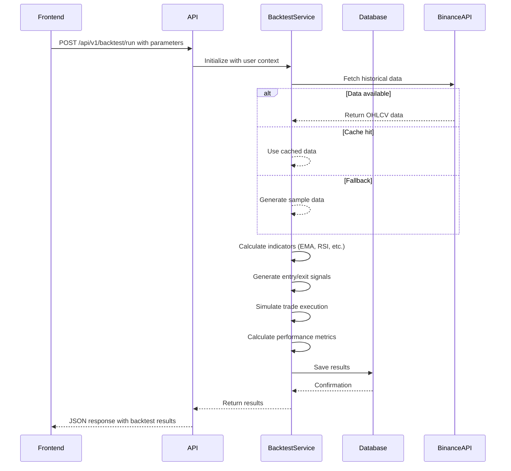
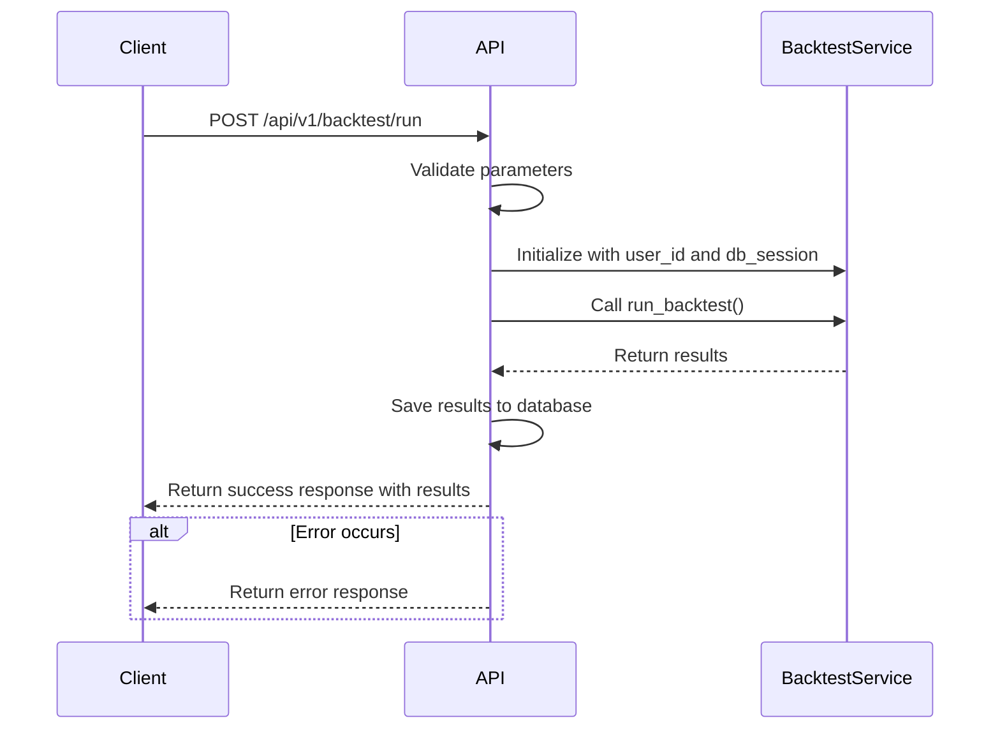
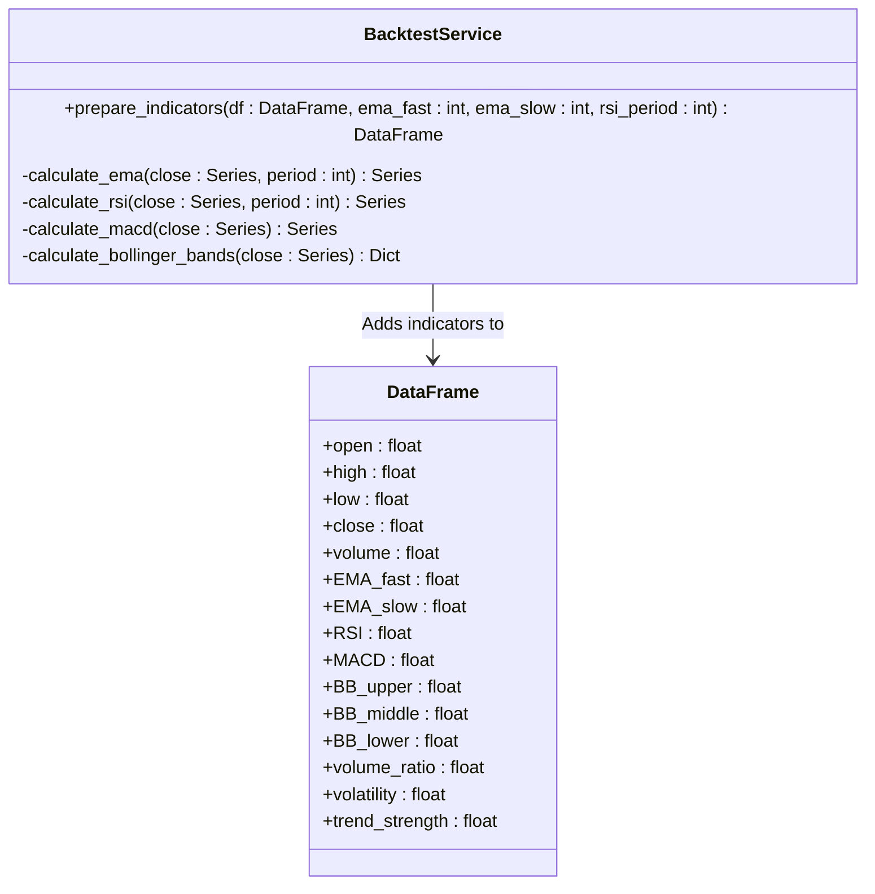
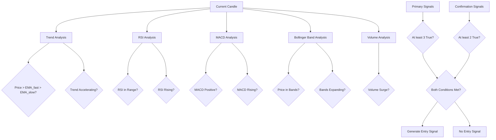
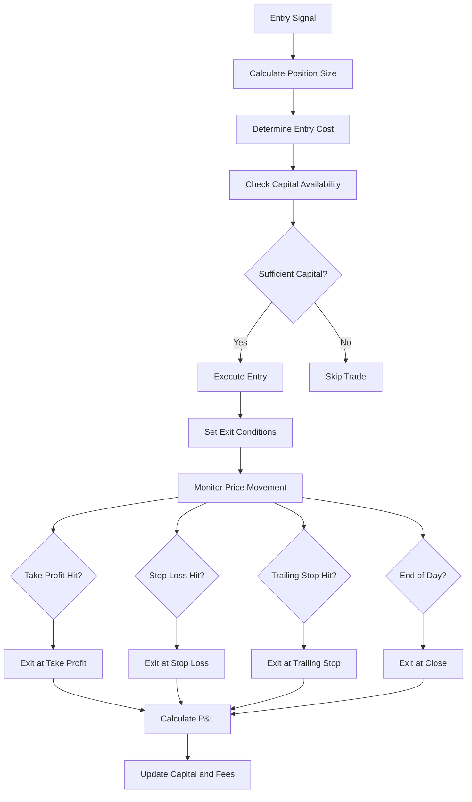

# Strategy Simulation

<cite>
**Referenced Files in This Document**   
- [BacktestPage.jsx](file://frontend/src/pages/Backtest/BacktestPage.jsx)
- [backtest.py](file://app/api/routes/backtest.py)
- [backtest_service.py](file://app/services/backtest_service.py)
- [backtest.py](file://app/models/backtest.py)
- [backtest.py](file://app/schemas/backtest.py)
</cite>

## Table of Contents
1. [Introduction](#introduction)
2. [Workflow Overview](#workflow-overview)
3. [Frontend Configuration Interface](#frontend-configuration-interface)
4. [API Endpoint and Request Handling](#api-endpoint-and-request-handling)
5. [Backtest Service Implementation](#backtest-service-implementation)
6. [Technical Indicator Calculation](#technical-indicator-calculation)
7. [Signal Generation Logic](#signal-generation-logic)
8. [Trade Execution Simulation](#trade-execution-simulation)
9. [Risk Management and Position Sizing](#risk-management-and-position-sizing)
10. [Performance Metrics and Results](#performance-metrics-and-results)
11. [Common Issues and Solutions](#common-issues-and-solutions)

## Introduction
The strategy simulation system enables users to test trading strategies using historical market data through a backtesting engine. This document details the implementation of the backtesting functionality, focusing on how trading strategies are simulated using technical indicators such as EMA and RSI, along with custom parameters. The process begins with user configuration in the frontend, proceeds through an API endpoint at `/api/v1/backtest/run`, and culminates in the execution of the simulation via the `BacktestService.run_backtest()` method. The system processes strategy parameters, applies them to historical candlestick data, generates entry and exit signals based on multiple conditions (trend, momentum, volume), and simulates trades with realistic fees and slippage. It also addresses critical concerns like overfitting, look-ahead bias, and inaccurate signal generation.

**Section sources**
- [BacktestPage.jsx](file://frontend/src/pages/Backtest/BacktestPage.jsx#L1-L1011)
- [backtest.py](file://app/api/routes/backtest.py#L1-L352)

## Workflow Overview
The strategy simulation workflow consists of several interconnected components that process user inputs and generate backtest results. Users begin by configuring their strategy parameters in the frontend interface, including technical indicators (EMA, RSI), risk settings, and trade execution rules. These configurations are sent to the backend via the `/api/v1/backtest/run` API endpoint. The request is handled by the `run_backtest` function in the `backtest.py` route file, which instantiates the `BacktestService` with the user's context. The service orchestrates the simulation by retrieving historical market data, calculating technical indicators, generating trading signals, executing simulated trades, and computing performance metrics. Results are stored in the database and returned to the frontend for visualization.



**Diagram sources**
- [backtest.py](file://app/api/routes/backtest.py#L26-L73)
- [backtest_service.py](file://app/services/backtest_service.py#L829-L1021)

**Section sources**
- [backtest.py](file://app/api/routes/backtest.py#L26-L73)
- [backtest_service.py](file://app/services/backtest_service.py#L829-L1021)

## Frontend Configuration Interface
The frontend provides a comprehensive interface for configuring backtesting parameters through the `BacktestPage.jsx` component. Users can select trading pairs, time intervals, and market types (spot or futures). The interface includes sections for basic risk management parameters such as initial capital, daily target, maximum daily loss, stop loss, take profit, and trailing stop. Technical indicator parameters like EMA fast/slow periods and RSI settings are also configurable. The page implements a searchable dropdown for selecting trading pairs from Binance's available symbols, with fallback options if the API call fails. Date pickers allow users to specify the backtesting period, with quick selection buttons for common time ranges (1 month, 3 months, 6 months). All parameter changes are validated in real-time, with appropriate clamping for values like maximum daily trades (1-50) and leverage (1-125 for futures).

**Section sources**
- [BacktestPage.jsx](file://frontend/src/pages/Backtest/BacktestPage.jsx#L1-L1011)

## API Endpoint and Request Handling
The `/api/v1/backtest/run` endpoint serves as the entry point for initiating backtest simulations. Implemented in `app/api/routes/backtest.py`, this POST endpoint accepts a `BacktestRequest` model containing the symbol, interval, date range, market type, and strategy parameters. The route handler validates the request parameters, particularly ensuring that `max_daily_trades` is an integer between 1 and 50. It then creates an instance of `BacktestService` with the authenticated user's context and database session. The service's `run_backtest` method is called with the provided parameters, and upon completion, the results are saved to the database using `save_backtest_result`. The endpoint returns a JSON response containing the backtest results, including performance metrics and trade details. Error handling is implemented to catch and report any exceptions that occur during the backtesting process.



**Diagram sources**
- [backtest.py](file://app/api/routes/backtest.py#L26-L73)

**Section sources**
- [backtest.py](file://app/api/routes/backtest.py#L26-L73)

## Backtest Service Implementation
The `BacktestService` class, located in `app/services/backtest_service.py`, orchestrates the entire backtesting process. Its `run_backtest` method serves as the main entry point, coordinating data retrieval, indicator calculation, signal generation, and trade simulation. The service first ensures the Binance client is properly set up using the user's API keys, falling back to test mode if authentication fails. It then retrieves historical market data through the `get_historical_data` method, which attempts to use authenticated endpoints first, falls back to public APIs, and finally generates sample data if necessary. The service applies caching to improve performance for repeated requests with the same parameters. After data preparation, it calculates technical indicators and processes the data on a daily basis to enforce trading limits and risk rules. The results are enriched with advanced performance metrics before being returned to the caller.

**Section sources**
- [backtest_service.py](file://app/services/backtest_service.py#L829-L1021)

## Technical Indicator Calculation
Technical indicators are calculated using the `prepare_indicators` method in the `BacktestService` class. This method takes a DataFrame of price data and adds several technical indicators including EMA (Exponential Moving Average), RSI (Relative Strength Index), MACD (Moving Average Convergence Divergence), and Bollinger Bands. The implementation uses the TA (Technical Analysis) library to compute these indicators. For EMA, both fast and slow periods are calculated based on user parameters. The RSI is computed with a configurable period, typically set to 7 by default. Bollinger Bands are calculated with a middle band (SMA), upper band, and lower band. Additional derived indicators include volume ratio (current volume compared to 20-period moving average), volatility (standard deviation of price changes), and trend strength (absolute difference between fast and slow EMA as a percentage of the slow EMA). The method includes robust error handling and fills missing values with appropriate defaults to ensure the backtesting process can continue even with incomplete data.



**Diagram sources**
- [backtest_service.py](file://app/services/backtest_service.py#L345-L441)

**Section sources**
- [backtest_service.py](file://app/services/backtest_service.py#L345-L441)

## Signal Generation Logic
Entry signals are generated by the `check_entry_signal` method, which evaluates multiple conditions across trend, momentum, volume, and volatility dimensions. The method requires at least three primary signals and two confirmation signals to generate a valid entry. Primary signals include: an uptrend (price above both fast and slow EMA), RSI within oversold/overbought bounds, positive MACD, price within Bollinger Bands, and volume surge (volume ratio > 1.2). Confirmation signals include: accelerating trend (increasing EMA spread), rising RSI, increasing MACD, expanding Bollinger Bands, positive momentum (price increase > 0.05%), strong trend (trend strength > 0.2%), and acceptable volatility (current volatility below its moving average). This multi-factor approach helps reduce false signals and improves the robustness of the strategy. The method includes comprehensive error handling to manage missing or NaN values in the data, ensuring the backtesting process continues even with imperfect data.



**Diagram sources**
- [backtest_service.py](file://app/services/backtest_service.py#L512-L591)

**Section sources**
- [backtest_service.py](file://app/services/backtest_service.py#L512-L591)

## Trade Execution Simulation
Trade execution is simulated in the `calculate_daily_pnl` method, which processes each day's data to generate trades while respecting daily limits and risk rules. When an entry signal is generated, the position size is determined by the risk-per-trade parameter, calculating the number of units that can be purchased while limiting potential loss to the specified percentage of capital. For futures trading, leverage is applied to increase position size while maintaining appropriate margin requirements. The simulation accounts for both entry and exit fees using the `calculate_fees` method, which considers maker/taker fees and slippage in basis points. Trades are exited based on multiple conditions: take profit (price reaches target), stop loss (price hits stop level), trailing stop (maximum price reached and then retraced by specified percentage), or end-of-day if no other exit condition is met. The method tracks cumulative P&L, fees, and capital throughout the simulation.



**Diagram sources**
- [backtest_service.py](file://app/services/backtest_service.py#L619-L827)

**Section sources**
- [backtest_service.py](file://app/services/backtest_service.py#L619-L827)

## Risk Management and Position Sizing
The backtesting system implements comprehensive risk management through multiple mechanisms. Position sizing is determined by the risk-per-trade parameter, which specifies the maximum percentage of capital that can be risked on a single trade. The stop loss level is used to calculate the position size, ensuring that if the stop is hit, the loss will not exceed the specified risk percentage. Daily trading limits are enforced through the `max_daily_trades` parameter, which prevents the system from opening more than the specified number of trades per day. Daily profit targets and maximum loss limits are also implemented, stopping trading for the day if either threshold is reached. For futures trading, leverage is carefully managed, with validation to ensure it stays within acceptable bounds (1-125x). Margin requirements are calculated based on the leverage and position size, ensuring that trades do not exceed available capital. These risk controls help prevent overtrading and protect capital during adverse market conditions.

**Section sources**
- [backtest_service.py](file://app/services/backtest_service.py#L619-L827)

## Performance Metrics and Results
The backtesting engine calculates a comprehensive set of performance metrics to evaluate strategy effectiveness. Basic metrics include total return, win rate, total trades, winning/losing trades, and average profit. Advanced risk-adjusted metrics are also computed, including maximum drawdown (worst peak-to-trough decline), Sharpe ratio (return per unit of volatility), Sortino ratio (return per unit of downside volatility), profit factor (gains divided by losses), and CAGR (Compound Annual Growth Rate). These metrics are calculated from the daily P&L results and equity curve generated during the simulation. The results are structured according to the `BacktestDetail` schema and stored in the database with all relevant parameters and outcomes. Users can retrieve backtest results through the `/api/v1/backtest/detail/{id}` endpoint, and export detailed trade logs, daily results, and monthly summaries in CSV format for further analysis.

```mermaid
erDiagram
BACKTEST ||--o{ DAILY_RESULTS : contains
BACKTEST ||--o{ MONTHLY_RESULTS : contains
class BACKTEST {
id: int
user_id: int
symbol: str
interval: str
start_date: str
end_date: str
parameters: JSON
initial_capital: float
final_capital: float
total_return: float
total_trades: int
winning_trades: int
losing_trades: int
win_rate: float
total_fees: float
avg_profit: float
max_drawdown: float
sharpe: float
sortino: float
profit_factor: float
cagr: float
test_mode: str
market_type: str
created_at: datetime
}
class DAILY_RESULTS {
date: str
pnl_pct: float
trades: int
capital: float
}
class MONTHLY_RESULTS {
month: str
pnl_pct: float
trades: int
}
```

**Diagram sources**
- [backtest.py](file://app/models/backtest.py#L1-L44)
- [backtest.py](file://app/schemas/backtest.py#L1-L45)

**Section sources**
- [backtest.py](file://app/models/backtest.py#L1-L44)
- [backtest.py](file://app/schemas/backtest.py#L1-L45)

## Common Issues and Solutions
The backtesting system addresses several common issues in strategy simulation. To prevent look-ahead bias, the system ensures that all indicators and signals are calculated using only data available up to the current candle, with proper handling of indicator warm-up periods. Overfitting is mitigated through the use of reasonable parameter ranges and the inclusion of robust risk management rules that prevent excessive optimization. The system handles missing data gracefully by filling NaN values with appropriate defaults and providing fallback mechanisms for data retrieval. To ensure realistic simulation, the engine incorporates trading fees and slippage into all trade calculations, with configurable maker/taker fees and slippage in basis points. The use of daily trading limits and profit/loss targets helps prevent unrealistic assumptions about trade frequency and position sizing. Additionally, the system validates all user inputs and parameters to prevent invalid configurations that could lead to misleading results.

**Section sources**
- [backtest_service.py](file://app/services/backtest_service.py#L345-L441)
- [backtest_service.py](file://app/services/backtest_service.py#L512-L591)
- [backtest_service.py](file://app/services/backtest_service.py#L619-L827)