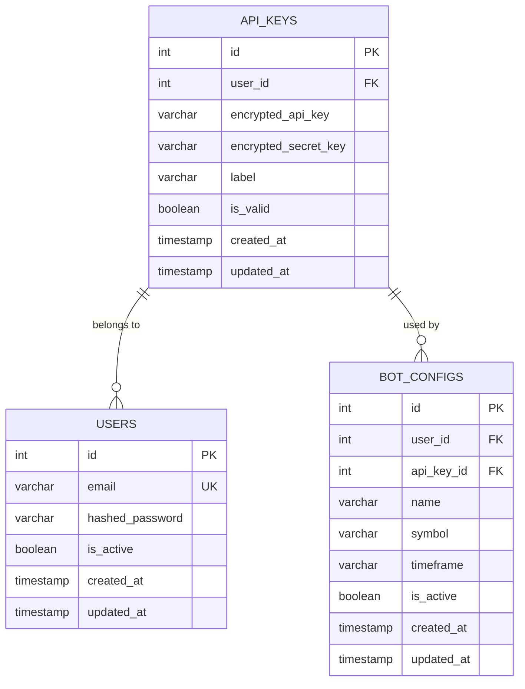
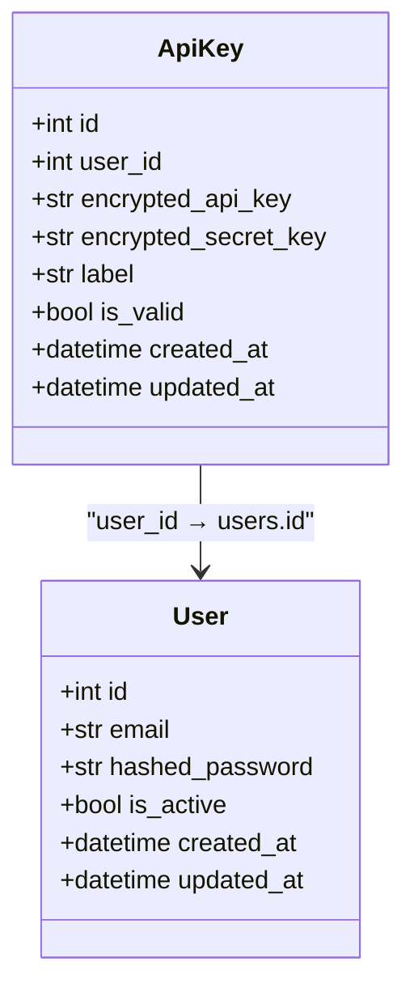
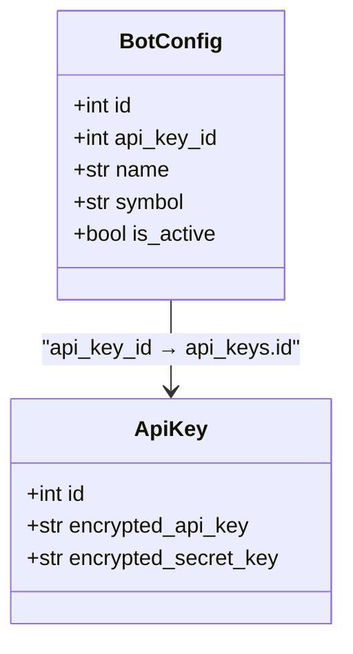
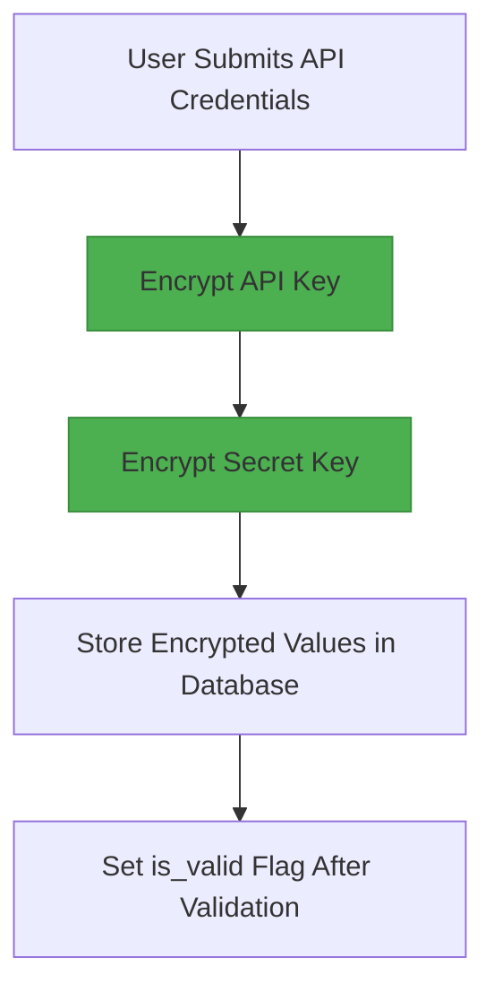
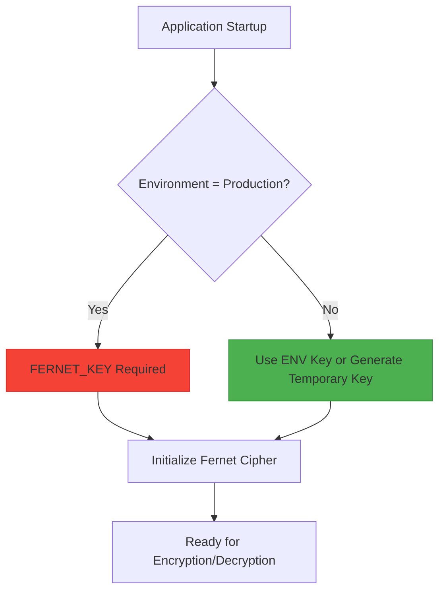
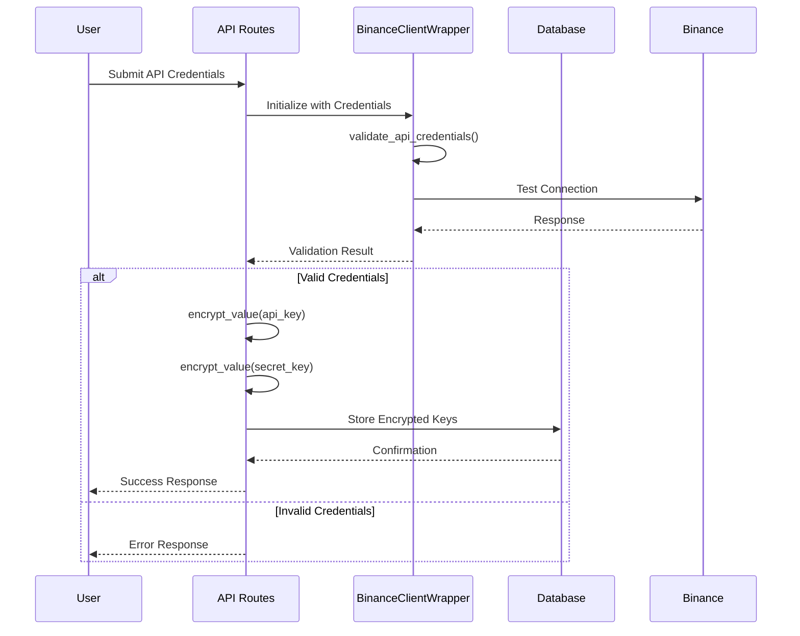
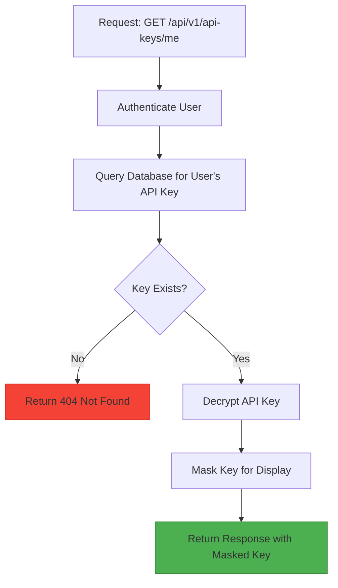
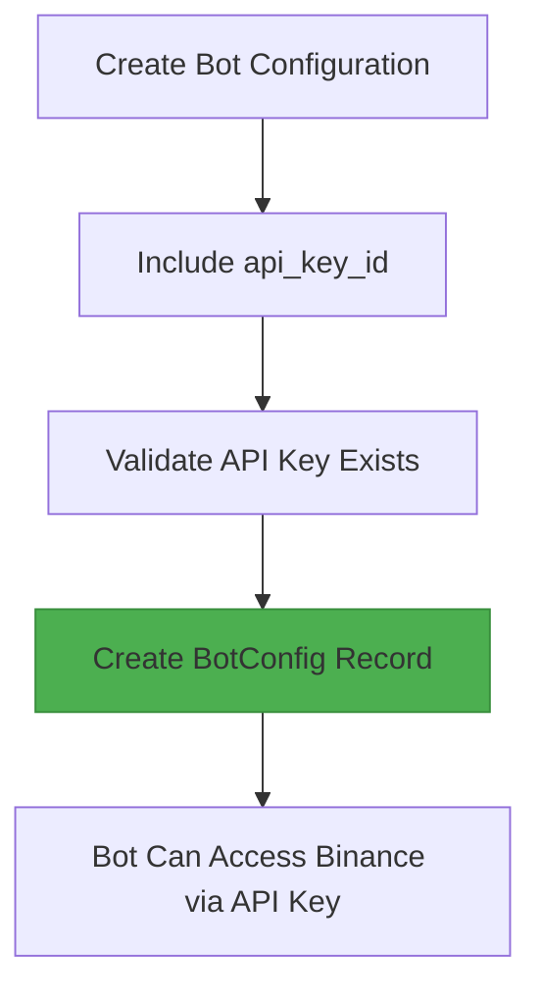
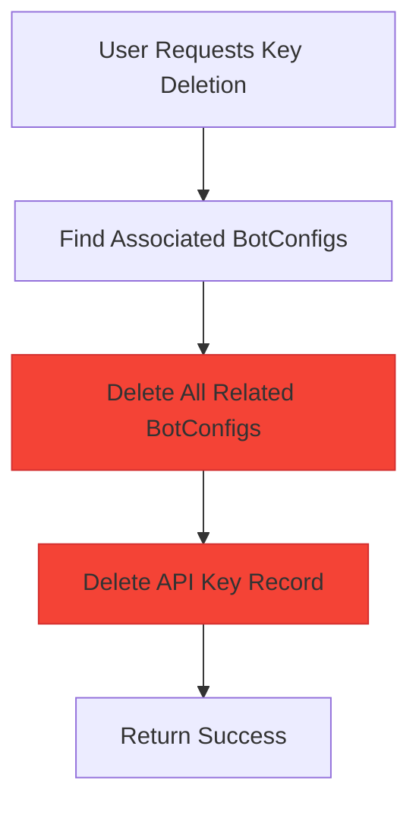

# API Key Model

<cite>
**Referenced Files in This Document**   
- [app/models/api_key.py](file://app/models/api_key.py)
- [app/schemas/api_key.py](file://app/schemas/api_key.py)
- [app/api/routes/api_key.py](file://app/api/routes/api_key.py)
- [app/core/crypto.py](file://app/core/crypto.py)
- [app/models/bot_config.py](file://app/models/bot_config.py)
- [alembic/versions/4b2e65b4c85b_create_api_key_table.py](file://alembic/versions/4b2e65b4c85b_create_api_key_table.py)
- [alembic/versions/69694099e14e_add_api_key_id_to_bot_config.py](file://alembic/versions/69694099e14e_add_api_key_id_to_bot_config.py)
</cite>

## Table of Contents
1. [Introduction](#introduction)
2. [Entity Overview](#entity-overview)
3. [Field Definitions](#field-definitions)
4. [Relationships](#relationships)
5. [Encryption Mechanism](#encryption-mechanism)
6. [Validation and Key Testing](#validation-and-key-testing)
7. [Access Patterns](#access-patterns)
8. [Security Considerations](#security-considerations)

## Introduction
The ApiKey model in the TradeBot application serves as a secure storage mechanism for users' Binance API credentials. It enables users to connect their Binance accounts to automated trading bots while ensuring sensitive authentication data is protected through encryption at rest. The model supports secure credential validation, access control, and integration with trading bot configurations.

**Section sources**
- [app/models/api_key.py](file://app/models/api_key.py#L4-L16)

## Entity Overview
The ApiKey entity represents encrypted Binance API credentials associated with a specific user. Each user can have one active API key that grants access to their Binance account for trading operations. The model ensures secure handling of sensitive data through encryption and provides mechanisms for validating key validity.

**Diagram sources**
- [app/models/api_key.py](file://app/models/api_key.py#L4-L16)
- [app/models/bot_config.py](file://app/models/bot_config.py#L4-L57)
- [alembic/versions/4b2e65b4c85b_create_api_key_table.py](file://alembic/versions/4b2e65b4c85b_create_api_key_table.py)
- [alembic/versions/69694099e14e_add_api_key_id_to_bot_config.py](file://alembic/versions/69694099e14e_add_api_key_id_to_bot_config.py)

## Field Definitions
The ApiKey model contains the following fields with their respective data types, constraints, and business rules:

| Field | Data Type | Constraints | Business Rules |
|-------|-----------|-------------|----------------|
| **id** | Integer | Primary Key, Indexed | Unique identifier for the API key record |
| **user_id** | Integer | Foreign Key (users.id), Indexed, Not Null | Links the API key to a specific user account |
| **encrypted_api_key** | String | Not Null | Stores the encrypted Binance API key |
| **encrypted_secret_key** | String | Not Null | Stores the encrypted Binance secret key |
| **label** | String | Nullable | User-defined label for identifying the API key |
| **is_valid** | Boolean | Default: False | Indicates whether the API credentials have been validated |
| **created_at** | DateTime (with timezone) | Server Default: Current Timestamp | Timestamp when the API key was created |
| **updated_at** | DateTime (with timezone) | Server Default: Current Timestamp, On Update: Current Timestamp | Timestamp of the last update to the record |

**Section sources**
- [app/models/api_key.py](file://app/models/api_key.py#L7-L14)

## Relationships
The ApiKey model maintains critical relationships with other entities in the system:

### User Relationship
Each API key belongs to exactly one user through the `user_id` foreign key. The relationship is defined with cascade delete behavior, meaning when a user is deleted, all their associated API keys are automatically removed.

**Diagram sources**
- [app/models/api_key.py](file://app/models/api_key.py#L8-L8)
- [app/models/user.py](file://app/models/user.py#L4-L22)

### BotConfig Relationship
Trading bot configurations reference API keys through the `api_key_id` field. This relationship allows bots to execute trades using the associated Binance credentials. When an API key is deleted, all bot configurations that reference it have their `api_key_id` set to NULL.

**Diagram sources**
- [app/models/api_key.py](file://app/models/api_key.py#L4-L16)
- [app/models/bot_config.py](file://app/models/bot_config.py#L30-L30)

## Encryption Mechanism
Sensitive API key data is encrypted at rest using the Fernet symmetric encryption scheme from the cryptography library. The encryption process ensures that even if the database is compromised, the actual API credentials remain protected.

### Encryption Process
When a user submits their API credentials, the system encrypts both the API key and secret key before storing them in the database. The encryption uses a Fernet key configured through environment variables.

**Diagram sources**
- [app/core/crypto.py](file://app/core/crypto.py#L16-L18)
- [app/api/routes/api_key.py](file://app/api/routes/api_key.py#L48-L49)

### Key Management
The encryption key is managed through environment variables with different behaviors in development and production environments:
- **Production**: Requires the `FERNET_KEY` environment variable to be set
- **Development**: Generates a temporary key if `FERNET_KEY` is not provided

**Diagram sources**
- [app/core/crypto.py](file://app/core/crypto.py#L4-L13)

## Validation and Key Testing
The system validates API credentials before storing them by testing the connection to the Binance API. This ensures that only valid credentials are accepted and marked as valid in the database.

### Validation Workflow
When a user creates a new API key, the system performs the following validation steps:

**Diagram sources**
- [app/api/routes/api_key.py](file://app/api/routes/api_key.py#L18-L59)
- [app/core/binance_client.py](file://app/core/binance_client.py#L38-L68)

## Access Patterns
The system implements several common access patterns for working with API keys:

### Retrieving Valid API Keys
To retrieve a user's API key with masked display information:

**Diagram sources**
- [app/api/routes/api_key.py](file://app/api/routes/api_key.py#L62-L68)
- [app/schemas/api_key.py](file://app/schemas/api_key.py#L23-L39)

### Associating Keys with Bots
When a trading bot needs to use API credentials, the system establishes the relationship through the `api_key_id` field in the BotConfig model.

**Diagram sources**
- [app/models/bot_config.py](file://app/models/bot_config.py#L30-L30)
- [app/schemas/bot_config.py](file://app/schemas/bot_config.py#L4-L61)

## Security Considerations
The ApiKey model implements multiple security measures to protect sensitive credentials:

### Encryption at Rest
All API key data is encrypted before being stored in the database using Fernet symmetric encryption. The encryption key is managed through environment variables and never stored in the codebase.

### Key Rotation
The system supports key rotation by allowing users to delete their existing API key and create a new one. When a key is deleted, all associated bot configurations lose their reference to the key.

### Access Control
Access to API key data is protected through authentication and authorization:
- Only authenticated users can access their own API keys
- Users cannot access API keys belonging to other users
- Sensitive data is never exposed in API responses

### Cascade Delete Behavior
When an API key is deleted, the system automatically removes all bot configurations that depend on it, preventing orphaned configurations from attempting to use invalid credentials.

**Diagram sources**
- [app/api/routes/api_key.py](file://app/api/routes/api_key.py#L70-L89)