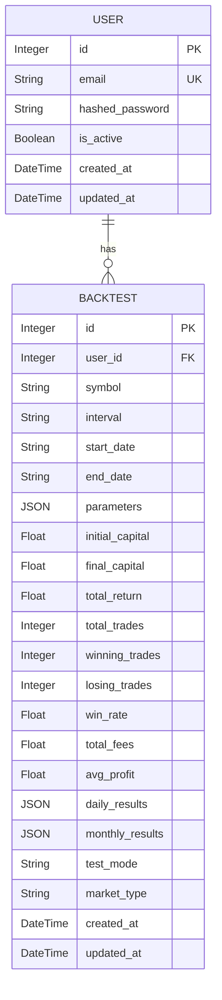
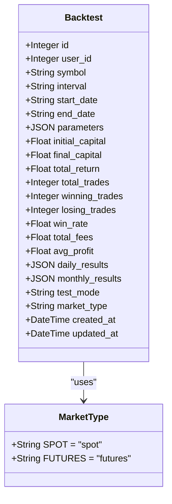

# Backtest Model

<cite>
**Referenced Files in This Document**   
- [backtest.py](file://app/models/backtest.py)
- [user.py](file://app/models/user.py)
- [backtest_service.py](file://app/services/backtest_service.py)
- [backtest.py](file://app/schemas/backtest.py)
- [8dff47bdfa5f_create_backtest_table_fixed.py](file://alembic/versions/8dff47bdfa5f_create_backtest_table_fixed.py)
- [a1b2c3d4e5f6_add_market_type_to_backtests.py](file://alembic/versions/a1b2c3d4e5f6_add_market_type_to_backtests.py)
</cite>

## Table of Contents
1. [Introduction](#introduction)
2. [Entity Purpose](#entity-purpose)
3. [Field Definitions](#field-definitions)
4. [Relationships](#relationships)
5. [JSON Field Structures](#json-field-structures)
6. [Market Type Support](#market-type-support)
7. [Performance Comparison Capabilities](#performance-comparison-capabilities)
8. [Indexing and Query Optimization](#indexing-and-query-optimization)

## Introduction
The Backtest model in the TradeBot application serves as a comprehensive storage mechanism for historical strategy simulation results. This documentation provides detailed information about the model's structure, field definitions, relationships, and capabilities for storing and analyzing trading strategy performance across different market conditions and time periods.

**Section sources**
- [backtest.py](file://app/models/backtest.py#L5-L42)

## Entity Purpose
The Backtest model is designed to store complete results from historical trading strategy simulations. It captures both the input parameters used for the backtest and the resulting performance metrics, enabling users to evaluate strategy effectiveness, compare different approaches, and analyze performance across various market conditions. The model supports both spot and futures trading simulations and includes detailed performance tracking at daily and monthly intervals.

**Section sources**
- [backtest.py](file://app/models/backtest.py#L5-L42)
- [backtest_service.py](file://app/services/backtest_service.py#L23-L1360)

## Field Definitions
The Backtest model contains the following fields with their respective data types and business rules:

### Core Identification Fields
- **id**: Integer, primary key, indexed - Unique identifier for each backtest record
- **user_id**: Integer, foreign key to users.id, indexed, not nullable - Links the backtest to the user who created it

### Backtest Parameters
- **symbol**: String, not nullable - Trading pair symbol (e.g., "BTCUSDT")
- **interval**: String, not nullable - Candlestick interval (e.g., "15m", "1h", "1d")
- **start_date**: String, not nullable - Start date of the backtest period in "YYYY-MM-DD" format
- **end_date**: String, not nullable - End date of the backtest period in "YYYY-MM-DD" format

### Strategy Parameters
- **parameters**: JSON, not nullable - Flexible storage for strategy-specific parameters including indicators, thresholds, and risk management settings

### Performance Results
- **initial_capital**: Float, not nullable - Starting capital for the simulation
- **final_capital**: Float, not nullable - Ending capital after all trades
- **total_return**: Float, not nullable - Overall return percentage calculated as ((final_capital - initial_capital) / initial_capital) * 100
- **total_trades**: Integer, not nullable - Total number of trades executed during the backtest
- **winning_trades**: Integer, not nullable - Number of profitable trades
- **losing_trades**: Integer, not nullable - Number of losing trades
- **win_rate**: Float, not nullable - Percentage of winning trades (winning_trades / total_trades * 100)
- **total_fees**: Float, not nullable - Cumulative fees paid during the simulation
- **avg_profit**: Float, not nullable - Average profit per trade

### Detailed Performance Data
- **daily_results**: JSON, nullable - Array of daily performance metrics including daily P&L, number of trades, and capital levels
- **monthly_results**: JSON, nullable - Aggregated monthly performance metrics

### Metadata
- **test_mode**: String, not nullable, default="true" - Indicates whether the backtest was run in test mode ("true" or "false")
- **market_type**: String, not nullable, default="spot" - Specifies the market type ("spot" or "futures")
- **created_at**: DateTime with timezone, server default=func.now() - Timestamp when the backtest was created
- **updated_at**: DateTime with timezone, server default=func.now(), onupdate=func.now() - Timestamp when the backtest was last updated

**Section sources**
- [backtest.py](file://app/models/backtest.py#L5-L42)

## Relationships
The Backtest model maintains a foreign key relationship with the User model through the user_id field. This one-to-many relationship allows each user to have multiple backtest records while ensuring data ownership and access control. The relationship is defined with a cascade delete constraint, meaning that when a user account is deleted, all associated backtest records are automatically removed.



**Diagram sources**
- [backtest.py](file://app/models/backtest.py#L5-L42)
- [user.py](file://app/models/user.py#L5-L22)

**Section sources**
- [backtest.py](file://app/models/backtest.py#L10)
- [user.py](file://app/models/user.py#L23)

## JSON Field Structures
The Backtest model utilizes JSON fields to store flexible and hierarchical data that would be difficult to represent with traditional relational structures.

### Parameters Field Structure
The parameters field stores strategy configuration as a JSON object with the following typical structure:
- Strategy-specific indicator settings (e.g., EMA periods, RSI thresholds)
- Risk management parameters (e.g., stop loss percentage, take profit targets)
- Trade execution rules (e.g., maximum daily trades, position sizing)
- Market-specific settings (e.g., leverage for futures trading)

### Daily Results Field Structure
The daily_results field contains an array of objects, each representing one day of trading activity:
- Date timestamp
- Opening and closing capital
- Daily P&L percentage and absolute value
- Number of trades executed
- Winning and losing trade counts
- Maximum drawdown for the day
- Trading activity summary

### Monthly Results Field Structure
The monthly_results field contains an object with month-year keys mapping to performance metrics:
- Monthly P&L percentage
- Total trades for the month
- Win rate for the month
- Largest winning and losing trades
- Average profit/loss ratio
- Maximum drawdown for the month

**Section sources**
- [backtest.py](file://app/models/backtest.py#L32-L34)
- [backtest_service.py](file://app/services/backtest_service.py#L652-L821)
- [backtest.py](file://app/schemas/backtest.py#L38-L39)

## Market Type Support
The Backtest model supports both 'spot' and 'futures' trading simulations through the market_type field. This field, added via migration a1b2c3d4e5f6, defaults to 'spot' for backward compatibility. The distinction between market types affects several aspects of the backtest:

For **spot trading**:
- Position sizing is based on available capital
- No leverage is applied
- Fees follow spot market fee structure
- Settlement is immediate

For **futures trading**:
- Leverage is factored into position sizing and P&L calculations
- Margin requirements are considered in risk management
- Funding rates may be simulated in extended models
- Fees follow futures market fee structure
- Liquidation risks are incorporated in simulations

The market_type field enables users to compare strategy performance across different trading environments and assess how leverage and margin trading impact results.



**Diagram sources**
- [backtest.py](file://app/models/backtest.py#L37-L38)
- [a1b2c3d4e5f6_add_market_type_to_backtests.py](file://alembic/versions/a1b2c3d4e5f6_add_market_type_to_backtests.py#L23)

**Section sources**
- [backtest.py](file://app/models/backtest.py#L38)
- [backtest_service.py](file://app/services/backtest_service.py#L1086-L1117)

## Performance Comparison Capabilities
The Backtest model is designed to facilitate comprehensive performance comparison across different strategies and time periods. By storing complete simulation results with detailed metadata, the model enables several types of analysis:

### Cross-Strategy Comparison
Users can compare multiple strategies by analyzing:
- Total return and win rate across different approaches
- Risk-adjusted returns using metrics derived from daily_results
- Trade frequency and average profit per trade
- Performance during specific market conditions

### Time Period Analysis
The model supports comparison across different time periods by:
- Using start_date and end_date fields to filter and group backtests
- Analyzing monthly_results to identify seasonal patterns
- Comparing performance across bull and bear markets
- Evaluating strategy robustness over extended periods

### Parameter Optimization
The parameters field allows for systematic testing of different configuration values:
- Grid search across parameter combinations
- Sensitivity analysis to identify critical parameters
- Robustness testing across market conditions
- Walk-forward optimization using rolling time windows

### Risk Profile Assessment
Detailed results enable comprehensive risk analysis:
- Maximum drawdown calculation from equity curves in daily_results
- Volatility analysis across different time frames
- Win/loss ratio and profit factor evaluation
- Recovery analysis from losing periods

**Section sources**
- [backtest.py](file://app/models/backtest.py#L5-L42)
- [backtest_service.py](file://app/services/backtest_service.py#L23-L1360)

## Indexing and Query Optimization
The Backtest model implements strategic indexing to ensure efficient querying for common access patterns:

### Primary Indexes
- **id index**: Created automatically as the primary key, enabling fast lookups by backtest ID
- **user_id index**: Explicitly created to optimize queries filtering by user, which is a common operation for retrieving a user's backtest history

### Query Performance Considerations
The indexing strategy supports efficient execution of the following query types:
- User-specific backtest retrieval: The user_id index allows for rapid filtering of backtests by owner
- Date range queries: While no dedicated date index exists, the combination of start_date and end_date filtering is optimized through database query planning
- Combined filtering: Queries that combine user_id with date ranges or symbol filters benefit from the user_id index as a starting point

### Migration History
The indexes were established in the initial migration (8dff47bdfa5f) with the following operations:
- Creation of ix_backtests_id index on the id column
- Creation of ix_backtests_user_id index on the user_id column
These indexes are automatically dropped during schema downgrade operations to maintain database consistency.

```mermaid
erDiagram
BACKTEST {
Integer id PK
Integer user_id FK
String symbol
String interval
String start_date
String end_date
JSON parameters
Float initial_capital
Float final_capital
Float total_return
Integer total_trades
Integer winning_trades
Integer losing_trades
Float win_rate
Float total_fees
Float avg_profit
JSON daily_results
JSON monthly_results
String test_mode
String market_type
DateTime created_at
DateTime updated_at
}
index "ix_backtests_id" on BACKTEST(id)
index "ix_backtests_user_id" on BACKTEST(user_id)
```

**Diagram sources**
- [8dff47bdfa5f_create_backtest_table_fixed.py](file://alembic/versions/8dff47bdfa5f_create_backtest_table_fixed.py#L48-L49)
- [backtest.py](file://app/models/backtest.py#L9-L10)

**Section sources**
- [8dff47bdfa5f_create_backtest_table_fixed.py](file://alembic/versions/8dff47bdfa5f_create_backtest_table_fixed.py#L48-L49)
- [backtest.py](file://app/models/backtest.py#L9-L10)