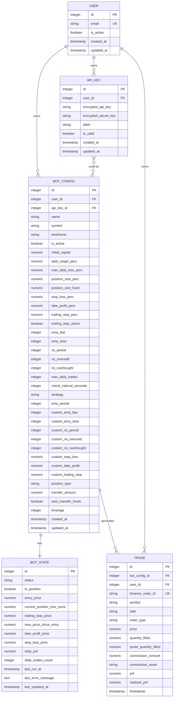

# Bot Configuration Model

<cite>
**Referenced Files in This Document**   
- [bot_config.py](file://app/models/bot_config.py)
- [user.py](file://app/models/user.py)
- [api_key.py](file://app/models/api_key.py)
- [bot_state.py](file://app/models/bot_state.py)
- [trade.py](file://app/models/trade.py)
- [19adfce0d2a6_create_bot_config_table.py](file://alembic/versions/19adfce0d2a6_create_bot_config_table.py)
- [59a0e8d02f5a_add_strategy_and_ema_period_to_bot_.py](file://alembic/versions/59a0e8d02f5a_add_strategy_and_ema_period_to_bot_.py)
- [3742c83cd3b1_add_advanced_bot_parameters.py](file://alembic/versions/3742c83cd3b1_add_advanced_bot_parameters.py)
- [107856acfca7_add_leverage_column_to_bot_configs.py](file://alembic/versions/107856acfca7_add_leverage_column_to_bot_configs.py)
- [bot_tasks.py](file://app/core/bot_tasks.py)
</cite>

## Table of Contents
1. [Introduction](#introduction)
2. [Entity Overview](#entity-overview)
3. [Field Definitions](#field-definitions)
4. [Relationships and Dependencies](#relationships-and-dependencies)
5. [Validation Rules and Constraints](#validation-rules-and-constraints)
6. [Configuration Patterns and Strategy Examples](#configuration-patterns-and-strategy-examples)
7. [Data Model Diagram](#data-model-diagram)

## Introduction
The `BotConfig` model serves as the central configuration store for automated trading bots within the TradeBot application. It encapsulates all parameters required to define a bot's trading behavior, risk management rules, technical indicators, and position management settings. This document provides comprehensive documentation of the model's structure, relationships, and usage patterns.

**Section sources**
- [bot_config.py](file://app/models/bot_config.py#L4-L57)

## Entity Overview
The `BotConfig` entity represents a complete configuration profile for an individual trading bot. Each configuration is owned by a user, associated with a specific trading symbol and timeframe, and contains all parameters necessary for executing trades according to predefined strategies. The model supports both spot and futures trading modes with configurable leverage and fund transfer behaviors.

**Section sources**
- [bot_config.py](file://app/models/bot_config.py#L4-L57)

## Field Definitions
The `BotConfig` model contains the following fields organized by functional category:

### Core Identification and Metadata
- **id**: Primary key identifier for the configuration
- **user_id**: Foreign key reference to the owning user
- **name**: User-defined name for the bot configuration
- **symbol**: Trading pair symbol (e.g., BTCUSDT)
- **timeframe**: Chart timeframe for trading decisions (e.g., 1h, 4h)
- **is_active**: Boolean flag indicating whether the bot is currently running
- **created_at**: Timestamp of configuration creation
- **updated_at**: Timestamp of last configuration update

### Capital and Position Management
- **initial_capital**: Starting capital allocated to the bot
- **position_size_perc**: Percentage of capital to use per trade
- **position_size_fixed**: Fixed amount of capital to use per trade
- **position_type**: Trading mode ("spot" or "futures")
- **leverage**: Leverage multiplier for futures trading (1-125)
- **auto_transfer_funds**: Whether to automatically transfer funds between spot and futures accounts
- **transfer_amount**: Specific amount to transfer when auto-transfer is enabled

### Risk Management Parameters
- **stop_loss_perc**: Percentage stop loss threshold
- **take_profit_perc**: Percentage take profit target
- **trailing_stop_perc**: Trailing stop percentage
- **trailing_stop_active**: Whether trailing stop is currently active
- **max_daily_loss_perc**: Maximum allowable daily loss percentage
- **daily_target_perc**: Daily profit target percentage
- **max_daily_trades**: Maximum number of trades allowed per day

### Technical Indicator Parameters
- **ema_fast**: Period for fast EMA calculation
- **ema_slow**: Period for slow EMA calculation
- **rsi_period**: RSI calculation period
- **rsi_oversold**: RSI oversold threshold
- **rsi_overbought**: RSI overbought threshold
- **ema_period**: General EMA period used in strategy
- **strategy**: Name of the trading strategy implementation

### Advanced Custom Parameters
- **custom_ema_fast**: Custom fast EMA period (default: 8)
- **custom_ema_slow**: Custom slow EMA period (default: 21)
- **custom_rsi_period**: Custom RSI period (default: 7)
- **custom_rsi_oversold**: Custom RSI oversold level (default: 35)
- **custom_rsi_overbought**: Custom RSI overbought level (default: 65)
- **custom_stop_loss**: Custom stop loss percentage (default: 0.5)
- **custom_take_profit**: Custom take profit percentage (default: 1.5)
- **custom_trailing_stop**: Custom trailing stop percentage (default: 0.3)

### Integration and Operational Settings
- **api_key_id**: Reference to the API key used for exchange connectivity
- **check_interval_seconds**: Frequency of market condition checks (default: 60)

**Section sources**
- [bot_config.py](file://app/models/bot_config.py#L4-L57)

## Relationships and Dependencies
The `BotConfig` model maintains several critical relationships with other entities in the system:

### Foreign Key Relationships
- **User Relationship**: Each `BotConfig` belongs to a `User` via the `user_id` foreign key. This establishes ownership and access control. The relationship is defined as `owner = relationship("User", back_populates="bot_configs")` with cascade delete behavior.
- **ApiKey Relationship**: Configurations can reference an `ApiKey` entity via `api_key_id`, enabling secure connection to exchange APIs. The relationship is defined as `api_key = relationship("ApiKey")`.

### One-to-One Relationship
- **BotState Relationship**: Each configuration has exactly one runtime state stored in the `BotState` model, linked by primary key. This relationship is defined as `state = relationship("BotState", back_populates="config", uselist=False, cascade="all, delete-orphan")` with cascade delete behavior.

### One-to-Many Relationship
- **Trade Relationship**: A configuration can generate multiple `Trade` records over its lifetime. The relationship is defined as `trades = relationship("Trade", back_populates="bot", cascade="all, delete-orphan")` with cascade delete behavior, ensuring all associated trades are removed when a configuration is deleted.

**Section sources**
- [bot_config.py](file://app/models/bot_config.py#L54-L57)
- [user.py](file://app/models/user.py#L20-L22)
- [api_key.py](file://app/models/api_key.py#L17)
- [bot_state.py](file://app/models/bot_state.py#L23)
- [trade.py](file://app/models/trade.py#L25)

## Validation Rules and Constraints
The `BotConfig` model enforces several validation rules and constraints:

- **Leverage Range**: The `leverage` field must be between 1 and 125 inclusive, as required by futures trading regulations.
- **Position Type Constraints**: The `position_type` field accepts only "spot" or "futures" as valid values.
- **Required Fields**: The `name`, `symbol`, `timeframe`, `stop_loss_perc`, `take_profit_perc`, `ema_fast`, `ema_slow`, `rsi_period`, `rsi_oversold`, `rsi_overbought`, and `strategy` fields are mandatory.
- **Default Values**: Several fields have sensible defaults including `is_active=False`, `check_interval_seconds=60`, `position_type="spot"`, `leverage=10`, and various custom parameter defaults.

The cascade delete behavior ensures data integrity by automatically removing associated `BotState`, `Trade`, and related records when a `BotConfig` is deleted.

**Section sources**
- [bot_config.py](file://app/models/bot_config.py#L4-L57)
- [107856acfca7_add_leverage_column_to_bot_configs.py](file://alembic/versions/107856acfca7_add_leverage_column_to_bot_configs.py)
- [3742c83cd3b1_add_advanced_bot_parameters.py](file://alembic/versions/3742c83cd3b1_add_advanced_bot_parameters.py)

## Configuration Patterns and Strategy Examples
The `BotConfig` model supports various trading strategy patterns through its flexible parameter system:

### Trend Following Strategy
Configure with longer EMA periods (e.g., ema_fast=12, ema_slow=26), moderate RSI thresholds (rsi_oversold=30, rsi_overbought=70), and trailing stop activation for capturing extended trends.

### Scalping Strategy
Use shorter timeframes with tight stop-loss (stop_loss_perc=0.5) and take-profit (take_profit_perc=0.8) percentages, high check frequency (check_interval_seconds=15), and fixed position sizing.

### Mean Reversion Strategy
Set aggressive RSI thresholds (rsi_oversold=20, rsi_overbought=80) with contrarian entry logic, combined with conservative position sizing and lower leverage.

### Futures Grid Strategy
Configure with position_type="futures", leverage=25, auto_transfer_funds=True, and custom parameters tuned for range-bound markets with frequent small trades.

The advanced custom parameters allow users to define alternative parameter sets that can be activated without modifying core strategy logic.

**Section sources**
- [bot_config.py](file://app/models/bot_config.py#L34-L43)
- [bot_tasks.py](file://app/core/bot_tasks.py#L42-L75)

## Data Model Diagram

**Diagram sources**
- [bot_config.py](file://app/models/bot_config.py#L4-L57)
- [user.py](file://app/models/user.py#L4-L22)
- [api_key.py](file://app/models/api_key.py#L4-L16)
- [bot_state.py](file://app/models/bot_state.py#L4-L22)
- [trade.py](file://app/models/trade.py#L4-L25)