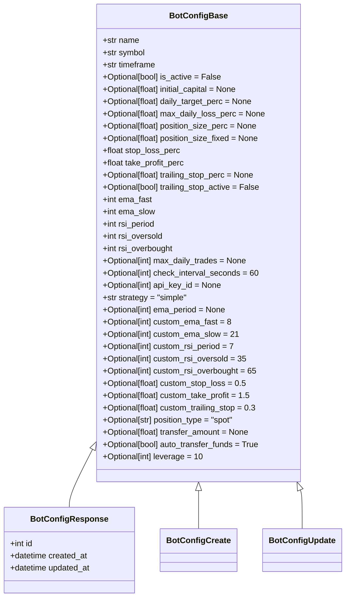

# Core Configuration

<cite>
**Referenced Files in This Document**   
- [bot_config.py](file://app/models/bot_config.py)
- [bot_config.py](file://app/schemas/bot_config.py)
- [bot_config.py](file://app/api/routes/bot_config.py)
- [test_bot_config.py](file://tests/test_bot_config.py)
</cite>

## Table of Contents
1. [Introduction](#introduction)
2. [Core Configuration Fields](#core-configuration-fields)
3. [Capital Allocation Settings](#capital-allocation-settings)
4. [Execution Frequency Configuration](#execution-frequency-configuration)
5. [Strategy Configuration](#strategy-configuration)
6. [Configuration Validation](#configuration-validation)
7. [Example Configurations](#example-configurations)
8. [Best Practices](#best-practices)

## Introduction
The BotConfig model serves as the central configuration entity for trading bots within the system, defining all operational parameters for both backtesting and live trading scenarios. This document details the core configuration fields, their purposes, validation rules, and usage patterns. The configuration system leverages SQLAlchemy for database persistence and Pydantic for data validation and serialization, ensuring data integrity across the application. The model supports both basic and advanced trading strategies through extensible parameter fields, allowing users to customize bot behavior for different market conditions and trading approaches.

**Section sources**
- [bot_config.py](file://app/models/bot_config.py#L4-L57)
- [bot_config.py](file://app/schemas/bot_config.py#L5-L80)

## Core Configuration Fields

The BotConfig model contains several fundamental attributes that define a trading bot's identity and basic operational parameters. The `id` field serves as the primary key, uniquely identifying each configuration in the database. The `user_id` field establishes ownership by linking the configuration to a specific user account, ensuring proper access control and data isolation between users. The `name` field allows users to assign a descriptive identifier to their bot configuration, facilitating organization and recognition among multiple configurations.

The `symbol` field specifies the trading pair that the bot will operate on, following the format "BASE/QUOTE" (e.g., "BTC/USDT"). This field is critical for market data retrieval and trade execution. The `timeframe` field determines the candlestick interval used for technical analysis, with common values including "1m", "5m", "15m", "1h", "4h", and "1d". The `is_active` boolean field controls whether the bot is currently running or paused, serving as the primary switch for bot execution.

**Section sources**
- [bot_config.py](file://app/models/bot_config.py#L7-L13)
- [bot_config.py](file://app/schemas/bot_config.py#L5-L8)

## Capital Allocation Settings

The `initial_capital` setting plays a crucial role in both backtesting and live trading scenarios. For backtesting purposes, this value represents the starting balance used to simulate trading performance, allowing users to evaluate strategy effectiveness under specific capital conditions. In live trading, this field may be used to allocate a specific portion of the user's actual account balance to the bot, providing capital isolation and risk management.

When `initial_capital` is set to null, the system typically defaults to using the available balance in the designated trading account. This configuration allows the bot to operate with the maximum available funds, which may be appropriate for users who want to fully utilize their trading capital. The field is defined as Numeric in the SQLAlchemy model, supporting precise decimal values for accurate capital representation.

**Section sources**
- [bot_config.py](file://app/models/bot_config.py#L13)
- [bot_config.py](file://app/schemas/bot_config.py#L10)

## Execution Frequency Configuration

The `check_interval_seconds` parameter controls the frequency at which the trading bot evaluates market conditions and executes its trading logic. This field has a default value of 60 seconds, meaning the bot will check for trading opportunities every minute by default. The parameter directly impacts both system resource usage and trading responsiveness - shorter intervals increase the frequency of market analysis but also increase computational load and API usage.

This configuration allows users to balance between timely trade execution and system efficiency. For high-frequency trading strategies, users might set this value to 15 or 30 seconds to capture rapid market movements. For longer-term strategies, values of 300 (5 minutes) or higher might be appropriate to reduce unnecessary processing. The field is implemented as an Integer column in the database with a default value, making it optional in configuration requests.

**Section sources**
- [bot_config.py](file://app/models/bot_config.py#L28)
- [bot_config.py](file://app/schemas/bot_config.py#L24)

## Strategy Configuration

The `strategy` field defines the trading algorithm that the bot will employ, with a default value of 'simple' indicating a basic trading approach. This extensible design allows the system to support multiple strategy types through the same configuration model. The field is implemented as a non-nullable String column with a default value, ensuring that every bot configuration has an explicitly defined strategy.

Custom strategies can be implemented by creating new strategy handlers that interpret the configuration parameters according to their specific logic. When a new strategy value is assigned (e.g., 'ema_rsi', 'macd_divergence'), the bot execution system routes the trading logic to the appropriate strategy module. This design enables users to switch between different trading approaches without changing the underlying configuration structure, promoting flexibility and reusability.

**Section sources**
- [bot_config.py](file://app/models/bot_config.py#L30)
- [bot_config.py](file://app/schemas/bot_config.py#L26)

## Configuration Validation

The BotConfig model implements comprehensive validation through both SQLAlchemy and Pydantic to ensure data integrity. The Pydantic schemas define field types, required status, and default values, while custom validators enforce business rules. For example, the `leverage` field includes a validator that ensures values are between 1 and 125, reflecting exchange limitations. Similarly, the `position_type` field is validated to accept only 'spot' or 'futures' values, preventing invalid configuration states.

The validation system operates at multiple levels: Pydantic validates incoming API requests before they reach the database layer, while SQLAlchemy constraints ensure data integrity at the database level. This dual-layer approach prevents invalid configurations from being created or updated. The system also includes foreign key constraints (e.g., user_id references users.id) to maintain referential integrity across related entities.

**Diagram sources**
- [bot_config.py](file://app/schemas/bot_config.py#L5-L80)

**Section sources**
- [bot_config.py](file://app/schemas/bot_config.py#L48-L62)
- [bot_config.py](file://app/models/bot_config.py#L4-L57)

## Example Configurations

Valid configuration setups vary based on trading scenarios and risk profiles. For a conservative spot trading strategy, a configuration might include: name="Conservative BTC Trader", symbol="BTC/USDT", timeframe="1h", initial_capital=1000.0, stop_loss_perc=2.0, take_profit_perc=4.0, strategy="simple", check_interval_seconds=300. This setup allocates $1,000 to trade Bitcoin against USDT on hourly candles with moderate risk parameters and checks for opportunities every 5 minutes.

For an aggressive futures trading strategy, a configuration could feature: name="Aggressive ETH Scalper", symbol="ETH/USDT", timeframe="5m", initial_capital=500.0, stop_loss_perc=1.5, take_profit_perc=3.0, leverage=20, position_type="futures", strategy="ema_rsi", check_interval_seconds=30. This configuration uses higher leverage for amplified returns, more frequent market checks for scalping opportunities, and a more complex strategy combining EMA and RSI indicators.

The test suite demonstrates a basic configuration with name="BTC/USDT EMA Cross", symbol="BTC/USDT", timeframe="1h", stop_loss_perc=2.0, take_profit_perc=4.0, ema_fast=9, ema_slow=21, rsi_period=14, rsi_oversold=30, rsi_overbought=70, which represents a classic EMA crossover strategy with RSI confirmation.

**Section sources**
- [test_bot_config.py](file://tests/test_bot_config.py#L16-L27)
- [bot_config.py](file://app/models/bot_config.py#L10-L30)

## Best Practices

When configuring trading bots, several best practices should be followed to ensure optimal performance and risk management. For naming conventions, use descriptive names that indicate the strategy, asset, and timeframe (e.g., "BTC_1h_EMA_Cross" rather than "Bot1"). This improves organization when managing multiple configurations. Symbol formatting should consistently use uppercase letters with the format "BASE/QUOTE" (e.g., "BTC/USDT") to match exchange conventions and prevent parsing errors.

Risk parameters should be carefully calibrated based on the user's risk tolerance and market volatility. Conservative traders might use stop-loss values between 1-3% and take-profit ratios of 2:1, while more aggressive strategies could employ tighter stops with higher profit targets. The initial capital allocation should consider the user's overall portfolio size, with many traders allocating no more than 5-10% of their total capital to a single bot strategy.

Regular monitoring and adjustment of configuration parameters based on performance metrics is essential for long-term success. Users should periodically review their bot's performance and adjust parameters like stop-loss, take-profit, and position sizing to adapt to changing market conditions.

**Section sources**
- [bot_config.py](file://app/models/bot_config.py#L9-L10)
- [bot_config.py](file://app/schemas/bot_config.py#L6-L7)