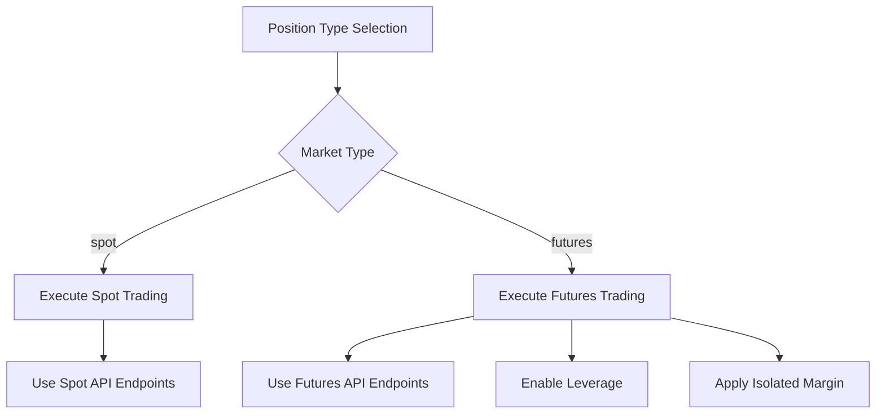
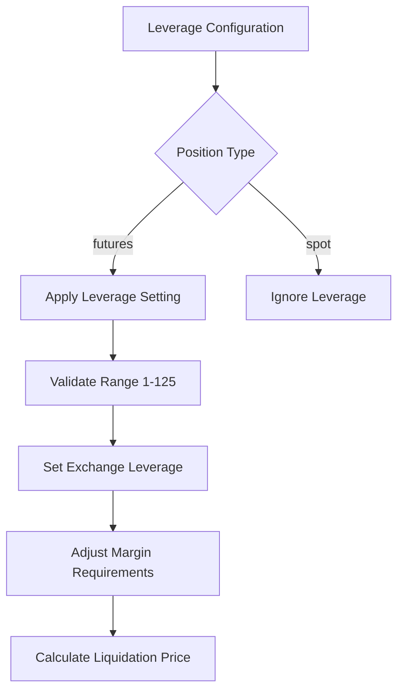
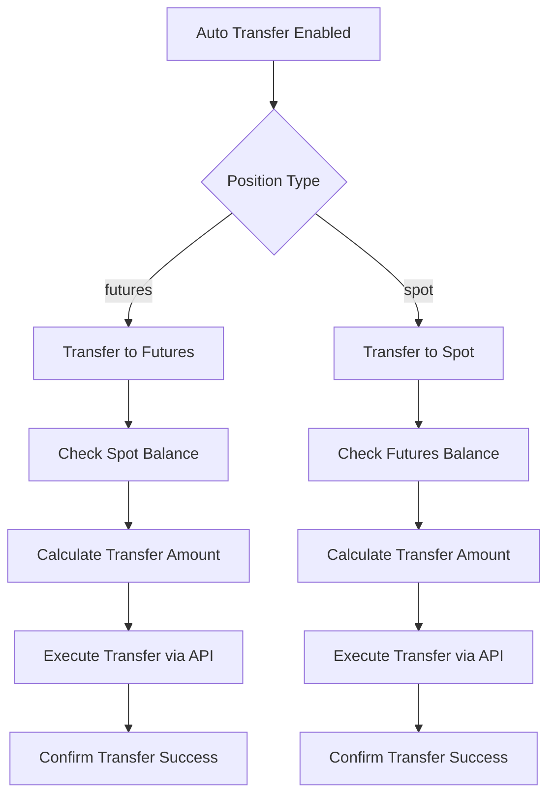
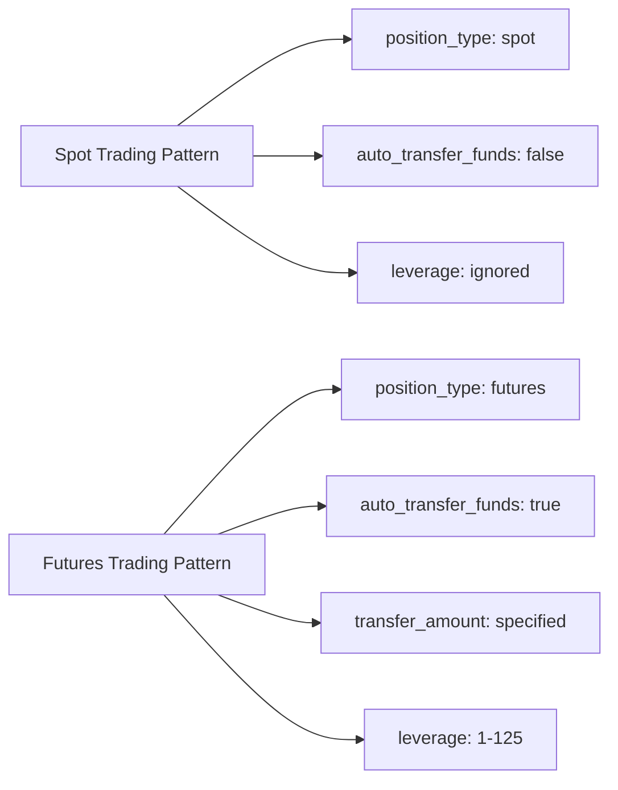
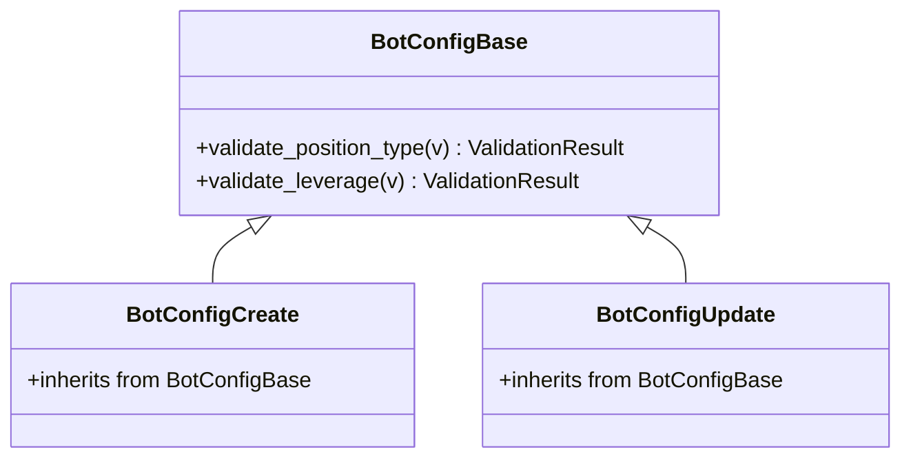

# Position Management

<cite>
**Referenced Files in This Document**   
- [bot_config.py](file://app/models/bot_config.py)
- [bot_config.py](file://app/schemas/bot_config.py)
- [bot_tasks.py](file://app/core/bot_tasks.py)
- [binance_client.py](file://app/core/binance_client.py)
</cite>

## Table of Contents
1. [Introduction](#introduction)
2. [Position Type Configuration](#position-type-configuration)
3. [Leverage Management](#leverage-management)
4. [Fund Transfer Automation](#fund-transfer-automation)
5. [Configuration Patterns](#configuration-patterns)
6. [Security and Best Practices](#security-and-best-practices)
7. [Validation Rules](#validation-rules)

## Introduction
The Position Management system in the trading bot provides comprehensive control over trading operations on both spot and futures markets. This document details the key components of the BotConfig model that enable sophisticated position and fund management strategies. The system allows traders to configure their trading approach based on market type, leverage requirements, and automated fund allocation between different wallet types on Binance. These features are designed to provide flexibility in trading strategies while maintaining robust risk management controls.

**Section sources**
- [bot_config.py](file://app/models/bot_config.py#L4-L57)

## Position Type Configuration
The `position_type` field in the BotConfig model determines whether trading operations occur in the 'spot' or 'futures' market. This configuration parameter serves as the primary switch that dictates the trading environment and associated behaviors. When set to 'spot', the bot executes traditional spot trading where assets are bought and sold directly. When set to 'futures', the bot engages in derivatives trading, enabling leverage and more sophisticated risk management features.

The position type directly influences several aspects of the trading operation, including the API endpoints used for order execution, margin requirements, and available order types. It also determines the fund transfer direction when the auto-transfer feature is enabled. The default value is set to 'spot', providing a conservative starting point for new configurations.

**Diagram sources**
- [bot_config.py](file://app/models/bot_config.py#L46)
- [bot_tasks.py](file://app/core/bot_tasks.py#L187-L210)

**Section sources**
- [bot_config.py](file://app/models/bot_config.py#L46)
- [bot_tasks.py](file://app/core/bot_tasks.py#L187-L210)

## Leverage Management
The `leverage` parameter in the BotConfig model specifies the leverage multiplier for futures trading, with a constrained range of 1-125. This parameter directly impacts the margin requirements and risk exposure of trading positions. Higher leverage amplifies both potential profits and losses, making it a critical risk management consideration.

When a futures position is initiated, the system automatically configures the leverage setting on the Binance exchange using the specified value. The leverage setting is applied to the specific trading pair and operates within Binance's margin system. The default leverage is set to 10x, providing a balanced approach between risk and potential return.

The leverage parameter only affects futures trading operations. In spot trading mode, this parameter is ignored as spot trading does not involve leverage. The system includes safeguards to prevent excessively high leverage settings that could lead to rapid liquidation of positions.

**Diagram sources**
- [bot_config.py](file://app/models/bot_config.py#L49)
- [binance_client.py](file://app/core/binance_client.py#L489-L504)
- [bot_tasks.py](file://app/core/bot_tasks.py#L199-L209)

**Section sources**
- [bot_config.py](file://app/models/bot_config.py#L49)
- [binance_client.py](file://app/core/binance_client.py#L489-L504)

## Fund Transfer Automation
The `auto_transfer_funds` feature enables automatic movement of funds between spot and futures wallets on Binance, synchronized with the position type configuration. When enabled, the system automatically transfers the required capital to the appropriate trading environment before executing trades. This automation eliminates the need for manual fund allocation and ensures that trading operations have the necessary capital available.

The `transfer_amount` field specifies the exact size of transfers. When this field is null, the system implements a dynamic transfer strategy: for spot-to-futures transfers, it moves the available balance minus a 10 USDT reserve; for futures-to-spot transfers, it moves the balance minus a 1 USDT reserve. This approach maintains a small buffer to cover potential fees and prevent complete fund depletion.

The fund transfer process is integrated into the trading workflow and executes before position initiation. The system handles both directions of transfer: from spot to futures when entering leveraged positions, and from futures to spot when closing positions or switching to spot trading.

**Diagram sources**
- [bot_config.py](file://app/models/bot_config.py#L47-L48)
- [bot_tasks.py](file://app/core/bot_tasks.py#L42-L75)
- [binance_client.py](file://app/core/binance_client.py#L419-L445)

**Section sources**
- [bot_config.py](file://app/models/bot_config.py#L47-L48)
- [bot_tasks.py](file://app/core/bot_tasks.py#L42-L75)

## Configuration Patterns
The system supports distinct configuration patterns for spot trading versus leveraged futures trading, allowing users to optimize their strategies for different market conditions and risk profiles.

For spot trading, a typical configuration would set `position_type` to 'spot', disable `auto_transfer_funds` (or leave `transfer_amount` null), and ignore the `leverage` parameter. This pattern focuses on direct asset ownership with no leverage, suitable for conservative strategies or market entry testing.

For leveraged futures trading, the configuration would set `position_type` to 'futures', enable `auto_transfer_funds`, specify a `transfer_amount` (or rely on the default dynamic calculation), and set an appropriate `leverage` value based on risk tolerance. This pattern enables amplified returns but requires careful risk management due to the increased exposure.

**Diagram sources**
- [bot_config.py](file://app/models/bot_config.py#L46-L49)
- [bot_tasks.py](file://app/core/bot_tasks.py#L187-L209)

**Section sources**
- [bot_config.py](file://app/models/bot_config.py#L46-L49)

## Security and Best Practices
When using high leverage in futures trading, several security considerations and best practices should be followed. High leverage significantly increases the risk of liquidation, where positions are automatically closed by the exchange when losses exceed the available margin. To mitigate this risk, it is recommended to use conservative leverage settings, especially for volatile assets.

Best practices for fund allocation include maintaining adequate reserves in both spot and futures wallets to handle unexpected market movements. The auto-transfer feature should be configured with appropriate transfer amounts to prevent over-allocation of capital to a single trading strategy. Regular monitoring of position health and margin levels is essential when using leverage.

Additional security measures include using API keys with restricted permissions, enabling exchange-level safeguards like isolated margin mode, and implementing comprehensive stop-loss mechanisms to limit potential losses. The system automatically enables isolated margin mode for futures positions, containing risk to the allocated position rather than the entire account balance.

**Section sources**
- [bot_tasks.py](file://app/core/bot_tasks.py#L410-L412)
- [binance_client.py](file://app/core/binance_client.py#L521-L533)

## Validation Rules
The BotConfig model enforces validation rules for position management parameters through Pydantic validators in the schema layer. The `position_type` field is validated to ensure it only accepts 'spot', 'futures', or null values. Any other value will trigger a validation error with the message "position_type 'spot' veya 'futures' olmalıdır".

The `leverage` parameter has a range constraint validation that ensures values are between 1 and 125 inclusive. Values outside this range will raise a validation error with the message "leverage 1-125 aralığında olmalıdır". The validation allows null values, which default to 10x leverage.

These validation rules are applied at the API request level, preventing invalid configurations from being saved to the database. The validation occurs in the BotConfigBase schema, which serves as the foundation for create, update, and response models.

**Diagram sources**
- [bot_config.py](file://app/schemas/bot_config.py#L48-L62)

**Section sources**
- [bot_config.py](file://app/schemas/bot_config.py#L48-L62)