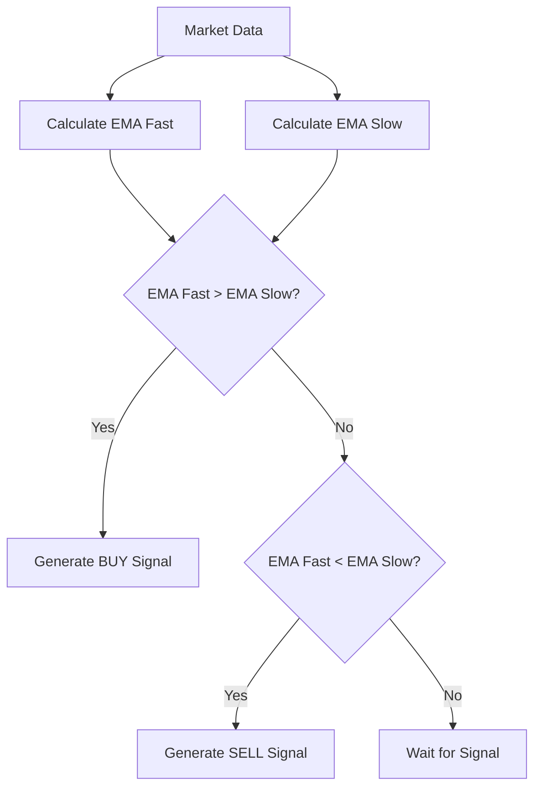
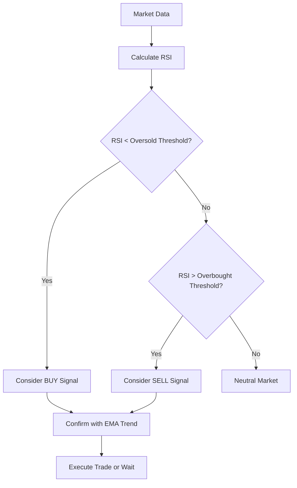
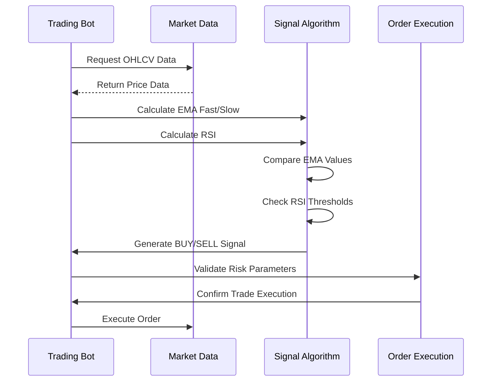

# Technical Indicators Configuration

<cite>
**Referenced Files in This Document**   
- [bot_config.py](file://app/models/bot_config.py)
- [bot_tasks.py](file://app/core/bot_tasks.py)
- [backtest_service.py](file://app/services/backtest_service.py)
- [bot_config.py](file://app/schemas/bot_config.py)
</cite>

## Table of Contents
1. [Introduction](#introduction)
2. [EMA Parameters](#ema-parameters)
3. [RSI Configuration](#rsi-configuration)
4. [Custom Indicator Parameters](#custom-indicator-parameters)
5. [Parameter Combinations for Market Conditions](#parameter-combinations-for-market-conditions)
6. [Algorithm Usage in Trading Logic](#algorithm-usage-in-trading-logic)
7. [Optimization and Backtesting Guidance](#optimization-and-backtesting-guidance)
8. [Validation Rules and Default Values](#validation-rules-and-default-values)

## Introduction
The BotConfig model contains technical indicator parameters that drive the trading algorithm's decision-making process. These parameters are used to identify market trends, generate buy/sell signals, and manage risk. The configuration includes standard EMA (Exponential Moving Average) and RSI (Relative Strength Index) parameters, as well as custom variants that allow for strategy-specific tuning. These values are utilized in the bot_tasks.py module to execute trading decisions based on market data analysis.

**Section sources**
- [bot_config.py](file://app/models/bot_config.py#L22-L27)
- [bot_config.py](file://app/models/bot_config.py#L34-L38)

## EMA Parameters
The EMA parameters in the BotConfig model consist of ema_fast, ema_slow, and ema_period. These parameters are used for trend identification by comparing two exponential moving averages of different periods. The ema_fast parameter represents the shorter period moving average that reacts more quickly to price changes, while ema_slow represents the longer period moving average that provides a smoother trend line. When the fast EMA crosses above the slow EMA, it generates a bullish signal, indicating a potential uptrend. Conversely, when the fast EMA crosses below the slow EMA, it generates a bearish signal, indicating a potential downtrend. The ema_period parameter, though present in the schema, appears to be less directly utilized in the current implementation compared to the fast and slow EMA values.

**Diagram sources**
- [bot_tasks.py](file://app/core/bot_tasks.py#L280-L290)
- [backtest_service.py](file://app/services/backtest_service.py#L356-L358)

**Section sources**
- [bot_config.py](file://app/models/bot_config.py#L22-L23)
- [bot_tasks.py](file://app/core/bot_tasks.py#L288-L289)

## RSI Configuration
The RSI configuration includes rsi_period, rsi_oversold, and rsi_overbought parameters that work together to identify overbought and oversold market conditions. The rsi_period determines the number of periods used to calculate the Relative Strength Index, with shorter periods making the indicator more sensitive to price changes. The rsi_oversold threshold (typically 30-40) indicates when an asset may be oversold and due for a potential upward correction, while the rsi_overbought threshold (typically 60-70) indicates when an asset may be overbought and due for a potential downward correction. In the trading algorithm, these thresholds are used to generate trading signals when combined with EMA crossovers, providing confirmation that momentum is aligning with the trend direction.

**Diagram sources**
- [bot_tasks.py](file://app/core/bot_tasks.py#L292-L307)
- [backtest_service.py](file://app/services/backtest_service.py#L360)

**Section sources**
- [bot_config.py](file://app/models/bot_config.py#L24-L26)
- [bot_tasks.py](file://app/core/bot_tasks.py#L313-L316)

## Custom Indicator Parameters
The BotConfig model includes custom indicator parameters such as custom_ema_fast, custom_ema_slow, custom_rsi_period, custom_rsi_oversold, and custom_rsi_overbought that enable strategy-specific tuning. These parameters allow users to override the standard indicator values with custom settings tailored to specific market conditions or trading strategies. The custom parameters have default values (8 for custom_ema_fast, 21 for custom_ema_slow, 7 for custom_rsi_period, 35 for custom_rsi_oversold, and 65 for custom_rsi_overbought) but can be adjusted to fine-tune the bot's sensitivity to market movements. In the trading algorithm, these custom parameters are prioritized over the standard ones when the "ema" strategy is selected, providing flexibility for advanced users to optimize their trading approach.

**Section sources**
- [bot_config.py](file://app/models/bot_config.py#L34-L38)
- [bot_tasks.py](file://app/core/bot_tasks.py#L253-L257)

## Parameter Combinations for Market Conditions
Effective parameter combinations vary based on market conditions. For trending markets, a combination of shorter EMA periods (e.g., custom_ema_fast=8, custom_ema_slow=21) with standard RSI thresholds (custom_rsi_oversold=35, custom_rsi_overbought=65) works well to capture momentum. In ranging markets, longer EMA periods (e.g., custom_ema_fast=13, custom_ema_slow=34) with tighter RSI thresholds (custom_rsi_oversold=30, custom_rsi_overbought=70) help avoid false signals during sideways price action. High-volatility markets may benefit from longer EMA periods and wider RSI bands to reduce noise, while low-volatility markets can use shorter periods for quicker signal generation. The backtesting service allows users to test these combinations across different market types (spot or futures) with leverage considerations.

**Section sources**
- [bot_config.py](file://app/models/bot_config.py#L34-L38)
- [backtest_service.py](file://app/services/backtest_service.py#L876-L886)

## Algorithm Usage in Trading Logic
The technical indicator values are used in the trading algorithm within bot_tasks.py to generate buy and sell signals. The algorithm first retrieves market data and calculates the EMA and RSI values based on the configured parameters. For the "ema" strategy, it uses the custom indicator parameters to determine trading signals: a BUY signal is generated when the fast EMA is greater than the slow EMA and the RSI is below the overbought threshold, while a SELL signal is generated when the fast EMA is less than the slow EMA and the RSI is above the oversold threshold. The algorithm also incorporates risk management parameters like stop_loss, take_profit, and trailing_stop to protect capital. These calculations are performed in real-time, with the bot checking for signals at intervals defined by check_interval_seconds.

**Diagram sources**
- [bot_tasks.py](file://app/core/bot_tasks.py#L251-L324)
- [bot_tasks.py](file://app/core/bot_tasks.py#L330-L339)

**Section sources**
- [bot_tasks.py](file://app/core/bot_tasks.py#L251-L324)
- [bot_tasks.py](file://app/core/bot_tasks.py#L330-L339)

## Optimization and Backtesting Guidance
Optimizing indicator settings should be done through systematic backtesting rather than manual adjustment. The backtest_service.py module provides functionality to test parameter combinations across historical data, calculating performance metrics like total return, win rate, maximum drawdown, Sharpe ratio, and profit factor. Users should test parameters across multiple market conditions and time periods to ensure robustness. It's crucial to avoid overfitting by testing on out-of-sample data and using walk-forward analysis. The backtesting service supports both spot and futures trading with leverage, allowing users to evaluate performance under different market regimes. Parameters should be optimized for consistency rather than maximum returns on a single dataset, and regular re-optimization is recommended as market conditions change.

**Section sources**
- [backtest_service.py](file://app/services/backtest_service.py#L829-L1018)
- [backtest_service.py](file://app/services/backtest_service.py#L1204-L1284)

## Validation Rules and Default Values
The BotConfig model enforces validation rules and provides default values for all technical indicator parameters. The standard EMA parameters (ema_fast, ema_slow) and RSI parameters (rsi_period, rsi_oversold, rsi_overbought) are required fields with no null values allowed. The custom indicator parameters have default values: custom_ema_fast defaults to 8, custom_ema_slow to 21, custom_rsi_period to 7, custom_rsi_oversold to 35, and custom_rsi_overbought to 65. These custom parameters are nullable, allowing users to fall back to standard values if not specified. The system validates that EMA fast is shorter than EMA slow and that RSI oversold is less than overbought, though these validations are primarily enforced through the default values and user interface constraints rather than explicit code-level validation.

**Section sources**
- [bot_config.py](file://app/models/bot_config.py#L34-L38)
- [bot_config.py](file://app/schemas/bot_config.py#L31-L35)