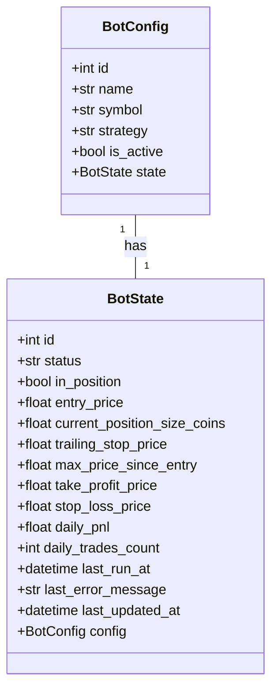
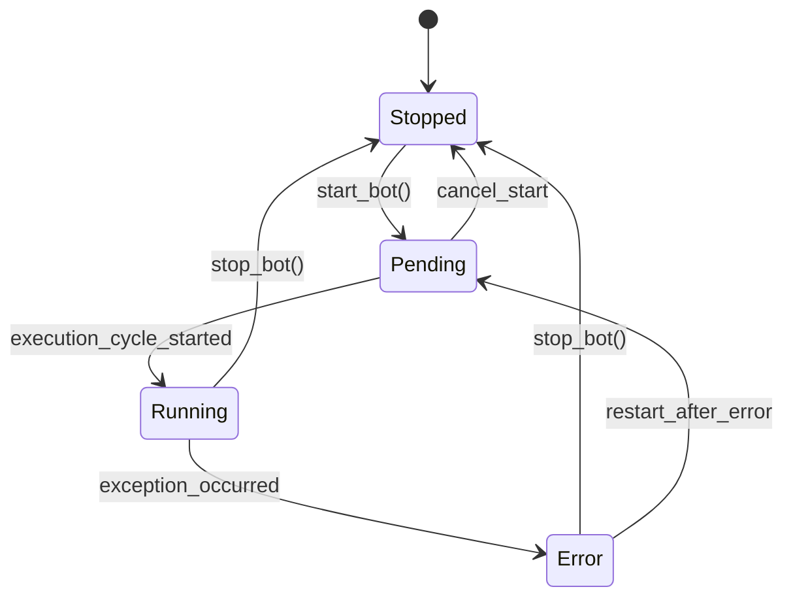
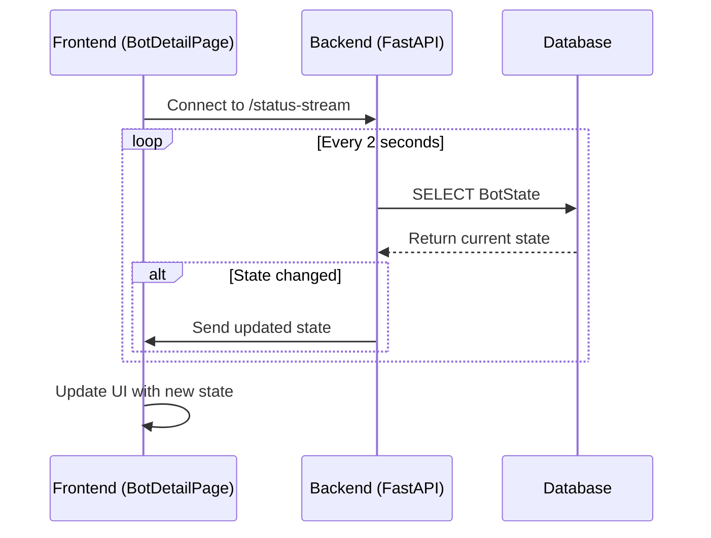
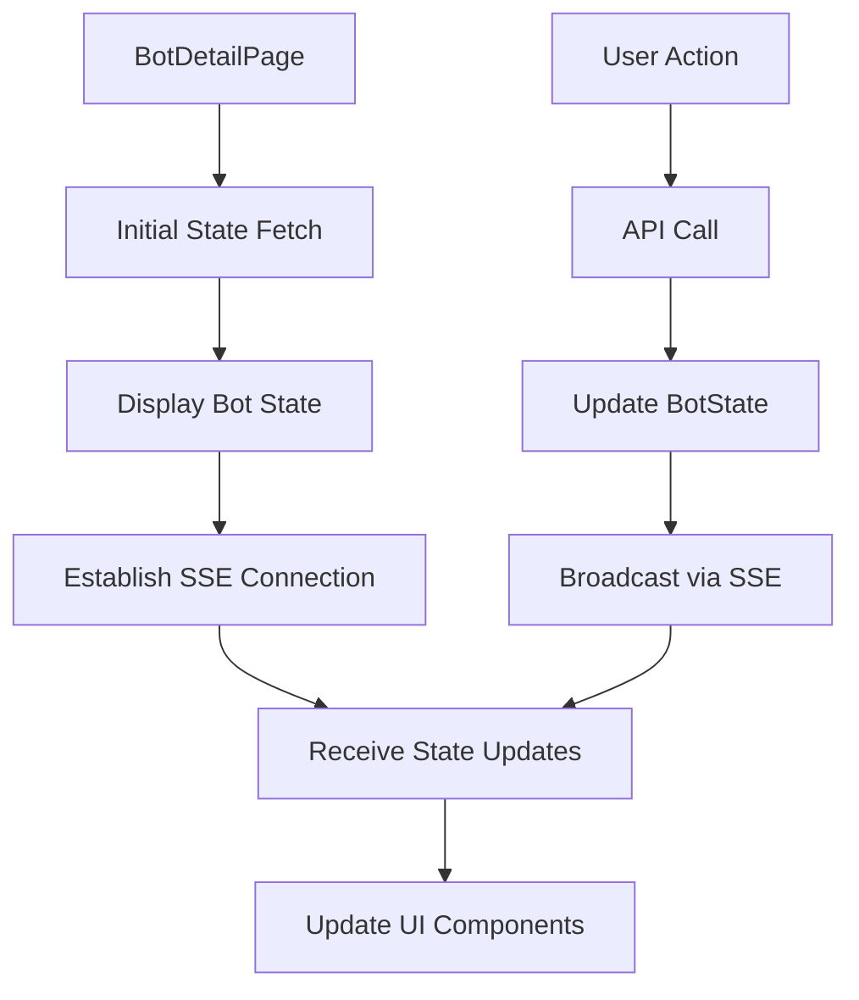

# Bot State Model

<cite>
**Referenced Files in This Document**   
- [bot_state.py](file://app/models/bot_state.py)
- [bot_state.py](file://app/schemas/bot_state.py)
- [bot_state.py](file://app/api/routes/bot_state.py)
- [main.py](file://app/main.py)
- [bot_runner.py](file://app/api/routes/bot_runner.py)
- [02_03_REALTIME_BOT_STATUS_MONITORING.md](file://docs/02_FEATURE_ENHANCEMENTS/02_03_REALTIME_BOT_STATUS_MONITORING.md)
- [BotDetailPage.jsx](file://frontend/src/pages/Bots/BotDetailPage.jsx)
</cite>

## Table of Contents
1. [Introduction](#introduction)
2. [Entity Overview](#entity-overview)
3. [Field Definitions](#field-definitions)
4. [Relationships](#relationships)
5. [State Transitions](#state-transitions)
6. [Real-time Monitoring](#real-time-monitoring)
7. [Performance Metrics](#performance-metrics)
8. [Error Handling](#error-handling)
9. [Concurrency Considerations](#concurrency-considerations)
10. [Frontend Integration](#frontend-integration)

## Introduction
The BotState model serves as the central repository for maintaining real-time operational state of active trading bots within the TradeBot application. This model captures the current execution status, position details, and performance metrics for each bot, enabling both the backend processing logic and frontend dashboard to maintain an accurate view of bot operations. The model is designed to support high-frequency updates during active trading while providing a reliable data source for monitoring and analysis.

**Section sources**
- [bot_state.py](file://app/models/bot_state.py#L4-L22)

## Entity Overview
The BotState entity represents the real-time operational state of a trading bot, with each record corresponding to a specific bot configuration. The model is implemented as a one-to-one relationship with the BotConfig model, using the bot configuration ID as both the foreign key and primary key. This design ensures that each bot configuration has exactly one state record, preventing data inconsistencies. The model tracks various aspects of bot operation including execution status, position details, risk management parameters, and performance metrics.

```mermaid
erDiagram
BOT_CONFIGS ||--o{ BOT_STATES : "has"
BOT_CONFIGS {
int id PK
string name
string symbol
string strategy
boolean is_active
}
BOT_STATES {
int id PK FK
string status
boolean in_position
numeric entry_price
numeric current_position_size_coins
numeric trailing_stop_price
numeric max_price_since_entry
numeric take_profit_price
numeric stop_loss_price
numeric daily_pnl
int daily_trades_count
datetime last_run_at
text last_error_message
datetime last_updated_at
}
```

**Diagram sources**
- [bot_state.py](file://app/models/bot_state.py#L4-L22)
- [bot_config.py](file://app/models/bot_config.py)

**Section sources**
- [bot_state.py](file://app/models/bot_state.py#L4-L22)

## Field Definitions
The BotState model contains comprehensive fields to track all aspects of bot operation:

- **id**: Integer, Primary Key, Foreign Key to bot_configs.id - The unique identifier that links the state to its corresponding bot configuration
- **status**: String, Default "stopped" - Current operational status of the bot (stopped, running, error, etc.)
- **in_position**: Boolean, Default False - Indicates whether the bot currently holds an open position
- **entry_price**: Numeric, Nullable - The price at which the current position was entered
- **current_position_size_coins**: Numeric, Nullable - The size of the current position in base currency units
- **trailing_stop_price**: Numeric, Nullable - The current trailing stop price level for risk management
- **max_price_since_entry**: Numeric, Nullable - The highest price reached since entering the current position
- **take_profit_price**: Numeric, Nullable - The price level at which to take profit
- **stop_loss_price**: Numeric, Nullable - The price level at which to stop loss
- **daily_pnl**: Numeric, Default 0.0 - The profit and loss for the current trading day
- **daily_trades_count**: Integer, Default 0 - The number of trades executed today
- **last_run_at**: DateTime, Nullable - Timestamp of the last strategy execution cycle
- **last_error_message**: Text, Nullable - Details of the most recent error encountered
- **last_updated_at**: DateTime with timezone, Server default and on update - Timestamp of the last state update

**Section sources**
- [bot_state.py](file://app/models/bot_state.py#L4-L22)

## Relationships
The BotState model maintains a one-to-one relationship with the BotConfig model through a foreign key constraint on the id field. This relationship is bidirectional, with the BotConfig model containing a state property that references the BotState, and the BotState model containing a config relationship that references the BotConfig. The uselist=False parameter in the relationship definition ensures that each BotConfig has exactly one BotState, enforcing the one-to-one nature of this relationship. This design allows for efficient joins when retrieving bot configuration and state together, while maintaining data integrity by preventing multiple state records for a single configuration.



**Diagram sources**
- [bot_state.py](file://app/models/bot_state.py#L4-L22)
- [bot_config.py](file://app/models/bot_config.py)

**Section sources**
- [bot_state.py](file://app/models/bot_state.py#L4-L22)

## State Transitions
The BotState model supports a state machine pattern for bot operation with three primary states: 'stopped', 'running', and 'error'. Transitions between these states are managed through the bot runner API endpoints. When a user starts a bot, the state transitions from 'stopped' to 'pending' and then to 'running' once the execution cycle begins. If an error occurs during execution, the state transitions to 'error' with the error details captured in the last_error_message field. The stop operation transitions the state from any active state back to 'stopped'. These state transitions are atomic operations within database transactions to ensure consistency, and are triggered by both user actions and automated processes.



**Diagram sources**
- [bot_runner.py](file://app/api/routes/bot_runner.py#L1-L55)
- [bot_state.py](file://app/models/bot_state.py#L4-L22)

**Section sources**
- [bot_runner.py](file://app/api/routes/bot_runner.py#L1-L55)

## Real-time Monitoring
The BotState model enables real-time monitoring of bot status through Server-Sent Events (SSE). The /api/v1/bots/{bot_config_id}/status-stream endpoint in the main application creates a persistent connection that pushes state updates to connected clients. This implementation uses a polling mechanism within an async generator that checks for state changes every 2 seconds, only sending updates when the payload has changed from the previous state. The streamed data includes essential fields such as status, in_position, entry_price, daily_pnl, daily_trades_count, and last_updated_at, providing a comprehensive view of bot operation without overwhelming the network with redundant data.



**Diagram sources**
- [main.py](file://app/main.py#L72-L92)
- [BotDetailPage.jsx](file://frontend/src/pages/Bots/BotDetailPage.jsx)

**Section sources**
- [main.py](file://app/main.py#L72-L92)

## Performance Metrics
The BotState model tracks daily performance metrics to provide insights into bot effectiveness and trading activity. The daily_pnl field accumulates profit and loss for the current trading day, resetting at midnight UTC, while the daily_trades_count field increments with each executed trade. These metrics are updated atomically within the same transaction as other state changes to ensure consistency. The model also tracks position-specific metrics such as entry_price, current_position_size_coins, and max_price_since_entry, which are essential for calculating unrealized P&L and determining optimal exit points. These performance metrics enable both real-time monitoring and historical analysis of bot performance.

**Section sources**
- [bot_state.py](file://app/models/bot_state.py#L4-L22)

## Error Handling
The BotState model includes comprehensive error handling capabilities through the last_error_message field, which stores detailed information about the most recent error encountered during bot execution. When an exception occurs in the bot execution cycle, the system captures the error message and updates the bot state to 'error' status. This information is then available through the API for both the frontend display and debugging purposes. The error handling process is designed to be resilient, ensuring that even if an error occurs during state update, the system attempts to log the error through alternative means such as logging services. This approach provides transparency into bot failures and supports troubleshooting and improvement of trading strategies.

**Section sources**
- [bot_state.py](file://app/models/bot_state.py#L4-L22)
- [bot_runner.py](file://app/api/routes/bot_runner.py#L1-L55)

## Concurrency Considerations
The BotState model is designed to handle concurrent updates during active trading through several mechanisms. The database schema includes proper indexing on the id field to ensure fast lookups and updates. The API endpoints use database transactions to ensure atomic updates, preventing race conditions when multiple processes attempt to modify the state simultaneously. The last_updated_at field with onupdate=func.now() ensures that timestamp updates are handled at the database level, reducing the risk of timestamp inconsistencies. Additionally, the application logic minimizes the duration of database transactions by performing calculations and validations before initiating the transaction, reducing lock contention during high-frequency trading operations.

**Section sources**
- [bot_state.py](file://app/models/bot_state.py#L4-L22)
- [bot_runner.py](file://app/api/routes/bot_runner.py#L1-L55)

## Frontend Integration
The BotState model is integrated into the frontend through the BotDetailPage component, which displays the current state of a trading bot in real-time. The component fetches the initial state through the bot-states API endpoint and establishes an SSE connection to receive live updates. The UI presents state information in a user-friendly format, using color-coded indicators for status, formatted currency values for financial metrics, and appropriate icons for different data types. The component also handles state transitions by providing start/stop buttons that trigger the corresponding API endpoints, creating a seamless interaction between the user interface and the underlying state model.



**Diagram sources**
- [BotDetailPage.jsx](file://frontend/src/pages/Bots/BotDetailPage.jsx)
- [main.py](file://app/main.py#L72-L92)

**Section sources**
- [BotDetailPage.jsx](file://frontend/src/pages/Bots/BotDetailPage.jsx)