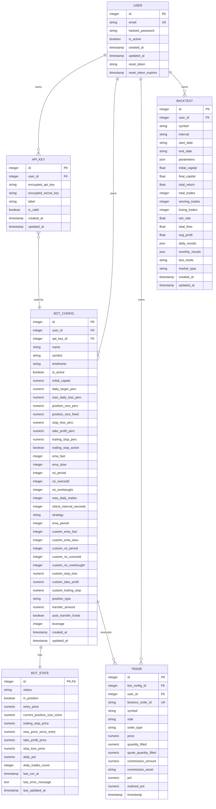
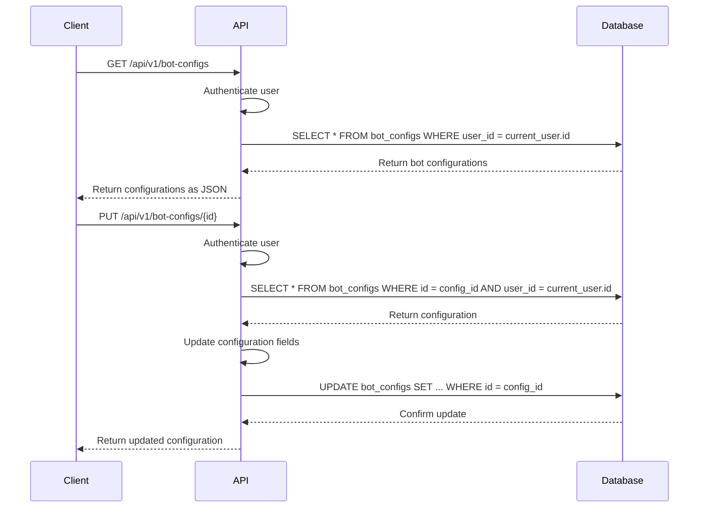
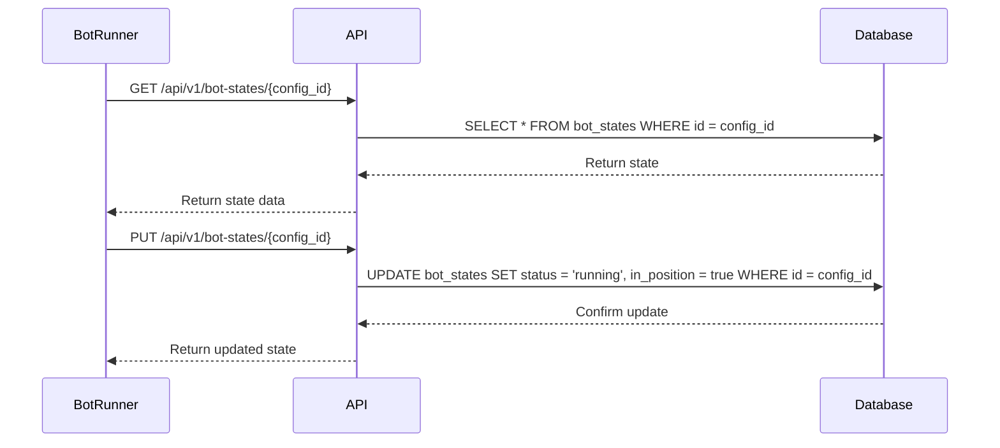
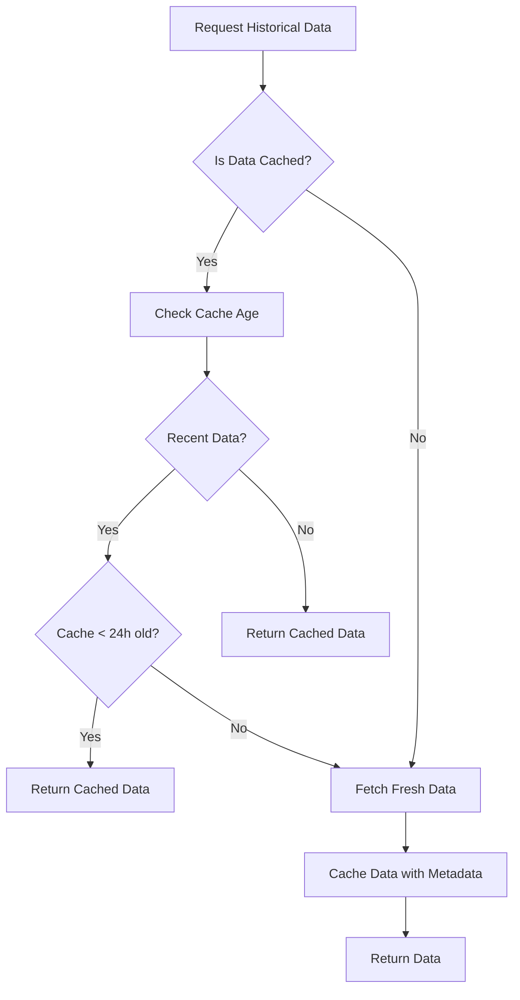
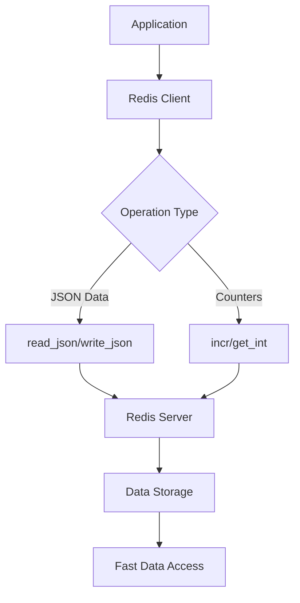

# Database Schema Design

<cite>
**Referenced Files in This Document**   
- [user.py](file://app/models/user.py)
- [api_key.py](file://app/models/api_key.py)
- [bot_config.py](file://app/models/bot_config.py)
- [bot_state.py](file://app/models/bot_state.py)
- [trade.py](file://app/models/trade.py)
- [backtest.py](file://app/models/backtest.py)
- [database.py](file://app/database.py)
- [cache.py](file://app/core/cache.py)
- [redis_client.py](file://app/core/redis_client.py)
- [bot_config.py](file://app/api/routes/bot_config.py)
- [bot_state.py](file://app/api/routes/bot_state.py)
</cite>

## Table of Contents
1. [Introduction](#introduction)
2. [Core Data Models](#core-data-models)
3. [Entity Relationship Diagram](#entity-relationship-diagram)
4. [Data Access Patterns](#data-access-patterns)
5. [Caching Strategy](#caching-strategy)
6. [Performance Considerations](#performance-considerations)
7. [Data Lifecycle and Retention](#data-lifecycle-and-retention)
8. [Schema Evolution and Migrations](#schema-evolution-and-migrations)
9. [Sample Data](#sample-data)

## Introduction
This document provides comprehensive documentation for the TradeBot database schema, detailing the core models that power the trading automation system. The schema is designed to support cryptocurrency trading bots with features including automated trading, backtesting, state management, and secure API key storage. The database design follows relational principles with proper normalization, foreign key constraints, and indexing strategies to ensure data integrity and query performance. The models are implemented using SQLAlchemy ORM with PostgreSQL as the primary database backend, supporting asynchronous operations for high-concurrency scenarios.

## Core Data Models

### User Model
The User model represents registered users of the TradeBot application, storing authentication and profile information.

**Fields:**
- `id`: Primary key, auto-incrementing integer
- `email`: Unique email address, indexed for fast lookups
- `hashed_password`: Securely hashed password using industry-standard algorithms
- `is_active`: Boolean flag indicating account status
- `created_at`: Timestamp of account creation with timezone
- `updated_at`: Timestamp of last update with timezone and auto-update trigger
- `reset_token`: Temporary token for password reset functionality
- `reset_token_expires`: Expiration timestamp for password reset token

The User model serves as the central entity in the system, establishing relationships with all user-owned resources including API keys, bot configurations, trades, and backtests.

**Section sources**
- [user.py](file://app/models/user.py#L5-L24)

### ApiKey Model
The ApiKey model securely stores cryptocurrency exchange API credentials for users, enabling the bot to interact with exchanges like Binance.

**Fields:**
- `id`: Primary key, auto-incrementing integer
- `user_id`: Foreign key referencing User.id, indexed for performance
- `encrypted_api_key`: Encrypted API key string
- `encrypted_secret_key`: Encrypted secret key string
- `label`: Optional descriptive label for the API key
- `is_valid`: Boolean flag indicating key validity status
- `created_at`: Creation timestamp with timezone
- `updated_at`: Last update timestamp with timezone and auto-update trigger

The model implements encryption at rest for sensitive API credentials and establishes a relationship with the User model to enforce ownership and access control.

**Section sources**
- [api_key.py](file://app/models/api_key.py#L5-L18)

### BotConfig Model
The BotConfig model defines the configuration parameters for trading bots, including strategy settings, risk management rules, and execution parameters.

**Fields:**
- `id`: Primary key, auto-incrementing integer
- `user_id`: Foreign key referencing User.id, indexed
- `name`: Descriptive name for the bot configuration
- `symbol`: Trading pair symbol (e.g., BTCUSDT)
- `timeframe`: Candlestick timeframe for analysis
- `is_active`: Boolean flag indicating if the bot is enabled
- `initial_capital`: Starting capital for the bot
- `daily_target_perc`: Daily profit target percentage
- `max_daily_loss_perc`: Maximum daily loss threshold
- `position_size_perc`: Position size as percentage of capital
- `position_size_fixed`: Fixed position size in quote currency
- `stop_loss_perc`: Stop loss percentage
- `take_profit_perc`: Take profit percentage
- `trailing_stop_perc`: Trailing stop percentage
- `trailing_stop_active`: Boolean flag for trailing stop activation
- `ema_fast`: Fast EMA period
- `ema_slow`: Slow EMA period
- `rsi_period`: RSI calculation period
- `rsi_oversold`: RSI oversold threshold
- `rsi_overbought`: RSI overbought threshold
- `max_daily_trades`: Maximum number of trades per day
- `check_interval_seconds`: Frequency of market checks
- `api_key_id`: Foreign key referencing ApiKey.id
- `strategy`: Strategy name identifier
- `ema_period`: EMA calculation period
- `custom_ema_fast`: Custom fast EMA period
- `custom_ema_slow`: Custom slow EMA period
- `custom_rsi_period`: Custom RSI period
- `custom_rsi_oversold`: Custom RSI oversold level
- `custom_rsi_overbought`: Custom RSI overbought level
- `custom_stop_loss`: Custom stop loss percentage
- `custom_take_profit`: Custom take profit percentage
- `custom_trailing_stop`: Custom trailing stop percentage
- `position_type`: Position type ("spot" or "futures")
- `transfer_amount`: Amount to transfer between accounts
- `auto_transfer_funds`: Boolean flag for automatic fund transfers
- `leverage`: Leverage multiplier for futures trading
- `created_at`: Creation timestamp with timezone
- `updated_at`: Last update timestamp with timezone and auto-update trigger

The BotConfig model supports both basic and advanced trading strategies with customizable parameters and establishes relationships with User, ApiKey, BotState, and Trade models.

**Section sources**
- [bot_config.py](file://app/models/bot_config.py#L5-L59)

### BotState Model
The BotState model tracks the real-time operational state of active trading bots, enabling persistence across application restarts.

**Fields:**
- `id`: Primary key with foreign key constraint to BotConfig.id
- `status`: Current status ("stopped", "running", "paused", etc.)
- `in_position`: Boolean flag indicating if the bot holds a position
- `entry_price`: Entry price of the current position
- `current_position_size_coins`: Size of current position in base currency
- `trailing_stop_price`: Current trailing stop price level
- `max_price_since_entry`: Highest price reached since position entry
- `take_profit_price`: Current take profit price level
- `stop_loss_price`: Current stop loss price level
- `daily_pnl`: Daily profit and loss amount
- `daily_trades_count`: Count of trades executed today
- `last_run_at`: Timestamp of last bot execution
- `last_error_message`: Error message from last failed execution
- `last_updated_at`: Timestamp of last state update with auto-update trigger

The BotState model uses a one-to-one relationship with BotConfig (via shared primary key) to ensure each bot configuration has exactly one state record, enabling efficient state management and recovery.

**Section sources**
- [bot_state.py](file://app/models/bot_state.py#L5-L24)

### Trade Model
The Trade model records individual trade executions performed by trading bots, providing a complete audit trail of trading activity.

**Fields:**
- `id`: Primary key, auto-incrementing integer
- `bot_config_id`: Foreign key referencing BotConfig.id, indexed
- `user_id`: Foreign key referencing User.id, indexed
- `binance_order_id`: Exchange-specific order identifier
- `symbol`: Trading pair symbol
- `side`: Trade direction ("BUY" or "SELL")
- `order_type`: Order type ("MARKET", "LIMIT", etc.)
- `price`: Execution price
- `quantity_filled`: Quantity of base currency filled
- `quote_quantity_filled`: Quantity of quote currency filled
- `commission_amount`: Commission amount paid
- `commission_asset`: Commission asset (e.g., BNB, USDT)
- `pnl`: Profit and loss from the trade
- `realized_pnl`: Realized profit and loss amount
- `timestamp`: Trade execution timestamp

The Trade model establishes relationships with both BotConfig and User models, enabling comprehensive trade history analysis and reporting by both bot and user dimensions.

**Section sources**
- [trade.py](file://app/models/trade.py#L5-L27)

### Backtest Model
The Backtest model stores the results and parameters of historical backtesting simulations, enabling performance evaluation of trading strategies.

**Fields:**
- `id`: Primary key, auto-incrementing integer
- `user_id`: Foreign key referencing User.id, indexed
- `symbol`: Trading pair symbol used in backtest
- `interval`: Candlestick interval used in backtest
- `start_date`: Backtest start date (string format)
- `end_date`: Backtest end date (string format)
- `parameters`: JSON field storing strategy parameters
- `initial_capital`: Starting capital for the simulation
- `final_capital`: Ending capital after the simulation
- `total_return`: Total return percentage
- `total_trades`: Total number of trades executed
- `winning_trades`: Number of profitable trades
- `losing_trades`: Number of losing trades
- `win_rate`: Win rate percentage
- `total_fees`: Total fees paid during simulation
- `avg_profit`: Average profit per winning trade
- `daily_results`: JSON field storing daily performance data
- `monthly_results`: JSON field storing monthly performance data
- `test_mode`: Test mode indicator ("true" or "false")
- `market_type`: Market type ("spot" or "futures")
- `created_at`: Creation timestamp with timezone
- `updated_at`: Last update timestamp with timezone and auto-update trigger

The Backtest model uses JSON fields to store flexible parameter and results data, accommodating various strategy types and analysis requirements.

**Section sources**
- [backtest.py](file://app/models/backtest.py#L5-L44)

## Entity Relationship Diagram



**Diagram sources**
- [user.py](file://app/models/user.py#L5-L24)
- [api_key.py](file://app/models/api_key.py#L5-L18)
- [bot_config.py](file://app/models/bot_config.py#L5-L59)
- [bot_state.py](file://app/models/bot_state.py#L5-L24)
- [trade.py](file://app/models/trade.py#L5-L27)
- [backtest.py](file://app/models/backtest.py#L5-L44)

## Data Access Patterns

### Bot Configuration Retrieval and Update
Bot configurations are retrieved and updated through REST API endpoints that enforce user ownership and authentication. When retrieving bot configurations, the system performs a database query filtered by the authenticated user's ID to ensure data isolation between users.



**Diagram sources**
- [bot_config.py](file://app/api/routes/bot_config.py#L11-L54)

### Bot State Management
Bot state is managed through dedicated API endpoints that allow bots to report their current status and retrieve their state. The system uses the bot configuration ID as the primary key for state records, ensuring a direct mapping between configurations and their states.



**Diagram sources**
- [bot_state.py](file://app/api/routes/bot_state.py#L12-L31)

## Caching Strategy
The TradeBot system implements a multi-layer caching strategy using both file-based caching for historical data and Redis for real-time state management.

### File-Based Data Caching
Historical market data used for backtesting is cached in CSV files with metadata to avoid repeated API calls to cryptocurrency exchanges. The caching system uses a hash-based key generation strategy and implements time-based expiration rules.



**Section sources**
- [cache.py](file://app/core/cache.py#L8-L192)

### Redis State Caching
Redis is used to cache frequently accessed data and provide real-time state updates for trading bots. The system uses Redis JSON operations to store structured data and implements counters for monitoring cache performance.



**Section sources**
- [redis_client.py](file://app/core/redis_client.py#L18-L129)

## Performance Considerations

### Trade History Queries
Queries on trade history data are optimized through strategic indexing on frequently queried fields. The system creates composite indexes on bot_config_id and timestamp to support efficient date-range queries for specific bots.

For large trade datasets, the system implements pagination in API responses to prevent memory exhaustion and ensure responsive user interfaces. Aggregation queries for performance metrics are optimized using database-level GROUP BY operations rather than in-memory processing.

### Bot State Data Access
Bot state data is optimized for high-frequency read/write operations since trading bots may update their state multiple times per minute. The one-to-one relationship between BotConfig and BotState ensures that state queries are highly efficient, typically requiring only a single index lookup.

Real-time state streaming is implemented using server-sent events (SSE) to push state updates to clients without requiring constant polling, reducing database load and providing immediate feedback on bot operations.

**Section sources**
- [database.py](file://app/database.py#L1-L24)
- [bot_state.py](file://app/models/bot_state.py#L5-L24)

## Data Lifecycle and Retention

### Trade Record Retention
Trade records are retained indefinitely by default to maintain a complete audit trail of all trading activity. Users can manually delete bot configurations, which triggers cascading deletion of associated trade records through the database relationship configuration.

For systems with storage constraints, a data retention policy can be implemented to automatically archive or delete trade records older than a specified period (e.g., 2 years) while preserving aggregated performance metrics.

### Data Archival
Historical backtest results and trade data can be archived to cold storage for compliance and backup purposes. The JSON fields in the Backtest model facilitate easy serialization and export of complete backtest results for archival.

The system's use of standardized data types and clear schema design enables straightforward data migration and export operations for regulatory compliance or user data portability requirements.

## Schema Evolution and Migrations
The TradeBot system uses Alembic for database schema migrations, enabling version-controlled evolution of the database schema across deployments.

Migration scripts are stored in the alembic/versions directory and are executed in sequence based on their revision identifiers. Each migration includes both upgrade and downgrade functions to support reversible schema changes.

Key schema changes documented in migration scripts include:
- Addition of leverage column to bot_configs for futures trading support
- Creation of bot_config table with comprehensive trading parameters
- Creation of user table with authentication fields
- Creation of api_key table for secure credential storage
- Creation of trade table for recording executed trades
- Addition of realized_pnl to trade model for accurate profit calculation
- Addition of market_type to backtests for spot/futures differentiation

The migration system ensures that schema changes are applied consistently across development, staging, and production environments while preserving existing data integrity.

**Section sources**
- [alembic/versions/](file://alembic/versions/)

## Sample Data

### User Record
```json
{
  "id": 1,
  "email": "user@example.com",
  "is_active": true,
  "created_at": "2024-01-15T10:30:00+00:00",
  "updated_at": "2024-01-15T10:30:00+00:00"
}
```

### ApiKey Record
```json
{
  "id": 1,
  "user_id": 1,
  "label": "Binance Primary",
  "is_valid": true,
  "created_at": "2024-01-15T10:30:00+00:00",
  "updated_at": "2024-01-15T10:30:00+00:00"
}
```

### BotConfig Record
```json
{
  "id": 1,
  "user_id": 1,
  "name": "BTC Trend Follower",
  "symbol": "BTCUSDT",
  "timeframe": "1h",
  "is_active": true,
  "stop_loss_perc": 2.0,
  "take_profit_perc": 5.0,
  "ema_fast": 9,
  "ema_slow": 21,
  "rsi_period": 14,
  "position_type": "spot",
  "created_at": "2024-01-15T10:30:00+00:00",
  "updated_at": "2024-01-15T10:30:00+00:00"
}
```

### BotState Record
```json
{
  "id": 1,
  "status": "running",
  "in_position": true,
  "entry_price": 43250.50,
  "current_position_size_coins": 0.025,
  "daily_pnl": 125.75,
  "daily_trades_count": 3,
  "last_updated_at": "2024-01-15T14:45:30+00:00"
}
```

### Trade Record
```json
{
  "id": 1,
  "bot_config_id": 1,
  "user_id": 1,
  "symbol": "BTCUSDT",
  "side": "BUY",
  "order_type": "MARKET",
  "price": 43250.50,
  "quantity_filled": 0.025,
  "quote_quantity_filled": 1081.26,
  "realized_pnl": null,
  "timestamp": "2024-01-15T14:45:30"
}
```

### Backtest Record
```json
{
  "id": 1,
  "user_id": 1,
  "symbol": "BTCUSDT",
  "interval": "1h",
  "start_date": "2023-01-01",
  "end_date": "2023-12-31",
  "parameters": {
    "strategy": "ema_crossover",
    "fast_ema": 9,
    "slow_ema": 21
  },
  "initial_capital": 10000.0,
  "final_capital": 18567.34,
  "total_return": 85.67,
  "total_trades": 142,
  "win_rate": 63.38,
  "market_type": "spot",
  "created_at": "2024-01-15T11:20:15+00:00"
}
```