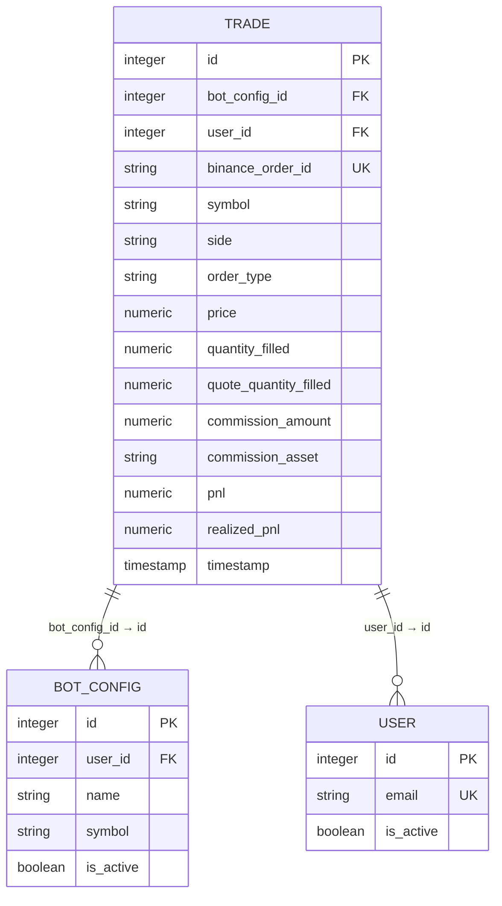
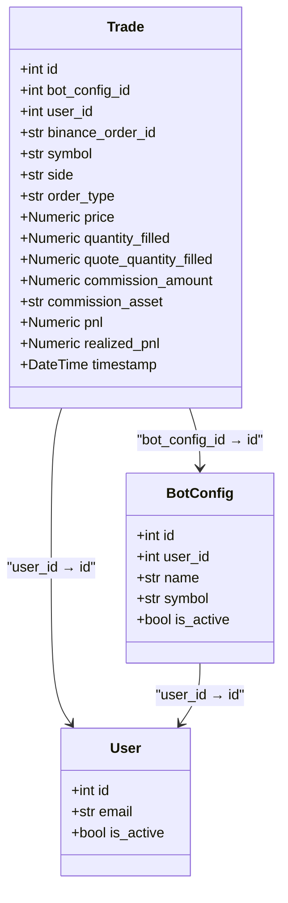
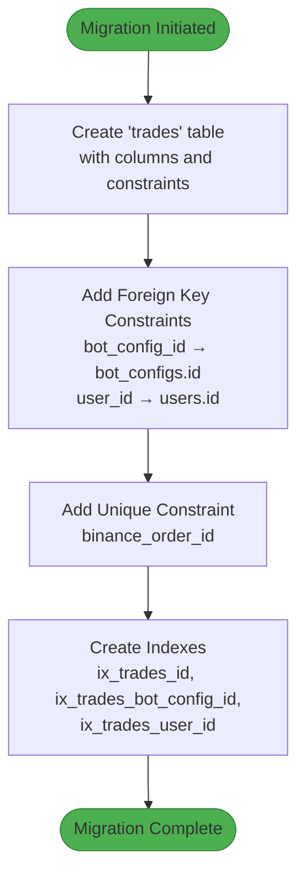

# Trade Model

<cite>
**Referenced Files in This Document**   
- [trade.py](file://app/models/trade.py)
- [bot_config.py](file://app/models/bot_config.py)
- [user.py](file://app/models/user.py)
- [7354d6bd11ea_create_trade_table.py](file://alembic/versions/7354d6bd11ea_create_trade_table.py)
- [92c67f02186c_add_realized_pnl_to_trade.py](file://alembic/versions/92c67f02186c_add_realized_pnl_to_trade.py)
- [trade.py](file://app/schemas/trade.py)
- [trade.py](file://app/api/routes/trade.py)
- [bot_report.py](file://app/api/routes/bot_report.py)
</cite>

## Table of Contents
1. [Introduction](#introduction)
2. [Entity Overview](#entity-overview)
3. [Field Definitions](#field-definitions)
4. [Relationships and Constraints](#relationships-and-constraints)
5. [PnL Field Differentiation](#pnl-field-differentiation)
6. [Database Schema and Migration](#database-schema-and-migration)
7. [Query Patterns](#query-patterns)
8. [Indexing and Performance](#indexing-and-performance)
9. [Data Retention Considerations](#data-retention-considerations)

## Introduction
The Trade model in the TradeBot application serves as the central entity for recording all executed trades across user-configured trading bots. It is designed to support auditing, performance analysis, and reporting by capturing comprehensive trade execution data from the Binance exchange. Each trade record is associated with a specific bot configuration and user, enabling secure, multi-tenant access to trading history. The model includes financial metrics such as profit and loss (PnL), commission details, and timestamps to facilitate accurate backtesting and performance evaluation.

**Section sources**
- [trade.py](file://app/models/trade.py#L4-L26)

## Entity Overview
The Trade model represents a single executed trade event in the trading system. It captures essential execution details including price, quantity, order type, and side (buy/sell), along with metadata such as the Binance order ID and timestamp. The model is structured to ensure data integrity through foreign key relationships with the BotConfig and User models, and includes a unique constraint on the binance_order_id field to prevent duplicate trade entries. Designed for time-series analysis, the model supports efficient querying by user, bot, and time range, making it suitable for generating performance reports and validating backtesting results.

**Diagram sources**
- [trade.py](file://app/models/trade.py#L4-L26)
- [bot_config.py](file://app/models/bot_config.py#L5-L59)
- [user.py](file://app/models/user.py#L5-L24)

**Section sources**
- [trade.py](file://app/models/trade.py#L4-L26)

## Field Definitions
The Trade model contains the following fields, each serving a specific purpose in trade recording and analysis:

| Field Name | Data Type | Nullable | Constraints | Description |
|------------|-----------|----------|-------------|-------------|
| id | Integer | False | Primary Key, Index | Unique identifier for the trade record |
| bot_config_id | Integer | False | Foreign Key (bot_configs.id), Index | References the BotConfig that executed the trade |
| user_id | Integer | False | Foreign Key (users.id), Index | References the User who owns the bot |
| binance_order_id | String | True | Unique | Binance exchange order ID for deduplication |
| symbol | String | False | None | Trading pair symbol (e.g., BTC/USDT) |
| side | String | False | None | Trade direction: BUY or SELL |
| order_type | String | False | None | Order type (e.g., MARKET, LIMIT) |
| price | Numeric | False | None | Execution price of the trade |
| quantity_filled | Numeric | False | None | Base asset quantity filled |
| quote_quantity_filled | Numeric | False | None | Quote asset quantity filled |
| commission_amount | Numeric | True | None | Commission paid for the trade |
| commission_asset | String | True | None | Asset in which commission was paid |
| pnl | Numeric | True | None | Unrealized profit and loss |
| realized_pnl | Numeric | True | None | Realized profit and loss after closing position |
| timestamp | DateTime | False | Server Default (now) | Time when the trade was recorded |

**Section sources**
- [trade.py](file://app/models/trade.py#L7-L23)

## Relationships and Constraints
The Trade model establishes critical relationships with other entities in the system through foreign key constraints. It references the BotConfig model via the bot_config_id field, creating a one-to-many relationship where each bot configuration can have multiple associated trades. Similarly, the user_id field creates a relationship with the User model, ensuring all trades are tied to a specific user account. Both relationships are configured with cascade delete behavior, meaning that when a bot configuration or user is deleted, all associated trades are automatically removed from the database. This ensures data consistency and prevents orphaned records. Additionally, the binance_order_id field has a unique constraint to prevent duplicate trade entries from the exchange API.

**Diagram sources**
- [trade.py](file://app/models/trade.py#L8-L10)
- [bot_config.py](file://app/models/bot_config.py#L57-L58)
- [user.py](file://app/models/user.py#L22-L23)

**Section sources**
- [trade.py](file://app/models/trade.py#L8-L10)
- [bot_config.py](file://app/models/bot_config.py#L57-L58)
- [user.py](file://app/models/user.py#L22-L23)

## PnL Field Differentiation
The Trade model includes two distinct profit and loss (PnL) fields to accurately capture different aspects of trading performance. The `pnl` field represents unrealized PnL, which reflects the current profit or loss of an open position based on market prices. This value can fluctuate over time as market conditions change. In contrast, the `realized_pnl` field captures the actual profit or loss that has been locked in when a position is closed. This field is populated only when a trade completes a position (e.g., selling a previously bought asset), providing a definitive measure of trading performance. The distinction between these fields enables accurate performance tracking, allowing users to differentiate between paper gains and actual realized profits.

**Section sources**
- [trade.py](file://app/models/trade.py#L20-L21)
- [92c67f02186c_add_realized_pnl_to_trade.py](file://alembic/versions/92c67f02186c_add_realized_pnl_to_trade.py#L1-L33)

## Database Schema and Migration
The Trade table was created through Alembic migration `7354d6bd11ea_create_trade_table.py`, which defines the complete schema including all columns, constraints, and indexes. The migration establishes the primary key on the id column, foreign key constraints on bot_config_id and user_id, and a unique constraint on binance_order_id. Indexes are created on id, bot_config_id, and user_id to optimize query performance. A subsequent migration `92c67f02186c_add_realized_pnl_to_trade.py` added the realized_pnl column to support more accurate performance reporting. The table uses PostgreSQL's numeric type for financial values to ensure precision in calculations, and the timestamp field defaults to the current server time upon record creation.

**Diagram sources**
- [7354d6bd11ea_create_trade_table.py](file://alembic/versions/7354d6bd11ea_create_trade_table.py#L24-L47)
- [92c67f02186c_add_realized_pnl_to_trade.py](file://alembic/versions/92c67f02186c_add_realized_pnl_to_trade.py#L24)

**Section sources**
- [7354d6bd11ea_create_trade_table.py](file://alembic/versions/7354d6bd11ea_create_trade_table.py#L24-L47)
- [92c67f02186c_add_realized_pnl_to_trade.py](file://alembic/versions/92c67f02186c_add_realized_pnl_to_trade.py#L24)

## Query Patterns
Common query patterns for the Trade model focus on retrieving trade history, calculating performance metrics, and validating backtesting results. The most frequent queries filter trades by user_id and bot_config_id to retrieve a specific bot's trading history. Time-range queries using the timestamp field are essential for performance analysis over specific periods. The API endpoint `/api/v1/trades/{trade_id}` retrieves individual trade details with user ownership verification, while `/api/v1/trades/` returns all trades for the authenticated user. The bot_report endpoint queries trades by bot_config_id with optional filters for side, date range, and status, supporting detailed performance reporting. These patterns enable comprehensive analysis of trading behavior and strategy effectiveness.

**Section sources**
- [trade.py](file://app/api/routes/trade.py#L1-L34)
- [bot_report.py](file://app/api/routes/bot_report.py#L27-L59)

## Indexing and Performance
The Trade model employs strategic indexing to optimize query performance for time-series analysis and reporting. Three database indexes are defined: on the id column for primary key lookups, on bot_config_id for retrieving trades by bot, and on user_id for filtering by user. These indexes accelerate common query patterns used in trade history retrieval and performance calculation. The numeric fields (price, quantity_filled, etc.) are stored as PostgreSQL Numeric type to maintain precision in financial calculations, while string fields use variable-length character types appropriate for their content. The combination of indexing and appropriate data typing ensures efficient data retrieval even as the trade volume grows over time, supporting responsive user interfaces and timely report generation.

**Section sources**
- [7354d6bd11ea_create_trade_table.py](file://alembic/versions/7354d6bd11ea_create_trade_table.py#L44-L46)
- [trade.py](file://app/models/trade.py#L7-L8)

## Data Retention Considerations
The Trade model is designed to support long-term data retention for auditing and performance analysis purposes. Trade records are retained indefinitely by default, as they represent critical financial data for users. The cascade delete behavior ensures that when a user or bot configuration is deleted, all associated trades are removed, maintaining data privacy and compliance. For large-scale deployments, data retention policies could be implemented at the application level to archive older trade data while preserving audit trails. The unique constraint on binance_order_id prevents duplicate entries that could skew performance metrics, ensuring data integrity over time. Regular database maintenance and archiving strategies should be considered for production environments with high trade volumes to maintain optimal query performance.

**Section sources**
- [trade.py](file://app/models/trade.py#L10)
- [bot_config.py](file://app/models/bot_config.py#L57)
- [user.py](file://app/models/user.py#L22)