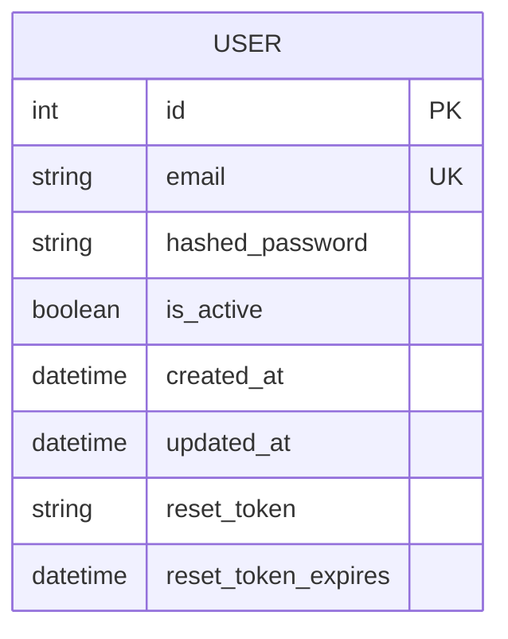
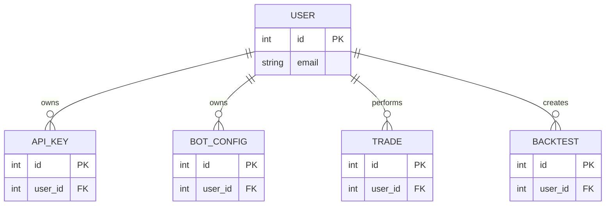
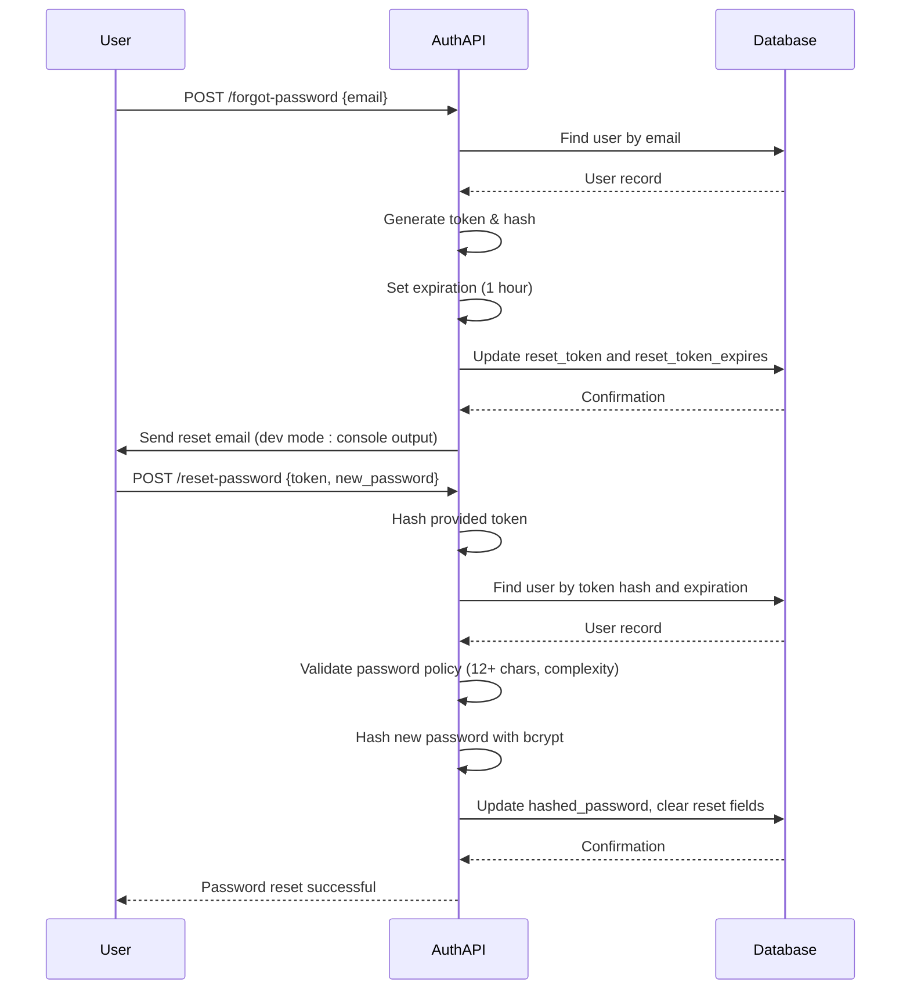

# User Model

<cite>
**Referenced Files in This Document**   
- [user.py](file://app/models/user.py)
- [auth.py](file://app/api/routes/auth.py)
- [user.py](file://app/schemas/user.py)
- [security.py](file://app/core/security.py)
- [jwt.py](file://app/core/jwt.py)
- [auth.py](file://app/dependencies/auth.py)
- [rate_limit.py](file://app/core/rate_limit.py)
- [create_user_table.py](file://alembic/versions/30d6391a9fcf_create_user_table.py)
- [add_reset_token_fields_to_users.py](file://alembic/versions/d24f9f7e7532_add_reset_token_fields_to_users.py)
</cite>

## Table of Contents
1. [Introduction](#introduction)
2. [Entity Overview](#entity-overview)
3. [Field Definitions](#field-definitions)
4. [Constraints and Indexes](#constraints-and-indexes)
5. [Relationship Mappings](#relationship-mappings)
6. [Password Reset Functionality](#password-reset-functionality)
7. [Authentication Integration](#authentication-integration)
8. [Rate Limiting Integration](#rate-limiting-integration)
9. [Common Queries](#common-queries)
10. [Security Considerations](#security-considerations)

## Introduction
The User model serves as the core identity and authentication unit for the TradeBot application. It represents system users who can authenticate, manage trading bots, and access trading functionality. This document provides comprehensive documentation of the User model's structure, relationships, and integration with authentication and security systems.

## Entity Overview
The User model is the central identity entity in the TradeBot application, responsible for storing user credentials and managing authentication state. It serves as the foundation for all user-related operations including login, registration, password management, and authorization.

**Section sources**
- [user.py](file://app/models/user.py#L5-L23)

## Field Definitions
The User model contains the following fields with their respective data types, constraints, and business rules:

- **id**: Integer, primary key, auto-incrementing identifier for the user
- **email**: String, unique identifier for the user, used for login and communication
- **hashed_password**: String, bcrypt-hashed password for secure authentication
- **is_active**: Boolean, indicates whether the user account is active (default: true)
- **created_at**: DateTime with timezone, timestamp when the user was created
- **updated_at**: DateTime with timezone, automatically updated timestamp on any modification
- **reset_token**: String, nullable field storing SHA-256 hash of password reset token
- **reset_token_expires**: DateTime with timezone, nullable field indicating expiration time for reset token

**Section sources**
- [user.py](file://app/models/user.py#L7-L17)

## Constraints and Indexes
The User model implements several constraints to ensure data integrity:

- **Primary Key Constraint**: The `id` field serves as the primary key, ensuring each user has a unique identifier
- **Unique Constraint**: The `email` field has a unique constraint to prevent duplicate accounts
- **Indexing**: Both `id` and `email` fields are indexed for optimal query performance
- **Not Null Constraints**: `email` and `hashed_password` fields are required and cannot be null
- **Default Values**: `is_active` defaults to true, `created_at` and `updated_at` use database server defaults

**Diagram sources**
- [create_user_table.py](file://alembic/versions/30d6391a9fcf_create_user_table.py#L25-L32)
- [add_reset_token_fields_to_users.py](file://alembic/versions/d24f9f7e7532_add_reset_token_fields_to_users.py#L20-L23)

## Relationship Mappings
The User model establishes relationships with other core entities in the system, implementing cascade delete behavior to maintain referential integrity:

- **ApiKey**: One-to-many relationship where a user can have multiple API keys, with cascade delete orphan behavior
- **BotConfig**: One-to-many relationship where a user owns multiple bot configurations, with cascade delete orphan behavior
- **Trade**: One-to-many relationship where a user is associated with multiple trades, with cascade delete orphan behavior
- **Backtest**: One-to-many relationship where a user owns multiple backtests, with cascade delete orphan behavior

When a user is deleted, all related records in these entities are automatically removed, ensuring data consistency across the application.

**Diagram sources**
- [user.py](file://app/models/user.py#L19-L23)

## Password Reset Functionality
The User model supports password reset functionality through dedicated fields and corresponding API endpoints:

- **reset_token**: Stores the SHA-256 hash of a randomly generated token (32-character URL-safe string)
- **reset_token_expires**: Timestamp indicating when the reset token expires (1 hour from creation)

The password reset process follows these steps:
1. User requests password reset via email
2. System generates cryptographically secure token using `secrets.token_urlsafe(32)`
3. Token is hashed with SHA-256 before storage for security
4. Expiration timestamp is set to 1 hour from creation
5. Reset link is sent to user's email
6. Upon submission, the provided token is hashed and compared with stored value
7. If valid and not expired, password is updated and reset tokens are cleared

**Diagram sources**
- [user.py](file://app/models/user.py#L15-L17)
- [auth.py](file://app/api/routes/auth.py#L67-L177)

## Authentication Integration
The User model integrates with JWT-based authentication system through several components:

- **JWT Token Generation**: Upon successful login, a JWT token is created containing the user's email (`sub` claim) and user ID
- **Token Validation**: The `verify_access_token` function validates incoming JWT tokens and extracts user information
- **Session Management**: Tokens have configurable expiration (7 days by default, 30 days with "Remember Me")
- **Active User Verification**: The `get_current_active_user` dependency ensures users are both authenticated and active

Authentication flows use the User model to:
- Verify credentials during login by comparing provided password with bcrypt hash
- Retrieve user information for the `/me` endpoint
- Enforce account activation status
- Support optional authentication for certain endpoints

**Section sources**
- [jwt.py](file://app/core/jwt.py#L29-L44)
- [auth.py](file://app/dependencies/auth.py#L19-L65)

## Rate Limiting Integration
The User model interacts with the rate limiting system to prevent abuse of authentication endpoints:

- **Login Attempts**: Limited to 5 attempts per IP per minute and 10 attempts per email per hour
- **Password Reset Requests**: Limited to 5 attempts per IP per minute and 3 attempts per email per hour
- **Rate Limit Storage**: Implemented using Redis with graceful degradation if Redis is unavailable
- **Client Identification**: Uses X-Forwarded-For header or direct client IP for identification

The rate limiting system protects against brute force attacks and denial-of-service attempts while maintaining availability even if the Redis service is temporarily unavailable.

**Section sources**
- [auth.py](file://app/api/routes/auth.py#L34-L38)
- [rate_limit.py](file://app/core/rate_limit.py#L1-L43)

## Common Queries
The following are common database queries performed on the User model:

- **User Lookup by Email**: `SELECT * FROM users WHERE email = :email` - Used during authentication to verify credentials
- **Active User Verification**: `SELECT * FROM users WHERE email = :email AND is_active = true` - Ensures only active accounts can authenticate
- **Reset Token Validation**: `SELECT * FROM users WHERE reset_token = :token_hash AND reset_token_expires > NOW()` - Validates password reset requests
- **User Registration Check**: `SELECT * FROM users WHERE email = :email` - Prevents duplicate account creation

These queries are optimized through indexing on the `id` and `email` columns, ensuring fast lookup performance even with large user bases.

**Section sources**
- [auth.py](file://app/api/routes/auth.py#L39-L41)
- [auth.py](file://app/api/routes/auth.py#L81-L82)
- [auth.py](file://app/api/routes/auth.py#L133-L137)

## Security Considerations
The User model implements multiple security measures to protect user data and prevent common vulnerabilities:

- **Password Hashing**: Uses bcrypt algorithm via passlib context to securely hash passwords, preventing exposure even in case of database breach
- **Token Security**: Password reset tokens are generated using cryptographically secure random generation and stored as SHA-256 hashes
- **Token Expiration**: Reset tokens expire after 1 hour to minimize the window of opportunity for misuse
- **Rate Limiting**: Protects against brute force attacks on authentication endpoints
- **Email Enumeration Prevention**: The forgot password endpoint returns success regardless of whether the email exists to prevent user enumeration
- **Input Validation**: Enforces strong password policies requiring minimum 12 characters with lowercase, uppercase, numeric, and special characters
- **Data Protection**: Sensitive operations are protected by proper error handling and logging without exposing sensitive information

These security measures work together to create a robust authentication system that protects user accounts while providing necessary functionality.

**Section sources**
- [security.py](file://app/core/security.py#L7-L15)
- [user.py](file://app/schemas/user.py#L10-L17)
- [auth.py](file://app/api/routes/auth.py#L149-L154)