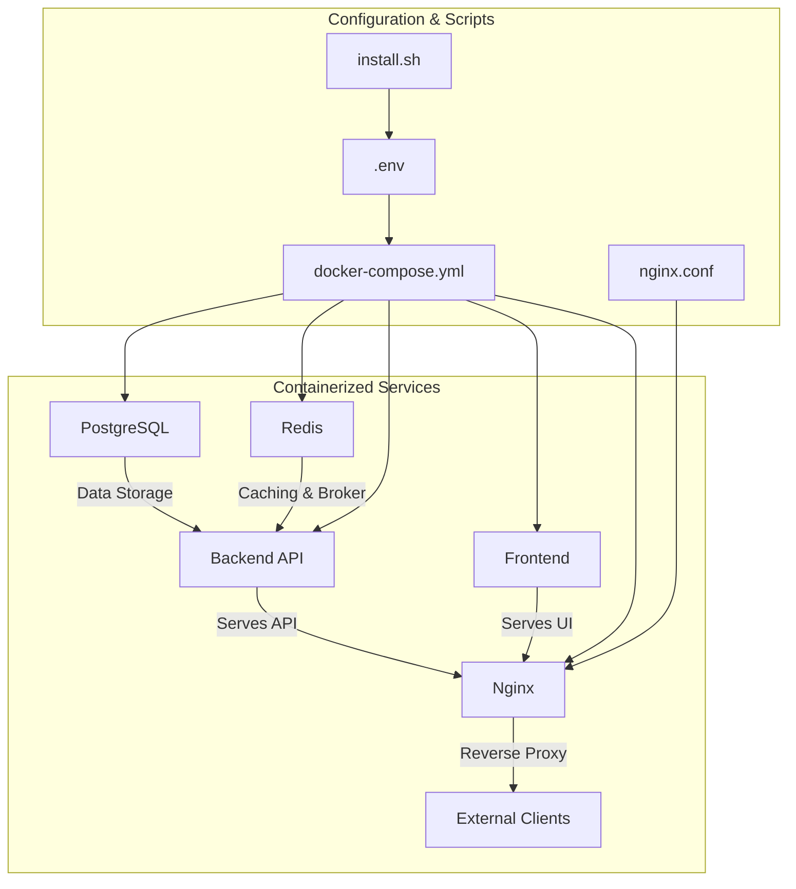
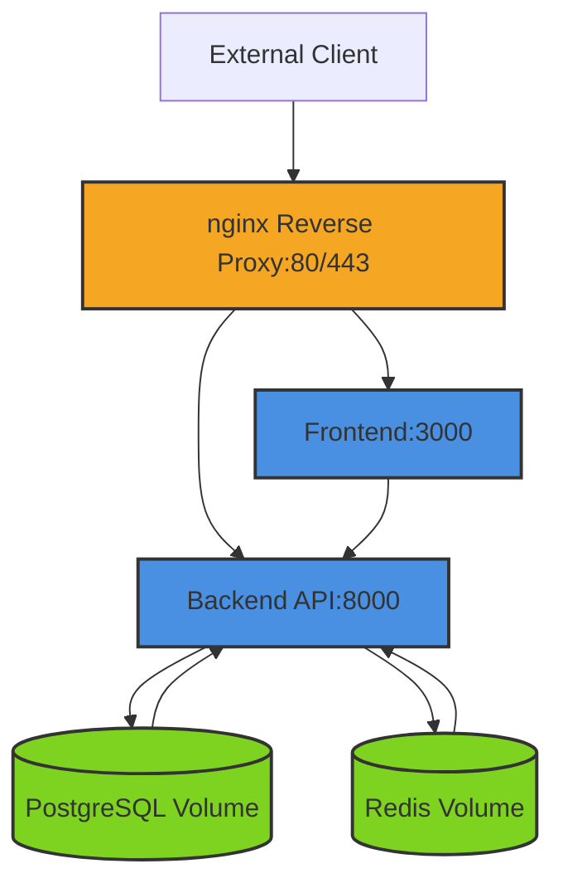
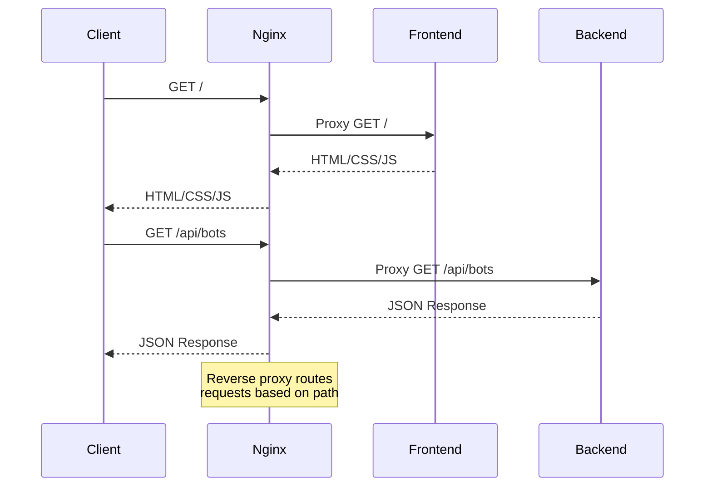
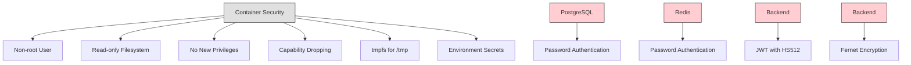
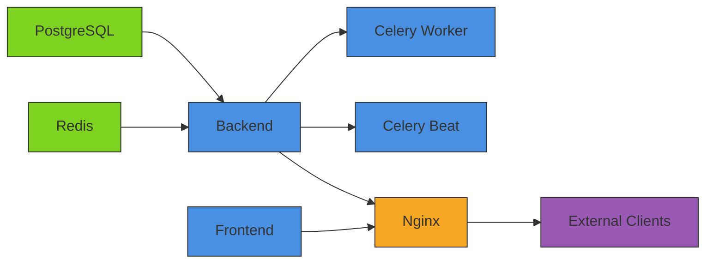

# Deployment Architecture

<cite>
**Referenced Files in This Document**   
- [docker-compose.yml](file://docker-compose.yml)
- [nginx/nginx.conf](file://nginx/nginx.conf)
- [SECURE_INSTALL.md](file://SECURE_INSTALL.md)
- [install.sh](file://install.sh)
- [requirements.txt](file://requirements.txt)
- [frontend/package.json](file://frontend/package.json)
</cite>

## Table of Contents
1. [Introduction](#introduction)
2. [Project Structure](#project-structure)
3. [Core Components](#core-components)
4. [Architecture Overview](#architecture-overview)
5. [Detailed Component Analysis](#detailed-component-analysis)
6. [Dependency Analysis](#dependency-analysis)
7. [Performance Considerations](#performance-considerations)
8. [Troubleshooting Guide](#troubleshooting-guide)
9. [Conclusion](#conclusion)

## Introduction
This document provides comprehensive architectural documentation for the TradeBot deployment environment. The system is containerized using Docker and orchestrated via docker-compose, with distinct services for PostgreSQL, Redis, backend API, frontend application, and nginx reverse proxy. The architecture emphasizes security, service isolation, and production readiness through hardened container configurations, reverse proxy patterns, and robust network design. This documentation covers component interactions, data flows, infrastructure requirements, cross-cutting concerns, and scaling considerations for handling multiple trading bots and users.

## Project Structure
The TradeBot deployment architecture follows a microservices pattern with containerized components orchestrated through docker-compose. The project structure includes dedicated directories for database migrations (alembic), application logic (app), frontend assets (frontend), installation scripts (installer), and configuration files. The core deployment configuration is defined in docker-compose.yml, which orchestrates all services and their dependencies. Supporting configuration files for nginx, environment variables, and security setup are organized in their respective directories to maintain separation of concerns and facilitate both development and production deployments.

**Diagram sources**
- [docker-compose.yml](file://docker-compose.yml)
- [nginx/nginx.conf](file://nginx/nginx.conf)

**Section sources**
- [docker-compose.yml](file://docker-compose.yml)
- [install.sh](file://install.sh)

## Core Components
The TradeBot deployment consists of five primary components: PostgreSQL for persistent data storage, Redis for caching and message brokering, a FastAPI-based backend for business logic and API services, a React-based frontend for user interface, and nginx as a reverse proxy. These components are containerized and orchestrated through docker-compose, with strict security configurations including non-root execution, read-only filesystems, and capability dropping. The backend service depends on database and cache health, while the frontend and nginx services depend on the backend's availability, creating a well-defined startup sequence and dependency chain.

**Section sources**
- [docker-compose.yml](file://docker-compose.yml#L3-L276)
- [requirements.txt](file://requirements.txt#L1-L47)
- [frontend/package.json](file://frontend/package.json#L1-L39)

## Architecture Overview
The TradeBot deployment architecture implements a production-grade containerized environment with service isolation, reverse proxy routing, and secure communication patterns. The system uses a custom Docker network (tradebot-network) to isolate internal service communication while allowing external access through nginx on ports 80 and 443. The nginx reverse proxy routes requests to either the frontend (root path) or backend API (/api/ path), providing a unified entry point. Health checks are implemented for all critical services to ensure system reliability, and volumes are used for persistent data storage of database and cache information.

**Diagram sources**
- [docker-compose.yml](file://docker-compose.yml#L219-L244)
- [nginx/nginx.conf](file://nginx/nginx.conf#L1-L43)

## Detailed Component Analysis

### Container Orchestration with docker-compose
The docker-compose.yml file defines the complete deployment architecture with seven services: postgres, redis, backend, celery-worker, celery-beat, frontend, and nginx. The configuration specifies container images, environment variables, port mappings, volume mounts, and health checks. Services are connected through a custom bridge network (tradebot-network) that enables internal communication while maintaining isolation from other Docker networks. The orchestration ensures proper startup order through health-based dependencies, with database and cache services starting first, followed by backend services, and finally frontend and proxy components.

**Section sources**
- [docker-compose.yml](file://docker-compose.yml#L1-L276)

### Reverse Proxy Configuration
The nginx service acts as a reverse proxy, routing incoming requests to appropriate backend services based on URL patterns. The configuration, defined in nginx/nginx.conf, sets up upstream servers for both backend (port 8000) and frontend (port 80 within container). Requests to the root path (/) are proxied to the frontend service, while requests to /api/ are routed to the backend API. The proxy preserves client information through headers like X-Real-IP and X-Forwarded-For, and implements health checks to monitor backend availability. This pattern provides a clean separation between static content delivery and API endpoints while maintaining a single public interface.

**Diagram sources**
- [nginx/nginx.conf](file://nginx/nginx.conf#L5-L42)
- [docker-compose.yml](file://docker-compose.yml#L219-L244)

### Service Isolation and Security
The deployment implements multiple security hardening measures across all containers. Each application container runs with non-root privileges, has all capabilities dropped (cap_drop: [ALL]), and operates with read-only filesystems. The security_opt directive prevents privilege escalation, while tmpfs mounts protect temporary directories. Environment variables containing sensitive information (passwords, keys) are injected from the .env file rather than being hardcoded in the configuration. The postgres and redis services require authentication, with passwords provided through environment variables, preventing unauthorized access to critical data stores.

**Diagram sources**
- [docker-compose.yml](file://docker-compose.yml#L83-L90)
- [SECURE_INSTALL.md](file://SECURE_INSTALL.md#L28-L31)

### Data Flow and Integration Patterns
The system implements a well-defined data flow pattern where the frontend communicates with the backend API over HTTP, the backend persists data to PostgreSQL, and uses Redis for caching and as a message broker for Celery tasks. The celery-worker and celery-beat services consume tasks from Redis, process trading logic, and update the database state. This separation of concerns allows for horizontal scaling of worker processes to handle increased trading bot loads. The alembic directory contains database migration scripts that ensure schema consistency across deployments, with automatic migration execution during backend startup.

**Section sources**
- [docker-compose.yml](file://docker-compose.yml#L104-L188)
- [alembic](file://alembic)

## Dependency Analysis
The TradeBot deployment has a clear dependency hierarchy with well-defined relationships between components. The backend service depends on both postgres and redis services, requiring them to be healthy before startup. The celery-worker and celery-beat services share the same dependency chain as the backend, ensuring database and cache availability. The frontend service depends on the backend being healthy, creating a cascading startup sequence. The nginx reverse proxy depends on both frontend and backend services, making it the last component to become fully operational. External dependencies include the Binance API, which the backend connects to for trading operations, and various Python and JavaScript packages specified in requirements.txt and package.json.

**Diagram sources**
- [docker-compose.yml](file://docker-compose.yml#L72-L77)
- [docker-compose.yml](file://docker-compose.yml#L120-L125)
- [docker-compose.yml](file://docker-compose.yml#L205-L208)
- [docker-compose.yml](file://docker-compose.yml#L230-L232)

## Performance Considerations
The architecture is designed to handle multiple trading bots and users through several performance optimization strategies. The separation of Celery workers from the main backend process allows for independent scaling of compute-intensive trading tasks. Redis caching reduces database load for frequently accessed data, while the asynchronous nature of FastAPI and Celery enables high concurrency. The nginx reverse proxy provides efficient static file serving and connection pooling. For production deployments, the system can be scaled horizontally by increasing the number of celery-worker instances based on trading load. Monitoring can be implemented through docker stats and logging to identify performance bottlenecks and optimize resource allocation.

**Section sources**
- [docker-compose.yml](file://docker-compose.yml#L104-L145)
- [SECURE_INSTALL.md](file://SECURE_INSTALL.md#L47-L50)

## Troubleshooting Guide
Common deployment issues can be addressed through systematic troubleshooting. Database connection problems can be diagnosed by checking postgres container logs and verifying the DATABASE_URL environment variable. Redis authentication issues typically stem from mismatched REDIS_PASSWORD values between the redis service and client services. Backend startup failures may indicate missing migrations or environment variable configuration errors. The health check endpoints (e.g., /health) provide quick verification of service availability. For production environments, monitoring tools like Trivy can scan container images for vulnerabilities, while pip-audit and npm audit can identify security issues in Python and JavaScript dependencies respectively.

**Section sources**
- [SECURE_INSTALL.md](file://SECURE_INSTALL.md#L60-L64)
- [install.sh](file://install.sh#L342-L356)

## Conclusion
The TradeBot deployment architecture presents a robust, secure, and scalable containerized environment for automated trading operations. By leveraging Docker and docker-compose, the system achieves consistent deployments across development and production environments while maintaining strong security postures through container hardening practices. The separation of concerns between frontend, backend, database, cache, and reverse proxy components enables independent scaling and maintenance. The architecture supports the core requirements of handling multiple trading bots and users through asynchronous task processing and efficient data access patterns. With proper monitoring and disaster recovery procedures (including volume backups), this deployment architecture provides a solid foundation for reliable trading bot operations.