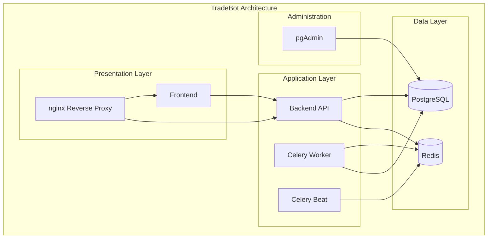
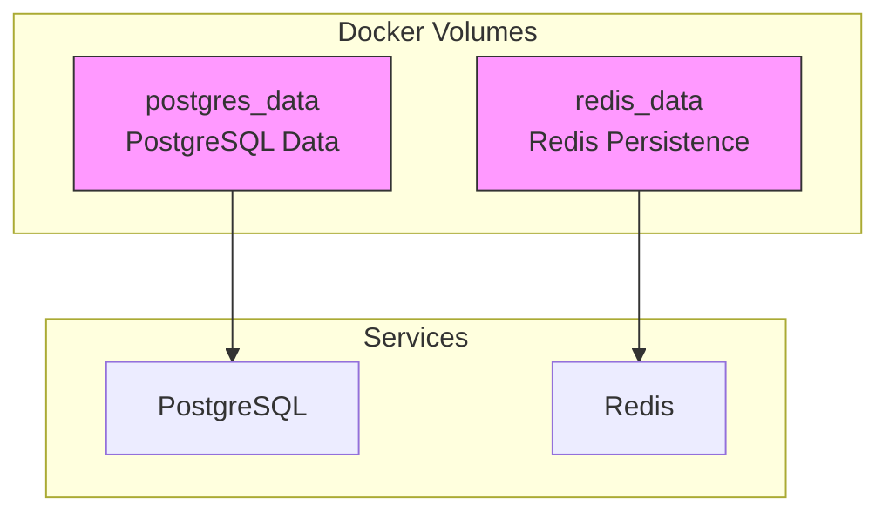
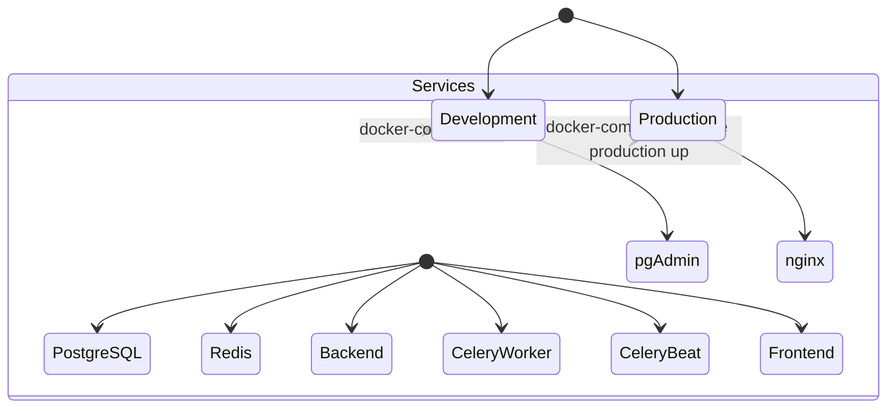
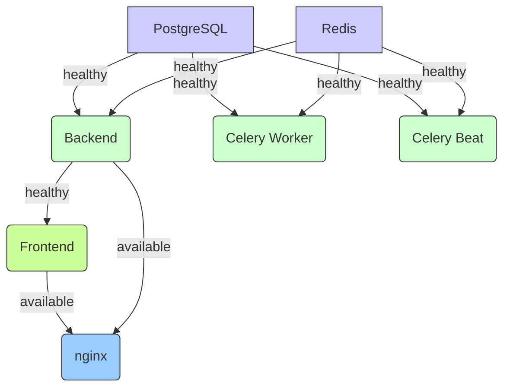

# Docker Configuration

<cite>
**Referenced Files in This Document**   
- [docker-compose.yml](file://docker-compose.yml)
- [docker-compose-pgadmin-only.yml](file://docker-compose-pgadmin-only.yml)
- [Dockerfile.backend](file://Dockerfile.backend)
- [frontend/Dockerfile.prod](file://frontend/Dockerfile.prod)
- [nginx/nginx.conf](file://nginx/nginx.conf)
</cite>

## Table of Contents
1. [Introduction](#introduction)
2. [Multi-Container Architecture](#multi-container-architecture)
3. [Service Configuration](#service-configuration)
4. [Network and Volume Management](#network-and-volume-management)
5. [Production vs Development Profiles](#production-vs-development-profiles)
6. [Build Process](#build-process)
7. [Environment Variables](#environment-variables)
8. [Service Dependencies](#service-dependencies)
9. [Security Configuration](#security-configuration)

## Introduction

The TradeBot application utilizes a comprehensive Docker-based multi-container architecture to provide a robust trading platform. The system is orchestrated through Docker Compose, defining multiple services that work together to deliver backend API functionality, frontend user interface, database storage, caching, task processing, and administrative tools. This documentation details the complete Docker configuration, including service definitions, network topology, volume management, security settings, and environment-specific configurations.

**Section sources**
- [docker-compose.yml](file://docker-compose.yml#L1-L276)

## Multi-Container Architecture

The TradeBot system consists of eight primary services working together in a coordinated manner:

- **PostgreSQL**: Primary relational database for persistent data storage
- **Redis**: In-memory data store for caching and Celery task queue
- **Backend**: FastAPI application providing the core API functionality
- **Celery Worker**: Processes background tasks and asynchronous operations
- **Celery Beat**: Manages periodic/scheduled tasks
- **Frontend**: React-based user interface application
- **nginx**: Reverse proxy for routing requests to appropriate services
- **pgAdmin**: Web-based PostgreSQL administration interface

These services are interconnected through a shared bridge network named `tradebot-network`, allowing secure communication between containers while maintaining isolation from external networks. The architecture follows microservices principles with clear separation of concerns, where each service has a specific responsibility and communicates with others through well-defined interfaces.

**Diagram sources**
- [docker-compose.yml](file://docker-compose.yml#L3-L262)

## Service Configuration

### PostgreSQL Service
The PostgreSQL service uses the `postgres:15-alpine` image and is configured with:
- Database name: `tradebot_db`
- Username: `tradebot_user`
- Password: Retrieved from environment variable `${POSTGRES_PASSWORD}`
- Port mapping: 5432 (host) to 5432 (container)
- Persistent volume: `postgres_data` mounted to `/var/lib/postgresql/data`
- Health check using `pg_isready` command

### Redis Service
The Redis service uses the `redis:7-alpine` image and is configured with:
- Password protection via `${REDIS_PASSWORD}` environment variable
- Port mapping: 6379 (host) to 6379 (container)
- Persistent volume: `redis_data` mounted to `/data`
- Append-only file persistence enabled
- Dynamic startup command that conditionally applies password protection

### Backend Service
The backend service is built from a custom Docker image and configured with:
- Image: `tradebot-backend:latest`
- Build context: Root directory with `Dockerfile.backend`
- Target stage: `production`
- Environment variables for database, Redis, security, and logging configuration
- Port mapping: 8000 (host) to 8000 (container)
- Multiple volume mounts for cache, logs, and migration scripts
- Security hardening with read-only filesystem and capability dropping
- Health check via HTTP endpoint `/health`

### Celery Worker and Beat Services
Both Celery services share similar configuration:
- Same image as backend service (`tradebot-backend:latest`)
- Environment variables for database and Redis connectivity
- Security hardening with read-only filesystem and capability dropping
- Volume mounts for logs and migration scripts
- Worker processes background tasks while Beat manages periodic tasks

### Frontend Service
The frontend service is built from the frontend directory and configured with:
- Build context: `./frontend` directory
- Dockerfile: `Dockerfile.prod`
- Build argument: `VITE_API_URL` for API endpoint configuration
- Container name: `tradebot-frontend`
- Port mapping: 3000 (host) to 80 (container)
- Health check using wget to verify health endpoint

### nginx Service
The nginx service uses the `nginx:alpine` image and is configured with:
- Port mapping: 80 and 443 (host) to 80 and 443 (container)
- Volume mounts for custom configuration and SSL certificates
- Dependency on frontend and backend services
- Security hardening with read-only filesystem and capability dropping
- Configured as production profile service

### pgAdmin Service
The pgAdmin service uses the `dpage/pgadmin4:latest` image and is configured with:
- Default email and password from environment variables
- Server mode disabled for standalone operation
- Port mapping: 5050 (host) to 80 (container)
- Dependency on PostgreSQL service
- Configured as development profile service

**Section sources**
- [docker-compose.yml](file://docker-compose.yml#L3-L262)

## Network and Volume Management

### Network Configuration
The system defines a custom bridge network named `tradebot-network` using the default bridge driver. This network enables communication between all services while providing isolation from external networks. All services are connected to this network, allowing them to communicate using service names as hostnames (e.g., `postgres`, `backend`, `frontend`). The network configuration explicitly allows outbound internet access, which is essential for the application to reach external APIs like Binance.

### Volume Management
The system uses named volumes for persistent data storage:
- `postgres_data`: Stores PostgreSQL database files, ensuring data persistence across container restarts
- `redis_data`: Stores Redis data with append-only file persistence

These volumes use the local driver and are managed by Docker, providing durable storage that survives container lifecycle events. The volume definitions are explicit in the docker-compose file, making them easily identifiable and manageable.

**Diagram sources**
- [docker-compose.yml](file://docker-compose.yml#L263-L275)

## Production vs Development Profiles

The Docker configuration distinguishes between production and development environments through Docker Compose profiles:

### Production Profile
The nginx service is assigned to the production profile with `profiles: - production`. This means:
- The reverse proxy is only started in production mode
- Services are accessible directly on their mapped ports during development
- Production deployment requires explicit profile activation
- Provides a clean separation between development and production configurations

### Development Profile
The pgAdmin service is assigned to the development profile with `profiles: - development`. This means:
- The database administration interface is only available in development mode
- Production deployments do not expose pgAdmin, reducing attack surface
- Developers can easily manage the database during development
- Can be started with `docker-compose --profile development up`

Additionally, a standalone pgAdmin configuration is provided in `docker-compose-pgadmin-only.yml` for cases where only database administration is needed without starting the entire application stack.

**Diagram sources**
- [docker-compose.yml](file://docker-compose.yml#L235-L236)
- [docker-compose.yml](file://docker-compose.yml#L260-L261)
- [docker-compose-pgadmin-only.yml](file://docker-compose-pgadmin-only.yml#L1-L27)

## Build Process

### Backend Image Build
The backend service uses a multi-stage build process defined in `Dockerfile.backend`:
- **Builder stage**: Uses `python:3.11-slim` to build Python wheels with necessary compilation dependencies
- **Development stage**: Optional stage with development dependencies
- **Production stage**: Minimal runtime environment without compilers

The build process:
1. Installs build dependencies in the builder stage
2. Creates Python wheels for all requirements
3. Copies wheels to the production stage
4. Installs packages from wheels without internet access
5. Copies application code and sets up directories
6. Creates a non-root user for security
7. Sets appropriate permissions

This approach provides several benefits:
- Reduced image size by excluding build tools from the final image
- Faster subsequent builds through wheel caching
- Improved security by running as non-root user
- Reproducible builds with pinned dependencies

### Frontend Image Build
The frontend service uses a multi-stage build defined in `frontend/Dockerfile.prod`:
- **Builder stage**: Uses `node:20-alpine` to install dependencies and build the React application
- **Production stage**: Uses `nginx:alpine` to serve the static assets

The build process:
1. Sets up build environment with proper esbuild configuration
2. Installs all dependencies including devDependencies
3. Builds the application using Vite
4. Uses nginx as the production server
5. Installs wget for health checks
6. Copies built assets to nginx directory
7. Applies custom nginx configuration

**Section sources**
- [Dockerfile.backend](file://Dockerfile.backend#L1-L86)
- [frontend/Dockerfile.prod](file://frontend/Dockerfile.prod#L1-L49)

## Environment Variables

The system relies on numerous environment variables for configuration, which are primarily sourced from a `.env` file. Key environment variables include:

### Database Configuration
- `POSTGRES_PASSWORD`: Password for PostgreSQL database (required)
- `DATABASE_URL`: Async connection string for database access
- `SYNC_DATABASE_URL`: Synchronous connection string for Celery tasks

### Security Configuration
- `SECRET_KEY`: Key for JWT token signing
- `FERNET_KEY`: Key for data encryption
- `ALGORITHM`: JWT signing algorithm (defaults to HS512)
- `ACCESS_TOKEN_EXPIRE_MINUTES`: Token expiration time (defaults to 10080)

### Application Configuration
- `ENVIRONMENT`: Environment mode (defaults to production)
- `LOG_LEVEL`: Logging verbosity (defaults to INFO)
- `FRONTEND_URL`: Frontend base URL
- `VITE_API_URL`: API endpoint for frontend

### Redis/Celery Configuration
- `REDIS_PASSWORD`: Password for Redis authentication
- `REDIS_URL`: Connection URL for Redis
- `CELERY_BROKER_URL`: Celery broker URL
- `CELERY_RESULT_BACKEND`: Celery result backend URL

These variables are injected into containers at runtime, allowing for environment-specific configuration without changing the container images. The installer automatically generates secure values for sensitive variables like passwords and keys.

**Section sources**
- [docker-compose.yml](file://docker-compose.yml#L58-L70)
- [docker-compose.yml](file://docker-compose.yml#L109-L120)
- [docker-compose.yml](file://docker-compose.yml#L250-L253)

## Service Dependencies

The system implements a sophisticated dependency management system using Docker Compose health checks to ensure proper startup order:

### Health Check Configuration
Each critical service has health checks to determine its readiness:
- **PostgreSQL**: Uses `pg_isready` command to verify database readiness
- **Redis**: Conditional ping command that accounts for password protection
- **Backend**: HTTP GET request to `/health` endpoint
- **Frontend**: wget command to verify health endpoint
- **Celery services**: Simple exit 0 test (always healthy)

### Startup Dependencies
The dependency chain ensures services start in the correct order:
1. PostgreSQL and Redis start first and become healthy
2. Backend service waits for both PostgreSQL and Redis to be healthy
3. Celery Worker and Beat wait for the same database and cache services
4. Frontend waits for Backend to be healthy
5. nginx waits for both Frontend and Backend to be available

This dependency graph prevents race conditions during startup and ensures that services only start when their dependencies are fully operational. The health check intervals and timeouts are tuned appropriately for each service, with database services having shorter intervals due to their critical nature.

**Diagram sources**
- [docker-compose.yml](file://docker-compose.yml#L72-L76)
- [docker-compose.yml](file://docker-compose.yml#L120-L124)
- [docker-compose.yml](file://docker-compose.yml#L205-L207)
- [docker-compose.yml](file://docker-compose.yml#L230-L232)

## Security Configuration

The Docker configuration implements multiple security hardening measures:

### Security Opt Settings
Several services use `no-new-privileges: true` to prevent processes from gaining additional privileges, even when executing setuid binaries or calling exec with file capabilities.

### Read-Only Filesystems
Critical services (backend, celery-worker, celery-beat, nginx) have `read_only: true` flag, making their entire filesystem read-only except for explicitly mounted volumes and tmpfs mounts. This prevents malicious code from modifying the container's filesystem.

### Capability Dropping
All backend services drop all capabilities with `cap_drop: - ALL`, removing potentially dangerous operations like raw socket access, system clock modification, and module loading. This follows the principle of least privilege.

### Temporary Filesystems
Services use tmpfs mounts for temporary directories:
- Backend, Celery services: `/tmp`
- Frontend: `/run` and `/var/cache/nginx`
- nginx: `/var/cache/nginx`

These in-memory filesystems provide temporary storage without persisting data to disk.

### Non-Root User
The backend Dockerfile creates a dedicated non-root user (`appuser`) and switches to this user before running the application, reducing the impact of potential security vulnerabilities.

These security measures collectively provide defense in depth, significantly reducing the attack surface of the application.

**Section sources**
- [docker-compose.yml](file://docker-compose.yml#L83-L87)
- [docker-compose.yml](file://docker-compose.yml#L130-L134)
- [docker-compose.yml](file://docker-compose.yml#L173-L177)
- [docker-compose.yml](file://docker-compose.yml#L237-L241)
- [Dockerfile.backend](file://Dockerfile.backend#L71-L75)