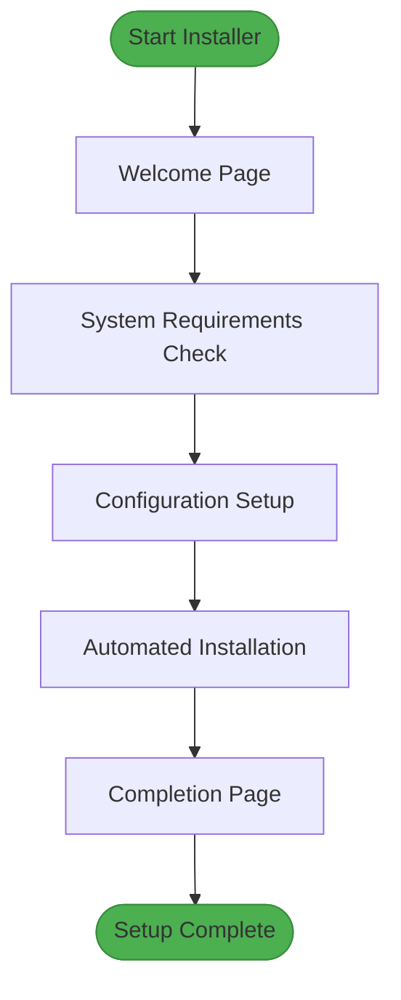
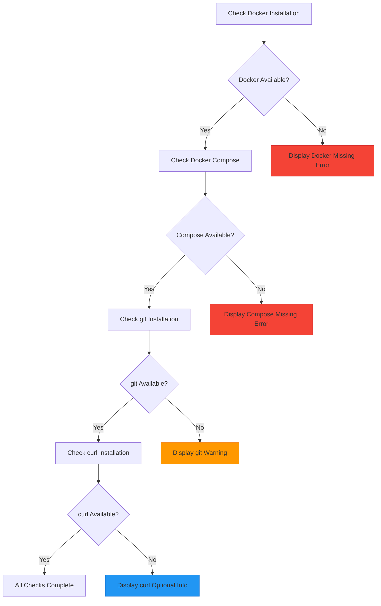
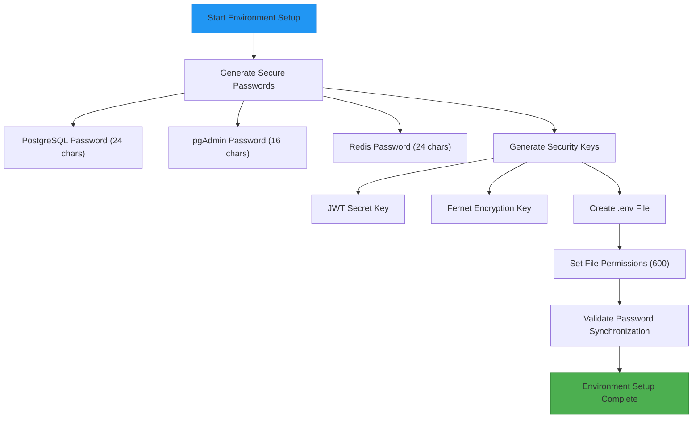
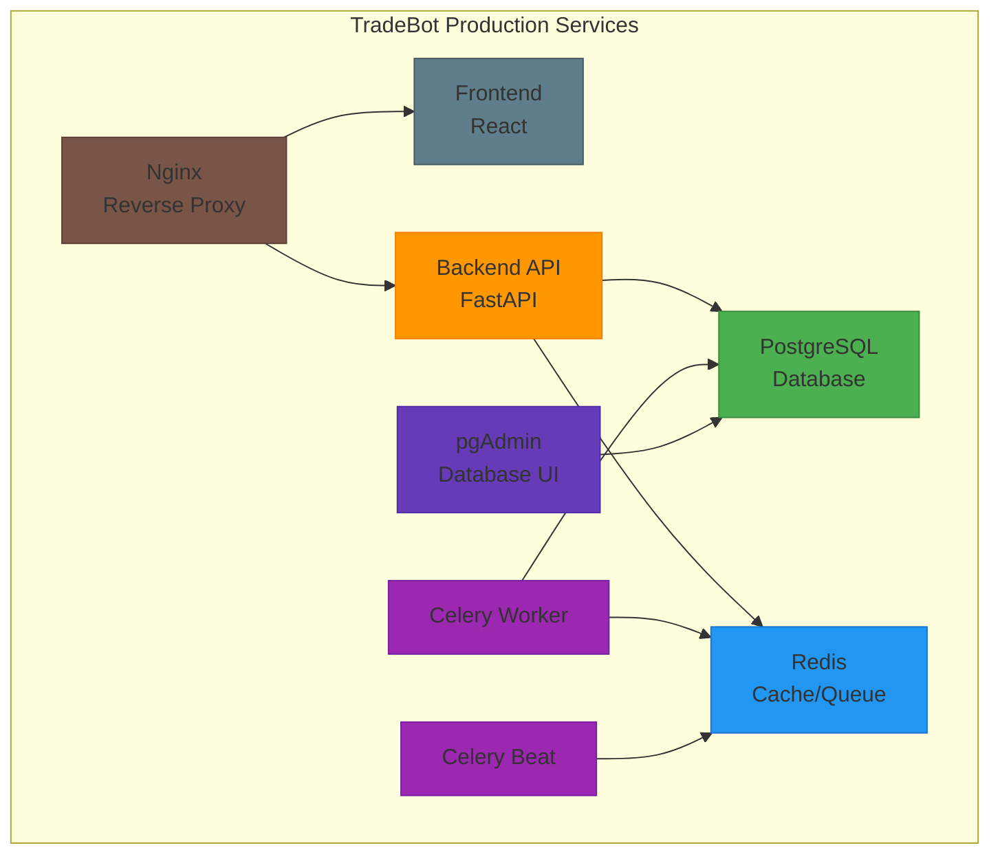
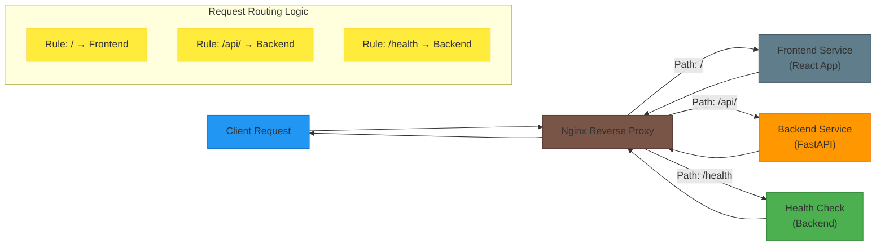
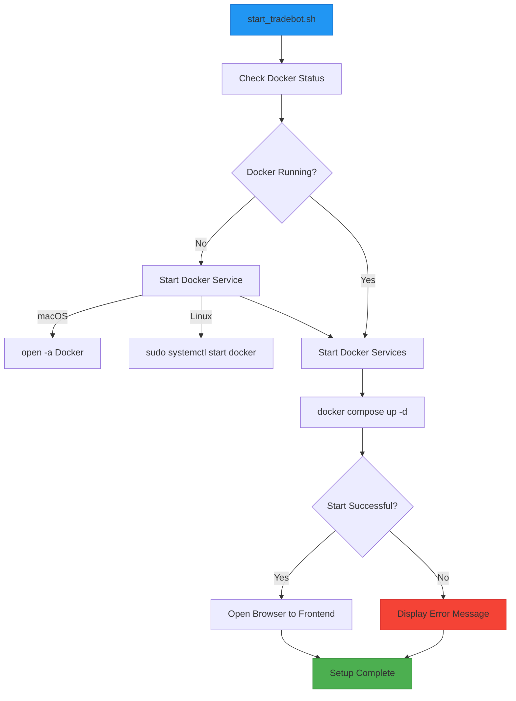
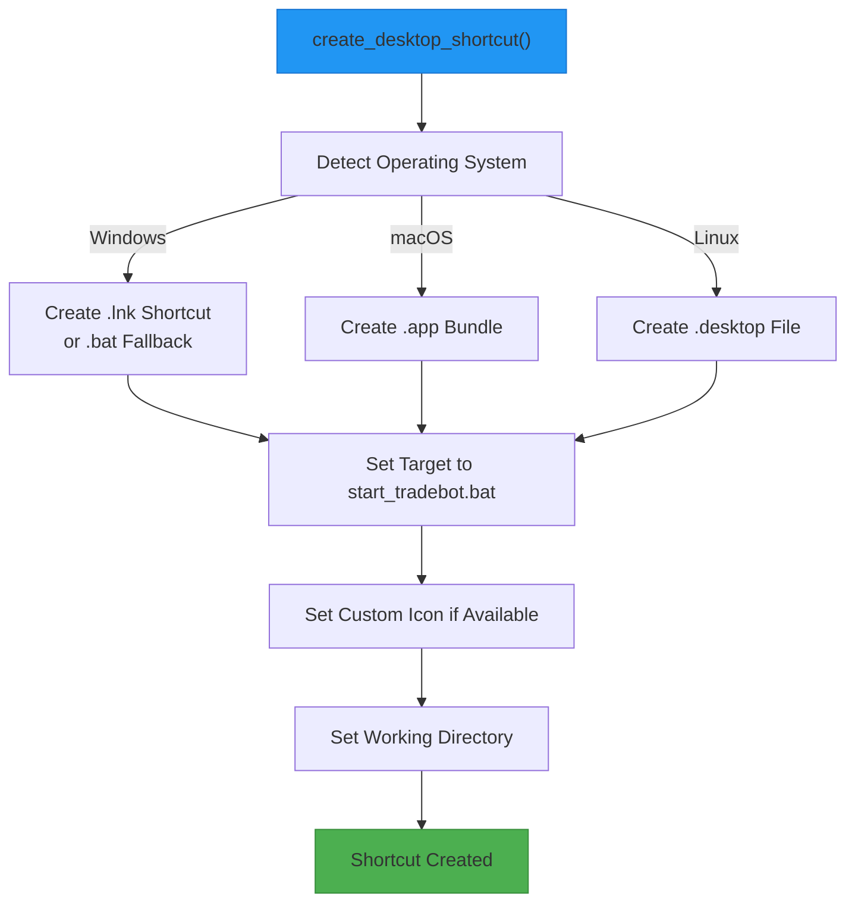

# Production Setup

<cite>
**Referenced Files in This Document**   
- [main.py](file://installer/main.py)
- [docker-compose.yml](file://docker-compose.yml)
- [nginx.conf](file://nginx/nginx.conf)
- [start_tradebot.sh](file://start_tradebot.sh)
- [stop_tradebot.sh](file://stop_tradebot.sh)
</cite>

## Table of Contents
1. [Introduction](#introduction)
2. [GUI Installer Workflow](#gui-installer-workflow)
3. [System Requirements and Preflight Checks](#system-requirements-and-preflight-checks)
4. [Secure Environment Configuration](#secure-environment-configuration)
5. [Docker Compose Production Settings](#docker-compose-production-settings)
6. [Nginx Reverse Proxy Configuration](#nginx-reverse-proxy-configuration)
7. [Startup and Shutdown Scripts](#startup-and-shutdown-scripts)
8. [Desktop Integration](#desktop-integration)
9. [Production Best Practices](#production-best-practices)

## Introduction
The TradeBot production setup is designed to provide a secure, automated, and user-friendly deployment experience through a comprehensive GUI installer and supporting infrastructure components. This documentation details the complete production deployment workflow, focusing on the automated installation process, container security configurations, reverse proxy setup, and operational best practices. The system leverages Docker Compose for container orchestration, nginx for request routing, and a graphical installer to streamline the setup process while maintaining high security standards.

## GUI Installer Workflow
The TradeBot GUI installer provides a step-by-step wizard interface that guides users through the complete production setup process. The installer is implemented in Python using the tkinter library and follows a multi-page navigation pattern to organize the installation workflow into logical stages.

The installation process begins with a welcome page that outlines the key steps involved in the setup, including system requirements checking, configuration setup, automated service orchestration, and final access information. The installer then proceeds through a series of validation and configuration pages, ensuring that all prerequisites are met before proceeding with the actual deployment.

**Diagram sources**
- [main.py](file://installer/main.py#L157-L396)

**Section sources**
- [main.py](file://installer/main.py#L157-L396)

## System Requirements and Preflight Checks
The TradeBot production setup requires specific system components to be installed and properly configured before deployment can proceed. The GUI installer performs comprehensive preflight checks to validate the presence and functionality of these required components.

The primary dependencies include Docker and Docker Compose, which are essential for container orchestration. The installer checks for both Docker Compose V2 (preferred) and V1 (fallback) to ensure compatibility across different environments. Additional optional components like git and curl are also checked, with appropriate warnings provided if they are missing but not required for basic functionality.

The preflight validation process is implemented in the `check_system` method of the `TradeBotInstaller` class, which executes system commands to verify the availability of each required component. For Docker and Docker Compose, the installer attempts to retrieve version information, using the return code to determine success or failure. The results are displayed in the installer interface with appropriate visual indicators (green checkmarks for installed components, red crosses for missing ones).

**Diagram sources**
- [main.py](file://installer/main.py#L454-L514)
- [preflight_check.py](file://installer/preflight_check.py#L28-L39)

**Section sources**
- [main.py](file://installer/main.py#L454-L514)
- [preflight_check.py](file://installer/preflight_check.py#L28-L39)

## Secure Environment Configuration
The TradeBot production setup emphasizes security through automated generation of strong, cryptographically secure passwords and keys. The installer creates a comprehensive `.env` file containing all necessary environment variables with securely generated values, eliminating the risk of weak or default credentials.

The environment configuration process begins with the creation of a `.env` file that includes database credentials, security keys, and application settings. The installer generates multiple secure values using Python's `secrets` module, which provides cryptographically strong random numbers suitable for managing data such as passwords, account authentication, and related secrets.

Key security elements generated during installation include:
- PostgreSQL database password (24 characters)
- pgAdmin interface password (16 characters)
- Redis password (24 characters)
- JWT secret key using URL-safe base64 encoding
- Fernet encryption key for data protection

The environment file is created with appropriate file permissions on Unix-like systems (600 mode, readable only by the owner) to prevent unauthorized access. The installer also provides an option to force recreation of the `.env` file, which is useful when security credentials need to be rotated or when a fresh installation is required.

**Diagram sources**
- [main.py](file://installer/main.py#L855-L910)
- [setup_security.py](file://scripts/setup_security.py#L15-L44)

**Section sources**
- [main.py](file://installer/main.py#L855-L910)
- [setup_security.py](file://scripts/setup_security.py#L15-L44)

## Docker Compose Production Settings
The TradeBot production environment is orchestrated using Docker Compose with specific security and operational configurations optimized for production deployment. The `docker-compose.yml` file defines multiple services that work together to provide a complete trading bot platform, with each service configured for security, reliability, and performance.

The production setup includes several key services:
- **PostgreSQL**: Database service with persistent storage and health checks
- **Redis**: In-memory data store for caching and Celery task queue
- **Backend**: FastAPI application server with security hardening
- **Celery Worker**: Background task processor for asynchronous operations
- **Celery Beat**: Periodic task scheduler for recurring jobs
- **Frontend**: React-based user interface served via nginx
- **nginx**: Reverse proxy for routing requests to appropriate services
- **pgAdmin**: Database management interface (development profile)

Each container is configured with security best practices, including read-only filesystems, dropped capabilities, and restricted privileges. The `security_opt` parameter with `no-new-privileges:true` prevents processes from gaining additional privileges, while `cap_drop: [ALL]` removes all Linux capabilities from the container. The `read_only: true` setting mounts the container's filesystem as read-only, preventing unauthorized modifications.

Health checks are implemented for all critical services to ensure system reliability. The PostgreSQL service uses `pg_isready` to verify database readiness, while the backend service checks its `/health` endpoint using curl. These health checks allow Docker to monitor service status and take appropriate actions if a service becomes unresponsive.

**Diagram sources**
- [docker-compose.yml](file://docker-compose.yml#L1-L276)

**Section sources**
- [docker-compose.yml](file://docker-compose.yml#L1-L276)

## Nginx Reverse Proxy Configuration
The nginx reverse proxy serves as the entry point for all incoming requests to the TradeBot application, routing traffic to the appropriate backend services based on the request path. This configuration provides a unified interface to the application while maintaining separation between the frontend and backend components.

The nginx configuration is defined in the `nginx.conf` file and includes upstream definitions for both the frontend and backend services. The server block listens on port 80 and uses location-based routing to direct requests to the correct destination. Requests to the root path (`/`) are proxied to the frontend service, while requests to the `/api/` path are routed to the backend API service.

The proxy configuration includes essential headers to preserve client information and ensure proper request handling:
- `Host`: Preserves the original host header
- `X-Real-IP`: Passes the client's real IP address
- `X-Forwarded-For`: Maintains the chain of proxy servers
- `X-Forwarded-Proto`: Preserves the original protocol (HTTP/HTTPS)

Health checks are implemented through the `/health` location, which proxies requests to the backend service. This allows external monitoring systems to verify the health of the application without exposing internal endpoints directly to the internet.

**Diagram sources**
- [nginx.conf](file://nginx/nginx.conf#L1-L43)

**Section sources**
- [nginx.conf](file://nginx/nginx.conf#L1-L43)

## Startup and Shutdown Scripts
The TradeBot production setup includes platform-agnostic startup and shutdown scripts that simplify the management of the application lifecycle. These scripts handle the complexities of starting and stopping the Docker containers, ensuring that the application is properly initialized and terminated.

The `start_tradebot.sh` script is responsible for launching the TradeBot services and includes several key features:
- Automatic detection and startup of Docker service if not running
- Platform-specific handling for macOS, Linux, and Windows environments
- Support for both Docker Compose V2 and V1 syntax
- Automatic opening of the web interface in the default browser
- Comprehensive error handling and user feedback

The script first checks if Docker is running and attempts to start it if necessary. On macOS, it uses the `open` command to launch Docker Desktop, while on Linux systems it uses `sudo systemctl start docker`. Once Docker is confirmed to be running, the script uses the `docker compose up -d` command to start all services in detached mode.

The `stop_tradebot.sh` script provides a simple mechanism to gracefully shut down all TradeBot services. It changes to the installation directory and executes `docker-compose down`, which stops and removes all containers, networks, and volumes defined in the compose file.

**Diagram sources**
- [start_tradebot.sh](file://start_tradebot.sh#L1-L134)
- [stop_tradebot.sh](file://stop_tradebot.sh#L1-L6)

**Section sources**
- [start_tradebot.sh](file://start_tradebot.sh#L1-L134)
- [stop_tradebot.sh](file://stop_tradebot.sh#L1-L6)

## Desktop Integration
The TradeBot GUI installer provides seamless desktop integration by automatically creating platform-specific shortcuts that allow users to start the application with a simple double-click. This feature enhances user experience by providing easy access to the application without requiring command-line interaction.

The desktop integration is implemented in the `create_desktop_shortcut` method, which detects the operating system and creates the appropriate shortcut type:
- **Windows**: Creates a `.lnk` shortcut using the `win32com.client` library, with fallback to batch files if the library is not available
- **macOS**: Creates an `.app` bundle that can be launched from the Applications folder or Dock
- **Linux**: Creates a `.desktop` file that integrates with the desktop environment's application menu

The shortcuts are configured to execute the `start_tradebot.sh` or `start_tradebot.bat` script, ensuring consistent behavior across platforms. The installer also sets appropriate icons for the shortcuts, using a custom icon if available or falling back to system defaults.

**Diagram sources**
- [main.py](file://installer/main.py#L1636-L1656)
- [main.py](file://installer/main.py#L1676-L1735)

**Section sources**
- [main.py](file://installer/main.py#L1636-L1656)

## Production Best Practices
Deploying TradeBot in a production environment requires adherence to security, performance, and reliability best practices. The following recommendations ensure a robust and secure deployment that can handle real-world trading scenarios.

### Firewall Configuration
Configure the system firewall to allow only necessary ports while blocking unauthorized access. The recommended firewall rules include:
- Allow inbound traffic on port 80 (HTTP) and 443 (HTTPS) for web access
- Block inbound traffic on database ports (5432 for PostgreSQL, 6379 for Redis)
- Allow outbound traffic for API calls to cryptocurrency exchanges
- Implement rate limiting to prevent abuse of API endpoints

### SSL Termination
Implement SSL/TLS encryption to secure communications between clients and the TradeBot application. This can be achieved through:
- Using a reverse proxy like nginx with Let's Encrypt certificates
- Configuring SSL termination at the load balancer level in cloud environments
- Implementing HSTS (HTTP Strict Transport Security) to enforce HTTPS connections

### Monitoring Setup
Establish comprehensive monitoring to ensure system health and performance:
- Implement container health checks as defined in the docker-compose.yml file
- Use logging to track application events and errors
- Monitor resource usage (CPU, memory, disk) of Docker containers
- Set up alerts for critical events such as service failures or high error rates

### Security Considerations
Follow security best practices to protect the trading bot and associated data:
- Regularly rotate passwords and security keys
- Keep all software components up to date with security patches
- Implement proper access controls for database and administrative interfaces
- Store sensitive information in environment variables rather than configuration files
- Use read-only filesystems and dropped capabilities for containers

### Backup and Recovery
Implement a robust backup strategy to protect against data loss:
- Regularly backup the PostgreSQL database
- Store backups in a secure, off-site location
- Test backup restoration procedures periodically
- Implement version control for configuration files

**Section sources**
- [SECURE_INSTALL.md](file://SECURE_INSTALL.md#L1-L77)
- [docker-compose.yml](file://docker-compose.yml#L1-L276)