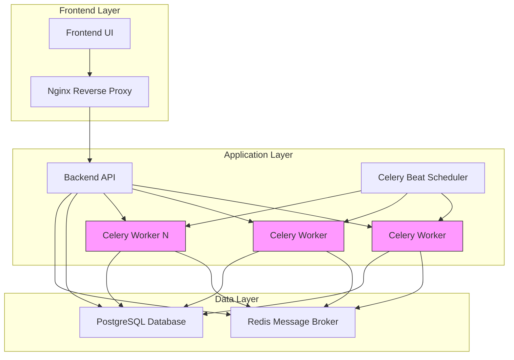
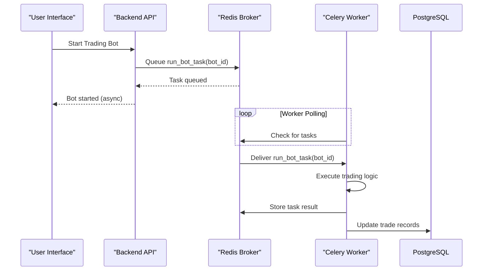
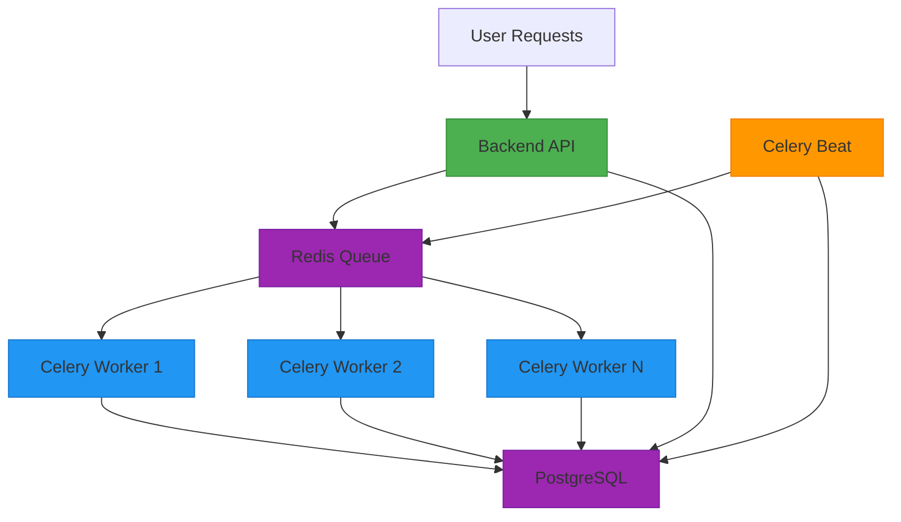

# Scaling Considerations

<cite>
**Referenced Files in This Document**   
- [docker-compose.yml](file://docker-compose.yml)
- [app/core/celery_app.py](file://app/core/celery_app.py)
- [app/core/bot_tasks.py](file://app/core/bot_tasks.py)
- [app/core/redis_client.py](file://app/core/redis_client.py)
- [app/database.py](file://app/database.py)
</cite>

## Table of Contents
1. [Architecture Overview](#architecture-overview)
2. [Horizontal Scaling of Celery Workers](#horizontal-scaling-of-celery-workers)
3. [Redis as Message Broker](#redis-as-message-broker)
4. [Database Connection Pooling Strategy](#database-connection-pooling-strategy)
5. [Component Isolation and Independent Scaling](#component-isolation-and-independent-scaling)
6. [Performance Bottlenecks and Optimization Strategies](#performance-bottlenecks-and-optimization-strategies)
7. [Scaling Recommendations by Deployment Scenario](#scaling-recommendations-by-deployment-scenario)
8. [Resource Allocation for High-Frequency Trading](#resource-allocation-for-high-frequency-trading)

## Architecture Overview

The TradeBot system follows a distributed microservices architecture with clear separation of concerns between components. The system is composed of multiple Docker containers orchestrated through docker-compose, enabling independent scaling and management of each service. The core architectural components include:

- **PostgreSQL Database**: Central data storage for bot configurations, user data, trade history, and state management
- **Redis Cache**: Message broker for Celery task distribution and in-memory caching
- **Backend API**: REST interface handling user requests and authentication
- **Celery Workers**: Task processors executing trading logic
- **Celery Beat**: Periodic task scheduler for recurring operations
- **Frontend**: User interface for bot management and monitoring
- **Nginx**: Reverse proxy for production traffic routing

The architecture enables horizontal scaling of Celery workers to handle increased load from multiple trading bots and users. The separation of components allows each service to be scaled independently based on resource requirements and performance characteristics.

**Diagram sources**
- [docker-compose.yml](file://docker-compose.yml#L104-L145)
- [app/core/celery_app.py](file://app/core/celery_app.py#L1-L43)

**Section sources**
- [docker-compose.yml](file://docker-compose.yml#L1-L276)

## Horizontal Scaling of Celery Workers

The TradeBot system is designed for horizontal scaling of Celery workers to handle multiple trading bots and users concurrently. The docker-compose.yml configuration defines a dedicated `celery-worker` service that can be scaled horizontally using Docker's replica mechanism.

Each Celery worker container runs an independent instance of the Celery worker process, allowing the system to distribute trading tasks across multiple worker processes. When a user starts a trading bot through the API, the request triggers a Celery task that is placed in the Redis message queue. The task distribution mechanism ensures that available workers process these tasks in parallel, enabling the system to handle multiple bots simultaneously.

The scaling capability is particularly important for high-frequency trading operations where multiple bots may need to execute trades within short time intervals. By increasing the number of Celery worker replicas, the system can process more trading tasks concurrently, reducing processing latency and improving overall throughput.

The current configuration allows for dynamic scaling based on workload. During peak trading hours or when users deploy multiple bots, additional worker instances can be deployed to handle the increased load. Conversely, during periods of low activity, worker instances can be scaled down to optimize resource utilization.

**Section sources**
- [docker-compose.yml](file://docker-compose.yml#L104-L145)
- [app/core/bot_tasks.py](file://app/core/bot_tasks.py#L110-L118)

## Redis as Message Broker

Redis serves as the message broker for the Celery task queue system, playing a critical role in distributing tasks among worker processes. The configuration in docker-compose.yml sets up a dedicated Redis container with persistent storage, ensuring message durability across container restarts.

The Redis instance is configured with append-only file (AOF) persistence (`appendonly yes`) to prevent data loss in case of crashes. This is essential for maintaining task integrity, as trading operations must not be lost during system failures. The configuration also supports password authentication when the REDIS_PASSWORD environment variable is set, providing security for the message queue.

In the application code, Redis is used as both the Celery broker and result backend. The celery_app.py configuration specifies Redis as the broker URL and result backend, enabling asynchronous task execution and result retrieval. This setup allows the system to:

1. Queue trading tasks from the backend API
2. Distribute tasks to available Celery workers
3. Store task execution results for later retrieval
4. Maintain task state and prevent duplicate processing

The Redis client implementation in redis_client.py provides both synchronous and asynchronous interfaces, allowing different components of the system to interact with Redis efficiently. The singleton pattern ensures connection reuse, reducing overhead and improving performance.

**Diagram sources**
- [app/core/celery_app.py](file://app/core/celery_app.py#L6-L7)
- [app/core/redis_client.py](file://app/core/redis_client.py#L12-L13)
- [docker-compose.yml](file://docker-compose.yml#L29-L47)

**Section sources**
- [app/core/celery_app.py](file://app/core/celery_app.py#L1-L43)
- [app/core/redis_client.py](file://app/core/redis_client.py#L1-L129)

## Database Connection Pooling Strategy

The TradeBot system implements a robust database connection strategy to handle concurrent access from multiple components. The architecture separates synchronous and asynchronous database connections to accommodate different usage patterns across the system.

For the asynchronous backend API, the system uses SQLAlchemy's async engine with connection pooling. The database.py module configures an async session maker that manages a pool of database connections, reusing connections efficiently and preventing connection exhaustion under high load. This approach is optimized for the API's concurrent request handling, where multiple user requests may access the database simultaneously.

For Celery workers, which execute synchronous code, the system establishes a separate synchronous database connection. The bot_tasks.py module creates a sync engine and session maker specifically for worker processes. This separation prevents blocking operations in workers from affecting the async API performance.

The connection strategy includes several optimization features:
- Connection pooling to minimize connection establishment overhead
- Connection reuse through session management
- Separate connection configurations for async and sync components
- Error handling and retry mechanisms for transient failures

The system also implements concurrency control at the application level using database row locking. When a worker processes a bot task, it acquires a row lock on the BotState record using `with_for_update(nowait=True)`, preventing multiple workers from processing the same bot simultaneously. This ensures data consistency while allowing parallel processing of different bots.

**Section sources**
- [app/database.py](file://app/database.py#L1-L24)
- [app/core/bot_tasks.py](file://app/core/bot_tasks.py#L24-L33)
- [app/core/bot_tasks.py](file://app/core/bot_tasks.py#L134-L144)

## Component Isolation and Independent Scaling

The TradeBot architecture demonstrates excellent component isolation, enabling independent scaling of different system components based on their specific resource requirements and performance characteristics. This separation follows the microservices design pattern, where each component has a single responsibility and can be scaled independently.

The backend API, Celery workers, and Celery beat scheduler are deployed as separate Docker services, each with its own resource allocation and scaling parameters. The backend API primarily handles HTTP requests and user authentication, requiring moderate CPU resources but benefiting from multiple instances to handle concurrent user connections.

Celery workers, responsible for executing trading logic, are CPU-intensive due to the complex calculations involved in trading strategies, technical indicators, and risk management. These workers can be scaled horizontally to handle increased trading volume without affecting the API's performance.

The Celery beat scheduler runs periodic tasks such as checking active bots every minute and resetting bot states daily. This component has minimal resource requirements but requires high reliability, as missed scheduled tasks could impact trading operations.

This isolation allows for targeted resource allocation:
- API instances can be scaled based on user concurrency
- Worker instances can be scaled based on trading volume and strategy complexity
- Beat scheduler can be deployed with high availability configurations

The services communicate through well-defined interfaces (Redis message queue and database), minimizing tight coupling and enabling independent deployment and scaling.

**Diagram sources**
- [docker-compose.yml](file://docker-compose.yml#L49-L188)
- [app/core/celery_app.py](file://app/core/celery_app.py#L26-L35)

**Section sources**
- [docker-compose.yml](file://docker-compose.yml#L49-L188)

## Performance Bottlenecks and Optimization Strategies

The TradeBot system may encounter several performance bottlenecks when handling high-frequency trading operations, particularly as the number of active bots and users increases. Understanding these bottlenecks and implementing appropriate optimization strategies is crucial for maintaining system reliability and responsiveness.

**Database Connection Limits**: With multiple Celery workers accessing the database concurrently, the system may hit PostgreSQL connection limits. The current configuration should implement connection pooling and consider using PgBouncer for additional connection pooling at the database proxy level.

**Message Queue Backlogs**: During periods of high trading activity, Redis may accumulate a backlog of tasks if workers cannot process them fast enough. Monitoring queue length and implementing auto-scaling of worker instances based on queue depth can mitigate this issue.

**CPU-Intensive Trading Calculations**: Technical indicator calculations (EMA, RSI) and risk management computations consume significant CPU resources. Optimizations include:
- Caching calculated indicators to avoid redundant computations
- Using optimized numerical libraries like NumPy for mathematical operations
- Implementing efficient algorithms with lower time complexity

**Redis Memory Usage**: As the system scales, Redis memory consumption may increase due to task metadata, result storage, and caching. Configuring appropriate memory limits and eviction policies is essential.

**Network Latency**: Communication between components introduces latency. Deploying components on the same network segment and optimizing serialization formats can reduce this overhead.

**Optimization Strategies**:
1. Implement horizontal scaling of Celery workers based on system load
2. Optimize database queries with proper indexing on frequently accessed fields
3. Use connection pooling and consider database read replicas for reporting queries
4. Implement caching strategies for frequently accessed market data
5. Monitor system performance metrics and set up alerts for threshold violations
6. Use asynchronous processing for non-critical operations like notifications

**Section sources**
- [app/core/bot_tasks.py](file://app/core/bot_tasks.py#L280-L307)
- [app/core/celery_app.py](file://app/core/celery_app.py#L17-L23)
- [docker-compose.yml](file://docker-compose.yml#L147-L188)

## Scaling Recommendations by Deployment Scenario

The scaling strategy for the TradeBot system should be tailored to the specific deployment scenario, ranging from single-server setups to distributed environments. Each scenario presents unique challenges and requires different approaches to resource allocation and component distribution.

**Single-Server Setup**: For development or small-scale production environments, all components can run on a single server. The recommended configuration includes:
- 4-8 CPU cores for handling both API requests and trading calculations
- 8-16GB RAM to accommodate database, Redis, and application memory needs
- SSD storage for database performance
- Single instances of each service with manual scaling as needed

**Multi-Server Production**: For medium to large-scale deployments, components should be distributed across multiple servers:
- Database server: Dedicated machine with high I/O performance
- Redis server: Dedicated machine with sufficient RAM
- Application servers: Multiple machines running API and worker services
- Load balancer: Distributing API requests across multiple backend instances

**Cloud Deployment**: In cloud environments, leverage auto-scaling groups and managed services:
- Use managed PostgreSQL and Redis services for improved reliability
- Implement auto-scaling policies for worker instances based on queue depth
- Use container orchestration (Kubernetes) for advanced scaling and management
- Implement monitoring and alerting for proactive issue detection

**High-Frequency Trading Environment**: For demanding trading scenarios:
- Deploy worker instances in close proximity to exchange APIs to minimize latency
- Use high-performance computing instances with optimized network connectivity
- Implement dedicated instances for specific trading strategies
- Use message queue prioritization for time-sensitive trading operations

The docker-compose configuration provides a foundation that can be adapted to these different scenarios by adjusting resource limits, replica counts, and deployment topology.

**Section sources**
- [docker-compose.yml](file://docker-compose.yml#L1-L276)
- [app/core/celery_app.py](file://app/core/celery_app.py#L1-L43)

## Resource Allocation for High-Frequency Trading

Proper resource allocation is critical for the TradeBot system when handling high-frequency trading operations. The computational requirements of trading algorithms, market data processing, and order execution demand careful consideration of CPU, memory, and I/O resources.

**CPU Allocation**: Trading calculations, particularly technical indicator computations and risk management algorithms, are CPU-intensive. Each active bot requires CPU cycles for:
- Market data analysis and indicator calculations
- Strategy decision-making
- Order execution and confirmation
- Risk management computations

Recommend allocating multiple CPU cores per worker instance, with the ability to scale horizontally by adding more worker instances as trading volume increases.

**Memory Requirements**: The system requires sufficient memory for:
- Database connections and query results
- Redis storage for task queues and caching
- Application memory for processing trading logic
- Market data storage and analysis

A minimum of 2GB RAM per worker instance is recommended, with additional memory for database and Redis services.

**I/O Considerations**: High-frequency trading generates significant I/O operations:
- Database reads/writes for trade records and state management
- Redis operations for task queuing and result storage
- Network communication with exchange APIs
- Log file writing for audit and debugging

Using SSD storage and optimizing database indexing can significantly improve I/O performance.

**Network Resources**: Low-latency network connectivity is essential for timely market data access and order execution. The system should be deployed in close proximity to exchange APIs when possible, and network bandwidth should be sufficient to handle market data streams for multiple trading pairs.

The docker-compose configuration should be enhanced with resource limits and reservations to ensure fair distribution of resources among services and prevent any single component from monopolizing system resources.

**Section sources**
- [docker-compose.yml](file://docker-compose.yml#L104-L145)
- [app/core/bot_tasks.py](file://app/core/bot_tasks.py#L280-L307)