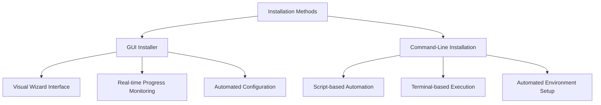
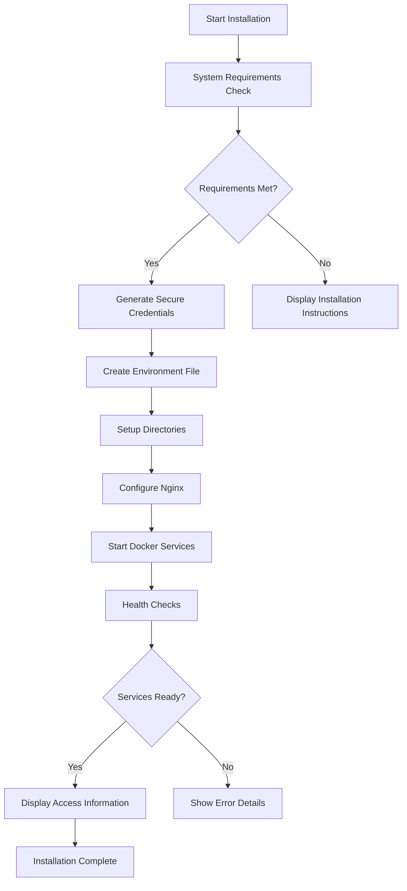

# Getting Started

<cite>
**Referenced Files in This Document**   
- [install.sh](file://install.sh)
- [installer/main.py](file://installer/main.py)
- [docker-compose.yml](file://docker-compose.yml)
- [env.example](file://env.example)
- [start_tradebot.sh](file://start_tradebot.sh)
- [stop_tradebot.sh](file://stop_tradebot.sh)
- [SETUP.md](file://SETUP.md)
- [SECURE_INSTALL.md](file://SECURE_INSTALL.md)
- [README.md](file://README.md)
- [installer/README.md](file://installer/README.md)
- [scripts/setup_env.py](file://scripts/setup_env.py)
- [scripts/setup_security.py](file://scripts/setup_security.py)
</cite>

## Table of Contents
1. [Introduction](#introduction)
2. [Installation Methods](#installation-methods)
3. [GUI Installer](#gui-installer)
4. [Command-Line Installation](#command-line-installation)
5. [Post-Installation Access](#post-installation-access)
6. [Common Issues and Solutions](#common-issues-and-solutions)
7. [Security Considerations](#security-considerations)
8. [Performance Tips](#performance-tips)
9. [Conclusion](#conclusion)

## Introduction

The TradeBot system provides a professional cryptocurrency trading solution with comprehensive installation options for users of all technical levels. This guide details the complete setup process for deploying the trading system using either the graphical user interface (GUI) installer or command-line installation methods. Both approaches automate the entire deployment process, including dependency installation, environment configuration, and service initialization through Docker containers.

The installation system is designed to enable quick deployment with minimal user intervention while maintaining high security standards. The automated setup scripts handle the creation of secure credentials, configuration of Docker services, and initialization of all required components. Users can choose between the user-friendly GUI installer for a step-by-step visual experience or the command-line approach for more technical users who prefer script-based deployment.

**Section sources**
- [README.md](file://README.md#L86-L145)
- [SETUP.md](file://SETUP.md#L1-L146)

## Installation Methods

TradeBot offers two primary installation methods to accommodate different user preferences and technical expertise levels. The GUI installer provides a user-friendly, step-by-step wizard interface that guides users through the entire setup process, while the command-line installation offers a script-based approach for more technical users. Both methods achieve the same end result by automating the deployment of Docker containers, creating secure environment configurations, and initializing all required services.

The choice between installation methods depends on user preference and technical comfort level. The GUI installer is recommended for users who prefer a visual interface with real-time feedback and guided configuration, while the command-line method is ideal for users who prefer script-based automation and have experience with terminal operations. Both installation methods perform comprehensive system checks, ensure all prerequisites are met, and provide detailed feedback throughout the installation process.



**Diagram sources**
- [installer/main.py](file://installer/main.py#L22-L800)
- [install.sh](file://install.sh#L1-L442)

## GUI Installer

The GUI installer provides a user-friendly, five-step wizard interface that simplifies the TradeBot installation process for users of all technical levels. This graphical interface guides users through system requirements verification, configuration settings, and automated deployment with real-time progress monitoring. The installer automatically detects the user's operating system and provides platform-specific instructions and optimizations.

The installation process begins with a welcome screen that outlines the steps involved and system requirements. The second step performs comprehensive system checks to verify the presence of essential components like Docker, Docker Compose, curl, and git. If any requirements are missing, the installer provides specific installation instructions for the user's operating system. The third step allows users to configure key settings including installation directory, port assignments for various services, and environment selection (production or development).

During the installation phase, the GUI provides real-time feedback through a progress bar and log window that displays detailed information about each step. The installer automatically generates secure random passwords for PostgreSQL, pgAdmin, Redis, and encryption keys, ensuring a secure deployment. Upon successful completion, the final screen displays access information for all services and provides one-click buttons to open the frontend, API documentation, and database management tools in the user's default web browser.

The GUI installer also creates desktop shortcuts and startup scripts that enable users to easily start and stop the TradeBot system with a single click. These platform-specific shortcuts are created for Windows (.lnk), Linux (.desktop), and macOS (.app) systems, providing a consistent user experience across different operating systems.

**Section sources**
- [installer/main.py](file://installer/main.py#L22-L800)
- [installer/README.md](file://installer/README.md#L1-L211)
- [README.md](file://README.md#L88-L116)

## Command-Line Installation

The command-line installation method provides a script-based approach to deploy the TradeBot system using the `install.sh` script. This method is designed for technical users who prefer terminal-based operations and automation. The installation process begins with cloning the repository and making the installation script executable:

```bash
git clone https://github.com/suleymantaha/tradebot.git
cd tradebot
chmod +x install.sh
./install.sh
```

The `install.sh` script performs a comprehensive system requirements check, verifying the presence of Docker, Docker Compose, curl, and git. If any components are missing, the script provides detailed installation instructions for different operating systems including Ubuntu/Debian, Arch Linux, and macOS. The script automatically handles platform-specific differences and provides appropriate commands for each system.

Once system requirements are verified, the script proceeds to create the environment configuration file (.env) by copying from the `env.example` template. It generates secure random credentials for all services including PostgreSQL, pgAdmin, Redis, and encryption keys. The script creates necessary directories for logs, cache, and nginx configuration, then builds and starts all Docker services defined in the `docker-compose.yml` file.

The installation process includes health checks to verify that all services are running properly before completing. Upon successful installation, the script displays a comprehensive summary of access information, including URLs for the frontend, backend API, API documentation, and pgAdmin interface, along with the generated credentials for database access.



**Diagram sources**
- [install.sh](file://install.sh#L1-L442)
- [env.example](file://env.example#L1-L89)

## Post-Installation Access

After successful installation, users can access various components of the TradeBot system through designated URLs and tools. The primary access points include the frontend web interface, backend API, API documentation, and database management tools. The frontend web interface is accessible at `http://localhost:3000` and serves as the main user interface for configuring trading bots, monitoring performance, and managing account settings.

The backend API is available at `http://localhost:8000` and provides the RESTful interface for all trading operations. Comprehensive API documentation is available at `http://localhost:8000/docs`, which uses Swagger/OpenAPI to provide interactive documentation of all available endpoints, request/response formats, and authentication requirements.

For database management, pgAdmin is available at `http://localhost:5050` and provides a web-based interface for managing the PostgreSQL database. Users can connect to the database using the credentials generated during installation, with the host set to `host.docker.internal` (or `localhost`), port `5432`, database name `tradebot_db`, username `tradebot_user`, and the generated PostgreSQL password.

The system also provides utility scripts for managing the TradeBot services. The `start_tradebot.sh` script starts all services and automatically opens the frontend in the default web browser, while the `stop_tradebot.sh` script stops all running services. These scripts handle Docker service detection and startup, ensuring that the Docker daemon is running before attempting to start the TradeBot containers.

**Section sources**
- [SETUP.md](file://SETUP.md#L21-L47)
- [start_tradebot.sh](file://start_tradebot.sh#L1-L134)
- [stop_tradebot.sh](file://stop_tradebot.sh#L1-L6)

## Common Issues and Solutions

Users may encounter several common issues during the TradeBot installation process. The most frequent problems include Docker permission errors, port conflicts, and missing system requirements. Docker permission errors typically occur when the user is not part of the docker group on Linux systems. This can be resolved by adding the user to the docker group with the command `sudo usermod -aG docker $USER` and restarting the terminal session.

Port conflicts occur when the default ports used by TradeBot (3000 for frontend, 8000 for backend, 5432 for PostgreSQL, and 5050 for pgAdmin) are already in use by other applications. Users can identify which processes are using these ports with the command `sudo lsof -i :[port_number]` and terminate the conflicting processes with `sudo kill -9 [PID]`. Alternatively, users can modify the port mappings in the `docker-compose.yml` file to use different ports.

Missing system requirements are automatically detected by both installation methods, which provide specific instructions for installing the required components. For Docker and Docker Compose on Ubuntu/Debian systems, users can run `sudo apt update` followed by `sudo apt install -y docker.io docker-compose curl git`. On macOS with Homebrew, the command is `brew install docker docker-compose curl git`.

If the installation fails due to network issues or timeouts, users can attempt to resolve the problem by cleaning up existing Docker resources with `docker-compose down -v` followed by `docker system prune -f`, then re-running the installation script. For persistent issues, users should check the detailed logs available in the `installer.log` file (for GUI installation) or through `docker-compose logs` commands.

**Section sources**
- [SETUP.md](file://SETUP.md#L90-L127)
- [SECURE_INSTALL.md](file://SECURE_INSTALL.md#L59-L64)
- [README.md](file://README.md#L527-L602)

## Security Considerations

The TradeBot installation process incorporates several security measures to protect user data and system integrity. During installation, all sensitive credentials are generated using cryptographically secure random functions, ensuring strong, unpredictable passwords for PostgreSQL, pgAdmin, Redis, and encryption keys. The system uses Fernet encryption for securing API keys and other sensitive data stored in the database.

The `.env` file containing all environment variables and secrets is configured to be excluded from version control through the `.gitignore` file, preventing accidental exposure of credentials. For production deployments, users should ensure that the `.env` file has appropriate file permissions (600 on Unix-like systems) to restrict access to the owner only.

The Docker containers are configured with security best practices, including running with non-root users where possible, dropping unnecessary capabilities with `cap_drop: [ALL]`, and setting `read_only: true` for containers that don't require write access to their filesystem. The Redis service requires authentication, and the PostgreSQL connection URLs properly encode passwords to prevent injection attacks.

For production environments, additional security measures should be implemented, including configuring SSL/TLS certificates for HTTPS access, setting up firewall rules to restrict access to necessary ports only, enabling two-factor authentication on the Binance account, and using IP whitelisting for API keys. Regular rotation of passwords and encryption keys is also recommended to minimize the impact of potential credential leaks.

**Section sources**
- [SECURE_INSTALL.md](file://SECURE_INSTALL.md#L1-L77)
- [docker-compose.yml](file://docker-compose.yml#L1-L276)
- [scripts/setup_security.py](file://scripts/setup_security.py#L1-L153)

## Performance Tips

To ensure optimal performance of the TradeBot system, several configuration and operational recommendations should be followed. The system requires a minimum of 4GB RAM, with 8GB recommended for optimal performance, especially when running multiple trading bots simultaneously. Users should ensure sufficient disk space (at least 10GB) for the application, logs, and database storage.

For production deployments, users should consider the following performance optimizations:
- Configure appropriate logging levels to balance diagnostic information with storage requirements
- Monitor resource usage with `docker stats` to identify potential bottlenecks
- Ensure the host system has a stable internet connection for reliable API communication with Binance
- Regularly monitor database performance and consider indexing strategies for frequently queried tables
- Use the provided monitoring scripts like `scripts/db_monitor.py` to track system health

The system's modular architecture allows for scaling individual components as needed. The Celery worker and beat services can be scaled independently to handle increased trading volume, while the frontend and backend services can be load-balanced for high-availability deployments. Users should also consider the impact of trading frequency and strategy complexity on system resource usage, adjusting bot configurations to match available hardware capabilities.

**Section sources**
- [README.md](file://README.md#L69-L75)
- [SECURE_INSTALL.md](file://SECURE_INSTALL.md#L47-L50)

## Conclusion

The TradeBot system provides a comprehensive and user-friendly installation process through both GUI and command-line methods, enabling users to quickly deploy a professional cryptocurrency trading platform. The automated installation scripts handle all aspects of system setup, from dependency verification to service initialization, while ensuring secure credential generation and proper configuration.

Users can choose the installation method that best suits their technical expertise, with the GUI installer providing a guided visual experience and the command-line method offering script-based automation. Both approaches result in a fully functional trading system with access to the frontend interface, API documentation, and database management tools.

By following the guidance in this document, users can successfully install and configure the TradeBot system, troubleshoot common issues, implement security best practices, and optimize performance for their specific use case. The comprehensive documentation and support resources ensure that users have the information needed to maintain and operate their trading system effectively.