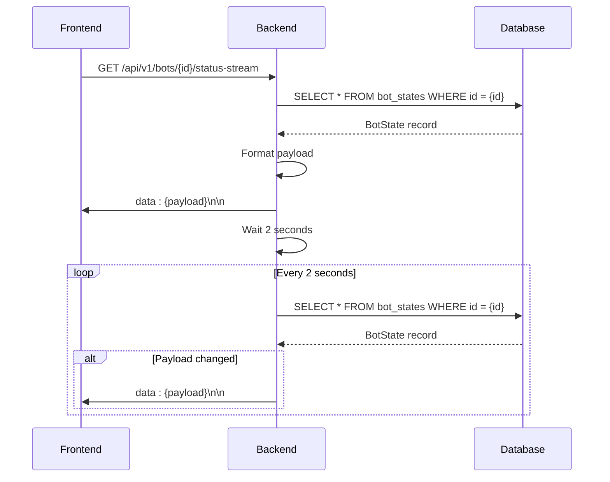
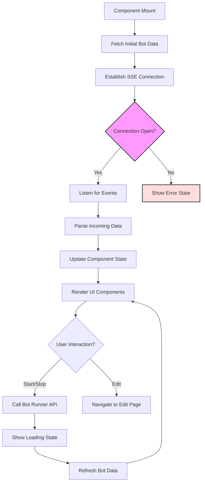
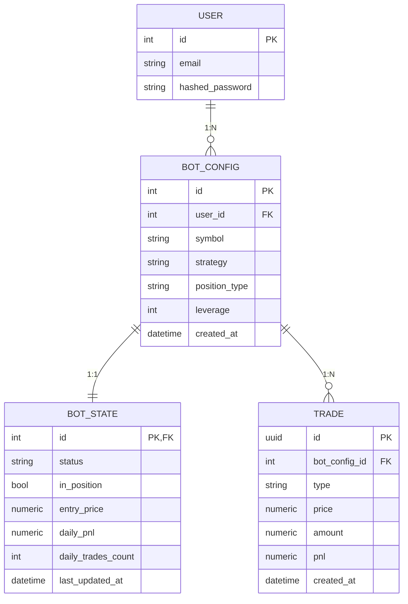

# Real-time Monitoring

<cite>
**Referenced Files in This Document**   
- [main.py](file://app/main.py)
- [BotDetailPage.jsx](file://frontend/src/pages/Bots/BotDetailPage.jsx)
- [bot_state.py](file://app/api/routes/bot_state.py)
- [bot_state.py](file://app/models/bot_state.py)
- [bot_state.py](file://app/schemas/bot_state.py)
</cite>

## Table of Contents
1. [Introduction](#introduction)
2. [Server-Sent Events (SSE) Implementation](#server-sent-events-sse-implementation)
3. [Bot State Model and Database Schema](#bot-state-model-and-database-schema)
4. [Frontend Event Processing](#frontend-event-processing)
5. [Domain Model and Trading Engine Integration](#domain-model-and-trading-engine-integration)
6. [Common Issues and Solutions](#common-issues-and-solutions)
7. [Conclusion](#conclusion)

## Introduction
The real-time monitoring sub-feature enables live tracking of trading bot status through Server-Sent Events (SSE). This system provides continuous updates from the backend to the frontend, allowing users to monitor bot performance metrics, trade history, and operational status in real time. The implementation centers around the `/api/v1/bots/{bot_config_id}/status-stream` endpoint, which streams JSON-formatted status updates every two seconds. This document details the technical architecture, data flow, and integration points between backend and frontend components, with a focus on accessibility for beginners while providing technical depth for experienced developers.

## Server-Sent Events (SSE) Implementation

The SSE system is implemented in the FastAPI backend through the `bot_status_stream` function in `main.py`. This endpoint creates a persistent connection that pushes status updates from the server to the client without requiring repeated polling. The implementation uses FastAPI's `StreamingResponse` to maintain an open HTTP connection and yield data events in the text/event-stream format.

The event generator queries the `BotState` model every two seconds using an asynchronous database session. It constructs a payload containing key metrics such as bot status, position state, entry price, daily PnL, trade count, and last update timestamp. The generator only yields data when the payload differs from the previous one, reducing unnecessary network traffic. This approach balances real-time responsiveness with server efficiency by using a fixed polling interval rather than reactive database triggers.



**Diagram sources**
- [main.py](file://app/main.py#L73-L93)

**Section sources**
- [main.py](file://app/main.py#L73-L93)

## Bot State Model and Database Schema

The `BotState` model serves as the central data structure for tracking bot runtime information. It is implemented as a SQLAlchemy model with a one-to-one relationship to the `BotConfig` model, using the bot configuration ID as both a foreign key and primary key. This design ensures each bot configuration has exactly one corresponding state record.

The schema includes fields for operational status, position tracking, price levels (entry, take profit, stop loss), performance metrics (daily PnL, trade count), and timestamps. The `last_updated_at` field uses database-level triggers to automatically update whenever the record changes, ensuring accurate timestamping even if the application logic fails to set it explicitly. Numeric fields use the `Numeric` type for precise financial calculations, while boolean flags track binary states like `in_position`.

```mermaid
classDiagram
class BotState {
+id : Integer
+status : String
+in_position : Boolean
+entry_price : Numeric
+current_position_size_coins : Numeric
+trailing_stop_price : Numeric
+max_price_since_entry : Numeric
+take_profit_price : Numeric
+stop_loss_price : Numeric
+daily_pnl : Numeric
+daily_trades_count : Integer
+last_run_at : DateTime
+last_error_message : Text
+last_updated_at : DateTime
}
class BotConfig {
+id : Integer
+user_id : Integer
+symbol : String
+strategy : String
}
BotState --> BotConfig : "1 : 1 relationship"
```

**Diagram sources**
- [bot_state.py](file://app/models/bot_state.py#L5-L24)

**Section sources**
- [bot_state.py](file://app/models/bot_state.py#L5-L24)
- [bot_state.py](file://app/schemas/bot_state.py#L5-L35)

## Frontend Event Processing

The frontend processes SSE events through the `BotDetailPage.jsx` component, which manages the lifecycle of the event stream connection. When the component mounts, it establishes a connection to the status stream endpoint and sets up an event listener to handle incoming data. The component uses React's useState and useEffect hooks to manage bot state, configuration, and UI state in response to streaming updates.

The event processing logic parses the JSON payload from each SSE message and updates the component's state accordingly. The UI renders key metrics in dedicated sections, using conditional formatting to highlight important information. For example, positive PnL values are displayed in green while negative values appear in red. Status indicators use color-coded badges that change based on the bot's current state (running, stopped, error, etc.).

The component also implements error handling for connection failures, with automatic reconnection attempts and user-facing error messages. This ensures a resilient user experience even under unstable network conditions. The UI provides real-time feedback on bot operations, with loading states during start/stop actions and confirmation dialogs for destructive operations.



**Diagram sources**
- [BotDetailPage.jsx](file://frontend/src/pages/Bots/BotDetailPage.jsx#L7-L711)

**Section sources**
- [BotDetailPage.jsx](file://frontend/src/pages/Bots/BotDetailPage.jsx#L7-L711)

## Domain Model and Trading Engine Integration

The bot state tracking system is tightly integrated with the trading engine through a shared domain model. The `BotState` entity serves as the bridge between the persistent configuration (`BotConfig`) and the runtime execution context. When a bot is started, the trading engine updates the `BotState` record to reflect its operational status, creating a feedback loop that enables real-time monitoring.

The domain model follows a clear separation of concerns: configuration data remains immutable in `BotConfig`, while runtime state is tracked in `BotState`. This separation allows the system to maintain historical configuration while supporting dynamic state changes during bot execution. The trading engine updates the state record after key events such as position entry, exit, or strategy signals, ensuring the monitoring system reflects the bot's actual behavior.

The integration also supports different trading modes (spot vs. futures) through conditional logic in both backend and frontend components. For futures trading, additional fields like leverage are displayed and updated in real time. The system handles both demo and live trading modes, with visual indicators to distinguish between them and prevent confusion about the nature of the displayed data.



**Diagram sources**
- [bot_state.py](file://app/models/bot_state.py#L5-L24)
- [bot_config.py](file://app/models/bot_config.py)

## Common Issues and Solutions

### Connection Timeouts
SSE connections may timeout due to network instability or server configuration. The system addresses this through multiple mechanisms: the backend sets a 2-second polling interval to ensure regular data transmission (preventing idle timeouts), and the frontend implements automatic reconnection logic. If a connection drops, the browser will automatically attempt to reconnect, starting from the last received event ID when supported.

### Data Synchronization Problems
Race conditions can occur when multiple components try to update bot state simultaneously. The system mitigates this through database transactions and optimistic locking. The `update_bot_state` endpoint in the bot_state router uses SQLAlchemy's ORM to ensure atomic updates, while the SSE stream reads from a consistent database snapshot. For critical operations like position management, the trading engine acquires explicit locks to prevent conflicting updates.

### Performance Considerations
Continuous polling of the database every 2 seconds could impact performance under high load. The system optimizes this through several strategies: the query targets a single record using primary key lookup, the payload comparison prevents redundant transmissions, and the asynchronous implementation allows concurrent handling of multiple connections. For large-scale deployments, Redis could be integrated as a cache layer to further reduce database load.

### Error Handling
The system provides comprehensive error handling at multiple levels. The backend validates user permissions and bot existence before establishing a stream, returning appropriate HTTP status codes. The frontend catches network errors and displays user-friendly messages, while maintaining the ability to retry failed operations. Critical errors are logged on the server with sufficient context for debugging, while non-critical issues are handled gracefully without disrupting the user experience.

**Section sources**
- [main.py](file://app/main.py#L73-L93)
- [BotDetailPage.jsx](file://frontend/src/pages/Bots/BotDetailPage.jsx#L7-L711)
- [bot_state.py](file://app/api/routes/bot_state.py#L12-L31)

## Conclusion
The real-time monitoring system provides a robust foundation for live bot tracking through Server-Sent Events. By combining a well-structured domain model with efficient streaming implementation, the system delivers timely updates while maintaining performance and reliability. The tight integration between backend state management and frontend visualization enables users to monitor bot performance with minimal latency. Future enhancements could include WebSocket support for bidirectional communication, more granular update frequencies based on event importance, and enhanced error recovery mechanisms. The current implementation strikes an effective balance between real-time responsiveness and system efficiency, making it suitable for both development and production environments.