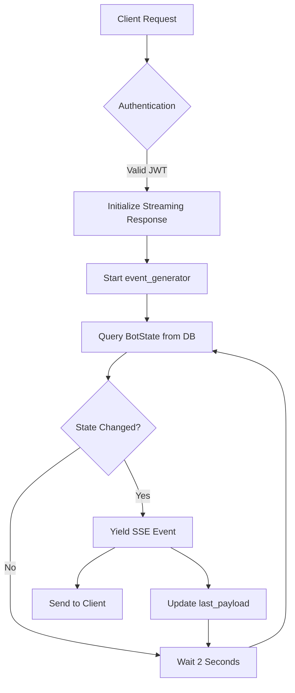

# Status Streaming

<cite>
**Referenced Files in This Document**   
- [main.py](file://app/main.py)
- [bot_state.py](file://app/models/bot_state.py)
- [BotDetailPage.jsx](file://frontend/src/pages/Bots/BotDetailPage.jsx)
- [rate_limit.py](file://app/core/rate_limit.py)
</cite>

## Table of Contents
1. [Introduction](#introduction)
2. [API Endpoint Specification](#api-endpoint-specification)
3. [Server-Side Implementation](#server-side-implementation)
4. [Frontend Implementation](#frontend-implementation)
5. [Error Handling and Reconnection Logic](#error-handling-and-reconnection-logic)
6. [Code Examples](#code-examples)
7. [Rate Limiting and Scalability](#rate-limiting-and-scalability)
8. [Conclusion](#conclusion)

## Introduction
This document provides comprehensive documentation for the Server-Sent Events (SSE) endpoint used to stream real-time bot status updates in the TradeBot application. The `/api/v1/bots/{bot_config_id}/status-stream` endpoint enables continuous monitoring of trading bot states through an efficient, low-latency connection. This documentation covers the API specification, server-side implementation using FastAPI, frontend integration with React's EventSource API, error handling mechanisms, and scalability considerations for handling multiple concurrent connections.

## API Endpoint Specification

The SSE endpoint provides real-time status updates for trading bots through a persistent HTTP connection:

- **HTTP Method**: GET
- **URL Pattern**: `/api/v1/bots/{bot_config_id}/status-stream`
- **Authentication**: JWT token in `Authorization` header with Bearer scheme
- **Media Type**: `text/event-stream`
- **Response Format**: Server-Sent Events with JSON data payloads

The `bot_config_id` path parameter specifies which bot's status to stream. The endpoint returns a streaming response where each event contains a JSON payload with the following fields:

- `status`: Current operational status of the bot (e.g., "running", "stopped", "error")
- `in_position`: Boolean indicating whether the bot currently holds a position
- `entry_price`: Price at which the current position was entered (nullable)
- `daily_pnl`: Daily profit and loss value in USDT
- `daily_trades_count`: Number of trades executed today
- `last_updated_at`: Timestamp of the last state update in ISO format

Clients must authenticate using a valid JWT token in the Authorization header to access this endpoint. The server validates the user's identity and ensures they have permission to access the specified bot configuration.

**Section sources**
- [main.py](file://app/main.py#L73-L93)
- [bot_state.py](file://app/models/bot_state.py#L4-L22)

## Server-Side Implementation

The server-side implementation uses FastAPI's StreamingResponse to create a persistent connection that pushes updates to clients whenever the bot state changes. The `event_generator` function runs an infinite loop that queries the BotState model every 2 seconds using an asynchronous database query.

The implementation employs change detection to minimize network traffic - updates are only sent when the payload data has changed from the previous state. This optimization prevents unnecessary data transmission when the bot state remains stable. The generator function maintains a `last_payload` variable to compare against the current state before yielding an event.

Each event is formatted according to the SSE specification with the `data:` prefix followed by the JSON payload and double newline terminators. The media type is explicitly set to `text/event-stream` to ensure proper client interpretation.

The endpoint integrates with the application's authentication system through the `get_current_active_user` dependency, which verifies the JWT token and ensures the requesting user is active. Database access is handled through the dependency-injected AsyncSession, enabling efficient asynchronous operations.



**Diagram sources**
- [main.py](file://app/main.py#L73-L93)

**Section sources**
- [main.py](file://app/main.py#L73-L93)
- [bot_state.py](file://app/models/bot_state.py#L4-L22)

## Frontend Implementation

The frontend implementation in BotDetailPage.jsx establishes and manages the SSE connection using the browser's EventSource API. When the component mounts, it creates a new EventSource instance pointing to the status stream endpoint with the appropriate bot_config_id.

The component subscribes to the 'message' event to receive incoming data updates. Each received event triggers a state update that refreshes the UI components displaying bot status information. The React component efficiently re-renders only the affected portions of the interface using React's state management system.

The implementation includes proper lifecycle management - the EventSource connection is closed when the component unmounts to prevent memory leaks and unnecessary server load. This cleanup occurs in the useEffect cleanup function, ensuring resources are properly released when users navigate away from the bot detail page.

The UI displays various aspects of the bot state including operational status, position information, performance metrics, and timestamps. Visual indicators change color based on the bot's current status (e.g., green for running, red for error), providing immediate visual feedback to users.

**Section sources**
- [BotDetailPage.jsx](file://frontend/src/pages/Bots/BotDetailPage.jsx#L1-L711)

## Error Handling and Reconnection Logic

The frontend implementation includes comprehensive error handling for connection issues and network failures. When the EventSource encounters an error, it automatically attempts to reconnect according to the browser's default reconnection behavior. The connection uses exponential backoff to prevent overwhelming the server with rapid reconnection attempts.

The application monitors connection health and provides user feedback through status indicators. If a connection cannot be established after multiple attempts, the UI displays appropriate error messages to inform users of the issue. The component gracefully handles temporary network disruptions by maintaining the last known state while attempting to restore the connection.

On the server side, the streaming endpoint handles client disconnections gracefully. When a client disconnects, the generator function will eventually raise an exception due to the broken connection, causing the streaming response to terminate cleanly. The server does not maintain any persistent client state beyond the HTTP request lifecycle, allowing for horizontal scaling.

**Section sources**
- [BotDetailPage.jsx](file://frontend/src/pages/Bots/BotDetailPage.jsx#L1-L711)

## Code Examples

### JavaScript Client Implementation
```javascript
// Create EventSource connection
const eventSource = new EventSource(`/api/v1/bots/${botConfigId}/status-stream`, {
  headers: {
    'Authorization': `Bearer ${jwtToken}`
  }
});

// Handle incoming messages
eventSource.onmessage = function(event) {
  const data = JSON.parse(event.data);
  // Update UI with new bot state
  updateBotStatus(data);
};

// Handle connection errors
eventSource.onerror = function(error) {
  console.error('SSE connection error:', error);
  // Connection will automatically retry
};

// Close connection when done
// eventSource.close();
```

### Alternative Fetch API Implementation
```javascript
async function connectToStatusStream(botConfigId, jwtToken) {
  const response = await fetch(`/api/v1/bots/${botConfigId}/status-stream`, {
    headers: {
      'Authorization': `Bearer ${jwtToken}`
    }
  });

  const reader = response.body.getReader();
  const decoder = new TextDecoder();

  while (true) {
    const { done, value } = await reader.read();
    if (done) break;
    
    const chunk = decoder.decode(value);
    const eventData = chunk.match(/data: (.*)\n\n/);
    if (eventData) {
      const data = JSON.parse(eventData[1]);
      console.log('Received bot status:', data);
    }
  }
}
```

## Rate Limiting and Scalability

The SSE endpoint incorporates rate limiting considerations to prevent abuse and ensure system stability. While the current implementation focuses on the streaming endpoint itself, the application's rate limiting infrastructure in rate_limit.py provides a foundation for future enhancements.

Each active SSE connection consumes server resources, particularly event loop capacity and database connection pool slots. The 2-second polling interval represents a balance between real-time responsiveness and server load. For deployments with many concurrent users, consider implementing connection pooling or message broadcasting through a pub/sub system like Redis to reduce database load.

Horizontal scaling is supported through stateless design - each SSE connection exists within a single server instance. Load balancers should use sticky sessions or implement a shared message distribution system to ensure clients receive updates consistently. The use of JWT authentication enables stateless session management across multiple server instances.

Monitoring connection counts and server resource usage is recommended to determine optimal scaling strategies based on actual usage patterns.

**Section sources**
- [rate_limit.py](file://app/core/rate_limit.py#L1-L43)
- [main.py](file://app/main.py#L73-L93)

## Conclusion

The `/api/v1/bots/{bot_config_id}/status-stream` SSE endpoint provides an efficient mechanism for delivering real-time bot status updates to clients. The implementation combines FastAPI's streaming capabilities with React's EventSource integration to create a responsive user experience. By only sending updates when data changes and using a reasonable polling interval, the system balances real-time requirements with server efficiency.

The architecture supports secure authentication through JWT tokens and can be scaled to accommodate growing user bases with appropriate infrastructure. Future enhancements could include configurable update intervals, selective field updates, and WebSocket fallback for environments with limited SSE support.