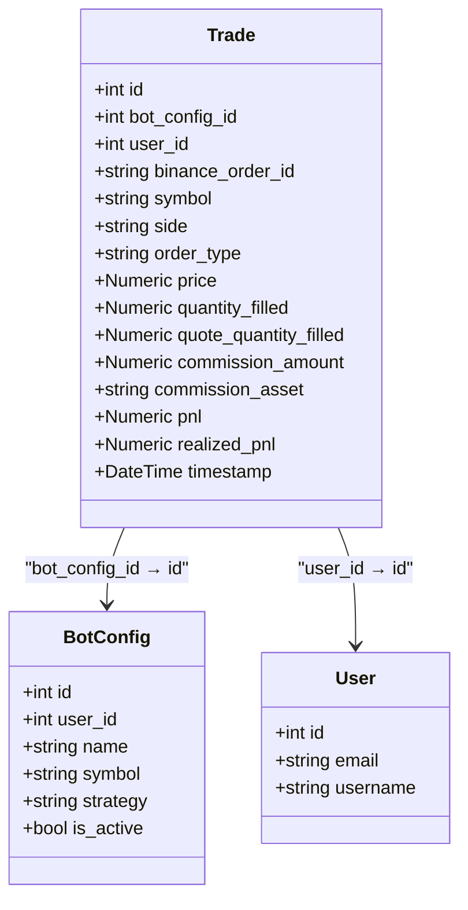
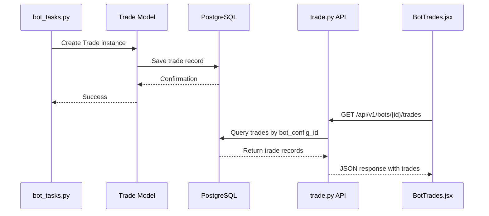

# Trade History Display

<cite>
**Referenced Files in This Document**   
- [bot_tasks.py](file://app/core/bot_tasks.py)
- [BotTrades.jsx](file://frontend/src/pages/Bots/BotTrades.jsx)
- [trade.py](file://app/models/trade.py)
- [trade.py](file://app/api/routes/trade.py)
- [trade.py](file://app/schemas/trade.py)
- [bot_report.py](file://app/api/routes/bot_report.py)
</cite>

## Table of Contents
1. [Introduction](#introduction)
2. [Trade Model Structure](#trade-model-structure)
3. [Trade Creation Process](#trade-creation-process)
4. [Backend Implementation](#backend-implementation)
5. [Frontend Implementation](#frontend-implementation)
6. [Real-time Integration](#real-time-integration)
7. [Common Issues and Solutions](#common-issues-and-solutions)
8. [Conclusion](#conclusion)

## Introduction
The Trade History Display feature provides users with a comprehensive view of executed trades in real-time, enabling them to monitor their bot's performance and trading activities. This documentation details the implementation of how trade records are created and displayed within the automated trading platform. The system captures executed trades through the bot_tasks.py module and presents them in the frontend via the BotTrades.jsx component. Users can view critical trade details including timestamp, side (buy/sell), price, quantity, and PnL (Profit and Loss). The feature integrates with the real-time monitoring system to display both historical trades and recent executions, providing a complete picture of trading activity. This documentation explains the technical implementation for both beginners and experienced developers, covering the data flow from trade execution to frontend display, addressing common challenges such as data synchronization and performance optimization.

## Trade Model Structure
The Trade model serves as the foundation for storing all executed trade records in the system. It contains comprehensive information about each trade, including identification, financial details, and execution metadata. The model is designed to capture essential trading parameters that enable performance analysis and historical tracking. Key fields include the unique identifier (id), bot configuration reference (bot_config_id), user association (user_id), trading symbol (symbol), trade direction (side), order type (order_type), execution price (price), filled quantity (quantity_filled), quote quantity (quote_quantity_filled), commission details, profit and loss calculations, and timestamp. The model also includes a binance_order_id field for linking to the exchange's order system, enabling reconciliation between platform records and exchange data. The realized_pnl field specifically tracks the actual profit or loss from completed trades, providing accurate performance metrics. The model establishes relationships with BotConfig and User entities through foreign key constraints, ensuring data integrity and enabling efficient querying of trades by bot or user. This structure supports comprehensive trade analysis and reporting capabilities.



**Diagram sources**
- [trade.py](file://app/models/trade.py#L4-L25)

**Section sources**
- [trade.py](file://app/models/trade.py#L4-L25)

## Trade Creation Process
The trade creation process begins when a bot successfully executes an order on the exchange. This process is managed by the _run_bot function in the bot_tasks.py module, which handles the entire lifecycle of trade execution and recording. When a trading signal is generated and validated against risk parameters, the system places an order through the Binance API using the BinanceClientWrapper. Upon successful order execution, the system creates a new Trade record with comprehensive details about the transaction. The process involves calculating key metrics such as realized PnL by comparing the current sell price with the last buy price from previous trades. The trade record captures essential information including the bot configuration ID, user ID, trading symbol, trade side (buy/sell), order type, execution price, filled quantity, and timestamp. Commission details are also recorded when available from the exchange response. The realized_pnl field is particularly important as it represents the actual profit or loss from the trade, calculated as the difference between entry and exit prices. This data is then committed to the database, making it immediately available for reporting and analysis. The process ensures that every executed trade is accurately recorded with all necessary details for performance tracking and reconciliation.

**Section sources**
- [bot_tasks.py](file://app/core/bot_tasks.py#L436-L450)

## Backend Implementation
The backend implementation of the trade history system consists of several interconnected components that handle trade creation, storage, and retrieval. The Trade model defines the database schema and relationships, while Pydantic schemas in trade.py define the data structure for API requests and responses. The API routes in trade.py provide endpoints for creating, reading, and listing trade records, with proper authentication and authorization checks to ensure users can only access their own trades. The bot_report.py module includes specialized endpoints for retrieving trade history filtered by bot configuration, supporting pagination and various filtering options. These endpoints enable efficient retrieval of trade data for specific bots, allowing the frontend to display targeted information. The system uses SQLAlchemy for database operations, ensuring data integrity and efficient querying. The implementation includes proper error handling and validation to maintain data quality. The backend also supports filtering trades by side (buy/sell), date range, and other parameters, providing flexibility for users to analyze their trading history. The API design follows REST principles, with clear endpoints for different operations and consistent response formats. This backend infrastructure provides a robust foundation for the trade history display feature, ensuring reliable data storage and efficient retrieval.



**Diagram sources**
- [bot_tasks.py](file://app/core/bot_tasks.py#L436-L450)
- [trade.py](file://app/api/routes/trade.py#L22-L26)
- [bot_report.py](file://app/api/routes/bot_report.py#L40-L80)

**Section sources**
- [trade.py](file://app/api/routes/trade.py#L11-L35)
- [trade.py](file://app/schemas/trade.py#L5-L33)
- [bot_report.py](file://app/api/routes/bot_report.py#L40-L80)

## Frontend Implementation
The frontend implementation of the trade history display is handled by the BotTrades.jsx component, which fetches and renders trade data in a user-friendly table format. The component uses React hooks to manage state, including loading status, error messages, and the trade data itself. It fetches data from two endpoints: the bot configuration details and the trade history for the specific bot. The implementation includes error handling to provide meaningful feedback when data cannot be retrieved, such as when the user is not authenticated or when there are network issues. For performance optimization, the component implements virtualization for large trade histories, rendering only the visible rows in the viewport to maintain smooth scrolling. The table displays key trade information including timestamp, symbol, side, price, quantity, and PnL, with visual indicators such as color-coded PnL values (green for profit, red for loss) and badge styling for buy/sell sides. The component also handles empty states, displaying a friendly message when no trades have been executed yet. The UI is responsive and follows the application's design system, with proper spacing, typography, and color schemes that adapt to the user's theme preference. This implementation provides an intuitive and efficient interface for users to monitor their trading activity.

```mermaid
flowchart TD
A[BotTrades.jsx Component] --> B[useState for state management]
A --> C[useEffect for data fetching]
C --> D[fetchData function]
D --> E[Promise.allSettled for parallel API calls]
E --> F[GET /api/v1/bot-configs/{id}]
E --> G[GET /api/v1/bots/{id}/trades]
F --> H[Set bot configuration data]
G --> I[Set trades data]
A --> J[Virtualization logic]
J --> K[Calculate visible trades]
K --> L[Render only visible rows]
A --> M[Conditional rendering]
M --> N[Loading state]
M --> O[Error state]
M --> P[Empty state]
M --> Q[Trade table]
Q --> R[Format date, price, quantity]
Q --> S[Color-code PnL values]
Q --> T[Badge for buy/sell]
```

**Diagram sources**
- [BotTrades.jsx](file://frontend/src/pages/Bots/BotTrades.jsx#L13-L335)

**Section sources**
- [BotTrades.jsx](file://frontend/src/pages/Bots/BotTrades.jsx#L13-L335)

## Real-time Integration
The trade history display is integrated with the real-time monitoring system through a combination of backend processing and frontend polling mechanisms. When a trade is executed by the bot_tasks.py module, it is immediately recorded in the database with a timestamp, making it available for retrieval through the API endpoints. The frontend component BotTrades.jsx does not use WebSockets for real-time updates but instead relies on the initial data fetch when the component mounts. This approach is sufficient for the trade history display since trades are typically not executed at extremely high frequency, and users expect to see trades when they navigate to the page. The system's architecture ensures that once a trade is recorded in the database, it will be included in subsequent API responses. For users who need to see the most recent trades, they can refresh the page or navigate back to the trade history view. The integration with the bot reporting system through the bot_report.py endpoints allows for efficient filtering and retrieval of trades, supporting both historical analysis and recent execution monitoring. This design balances real-time requirements with system performance and complexity, providing a reliable user experience without the overhead of maintaining persistent WebSocket connections for this particular feature.

**Section sources**
- [bot_tasks.py](file://app/core/bot_tasks.py#L436-L450)
- [BotTrades.jsx](file://frontend/src/pages/Bots/BotTrades.jsx#L80-L82)

## Common Issues and Solutions
The trade history display system addresses several common issues related to trading platforms. Trade data synchronization is ensured through the atomic database operations in the bot_tasks.py module, which create trade records immediately after successful order execution. This prevents data loss and ensures consistency between the platform's records and exchange data. For partial fills, the system records the actual filled quantity and quote quantity in the trade record, providing accurate information about the executed portion of the order. The implementation handles cases where multiple partial fills occur for a single order by creating separate trade records for each fill, maintaining transparency in the trading history. Display performance with large trade histories is addressed through virtualization in the BotTrades.jsx component, which renders only the visible rows in the viewport, preventing performance degradation with thousands of trades. The backend supports pagination and filtering through the bot_report.py endpoints, allowing efficient retrieval of trade data without overwhelming the database or network. Error handling is implemented at multiple levels, with proper validation and fallback mechanisms to ensure the system remains functional even when individual components fail. These solutions provide a robust and reliable trade history display that can handle various edge cases and scale with increasing data volume.

**Section sources**
- [bot_tasks.py](file://app/core/bot_tasks.py#L436-L450)
- [BotTrades.jsx](file://frontend/src/pages/Bots/BotTrades.jsx#L84-L117)

## Conclusion
The Trade History Display feature provides a comprehensive solution for monitoring executed trades in the automated trading platform. By integrating the backend trade creation process with the frontend display component, the system offers users real-time visibility into their trading activities. The implementation leverages a well-structured Trade model to store comprehensive trade details, ensuring accurate performance tracking and analysis. The backend API provides efficient endpoints for retrieving trade data with proper authentication and filtering capabilities, while the frontend component delivers an intuitive user interface with performance optimizations for large datasets. The system addresses common challenges such as data synchronization, partial fills, and display performance through thoughtful design and implementation. This documentation has detailed the technical aspects of the feature, from the data model structure to the integration points between components, providing valuable insights for both beginners and experienced developers. The trade history display enhances the overall user experience by providing transparency into bot performance and enabling informed decision-making based on historical trading data.