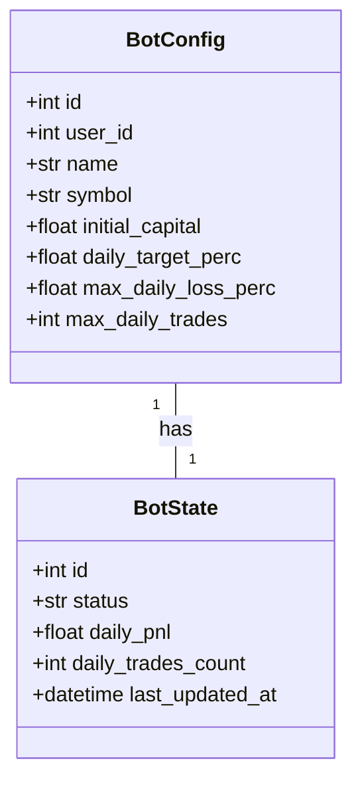
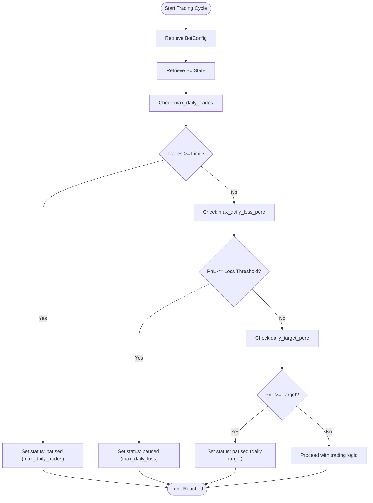
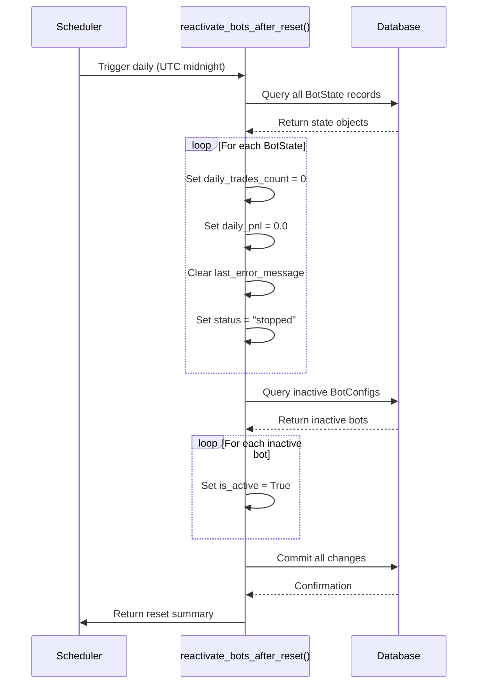

# Daily Limits

<cite>
**Referenced Files in This Document**   
- [bot_config.py](file://app/models/bot_config.py)
- [bot_state.py](file://app/models/bot_state.py)
- [bot_tasks.py](file://app/core/bot_tasks.py)
- [bot_config.py](file://app/schemas/bot_config.py)
- [bot_state.py](file://app/schemas/bot_state.py)
</cite>

## Table of Contents
1. [Introduction](#introduction)
2. [Domain Model of Daily Limits](#domain-model-of-daily-limits)
3. [Configuration Storage](#configuration-storage)
4. [State Management](#state-management)
5. [Enforcement Logic](#enforcement-logic)
6. [Daily Reset Mechanism](#daily-reset-mechanism)
7. [Conflict Resolution and Priority](#conflict-resolution-and-priority)
8. [Implementation Examples](#implementation-examples)
9. [Best Practices](#best-practices)
10. [Troubleshooting Common Issues](#troubleshooting-common-issues)

## Introduction

The Daily Limits sub-feature in TradeBot provides essential safety mechanisms that protect trading capital by enforcing configurable constraints on daily trading activity. This documentation explains the implementation of three critical safety parameters: daily trade limits, daily loss limits, and daily profit targets. These limits are configured through the BotConfig model and enforced in the bot's trading logic within bot_tasks.py. The system uses percentage-based calculations relative to the initial capital setting, ensuring risk parameters scale appropriately with account size. The implementation includes automatic daily reset functionality that clears counters and reactivates paused bots, enabling consistent daily trading cycles. This comprehensive safety framework helps prevent overtrading, limits potential losses, and secures profits according to user-defined parameters.

## Domain Model of Daily Limits

The daily limits system in TradeBot follows a clear domain model that separates configuration from runtime state. The domain consists of two primary entities: BotConfig, which stores user-defined safety parameters, and BotState, which maintains the current execution state and daily counters. These entities work together to enforce trading constraints while preserving historical context across sessions. The relationship between configuration and state enables dynamic adjustment of limits without requiring system restarts, while ensuring that runtime counters persist through bot restarts or system failures.

**Diagram sources**
- [bot_config.py](file://app/models/bot_config.py#L5-L59)
- [bot_state.py](file://app/models/bot_state.py#L5-L24)

**Section sources**
- [bot_config.py](file://app/models/bot_config.py#L5-L59)
- [bot_state.py](file://app/models/bot_state.py#L5-L24)

## Configuration Storage

Daily limit parameters are stored as nullable fields in the BotConfig model, allowing users to enable or disable specific limits as needed. The three primary safety parameters are max_daily_trades (integer), max_daily_loss_perc (numeric), and daily_target_perc (numeric). These fields are defined with nullable=True to support optional configuration, meaning bots can be configured with any combination of limits. The initial_capital field serves as the reference point for percentage-based calculations, ensuring that loss and profit thresholds scale appropriately with the trading account size. When these parameters are updated through the API, the changes are persisted to the database and take effect immediately during the next trading cycle.

**Section sources**
- [bot_config.py](file://app/models/bot_config.py#L14-L28)
- [bot_config.py](file://app/schemas/bot_config.py#L10-L24)

## State Management

Runtime state for daily limits is maintained in the BotState model, which tracks two key counters: daily_pnl (daily profit and loss) and daily_trades_count. These counters are initialized with default values of 0.0 and 0 respectively, ensuring predictable behavior when bots are first created. The daily_pnl counter accumulates realized profits and losses from completed trades throughout the day, while daily_trades_count increments with each executed trade. These state values are persisted to the database after each trading decision, providing durability across system restarts. The state is updated atomically within database transactions to prevent race conditions when multiple processes access the same bot configuration.

**Section sources**
- [bot_state.py](file://app/models/bot_state.py#L17-L18)
- [bot_state.py](file://app/schemas/bot_state.py#L14-L15)

## Enforcement Logic

The enforcement of daily limits occurs in the _run_bot function within bot_tasks.py, where safety checks are performed before executing any trading decisions. The logic follows a sequential evaluation pattern: first checking trade count limits, then daily loss limits, and finally daily profit targets. Each check retrieves the current configuration from BotConfig and the current state from BotState, performing calculations against the initial_capital value. When a limit is reached, the bot's status is updated to reflect the specific constraint that was triggered, and the trading cycle is terminated early. This prevents further trades until the next day or until manual intervention occurs.

**Diagram sources**
- [bot_tasks.py](file://app/core/bot_tasks.py#L351-L398)

**Section sources**
- [bot_tasks.py](file://app/core/bot_tasks.py#L351-L398)

## Daily Reset Mechanism

TradeBot implements an automated daily reset mechanism through the reactivate_bots_after_reset Celery task, which runs once per day (typically at midnight UTC). This task performs two critical functions: resetting daily counters in BotState and reactivating bots that were paused due to reaching their daily limits. The reset process clears daily_trades_count and daily_pnl to zero, resets error messages, and sets the bot status back to "stopped." Additionally, it identifies bots with is_active=False and reactivates them, allowing trading to resume the next day. This mechanism ensures that daily limits function as intended—restricting activity within a single day while automatically resetting for the next trading session without manual intervention.

**Diagram sources**
- [bot_tasks.py](file://app/core/bot_tasks.py#L79-L108)

**Section sources**
- [bot_tasks.py](file://app/core/bot_tasks.py#L79-L108)

## Conflict Resolution and Priority

When multiple daily limits are configured, TradeBot evaluates them in a specific priority order: trade count limit first, followed by loss limit, and then profit target. This sequential evaluation ensures predictable behavior when multiple limits could potentially be triggered simultaneously. The system does not attempt to resolve conflicts between limits because they serve different risk management purposes and can be enabled independently. If a bot reaches its daily trade limit but has not hit loss or profit targets, it will pause trading but can be manually reactivated. The daily reset mechanism ultimately resolves any conflicts by resetting all counters and reactivating bots at the start of each new day, providing a clean slate for trading activity.

**Section sources**
- [bot_tasks.py](file://app/core/bot_tasks.py#L351-L398)

## Implementation Examples

The implementation of daily limits demonstrates several key patterns in the codebase. Percentage-based risk parameters are calculated by converting percentage values to decimal form and multiplying by the initial_capital value from BotConfig. For example, a 5% daily loss limit with a $1,000 initial capital creates a loss threshold of -$50. The daily_trades_count is incremented after each trade execution by querying all trades for the bot and counting them, rather than maintaining a separate increment operation. This approach ensures accuracy even if trades are added through external processes. The status field in BotState is updated with descriptive messages indicating which specific limit was reached, providing clear feedback to users through the interface.

**Section sources**
- [bot_tasks.py](file://app/core/bot_tasks.py#L378-L398)
- [bot_tasks.py](file://app/core/bot_tasks.py#L463-L473)

## Best Practices

When configuring daily limits in TradeBot, several best practices should be followed. First, set realistic percentage-based limits that align with your overall risk management strategy—typically daily loss limits between 1-5% and profit targets between 2-10%. Second, coordinate trade count limits with your trading strategy; high-frequency strategies may require higher limits than swing trading approaches. Third, ensure the initial_capital value is accurately set, as it serves as the foundation for all percentage calculations. Fourth, monitor the automated reset process to confirm it's functioning correctly, especially if trading across multiple time zones. Finally, consider the interaction between different limits—setting both aggressive loss limits and high profit targets may result in short trading sessions that don't fully utilize your strategy's potential.

## Troubleshooting Common Issues

Common issues with daily limits typically involve unexpected pausing of bots or incorrect limit calculations. If a bot pauses unexpectedly, check the status field in BotState to identify which specific limit was reached. Verify that the initial_capital value in BotConfig is correctly set, as an incorrect value will skew all percentage-based calculations. If daily counters are not resetting, confirm that the reactivate_bots_after_reset Celery task is properly scheduled and executing. For issues with trade counting, ensure that the database contains accurate trade records, as the system counts actual trades rather than maintaining a separate counter. When limits appear to be ignored, verify that the configuration values are not null and that the bot is using the expected BotConfig instance. Monitoring logs for messages containing "Daily trade limit reached," "Daily loss limit reached," or "Daily target reached" can help diagnose enforcement issues.

**Section sources**
- [bot_tasks.py](file://app/core/bot_tasks.py#L376-L397)
- [bot_tasks.py](file://app/core/bot_tasks.py#L104-L105)