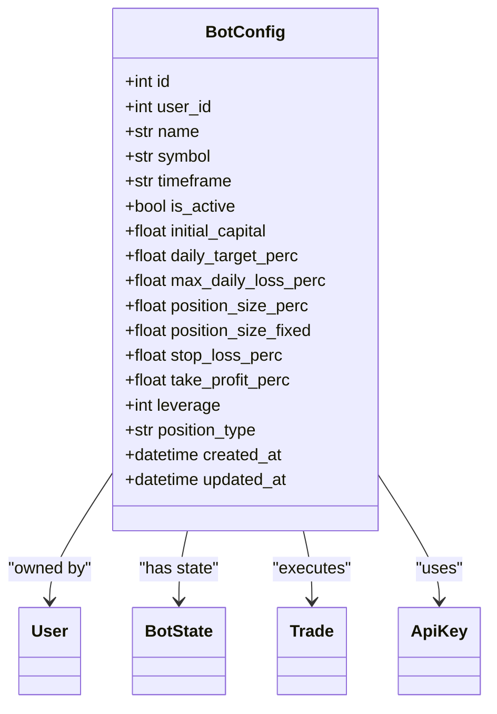
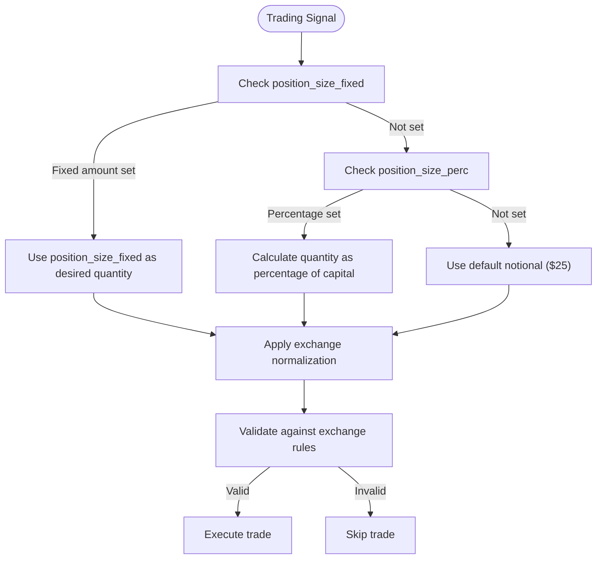

# Position Sizing

<cite>
**Referenced Files in This Document**   
- [bot_config.py](file://app/models/bot_config.py)
- [bot_tasks.py](file://app/core/bot_tasks.py)
- [binance_client.py](file://app/core/binance_client.py)
</cite>

## Table of Contents
1. [Introduction](#introduction)
2. [Position Sizing Domain Model](#position-sizing-domain-model)
3. [Implementation in Bot Configuration](#implementation-in-bot-configuration)
4. [Trading Logic and Position Size Calculation](#trading-logic-and-position-size-calculation)
5. [Exchange Compliance and Quantity Normalization](#exchange-compliance-and-quantity-normalization)
6. [Common Configuration Issues and Solutions](#common-configuration-issues-and-solutions)
7. [Conclusion](#conclusion)

## Introduction

Position sizing is a critical risk management component in automated trading systems, determining the capital allocated to each trade. In TradeBot, position sizing is implemented through two complementary mechanisms: percentage-based sizing (`position_size_perc`) and fixed amount sizing (`position_size_fixed`). These parameters are defined in the `BotConfig` model and enforced within the trading logic in `bot_tasks.py`. This document explains how these mechanisms work, how they interact with available capital, and how they are normalized to meet exchange requirements. The implementation ensures that trading bots operate within defined risk parameters while maintaining compatibility with Binance's trading rules for both spot and futures markets.

## Position Sizing Domain Model

The position sizing functionality in TradeBot is built around a clear domain model that separates configuration from execution. The core of this model is the `BotConfig` class, which defines the parameters that control how trading bots allocate capital. Two key attributes in this model are `position_size_perc` and `position_size_fixed`, which represent alternative approaches to determining trade size.

The domain model also includes related risk management parameters such as `initial_capital`, `stop_loss_perc`, and `take_profit_perc`, which work in conjunction with position sizing to create a comprehensive risk framework. The model supports both spot and futures trading through the `position_type` attribute, with futures trading incorporating leverage through the `leverage` parameter. This design allows users to configure their risk profile comprehensively, with position sizing being a central element of that configuration.

**Section sources**
- [bot_config.py](file://app/models/bot_config.py#L4-L57)

## Implementation in Bot Configuration

Position sizing parameters are defined in the `BotConfig` model as nullable numeric fields, allowing for flexible configuration. The `position_size_perc` field represents the percentage of available capital to use for each trade, while `position_size_fixed` specifies an absolute amount. These fields are implemented as SQLAlchemy columns with appropriate data types and nullability settings.

The configuration system allows users to choose between percentage-based and fixed amount sizing, or to leave both fields null to use default behavior. When both fields are null, the system falls back to a default notional value of $25 for trade sizing. This fallback mechanism ensures that bots can operate even with minimal configuration, while still providing experienced users with precise control over position sizing.

The configuration is validated through Pydantic schemas that ensure data integrity when creating or updating bot configurations. These schemas include validation rules for related parameters like leverage (constrained to 1-125 range) and position type (restricted to "spot" or "futures"), creating a robust foundation for position sizing decisions.



**Diagram sources**
- [bot_config.py](file://app/models/bot_config.py#L4-L57)

**Section sources**
- [bot_config.py](file://app/models/bot_config.py#L4-L57)

## Trading Logic and Position Size Calculation

The position sizing logic is implemented in the `_run_bot` function within `bot_tasks.py`, which orchestrates the trading workflow. When a trading signal is generated, the system calculates the desired position size by first checking the `position_size_fixed` parameter. If this is set to a positive value, it is used directly as the desired quantity. Otherwise, the system uses the `position_size_perc` parameter to calculate a percentage of available capital, falling back to a default notional value if both sizing parameters are null.

The calculation takes into account the current market price to convert between notional values and actual quantities. For example, with a $1000 initial capital and a `position_size_perc` of 10, the system would attempt to trade $100 worth of the target asset. This amount is then converted to a quantity by dividing by the current price. The resulting quantity is subject to further processing to ensure it meets exchange requirements, which is handled by the Binance client wrapper.

The trading logic also incorporates additional risk controls, such as daily trade limits and profit/loss targets, which can prevent trades from executing even when position sizing parameters are properly configured. This layered approach to risk management ensures that position sizing operates within broader risk parameters.



**Diagram sources**
- [bot_tasks.py](file://app/core/bot_tasks.py#L126-L518)

**Section sources**
- [bot_tasks.py](file://app/core/bot_tasks.py#L126-L518)

## Exchange Compliance and Quantity Normalization

To ensure trades comply with Binance's requirements, TradeBot implements a comprehensive normalization process through the `BinanceClientWrapper` class. This process addresses the specific constraints of both spot and futures markets, including minimum order sizes, step sizes, and notional value requirements.

For spot trading, the `normalize_spot_quantity` method applies LOT_SIZE and MIN_NOTIONAL filters from Binance's API. It ensures that order quantities are multiples of the exchange's step size and that the total order value meets minimum notional requirements. For futures trading, the `normalize_futures_quantity` method performs similar normalization using MARKET_LOT_SIZE and NOTIONAL filters specific to the futures market.

The normalization process works by first determining the desired quantity based on position sizing parameters, then adjusting this quantity to meet exchange requirements. If the normalized quantity would result in a notional value below the exchange's minimum, the system calculates the minimum acceptable quantity and adjusts accordingly. If no valid quantity can be determined, the trade is skipped to prevent order rejection.

This normalization layer is critical for reliable bot operation, as it prevents common errors like "LOT_SIZE filter" or "MIN_NOTIONAL filter" rejections from the exchange. By handling these requirements at the application level, TradeBot ensures smooth execution across different trading pairs and market conditions.

```mermaid
classDiagram
class BinanceClientWrapper {
+Client client
+normalize_spot_quantity(symbol, price, desired_qty)
+normalize_futures_quantity(symbol, price, desired_qty)
+get_symbol_filters_spot(symbol)
+get_symbol_filters_futures(symbol)
+_round_step(quantity, step_size)
}
class BotConfig {
+float position_size_perc
+float position_size_fixed
}
class TradeExecution {
+execute_trade()
+calculate_position_size()
}
BotConfig --> TradeExecution : "provides sizing parameters"
TradeExecution --> BinanceClientWrapper : "uses for normalization"
BinanceClientWrapper --> "Binance API" : "fetches filters"
```

**Diagram sources**
- [binance_client.py](file://app/core/binance_client.py#L18-L574)
- [bot_tasks.py](file://app/core/bot_tasks.py#L126-L518)

**Section sources**
- [binance_client.py](file://app/core/binance_client.py#L18-L574)

## Common Configuration Issues and Solutions

Several common issues can arise when configuring position sizing in TradeBot. One frequent problem is setting both `position_size_perc` and `position_size_fixed` to null values, which results in the system using the default notional value of $25. While this provides a fallback, it may not align with the user's risk tolerance. The solution is to explicitly set one of these parameters based on the desired risk profile.

Another common issue is configuring position sizes that are too small to meet exchange minimums. For example, a very small `position_size_fixed` value or a low `position_size_perc` with limited capital might result in quantities below the exchange's minimum notional requirement. The system handles this by attempting to adjust the quantity, but users should monitor their configurations to ensure they are appropriate for their chosen trading pairs.

A third issue involves leverage configuration in futures trading. While the `leverage` parameter is set independently of position sizing, it effectively multiplies the position size in terms of risk exposure. Users may inadvertently create excessive risk by combining high leverage with aggressive position sizing. The solution is to consider leverage and position size together when configuring risk parameters.

Finally, users may encounter issues when switching between spot and futures trading, as the normalization rules differ between these markets. The system automatically applies the appropriate normalization based on `position_type`, but users should be aware of the different requirements and adjust their position sizing accordingly.

**Section sources**
- [bot_config.py](file://app/models/bot_config.py#L4-L57)
- [bot_tasks.py](file://app/core/bot_tasks.py#L126-L518)
- [binance_client.py](file://app/core/binance_client.py#L18-L574)

## Conclusion

Position sizing in TradeBot provides a flexible and robust framework for managing risk in automated trading. By offering both percentage-based and fixed amount sizing options, the system accommodates different trading strategies and risk preferences. The implementation seamlessly integrates configuration parameters with execution logic, ensuring that trading decisions align with user-defined risk parameters.

The layered approach to position sizing—combining user configuration, capital-based calculations, and exchange compliance—creates a reliable system that can operate effectively across different market conditions. The normalization process ensures that trades meet exchange requirements, preventing common errors and improving execution reliability.

For beginners, the system provides sensible defaults and clear configuration options, making it accessible even with limited trading experience. For experienced developers, the transparent implementation and comprehensive risk controls offer the precision needed for sophisticated trading strategies. By understanding how position sizing interacts with other risk parameters and exchange requirements, users can configure their trading bots to operate within their desired risk tolerance while maximizing trading efficiency.