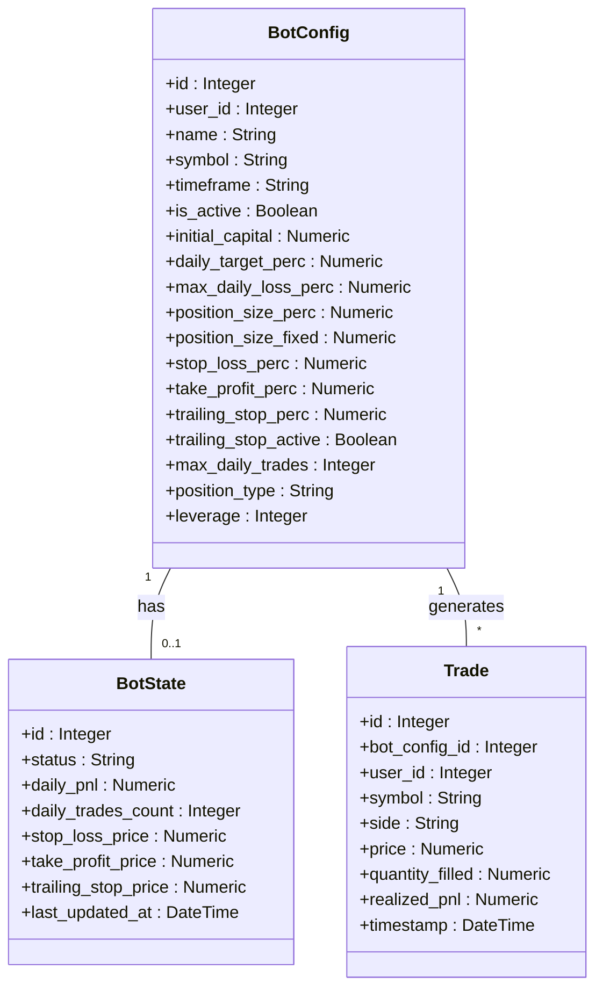
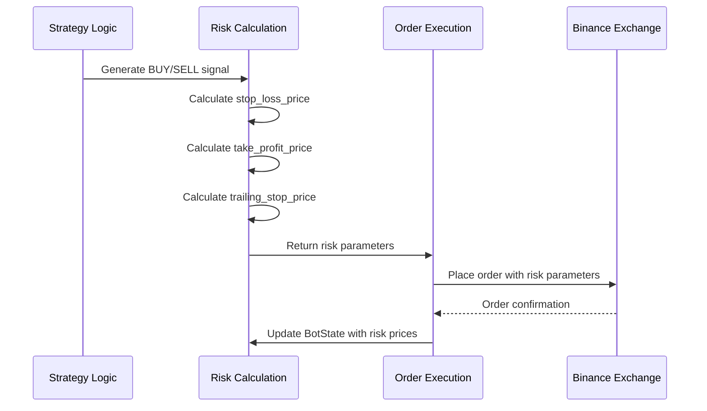
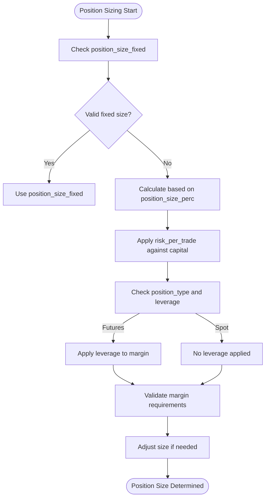
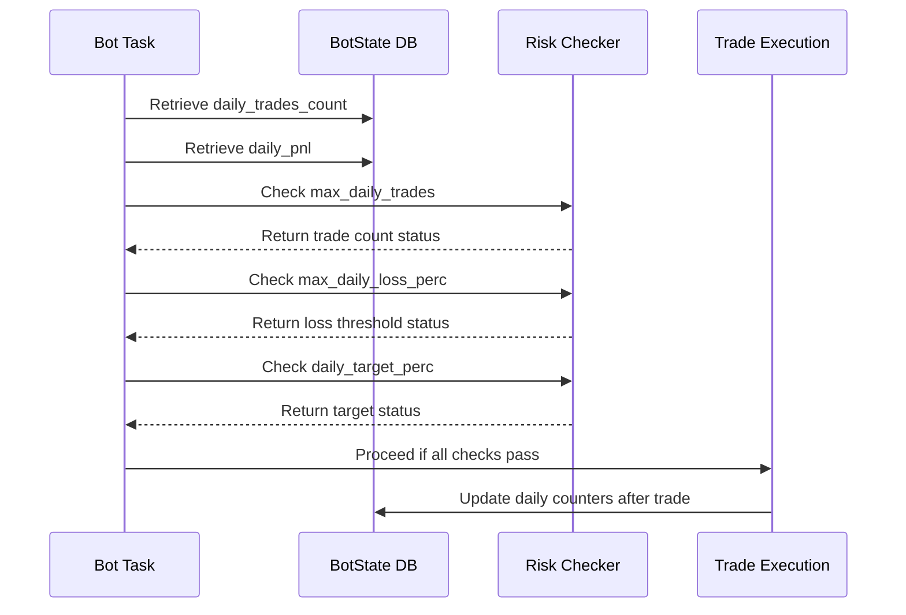

# Risk Management System

<cite>
**Referenced Files in This Document**   
- [bot_config.py](file://app/models/bot_config.py)
- [bot_tasks.py](file://app/core/bot_tasks.py)
- [bot_state.py](file://app/models/bot_state.py)
</cite>

## Table of Contents
1. [Introduction](#introduction)
2. [Domain Model of Risk Parameters](#domain-model-of-risk-parameters)
3. [Risk Controls Implementation](#risk-controls-implementation)
4. [Position Sizing and Capital Allocation](#position-sizing-and-capital-allocation)
5. [Daily Trade Limits and P&L Tracking](#daily-trade-limits-and-pnl-tracking)
6. [Common Risk Parameter Conflicts and Solutions](#common-risk-parameter-conflicts-and-solutions)
7. [Conclusion](#conclusion)

## Introduction
The TradeBot risk management system implements a comprehensive set of safety mechanisms designed to protect trading capital and ensure sustainable performance. This document details the implementation of key risk controls including stop-loss, take-profit, trailing stop, daily loss limits, daily profit targets, and position sizing. The system is built around the BotConfig model which stores all risk parameters, and the bot_tasks.py module which enforces these parameters in the trading logic. The risk management framework calculates percentage-based parameters against the account balance and tracks daily trade limits to prevent excessive risk exposure. This documentation provides both beginner-friendly explanations and technical depth for developers implementing risk controls in automated trading systems.

## Domain Model of Risk Parameters

The risk management system is centered around the BotConfig model which defines all risk parameters as database columns. These parameters are categorized into basic and custom risk controls, with appropriate validation and default values.

**Diagram sources**
- [bot_config.py](file://app/models/bot_config.py#L4-L57)
- [bot_state.py](file://app/models/bot_state.py#L4-L22)
- [trade.py](file://app/models/trade.py#L4-L25)

**Section sources**
- [bot_config.py](file://app/models/bot_config.py#L4-L57)
- [bot_state.py](file://app/models/bot_state.py#L4-L22)

## Risk Controls Implementation

The risk controls are implemented through a combination of configuration parameters in the BotConfig model and enforcement logic in the bot_tasks.py module. The system supports both basic and custom risk parameters, allowing users to override default values with their own settings.

The stop-loss, take-profit, and trailing stop mechanisms are calculated as percentage-based values relative to the entry price. For long positions, the stop-loss price is calculated as `entry_price * (1 - stop_loss / 100)` while the take-profit price is `entry_price * (1 + take_profit / 100)`. For short positions, these calculations are inverted to account for the different risk profile.

**Diagram sources**
- [bot_tasks.py](file://app/core/bot_tasks.py#L325-L351)
- [bot_tasks.py](file://app/core/bot_tasks.py#L422-L425)

**Section sources**
- [bot_tasks.py](file://app/core/bot_tasks.py#L259-L351)

## Position Sizing and Capital Allocation

Position sizing is a critical component of the risk management system, determining the appropriate trade size based on the user's risk tolerance and account balance. The system supports both percentage-based and fixed position sizing through the `position_size_perc` and `position_size_fixed` parameters in the BotConfig model.

The position sizing logic first attempts to use the fixed position size if specified. If no fixed size is provided, it calculates the position size as a percentage of the account balance. This ensures that trades are appropriately sized relative to the available capital, preventing overexposure.

For futures trading, the system also considers leverage when calculating position size, adjusting the margin requirements accordingly. The maximum leverage is capped at 50x as a safety measure to prevent excessive risk.

**Diagram sources**
- [bot_tasks.py](file://app/core/bot_tasks.py#L340-L351)
- [bot_tasks.py](file://app/core/bot_tasks.py#L399-L405)

**Section sources**
- [bot_tasks.py](file://app/core/bot_tasks.py#L340-L351)

## Daily Trade Limits and P&L Tracking

The system implements daily trade limits and profit/loss tracking through the BotState model, which maintains counters for daily trades and cumulative P&L. These limits are enforced before executing any new trades, ensuring compliance with the user's risk parameters.

The daily loss limit is calculated as a percentage of the initial capital (`max_daily_loss_perc`). When the cumulative daily P&L falls below this threshold, the bot is automatically paused. Similarly, when the daily profit target (`daily_target_perc`) is reached, the bot pauses to lock in gains.

The system also enforces a maximum number of daily trades (`max_daily_trades`) to prevent overtrading. These limits are checked in sequence, with the bot returning an appropriate status message when any limit is reached.

**Diagram sources**
- [bot_tasks.py](file://app/core/bot_tasks.py#L370-L397)
- [bot_state.py](file://app/models/bot_state.py#L16-L18)

**Section sources**
- [bot_tasks.py](file://app/core/bot_tasks.py#L361-L397)

## Common Risk Parameter Conflicts and Solutions

Several potential conflicts can arise when configuring risk parameters, and the system includes safeguards to handle these scenarios:

1. **Conflicting Stop-Loss and Take-Profit with Trailing Stop**: When both fixed stop-loss/take-profit and trailing stop are enabled, the system uses the more conservative exit price. For long positions, the effective stop price is the maximum of the fixed stop-loss and trailing stop prices.

2. **Position Size Conflicts**: When both percentage-based and fixed position sizing are specified, the system prioritizes the fixed size. If the fixed size would exceed available capital, it falls back to percentage-based sizing.

3. **Leverage and Margin Conflicts**: For futures trading, the system validates that the calculated position size does not exceed available margin. If necessary, it adjusts the position size to stay within margin limits.

4. **Daily Limit Conflicts**: The system checks daily limits in a specific order: trade count, loss limit, then profit target. This ensures consistent behavior when multiple limits are reached simultaneously.

The reactivate_bots_after_reset task runs daily to reset all counters and reactivate paused bots, ensuring that daily limits are applied on a rolling 24-hour basis rather than a calendar day basis.

**Section sources**
- [bot_tasks.py](file://app/core/bot_tasks.py#L72-L75)
- [bot_tasks.py](file://app/core/bot_tasks.py#L370-L397)
- [bot_tasks.py](file://app/core/bot_tasks.py#L80-L109)

## Conclusion
The TradeBot risk management system provides a robust framework for controlling trading risk through a combination of configurable parameters and automated enforcement mechanisms. By storing risk parameters in the BotConfig model and enforcing them in the bot_tasks.py module, the system ensures consistent application of risk controls across all trading activities. The implementation of percentage-based calculations relative to account balance allows for dynamic risk management that scales with the user's capital. Daily trade limits and P&L tracking provide additional safeguards against excessive risk exposure, while the comprehensive domain model enables detailed monitoring and analysis of trading performance. This risk management framework balances flexibility with safety, allowing users to customize their risk parameters while protecting against common trading pitfalls.