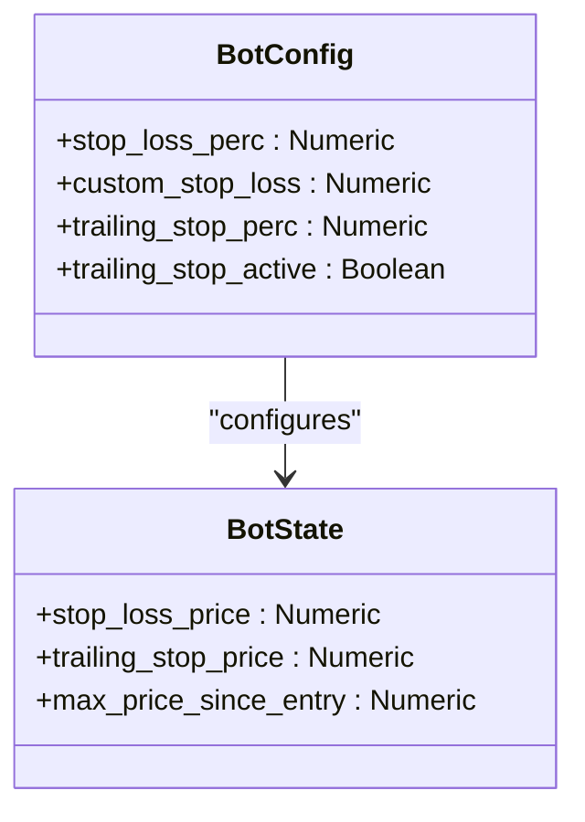
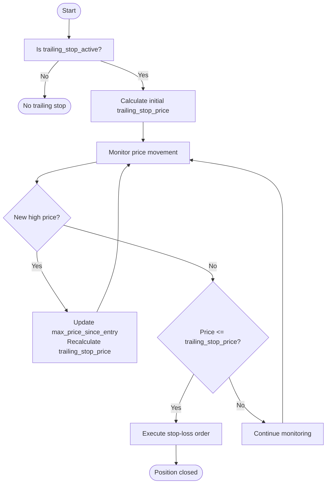

# Stop-Loss Mechanisms

<cite>
**Referenced Files in This Document**   
- [bot_config.py](file://app/models/bot_config.py)
- [bot_state.py](file://app/models/bot_state.py)
- [bot_tasks.py](file://app/core/bot_tasks.py)
- [backtest_service.py](file://app/services/backtest_service.py)
</cite>

## Table of Contents
1. [Introduction](#introduction)
2. [Domain Model of Stop-Loss Parameters](#domain-model-of-stop-loss-parameters)
3. [Fixed Percentage Stop-Loss Implementation](#fixed-percentage-stop-loss-implementation)
4. [Trailing Stop-Loss Implementation](#trailing-stop-loss-implementation)
5. [Stop-Loss Price Calculation Logic](#stop-loss-price-calculation-logic)
6. [Common Configuration Issues and Solutions](#common-configuration-issues-and-solutions)
7. [Conclusion](#conclusion)

## Introduction
This document provides a comprehensive analysis of the stop-loss mechanisms implemented in the TradeBot system. The safety controls are designed to protect trading capital by automatically closing positions when losses reach predefined thresholds. Two primary stop-loss strategies are supported: fixed percentage stop-loss and trailing stop-loss. These mechanisms are configured through the BotConfig model and enforced in the trading logic within bot_tasks.py. The implementation ensures risk management is consistently applied across both live trading and backtesting environments.

## Domain Model of Stop-Loss Parameters

The stop-loss functionality is governed by a well-defined domain model that spans multiple components of the application. The core parameters are stored in the BotConfig model, while runtime state is maintained in the BotState model.

**Diagram sources**
- [bot_config.py](file://app/models/bot_config.py#L18-L21)
- [bot_state.py](file://app/models/bot_state.py#L12-L15)

**Section sources**
- [bot_config.py](file://app/models/bot_config.py#L4-L57)
- [bot_state.py](file://app/models/bot_state.py#L4-L22)

## Fixed Percentage Stop-Loss Implementation

The fixed percentage stop-loss mechanism provides a straightforward risk management approach by setting a static exit price based on a percentage of the entry price. This implementation is controlled by two key parameters in the BotConfig model: `stop_loss_perc` and `custom_stop_loss`. The `stop_loss_perc` field is mandatory and defines the default stop-loss percentage, while `custom_stop_loss` provides an optional override with a default value of 0.5%.

When a trade is executed, the system calculates the stop-loss price using the current market price and the configured percentage. For long positions, the stop-loss price is calculated as: `entry_price * (1 - stop_loss_percentage / 100)`. This price is then stored in the BotState model's `stop_loss_price` field, where it serves as a trigger for automatic position closure if the market moves against the position.

The implementation ensures that stop-loss orders are properly communicated to the exchange through the Binance client wrapper, which handles the placement of appropriate order types (OCO orders for spot trading and reduce-only STOP_MARKET orders for futures).

**Section sources**
- [bot_config.py](file://app/models/bot_config.py#L18-L41)
- [bot_tasks.py](file://app/core/bot_tasks.py#L259-L338)

## Trailing Stop-Loss Implementation

The trailing stop-loss mechanism provides a dynamic risk management approach that adjusts the exit price as the market moves in favor of the position. This implementation is controlled by the `trailing_stop_perc` and `trailing_stop_active` fields in the BotConfig model. The `trailing_stop_perc` parameter defines the percentage distance from the highest price reached since entry, while `trailing_stop_active` is a boolean flag that enables or disables the trailing stop functionality.

When activated, the system continuously monitors the market price and updates the trailing stop price whenever a new high is reached. The trailing stop price is calculated as: `max_price_since_entry * (1 - trailing_stop_percentage / 100)`. The `max_price_since_entry` is tracked in the BotState model and updated whenever the current price exceeds the previous maximum.

During backtesting, the system simulates this behavior by iterating through historical price data and updating the trailing stop price whenever a new high is encountered in the candle data. This ensures that the trailing stop logic behaves consistently between simulated and live trading environments.

**Diagram sources**
- [bot_config.py](file://app/models/bot_config.py#L20-L21)
- [bot_state.py](file://app/models/bot_state.py#L12-L14)
- [backtest_service.py](file://app/services/backtest_service.py#L709-L723)

**Section sources**
- [bot_config.py](file://app/models/bot_config.py#L20-L44)
- [bot_tasks.py](file://app/core/bot_tasks.py#L261-L263)
- [backtest_service.py](file://app/services/backtest_service.py#L701-L728)

## Stop-Loss Price Calculation Logic

The stop-loss price calculation logic is implemented consistently across both live trading and backtesting scenarios. The core calculation follows the same mathematical formula regardless of the stop-loss type, with variations based on the position direction.

For long positions (BUY), the stop-loss price is calculated below the entry price:
- Fixed stop-loss: `stop_loss_price = entry_price * (1 - stop_loss_percentage / 100)`
- Trailing stop-loss: `trailing_stop_price = max_price_since_entry * (1 - trailing_stop_percentage / 100)`

For short positions (SELL), the stop-loss price is calculated above the entry price:
- Fixed stop-loss: `stop_loss_price = entry_price * (1 + stop_loss_percentage / 100)`

The system prioritizes custom stop-loss values when available, falling back to the default `stop_loss_perc` if `custom_stop_loss` is not configured. This hierarchical approach provides flexibility while ensuring that a stop-loss is always defined.

In the backtesting service, the same calculation logic is applied to historical data, allowing for accurate simulation of stop-loss behavior. The system checks each subsequent candle's price action against the stop-loss and trailing stop prices, executing the exit when the price crosses the threshold.

**Section sources**
- [bot_tasks.py](file://app/core/bot_tasks.py#L333-L338)
- [backtest_service.py](file://app/services/backtest_service.py#L677-L679)

## Common Configuration Issues and Solutions

Several common issues can arise when configuring stop-loss parameters in the TradeBot system. Understanding these issues and their solutions is crucial for effective risk management.

**Issue 1: Missing Stop-Loss Configuration**
The most critical issue occurs when stop-loss parameters are not properly configured. Since `stop_loss_perc` is a required field in the BotConfig model, this scenario is prevented at the database level. However, users might set excessively high values that effectively disable the protection.

*Solution*: Implement frontend validation to warn users when stop-loss percentages exceed reasonable thresholds (e.g., 10%). The system should also provide default values and clear guidance on appropriate risk levels.

**Issue 2: Conflicting Stop-Loss Strategies**
Users might enable both fixed and trailing stop-loss mechanisms simultaneously, creating potential conflicts in execution logic.

*Solution*: The system should clearly document that trailing stop-loss takes precedence when active. The trading logic already handles this by checking the `trailing_stop_active` flag and using the trailing stop price when appropriate.

**Issue 3: Inadequate Trailing Stop Percentage**
Setting a trailing stop percentage that is too tight can result in premature position closure due to normal market volatility.

*Solution*: The system provides a default `custom_trailing_stop` value of 0.3%, which represents a reasonable balance between protection and flexibility. Users should be educated on adjusting this parameter based on the volatility characteristics of their trading pair.

**Issue 4: Decimal Precision Issues**
Floating-point arithmetic can introduce small calculation errors that might affect stop-loss price accuracy.

*Solution*: The system uses the Numeric data type for all price and percentage fields, which provides exact decimal representation and avoids floating-point precision issues. The Binance client wrapper also includes price normalization functions that ensure compliance with exchange precision requirements.

**Section sources**
- [bot_config.py](file://app/models/bot_config.py#L18-L21)
- [bot_tasks.py](file://app/core/bot_tasks.py#L259-L263)
- [binance_client.py](file://app/core/binance_client.py#L227-L237)

## Conclusion
The stop-loss mechanisms in TradeBot provide robust safety controls that protect trading capital through both fixed percentage and trailing stop-loss strategies. The implementation is well-structured, with clear separation between configuration (BotConfig) and runtime state (BotState). The calculation logic is consistent across live trading and backtesting environments, ensuring reliable risk management. By understanding the domain model and potential configuration issues, users can effectively leverage these safety controls to manage their trading risk. The system's design prioritizes capital preservation while providing flexibility for different trading strategies and risk tolerances.