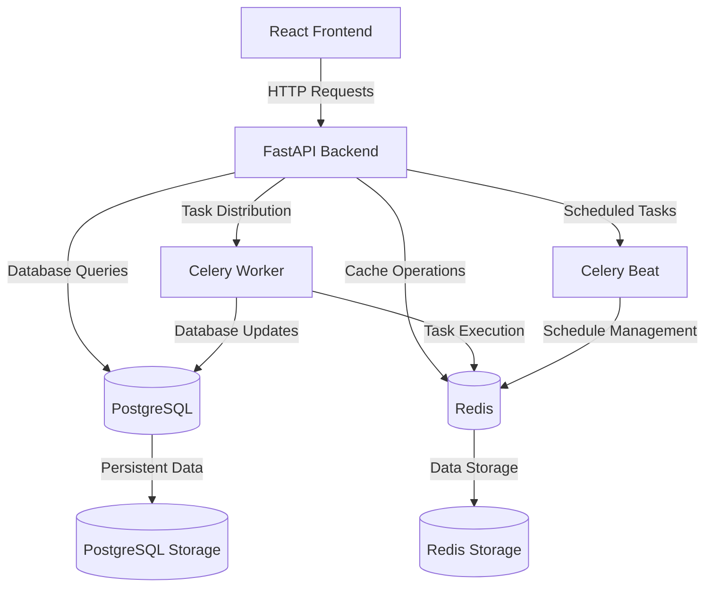
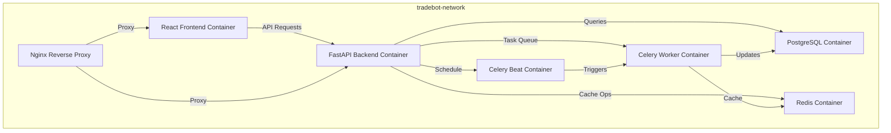
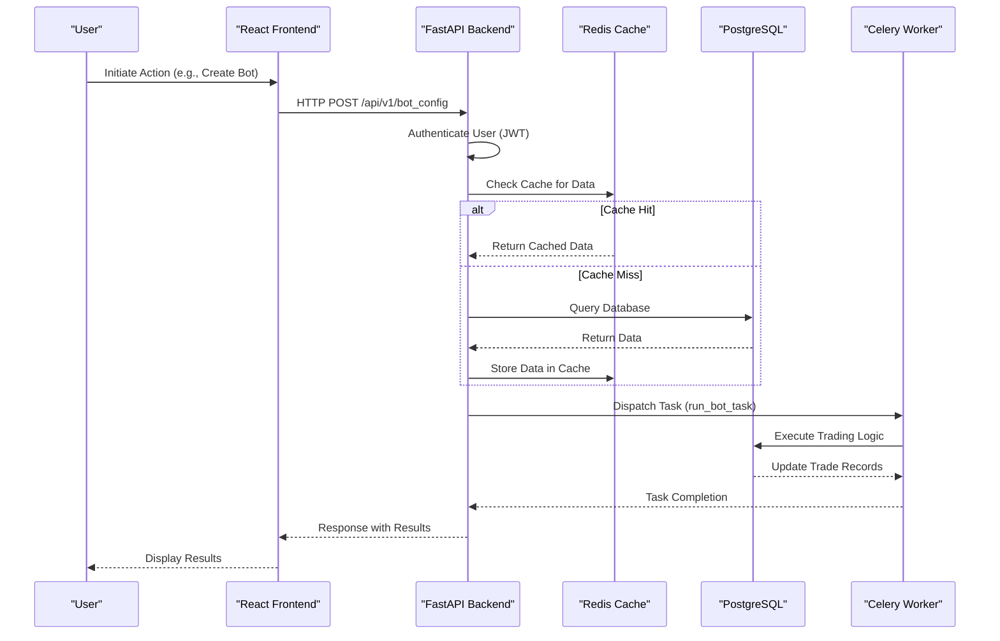
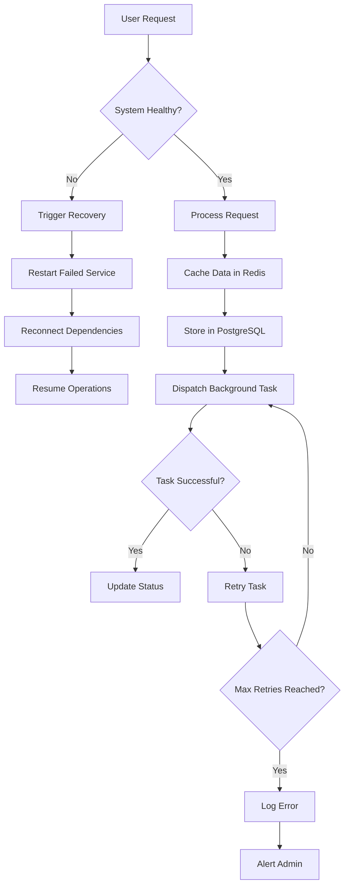

# Architectural Components

<cite>
**Referenced Files in This Document**   
- [main.py](file://app/main.py)
- [bot_tasks.py](file://app/core/bot_tasks.py)
- [cache.py](file://app/core/cache.py)
- [celery_app.py](file://app/core/celery_app.py)
- [redis_client.py](file://app/core/redis_client.py)
- [docker-compose.yml](file://docker-compose.yml)
- [health.py](file://app/api/routes/health.py)
- [backtest.py](file://app/api/routes/backtest.py)
</cite>

## Table of Contents
1. [Introduction](#introduction)
2. [System Architecture Overview](#system-architecture-overview)
3. [Component Integration via Docker](#component-integration-via-docker)
4. [User Request Flow](#user-request-flow)
5. [Scalability and Failure Recovery](#scalability-and-failure-recovery)
6. [Conclusion](#conclusion)

## Introduction
The TradeBot system is a full-stack trading automation platform designed to manage cryptocurrency trading bots through a comprehensive architecture. This document details the architectural components of TradeBot, focusing on the integration and interaction between its core technologies: FastAPI for backend services, React for the frontend interface, PostgreSQL for persistent data storage, Redis for caching, and Celery for background task processing. The system leverages Docker containers for deployment, ensuring consistent environments across development and production. This architecture enables efficient handling of trading operations, real-time data processing, and user interactions while maintaining scalability and reliability.

## System Architecture Overview
The TradeBot system consists of multiple interconnected components that work together to provide a seamless trading experience. The frontend, built with React, serves as the user interface where users can configure and monitor their trading bots. It communicates with the FastAPI backend through RESTful APIs to perform actions such as creating bot configurations, retrieving trade data, and managing user accounts. The backend processes these requests and interacts with the PostgreSQL database for persistent data storage, including user information, bot configurations, and trade history.

For performance optimization, Redis is used as a caching layer to store frequently accessed data, reducing the load on the database and improving response times. Celery, integrated with Redis as a message broker, handles background tasks such as executing trading strategies, updating bot states, and performing periodic maintenance operations. This separation of concerns allows the system to handle high-frequency trading operations efficiently while maintaining responsiveness for user interactions.

**Diagram sources**
- [docker-compose.yml](file://docker-compose.yml)
- [main.py](file://app/main.py)

**Section sources**
- [main.py](file://app/main.py)
- [docker-compose.yml](file://docker-compose.yml)

## Component Integration via Docker
The TradeBot system utilizes Docker containers to encapsulate and deploy its various components, ensuring consistency across different environments. The `docker-compose.yml` file defines the services required for the application, including the PostgreSQL database, Redis cache, FastAPI backend, Celery workers, and the React frontend. Each service runs in its own container, isolated from others, which enhances security and simplifies management.

The PostgreSQL container provides persistent data storage for the application, hosting tables for users, bot configurations, trades, and other entities. It is configured with health checks to ensure availability and uses environment variables for secure configuration of credentials. Similarly, the Redis container acts as both a cache and a message broker for Celery, facilitating fast data access and reliable task queuing. Both databases are exposed on standard ports and are accessible only within the Docker network, enhancing security.

The FastAPI backend container hosts the RESTful API endpoints, serving requests from the frontend and coordinating interactions with the database and background tasks. It depends on both PostgreSQL and Redis being healthy before starting, ensuring that all dependencies are met. The Celery worker and beat containers handle background processing and scheduled tasks, respectively. They share the same image as the backend but run different commands to start the Celery processes. The frontend container serves the React application, proxying API requests to the backend through Nginx in production setups.

**Diagram sources**
- [docker-compose.yml](file://docker-compose.yml)

**Section sources**
- [docker-compose.yml](file://docker-compose.yml)

## User Request Flow
The flow of user requests in the TradeBot system begins at the React frontend, where users interact with the application through a web interface. When a user performs an action, such as creating a new bot configuration or viewing trade history, the frontend sends an HTTP request to the FastAPI backend. These requests are routed through defined API endpoints, which validate input, authenticate the user, and process the request accordingly.

Upon receiving a request, the FastAPI backend first authenticates the user using JWT tokens. If authentication is successful, the request is processed by the appropriate route handler. For example, when retrieving bot configurations, the backend queries the PostgreSQL database using SQLAlchemy ORM to fetch the relevant records. Before accessing the database, the system checks if the requested data is available in the Redis cache. If a cache hit occurs, the data is returned directly from Redis, significantly reducing latency. If not, the data is fetched from the database, cached in Redis for future requests, and then returned to the frontend.

For operations that require background processing, such as executing trading strategies or performing backtests, the backend delegates tasks to Celery. The `run_bot_task_for_all` function in `app/core/bot_tasks.py` demonstrates this by iterating over active bot configurations and dispatching individual tasks to Celery workers. These workers execute the trading logic independently, updating the database with results and sending notifications as needed. This asynchronous processing ensures that the main application remains responsive even during intensive operations.

**Diagram sources**
- [main.py](file://app/main.py)
- [bot_tasks.py](file://app/core/bot_tasks.py)
- [cache.py](file://app/core/cache.py)

**Section sources**
- [main.py](file://app/main.py)
- [bot_tasks.py](file://app/core/bot_tasks.py)
- [cache.py](file://app/core/cache.py)

## Scalability and Failure Recovery
The TradeBot system is designed with scalability and failure recovery in mind, leveraging the capabilities of its architectural components to ensure high availability and performance under varying loads. Scalability is achieved through the use of containerization and microservices principles, allowing individual components to be scaled independently based on demand. For instance, additional Celery worker instances can be deployed to handle increased background task loads, while the FastAPI backend can be load-balanced across multiple containers to distribute incoming HTTP requests.

Failure recovery mechanisms are implemented at multiple levels within the system. The PostgreSQL database is configured with health checks and automatic restart policies, ensuring that it recovers from transient failures without manual intervention. Similarly, Redis and other services have health checks that monitor their status and trigger restarts if necessary. The use of environment variables for configuration allows for easy updates and rollbacks in case of misconfigurations.

Celery provides robust task queuing and retry mechanisms, ensuring that critical operations such as trading executions are not lost due to temporary failures. Tasks can be retried automatically upon failure, and the system logs detailed information about task execution for debugging purposes. The `reactivate_bots_after_reset` function in `app/core/bot_tasks.py` exemplifies a scheduled task that resets bot states daily, preventing accumulation of errors and ensuring consistent operation.

**Diagram sources**
- [celery_app.py](file://app/core/celery_app.py)
- [bot_tasks.py](file://app/core/bot_tasks.py)

**Section sources**
- [celery_app.py](file://app/core/celery_app.py)
- [bot_tasks.py](file://app/core/bot_tasks.py)

## Conclusion
The TradeBot system's architecture effectively integrates FastAPI, React, PostgreSQL, Redis, and Celery through Docker containers to create a scalable and reliable trading platform. By leveraging containerization, the system ensures consistent deployment across environments while maintaining isolation and security between components. The use of Redis for caching and Celery for background task processing enhances performance and responsiveness, allowing the platform to handle complex trading operations efficiently. With robust scalability and failure recovery mechanisms in place, TradeBot is well-equipped to support growing user demands and maintain high availability, making it a solid foundation for automated cryptocurrency trading.