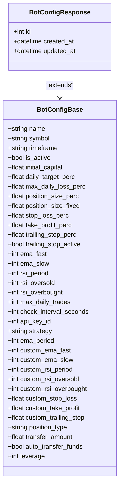

# API Endpoints

<cite>
**Referenced Files in This Document**   
- [auth.py](file://app/api/routes/auth.py)
- [bot_config.py](file://app/api/routes/bot_config.py)
- [bot_runner.py](file://app/api/routes/bot_runner.py)
- [backtest.py](file://app/api/routes/backtest.py)
- [trade.py](file://app/api/routes/trade.py)
- [api_key.py](file://app/api/routes/api_key.py)
- [user.py](file://app/schemas/user.py)
- [bot_config.py](file://app/schemas/bot_config.py)
- [backtest.py](file://app/schemas/backtest.py)
- [trade.py](file://app/schemas/trade.py)
- [api_key.py](file://app/schemas/api_key.py)
- [token.py](file://app/schemas/token.py)
- [jwt.py](file://app/core/jwt.py)
- [auth.py](file://app/dependencies/auth.py)
- [rate_limit.py](file://app/core/rate_limit.py)
</cite>

## Table of Contents
1. [Introduction](#introduction)
2. [Authentication Endpoints](#authentication-endpoints)
3. [Bot Configuration Endpoints](#bot-configuration-endpoints)
4. [Bot Control Endpoints](#bot-control-endpoints)
5. [Backtesting Endpoints](#backtesting-endpoints)
6. [Trade History Endpoints](#trade-history-endpoints)
7. [API Key Management Endpoints](#api-key-management-endpoints)
8. [Rate Limiting](#rate-limiting)
9. [Error Response Format](#error-response-format)
10. [Client Integration Guidance](#client-integration-guidance)

## Introduction
This document provides comprehensive documentation for the TradeBot backend API endpoints. The API is built using FastAPI and follows RESTful principles with JWT-based authentication. All endpoints are protected by authentication unless explicitly noted otherwise. The backend supports key trading functionalities including user authentication, bot configuration and control, backtesting, trade history retrieval, and API key management.

The API uses Pydantic models for request and response validation, SQLAlchemy for database operations, and Celery for asynchronous task execution. All endpoints are versioned under `/api/v1/` and return JSON responses. Authentication is required for all endpoints except user registration and login, using Bearer tokens via the OAuth2PasswordBearer scheme.

**Section sources**
- [auth.py](file://app/api/routes/auth.py)
- [main.py](file://app/main.py)

## Authentication Endpoints

### POST /api/v1/auth/register
Registers a new user in the system.

**Request**
- Method: POST
- URL: `/api/v1/auth/register`
- Authentication: Not required
- Request Body: `UserCreate` schema
  - `email`: User's email address (must be valid)
  - `password`: User's password (must meet complexity requirements: minimum 12 characters, uppercase, lowercase, digit, special character)

**Response**
- Status: 200 OK
- Response Body: `UserResponse` schema
  - `id`: User ID
  - `email`: User's email
  - `is_active`: Boolean indicating if user is active

**Error Responses**
- 400: Invalid email format or password policy violation
- 409: Email already registered

### POST /api/v1/auth/login
Authenticates a user and returns a JWT access token.

**Request**
- Method: POST
- URL: `/api/v1/auth/login`
- Authentication: Not required
- Request Body: `UserLogin` schema
  - `email`: User's email
  - `password`: User's password
  - `remember_me`: Optional boolean to extend token expiration to 30 days (default: 7 days)

**Response**
- Status: 200 OK
- Response Body: `Token` schema
  - `access_token`: JWT token for subsequent requests
  - `token_type`: "bearer"
  - `user`: User information (id, email, is_active)

**Error Responses**
- 401: Invalid credentials
- 429: Rate limited (after multiple failed attempts)

### GET /api/v1/auth/me
Retrieves the authenticated user's information.

**Request**
- Method: GET
- URL: `/api/v1/auth/me`
- Authentication: Required (Bearer token)
- Headers: `Authorization: Bearer <token>`

**Response**
- Status: 200 OK
- Response Body: `UserResponse` schema

**Error Responses**
- 401: Invalid or missing token
- 400: Inactive user

### POST /api/v1/auth/forgot-password
Initiates a password reset process.

**Request**
- Method: POST
- URL: `/api/v1/auth/forgot-password`
- Authentication: Not required
- Request Body: `ForgotPasswordRequest` schema
  - `email`: User's email address

**Response**
- Status: 200 OK
- Response Body: `PasswordResetResponse` schema
  - `message`: Confirmation message

**Rate Limiting**
- IP-based: 5 attempts per minute
- Email-based: 3 attempts per hour

### POST /api/v1/auth/reset-password
Resets the user's password using a reset token.

**Request**
- Method: POST
- URL: `/api/v1/auth/reset-password`
- Authentication: Not required
- Request Body: `ResetPasswordRequest` schema
  - `token`: Password reset token
  - `new_password`: New password (must meet complexity requirements)

**Response**
- Status: 200 OK
- Response Body: `PasswordResetResponse` schema


**Diagram sources**
- [auth.py](file://app/api/routes/auth.py)
- [jwt.py](file://app/core/jwt.py)
- [auth.py](file://app/dependencies/auth.py)

**Section sources**
- [auth.py](file://app/api/routes/auth.py)
- [user.py](file://app/schemas/user.py)
- [token.py](file://app/schemas/token.py)
- [jwt.py](file://app/core/jwt.py)

## Bot Configuration Endpoints

### POST /api/v1/bot-configs
Creates a new bot configuration.

**Request**
- Method: POST
- URL: `/api/v1/bot-configs`
- Authentication: Required
- Request Body: `BotConfigCreate` schema (all fields from `BotConfigBase`)

**Response**
- Status: 201 Created
- Response Body: `BotConfigResponse` schema
  - All `BotConfigBase` fields plus:
  - `id`: Bot configuration ID
  - `created_at`: Creation timestamp
  - `updated_at`: Last update timestamp

### GET /api/v1/bot-configs
Retrieves all bot configurations for the authenticated user.

**Request**
- Method: GET
- URL: `/api/v1/bot-configs`
- Authentication: Required

**Response**
- Status: 200 OK
- Response Body: Array of `BotConfigResponse` objects

### GET /api/v1/bot-configs/{config_id}
Retrieves a specific bot configuration.

**Request**
- Method: GET
- URL: `/api/v1/bot-configs/{config_id}`
- Authentication: Required
- Path Parameter: `config_id` (integer)

**Response**
- Status: 200 OK
- Response Body: `BotConfigResponse` object

**Error Responses**
- 404: Bot configuration not found or does not belong to user

### PUT /api/v1/bot-configs/{config_id}
Updates a bot configuration.

**Request**
- Method: PUT
- URL: `/api/v1/bot-configs/{config_id}`
- Authentication: Required
- Path Parameter: `config_id` (integer)
- Request Body: `BotConfigUpdate` schema (partial updates allowed)

**Response**
- Status: 200 OK
- Response Body: Updated `BotConfigResponse` object

### DELETE /api/v1/bot-configs/{config_id}
Deletes a bot configuration.

**Request**
- Method: DELETE
- URL: `/api/v1/bot-configs/{config_id}`
- Authentication: Required
- Path Parameter: `config_id` (integer)

**Response**
- Status: 204 No Content



**Diagram sources**
- [bot_config.py](file://app/schemas/bot_config.py)

**Section sources**
- [bot_config.py](file://app/api/routes/bot_config.py)
- [bot_config.py](file://app/schemas/bot_config.py)

## Bot Control Endpoints

### POST /api/v1/bot-runner/{bot_config_id}/start
Starts a bot instance based on the specified configuration.

**Request**
- Method: POST
- URL: `/api/v1/bot-runner/{bot_config_id}/start`
- Authentication: Required
- Path Parameter: `bot_config_id` (integer)

**Workflow**
1. Validates bot configuration exists and belongs to user
2. Updates bot state to "pending"
3. Commits database transaction
4. Triggers Celery task `run_bot_task` asynchronously
5. Returns success response

**Response**
- Status: 200 OK
- Response Body: 
  ```json
  {
    "message": "Bot started",
    "bot_config_id": {config_id}
  }
  ```

**Error Responses**
- 404: Bot configuration not found
- 400: Bot already active

### POST /api/v1/bot-runner/{bot_config_id}/stop
Stops a running bot instance.

**Request**
- Method: POST
- URL: `/api/v1/bot-runner/{bot_config_id}/stop`
- Authentication: Required
- Path Parameter: `bot_config_id` (integer)

**Workflow**
1. Validates bot configuration exists and belongs to user
2. Sets `is_active` field to false in bot configuration
3. Updates bot state to "stopped"
4. Commits database transaction
5. Returns success response

**Response**
- Status: 200 OK
- Response Body:
  ```json
  {
    "message": "Bot stopped",
    "bot_config_id": {config_id}
  }
  ```

**Error Responses**
- 404: Bot configuration not found


**Diagram sources**
- [bot_runner.py](file://app/api/routes/bot_runner.py)

**Section sources**
- [bot_runner.py](file://app/api/routes/bot_runner.py)

## Backtesting Endpoints

### POST /api/v1/backtest/run
Initiates a backtest with the specified parameters.

**Request**
- Method: POST
- URL: `/api/v1/backtest/run`
- Authentication: Required
- Request Body: `BacktestCreate` schema
  - `symbol`: Trading pair (e.g., "BTCUSDT")
  - `interval`: Candlestick interval (e.g., "1h")
  - `start_date`: Start date in ISO format
  - `end_date`: End date in ISO format
  - `parameters`: Strategy parameters as key-value pairs
  - `market_type`: "spot" or "futures"

**Workflow**
1. Validates input parameters
2. Executes backtest via `BacktestService`
3. Saves results to database
4. Returns backtest ID and results

**Response**
- Status: 200 OK
- Response Body:
  ```json
  {
    "status": "success",
    "data": {backtest_results}
  }
  ```

### GET /api/v1/backtest/list
Retrieves a list of completed backtests.

**Request**
- Method: GET
- URL: `/api/v1/backtest/list`
- Authentication: Required

**Response**
- Status: 200 OK
- Response Body: Array of `BacktestSummary` objects

### GET /api/v1/backtest/detail/{backtest_id}
Retrieves detailed results of a specific backtest.

**Request**
- Method: GET
- URL: `/api/v1/backtest/detail/{backtest_id}`
- Authentication: Required
- Path Parameter: `backtest_id` (integer)

**Response**
- Status: 200 OK
- Response Body: `BacktestDetail` object containing comprehensive results

### GET /api/v1/backtest/download/{backtest_id}/daily.csv
Downloads daily results of a backtest as CSV.

**Request**
- Method: GET
- URL: `/api/v1/backtest/download/{backtest_id}/daily.csv`
- Authentication: Required

**Response**
- Status: 200 OK
- Content-Type: text/csv
- Content-Disposition: attachment with filename


**Diagram sources**
- [backtest.py](file://app/api/routes/backtest.py)
- [backtest.py](file://app/schemas/backtest.py)

**Section sources**
- [backtest.py](file://app/api/routes/backtest.py)
- [backtest.py](file://app/schemas/backtest.py)
- [backtest_service.py](file://app/services/backtest_service.py)

## Trade History Endpoints

### GET /api/v1/trades
Retrieves all trades for the authenticated user.

**Request**
- Method: GET
- URL: `/api/v1/trades`
- Authentication: Required

**Response**
- Status: 200 OK
- Response Body: Array of `TradeResponse` objects

### GET /api/v1/trades/{trade_id}
Retrieves a specific trade.

**Request**
- Method: GET
- URL: `/api/v1/trades/{trade_id}`
- Authentication: Required
- Path Parameter: `trade_id` (integer)

**Response**
- Status: 200 OK
- Response Body: `TradeResponse` object

### GET /api/v1/bot-report/{bot_config_id}/trades
Retrieves trades for a specific bot configuration with pagination and filtering.

**Request**
- Method: GET
- URL: `/api/v1/bot-report/{bot_config_id}/trades`
- Authentication: Required
- Path Parameter: `bot_config_id` (integer)
- Query Parameters:
  - `limit`: Number of trades per page (1-200, default: 50)
  - `offset`: Pagination offset
  - `side`: Filter by "BUY" or "SELL"
  - `status`: Filter by trade status
  - `start_date`, `end_date`: Date range filtering

**Response**
- Status: 200 OK
- Response Body: Array of trade objects with specified fields

**Section sources**
- [trade.py](file://app/api/routes/trade.py)
- [bot_report.py](file://app/api/routes/bot_report.py)
- [trade.py](file://app/schemas/trade.py)

## API Key Management Endpoints

### POST /api/v1/api-keys
Creates a new API key for exchange integration.

**Request**
- Method: POST
- URL: `/api/v1/api-keys`
- Authentication: Required
- Request Body: `ApiKeyCreate` schema
  - `api_key`: Exchange API key
  - `secret_key`: Exchange secret key
  - `label`: Optional descriptive label

**Workflow**
1. Validates API key format and uniqueness
2. Encrypts sensitive data
3. Stores in database
4. Returns masked response

**Response**
- Status: 201 Created
- Response Body: `ApiKeyResponse` schema
  - `id`: Key ID
  - `label`: Key label
  - `api_key_masked`: First 4 and last 4 characters visible, rest masked
  - `is_valid`: Validation status
  - `created_at`, `updated_at`: Timestamps

**Error Responses**
- 400: API key already exists for user
- 422: Invalid input format

### GET /api/v1/api-keys/me
Retrieves the user's API key information.

**Request**
- Method: GET
- URL: `/api/v1/api-keys/me`
- Authentication: Required

**Response**
- Status: 200 OK
- Response Body: `ApiKeyResponse` object

**Error Responses**
- 404: No API key found

### DELETE /api/v1/api-keys/me
Deletes the user's API key and associated bot configurations.

**Request**
- Method: DELETE
- URL: `/api/v1/api-keys/me`
- Authentication: Required

**Workflow**
1. Validates API key exists
2. Deletes all associated bot configurations
3. Deletes API key record
4. Returns 204 No Content

**Response**
- Status: 204 No Content

**Error Responses**
- 404: API key not found


**Diagram sources**
- [api_key.py](file://app/schemas/api_key.py)

**Section sources**
- [api_key.py](file://app/api/routes/api_key.py)
- [api_key.py](file://app/schemas/api_key.py)

## Rate Limiting
The API implements rate limiting to prevent abuse and ensure service availability:

### Authentication Endpoints
- **Login attempts**: 5 failed attempts per minute per IP
- **Forgot password**: 5 attempts per minute per IP, 3 attempts per hour per email
- **General authentication**: Graceful degradation when Redis is unavailable

### Implementation
Rate limiting is implemented using Redis for counter storage with automatic expiration. The system gracefully degrades when Redis is unavailable, allowing requests to proceed without rate limiting.

```python
async def enforce_rate_limit(key: str, limit: int, window_seconds: int) -> None:
    """Increment counter and raise 429 if limit exceeded. If Redis is unavailable, degrade gracefully."""
```

**Section sources**
- [rate_limit.py](file://app/core/rate_limit.py)
- [auth.py](file://app/api/routes/auth.py)

## Error Response Format
All error responses follow a consistent format:

```json
{
  "detail": "Error description"
}
```

### Common Status Codes
- **400 Bad Request**: Invalid input, inactive user
- **401 Unauthorized**: Missing or invalid authentication
- **403 Forbidden**: Insufficient permissions
- **404 Not Found**: Resource not found
- **409 Conflict**: Resource already exists
- **422 Unprocessable Entity**: Validation error
- **429 Too Many Requests**: Rate limit exceeded
- **500 Internal Server Error**: Unexpected server error

**Section sources**
- [auth.py](file://app/api/routes/auth.py)
- [bot_config.py](file://app/api/routes/bot_config.py)

## Client Integration Guidance

### Authentication Flow
1. User logs in with email and password
2. Server returns JWT access token with 7-day expiration (30 days if "remember me" selected)
3. Client stores token securely and includes in subsequent requests
4. When token expires, client must re-authenticate

### Token Refresh Strategy
The API does not support refresh tokens. Clients should:
- Store the authentication state and token
- Handle 401 responses by redirecting to login
- Implement token expiration tracking to proactively refresh

### Handling 401/403 Responses
- **401 Unauthorized**: Clear authentication state and prompt user to log in again
- **403 Forbidden**: Display appropriate error message based on context (e.g., inactive account)

### Best Practices
- Use HTTPS for all API communications
- Store tokens securely (avoid localStorage for sensitive applications)
- Implement proper error handling and user feedback
- Respect rate limits to ensure reliable service
- Validate input before sending to API
- Handle network errors and timeouts gracefully

**Section sources**
- [auth.py](file://app/api/routes/auth.py)
- [jwt.py](file://app/core/jwt.py)
- [auth.py](file://app/dependencies/auth.py)