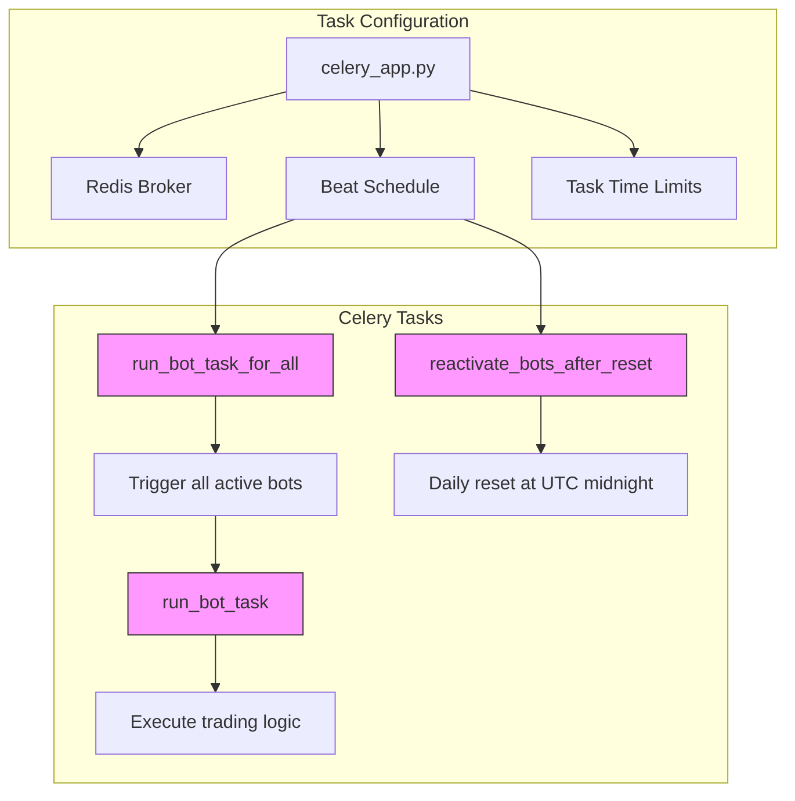
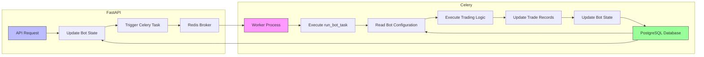
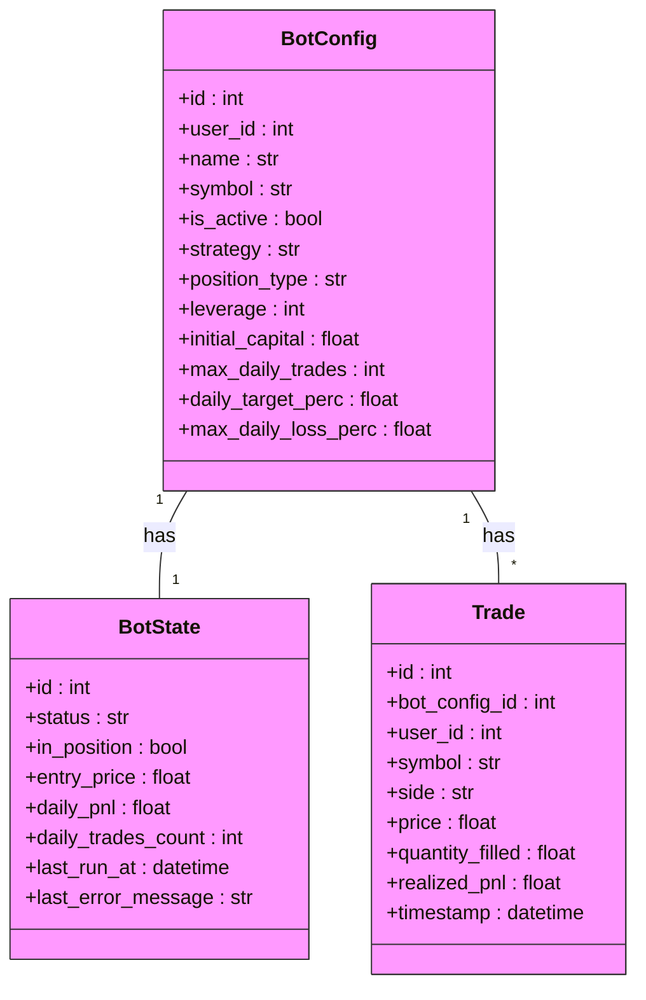

# Backend Services

<cite>
**Referenced Files in This Document**   
- [main.py](file://app/main.py)
- [bot_tasks.py](file://app/core/bot_tasks.py)
- [celery_app.py](file://app/core/celery_app.py)
- [database.py](file://app/database.py)
- [bot_config.py](file://app/models/bot_config.py)
- [bot_state.py](file://app/models/bot_state.py)
- [trade.py](file://app/models/trade.py)
- [bot_runner.py](file://app/api/routes/bot_runner.py)
- [redis_client.py](file://app/core/redis_client.py)
- [docker-compose.yml](file://docker-compose.yml)
</cite>

## Table of Contents
1. [Introduction](#introduction)
2. [FastAPI Application Architecture](#fastapi-application-architecture)
3. [Celery Task System](#celery-task-system)
4. [Integration Between FastAPI and Celery](#integration-between-fastapi-and-celery)
5. [Task Execution and Concurrency Control](#task-execution-and-concurrency-control)
6. [Error Handling and Monitoring](#error-handling-and-monitoring)
7. [Conclusion](#conclusion)

## Introduction
The TradeBot backend services are built on a modern Python stack using FastAPI for the web API and Celery for background task processing. This architecture enables the system to handle real-time trading operations while maintaining responsiveness and scalability. The backend is designed to manage automated trading bots that execute strategies based on technical indicators like EMA and RSI, with support for both spot and futures trading on Binance. The system separates concerns between the API interface and background processing, allowing user interactions to trigger long-running trading tasks without blocking the main application thread.

**Section sources**
- [main.py](file://app/main.py#L1-L94)
- [bot_tasks.py](file://app/core/bot_tasks.py#L1-L518)
- [celery_app.py](file://app/core/celery_app.py#L1-L44)

## FastAPI Application Architecture

The FastAPI application in `app/main.py` serves as the entry point for the TradeBot backend, providing a RESTful API interface for managing trading bots and their configurations. The application is configured with CORS middleware to allow cross-origin requests from the frontend, with different security settings for development and production environments. The API routes are organized into multiple modules that handle authentication, API key management, bot configuration, trade execution, and health monitoring.

The application includes several key features:
- **CORS Configuration**: The application allows all origins in development mode but restricts to a specific frontend URL in production for security.
- **Route Registration**: API routes are modularly organized and registered with the FastAPI application instance, covering authentication, bot management, trading, and health checks.
- **Startup Events**: The application performs cache warm-up operations on startup, pre-loading futures and spot symbols from Binance to improve performance.
- **Real-time Updates**: The application provides Server-Sent Events (SSE) endpoint for real-time bot status streaming, allowing the frontend to receive live updates about bot state.

```mermaid
graph TB
subgraph "FastAPI Application"
A[main.py] --> B[CORS Middleware]
A --> C[API Route Registration]
A --> D[Startup Events]
A --> E[SSE Streaming]
end
B --> F["Development: Allow All Origins"]
B --> G["Production: Specific Frontend URL"]
C --> H[auth_router]
C --> I[api_key_router]
C --> J[bot_config_router]
C --> K[bot_state_router]
C --> L[trade_router]
C --> M[bot_runner_router]
C --> N[health_router]
D --> O[warmup_futures_symbols_cache]
D --> P[warmup_spot_symbols_cache]
E --> Q[/api/v1/bots/{bot_config_id}/status-stream]
```

**Diagram sources **
- [main.py](file://app/main.py#L1-L94)

**Section sources**
- [main.py](file://app/main.py#L1-L94)
- [bot_runner.py](file://app/api/routes/bot_runner.py#L1-L56)

## Celery Task System

The Celery task system in `app/core/bot_tasks.py` provides the backbone for executing trading operations independently of the main FastAPI application thread. This separation allows the system to handle long-running trading tasks without blocking API responses. The Celery application is configured with Redis as both the message broker and result backend, ensuring reliable task queuing and execution.

Key components of the Celery task system include:
- **run_bot_task**: The primary task that executes trading logic for a specific bot configuration. This task handles market data retrieval, strategy evaluation, order execution, and state management.
- **run_bot_task_for_all**: A scheduled task that triggers `run_bot_task` for all active bots every minute, implementing the core trading loop.
- **reactivate_bots_after_reset**: A daily maintenance task that resets bot states and reactivates paused bots at midnight UTC, allowing daily trading limits to be refreshed.
- **Concurrency Control**: The system uses database row locking via `with_for_update(nowait=True)` to prevent multiple workers from executing the same bot simultaneously.

The task system is configured with beat scheduling to automate recurring operations. The `run_bot_task_for_all` task is scheduled to run every minute using a crontab expression, ensuring that active bots are regularly checked for trading opportunities. This scheduling is defined in `app/core/celery_app.py` and leverages Celery Beat for time-based task execution.



**Diagram sources **
- [bot_tasks.py](file://app/core/bot_tasks.py#L79-L108)
- [bot_tasks.py](file://app/core/bot_tasks.py#L111-L118)
- [celery_app.py](file://app/core/celery_app.py#L26-L34)

**Section sources**
- [bot_tasks.py](file://app/core/bot_tasks.py#L1-L518)
- [celery_app.py](file://app/core/celery_app.py#L1-L44)

## Integration Between FastAPI and Celery

The integration between FastAPI and Celery is a critical aspect of the TradeBot architecture, enabling seamless coordination between the API interface and background task processing. This integration is facilitated through shared database sessions and Redis as a message broker, creating a robust system for handling trading operations.

The database integration uses different connection patterns for the two systems:
- **FastAPI**: Uses asynchronous database sessions via `AsyncSession` for non-blocking API operations
- **Celery**: Uses synchronous database sessions via `SyncSessionLocal` for background task execution

Both systems connect to the same PostgreSQL database, with configuration managed through environment variables. The shared database allows FastAPI endpoints to update bot configurations and states that are then read by Celery tasks, creating a cohesive workflow.

Redis serves as the message broker for Celery, handling task queuing and communication between the FastAPI application and Celery workers. When a user starts a bot through the API, the `start_bot` endpoint in `bot_runner.py` triggers the `run_bot_task` Celery task using the `delay()` method. This decouples the API response from the actual trading execution, providing immediate feedback to the user while the trading operation runs in the background.

The Docker Compose configuration in `docker-compose.yml` defines the containerized services, including Redis and PostgreSQL, which are shared between the FastAPI application and Celery workers. This ensures consistent environment configuration across development and production deployments.



**Diagram sources **
- [database.py](file://app/database.py#L1-L24)
- [bot_tasks.py](file://app/core/bot_tasks.py#L24-L33)
- [redis_client.py](file://app/core/redis_client.py#L1-L129)
- [docker-compose.yml](file://docker-compose.yml#L1-L276)

**Section sources**
- [database.py](file://app/database.py#L1-L24)
- [bot_tasks.py](file://app/core/bot_tasks.py#L24-L33)
- [redis_client.py](file://app/core/redis_client.py#L1-L129)
- [docker-compose.yml](file://docker-compose.yml#L1-L276)

## Task Execution and Concurrency Control

The task execution system in TradeBot implements sophisticated concurrency control to ensure reliable and safe trading operations. The core mechanism is database row locking using PostgreSQL's `SELECT FOR UPDATE NOWAIT` functionality, which prevents multiple Celery workers from processing the same bot configuration simultaneously.

When a bot task executes, it first attempts to acquire a lock on the corresponding `BotState` record:
- If the lock is available, the task proceeds with trading operations
- If the lock is held by another worker, the task is skipped to prevent race conditions

This concurrency control is implemented in the `_run_bot` function in `bot_tasks.py` using SQLAlchemy's `with_for_update(nowait=True)` method. The system also includes additional safeguards:
- **Task Time Limits**: Celery tasks have both soft and hard time limits to prevent runaway processes
- **Error Handling**: Comprehensive exception handling ensures that database transactions are properly rolled back on failure
- **Retry Mechanisms**: While not explicitly shown in the code, Celery's configuration includes retry policies for failed tasks

The relationship between API routes, database models, and task execution forms a complete workflow:
1. User actions through API routes update bot configurations in the database
2. Celery tasks read these configurations and execute trading logic
3. Task results are written back to the database as trade records and updated bot states
4. The frontend receives real-time updates through SSE streams

The database models define the core entities:
- **BotConfig**: Stores bot configuration parameters including strategy settings and risk management rules
- **BotState**: Tracks the current state of each bot, including position status and performance metrics
- **Trade**: Records all executed trades with details like price, quantity, and PnL



**Diagram sources **
- [bot_config.py](file://app/models/bot_config.py#L5-L58)
- [bot_state.py](file://app/models/bot_state.py#L5-L23)
- [trade.py](file://app/models/trade.py#L5-L26)

**Section sources**
- [bot_tasks.py](file://app/core/bot_tasks.py#L125-L516)
- [bot_config.py](file://app/models/bot_config.py#L5-L58)
- [bot_state.py](file://app/models/bot_state.py#L5-L23)
- [trade.py](file://app/models/trade.py#L5-L26)

## Error Handling and Monitoring

The TradeBot backend implements comprehensive error handling and monitoring mechanisms to ensure reliable operation of trading tasks. The system is designed to gracefully handle various failure scenarios while maintaining data integrity and providing visibility into system operations.

Key error handling features include:
- **Database Transaction Management**: All Celery tasks use explicit transaction management with proper commit and rollback procedures
- **Exception Handling**: Comprehensive try-catch blocks handle specific exceptions like `OperationalError` for database locking conflicts
- **State Management**: Bot states are updated to reflect error conditions, providing visibility into issues
- **Logging**: Extensive logging using Python's logging module captures important events and errors

The monitoring considerations for long-running trading tasks include:
- **Task Time Limits**: Configured soft and hard time limits prevent tasks from running indefinitely
- **Health Checks**: Docker Compose includes health checks for all services to ensure system reliability
- **External Notifications**: Optional webhook and email notifications can be configured to alert users of trade executions
- **Metrics Collection**: The system includes counters and metrics for monitoring cache performance and other operational aspects

The error handling workflow follows a consistent pattern:
1. Attempt to execute the primary operation
2. Catch specific exceptions and handle them appropriately
3. Update the bot state to reflect the current status
4. Log the error for debugging and monitoring
5. Return a descriptive message about the outcome

This approach ensures that even when errors occur, the system remains in a consistent state and users are informed about the situation.

**Section sources**
- [bot_tasks.py](file://app/core/bot_tasks.py#L1-L518)
- [celery_app.py](file://app/core/celery_app.py#L17-L23)
- [docker-compose.yml](file://docker-compose.yml#L90-L94)

## Conclusion
The TradeBot backend services demonstrate a well-architected approach to building a trading automation system using FastAPI and Celery. The separation of concerns between the API interface and background task processing allows for responsive user interactions while handling complex trading operations. The integration of FastAPI with Celery through shared database sessions and Redis as a message broker creates a robust and scalable system.

Key architectural strengths include:
- Clear separation between synchronous API operations and asynchronous task execution
- Effective concurrency control using database row locking
- Comprehensive error handling and state management
- Flexible configuration through environment variables
- Containerized deployment using Docker Compose

The system is designed to handle the complexities of automated trading, including market data retrieval, strategy execution, order placement, and risk management. By leveraging modern Python tools and best practices, the TradeBot backend provides a solid foundation for reliable and scalable trading operations.