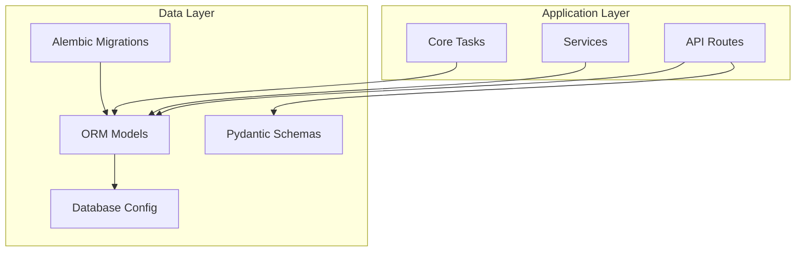
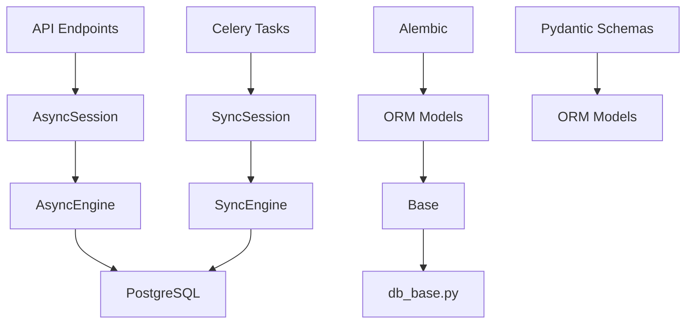
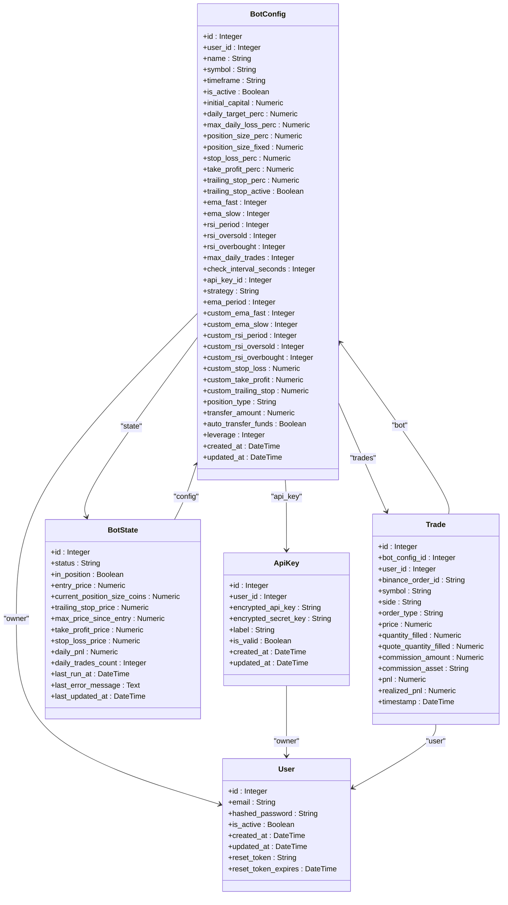
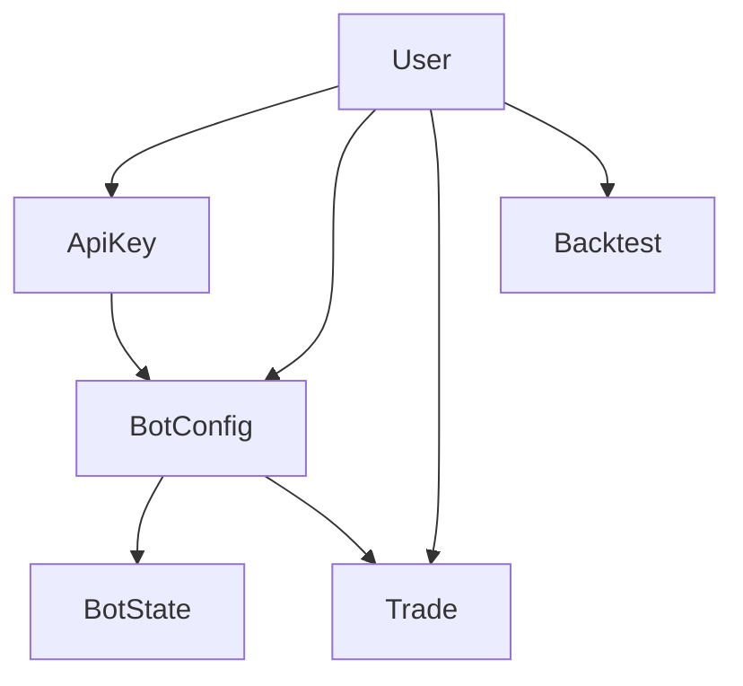

# Database Interactions and ORM

<cite>
**Referenced Files in This Document**   
- [app/models/user.py](file://app/models/user.py)
- [app/models/api_key.py](file://app/models/api_key.py)
- [app/models/bot_config.py](file://app/models/bot_config.py)
- [app/models/bot_state.py](file://app/models/bot_state.py)
- [app/models/trade.py](file://app/models/trade.py)
- [app/models/backtest.py](file://app/models/backtest.py)
- [app/database.py](file://app/database.py)
- [app/db_base.py](file://app/db_base.py)
- [app/api/routes/bot_report.py](file://app/api/routes/bot_report.py)
- [app/core/bot_tasks.py](file://app/core/bot_tasks.py)
</cite>

## Table of Contents
1. [Introduction](#introduction)
2. [Project Structure](#project-structure)
3. [Core Components](#core-components)
4. [Architecture Overview](#architecture-overview)
5. [Detailed Component Analysis](#detailed-component-analysis)
6. [Dependency Analysis](#dependency-analysis)
7. [Performance Considerations](#performance-considerations)
8. [Troubleshooting Guide](#troubleshooting-guide)
9. [Conclusion](#conclusion)

## Introduction
This document provides comprehensive documentation for the TradeBot application's SQLAlchemy ORM models and database interactions. It details the data model structure, entity relationships, field definitions, constraints, and indexing strategies for core entities including User, ApiKey, BotConfig, BotState, Trade, and Backtest. The documentation also covers session management, base model configuration, query patterns, data integrity, and integration between ORM models and API schemas via Pydantic.

## Project Structure
The TradeBot application follows a modular structure with clear separation of concerns. The database-related components are organized under the `app/` directory with distinct subdirectories for models, schemas, database configuration, and API routes. The ORM models are defined in `app/models/`, Pydantic schemas in `app/schemas/`, and database configuration in `app/database.py` and `app/db_base.py`. Alembic migration scripts in the `alembic/` directory manage schema evolution. The application uses an async PostgreSQL database with SQLAlchemy 2.0 async API for database operations.

**Diagram sources**
- [app/models/__init__.py](file://app/models/__init__.py#L1-L7)
- [alembic/versions/](file://alembic/versions/)

**Section sources**
- [app/models/__init__.py](file://app/models/__init__.py#L1-L7)
- [alembic/versions/](file://alembic/versions/)

## Core Components
The core components of the TradeBot ORM system consist of six primary models: User, ApiKey, BotConfig, BotState, Trade, and Backtest. These models represent the fundamental entities in the trading bot ecosystem, with User serving as the root entity that owns other resources. BotConfig represents a trading bot's configuration and serves as the central hub connecting to ApiKey for exchange authentication, BotState for runtime status, and Trade for transaction history. The Backtest model stores historical simulation results. The models are built on a common base from `db_base.py` and use SQLAlchemy's declarative system with proper type hints and async session support.

**Section sources**
- [app/models/user.py](file://app/models/user.py#L5-L24)
- [app/models/api_key.py](file://app/models/api_key.py#L5-L18)
- [app/models/bot_config.py](file://app/models/bot_config.py#L5-L59)
- [app/models/bot_state.py](file://app/models/bot_state.py#L5-L24)
- [app/models/trade.py](file://app/models/trade.py#L5-L27)
- [app/models/backtest.py](file://app/models/backtest.py#L6-L44)

## Architecture Overview
The TradeBot ORM architecture follows a layered design with clear separation between database models, API schemas, and business logic. The architecture centers around the BotConfig entity, which acts as the primary orchestrator for trading activities. The system uses SQLAlchemy 2.0 with asyncpg for asynchronous database operations, enabling non-blocking I/O during bot execution and reporting. The base model configuration in `db_base.py` provides a centralized declarative base without engine side effects, while `database.py` manages the async engine and session factory. The architecture supports both async operations for API endpoints and sync operations for Celery background tasks through separate session configurations.

**Diagram sources**
- [app/database.py](file://app/database.py#L1-L24)
- [app/db_base.py](file://app/db_base.py#L1-L5)

## Detailed Component Analysis

### User Model Analysis
The User model represents the application's users and serves as the root entity in the data model hierarchy. Each user can own multiple API keys, bot configurations, trades, and backtests. The model includes standard user attributes such as email (with unique constraint), hashed password, and active status, along with timestamp fields for creation and updates. It also includes fields for password reset functionality. The model establishes relationships with other entities through cascade delete-orphan semantics, ensuring data integrity when a user is removed.

**Section sources**
- [app/models/user.py](file://app/models/user.py#L5-L24)

### ApiKey Model Analysis
The ApiKey model stores encrypted API credentials for connecting to cryptocurrency exchanges, primarily Binance. Each API key belongs to a user and can be associated with multiple bot configurations. The model includes fields for encrypted API key and secret, a descriptive label, validity status, and timestamps. The encryption is handled externally by the crypto module, ensuring sensitive credentials are never stored in plaintext. The relationship with BotConfig allows multiple bots to share the same API credentials while maintaining proper ownership through the user relationship.

**Section sources**
- [app/models/api_key.py](file://app/models/api_key.py#L5-L18)

### BotConfig Model Analysis
The BotConfig model represents a trading bot's configuration and serves as the central entity in the system. It contains comprehensive trading parameters including strategy settings (EMA periods, RSI thresholds), risk management controls (stop loss, take profit, trailing stop), position sizing options, and daily limits (trade count, profit target, loss threshold). The model supports both spot and futures trading with leverage configuration. It establishes critical relationships with User (ownership), ApiKey (authentication), BotState (runtime status), and Trade (execution history). The model includes advanced features like custom strategy parameters and fund transfer automation.

**Diagram sources**
- [app/models/bot_config.py](file://app/models/bot_config.py#L5-L59)
- [app/models/user.py](file://app/models/user.py#L5-L24)
- [app/models/api_key.py](file://app/models/api_key.py#L5-L18)
- [app/models/bot_state.py](file://app/models/bot_state.py#L5-L24)
- [app/models/trade.py](file://app/models/trade.py#L5-L27)

**Section sources**
- [app/models/bot_config.py](file://app/models/bot_config.py#L5-L59)

### BotState Model Analysis
The BotState model captures the runtime state of a trading bot, serving as a persistent memory between execution cycles. It uses a one-to-one relationship with BotConfig through a shared primary key, ensuring each bot has exactly one state record. The model tracks critical runtime information including current status (running, stopped, error), position status (in_position), entry price, trailing stop levels, daily performance metrics (daily_pnl, daily_trades_count), and error conditions. The last_updated_at field with server_default and onupdate ensures accurate timestamping of state changes. This model enables the system to maintain continuity across bot executions and supports real-time monitoring through SSE streams.

**Section sources**
- [app/models/bot_state.py](file://app/models/bot_state.py#L5-L24)
- [app/main.py](file://app/main.py#L67-L93)

### Trade Model Analysis
The Trade model records individual trading transactions executed by bots. Each trade is linked to a specific BotConfig and User, maintaining proper ownership and attribution. The model captures comprehensive trade details including order metadata (binance_order_id, symbol, side, order_type), execution data (price, quantity_filled, quote_quantity_filled), financial results (pnl, realized_pnl), and fees (commission_amount, commission_asset). The binance_order_id has a unique constraint to prevent duplicate records. The model supports both spot and futures trading by capturing relevant data points. The relationship with BotConfig enables aggregation of trade history for performance analysis and reporting.

**Section sources**
- [app/models/trade.py](file://app/models/trade.py#L5-L27)
- [app/api/routes/bot_report.py](file://app/api/routes/bot_report.py#L1-L111)

### Backtest Model Analysis
The Backtest model stores the results of historical trading simulations. It captures both input parameters (symbol, interval, date range, strategy parameters) and output metrics (initial_capital, final_capital, total_return, win_rate, total_fees). The model uses JSON fields for flexible storage of strategy parameters and detailed results (daily_results, monthly_results). It supports both spot and futures market types and includes metadata for test configuration. The relationship with User ensures proper ownership and access control. This model enables users to evaluate strategy performance before deploying bots with real funds.

**Section sources**
- [app/models/backtest.py](file://app/models/backtest.py#L6-L44)

## Dependency Analysis
The TradeBot ORM models exhibit a well-defined dependency hierarchy with User at the root. The dependency graph shows that BotConfig depends on both User and ApiKey, while BotState and Trade depend on BotConfig. The Backtest model depends directly on User. This structure ensures data integrity and proper ownership semantics. The system uses cascade delete-orphan relationships to automatically clean up dependent records when parent entities are removed. The database configuration in `database.py` depends on environment variables for connection settings, while the models depend on the base declarative class from `db_base.py`. Alembic migrations depend on the model definitions to generate schema changes.

**Diagram sources**
- [app/models/user.py](file://app/models/user.py#L5-L24)
- [app/models/api_key.py](file://app/models/api_key.py#L5-L18)
- [app/models/bot_config.py](file://app/models/bot_config.py#L5-L59)
- [app/models/bot_state.py](file://app/models/bot_state.py#L5-L24)
- [app/models/trade.py](file://app/models/trade.py#L5-L27)
- [app/models/backtest.py](file://app/models/backtest.py#L6-L44)

**Section sources**
- [app/models/user.py](file://app/models/user.py#L5-L24)
- [app/models/api_key.py](file://app/models/api_key.py#L5-L18)
- [app/models/bot_config.py](file://app/models/bot_config.py#L5-L59)

## Performance Considerations
The TradeBot ORM implementation includes several performance optimizations. Indexes are created on foreign key columns (user_id, bot_config_id, api_key_id) and frequently queried fields (email in User, binance_order_id in Trade). The async database operations prevent blocking during I/O-intensive operations like fetching market data or executing trades. The use of relationship loading strategies (e.g., selectinload) in API routes minimizes N+1 query problems. For reporting endpoints, the system uses direct SQL queries with appropriate filtering and pagination to handle large datasets efficiently. The BotState model's one-to-one relationship with BotConfig through a shared primary key optimizes state lookups. The daily reset task uses bulk operations to update multiple records efficiently.

**Section sources**
- [app/api/routes/bot_report.py](file://app/api/routes/bot_report.py#L1-L111)
- [app/core/bot_tasks.py](file://app/core/bot_tasks.py#L79-L109)

## Troubleshooting Guide
Common database-related issues in TradeBot typically involve connection problems, data integrity violations, or performance bottlenecks. Connection issues may arise from incorrect DATABASE_URL configuration or network problems with the PostgreSQL server. Data integrity issues can occur when foreign key constraints are violated, such as attempting to create a BotConfig with a non-existent User or ApiKey ID. Performance issues may manifest as slow API responses, particularly on trade history endpoints with large datasets, which can be mitigated by ensuring proper indexing and query optimization. The system logs database operations and errors through the standard logging framework, with detailed error messages for debugging. The daily reset task includes error handling and rollback mechanisms to maintain data consistency.

**Section sources**
- [app/database.py](file://app/database.py#L1-L24)
- [app/core/bot_tasks.py](file://app/core/bot_tasks.py#L79-L109)

## Conclusion
The TradeBot ORM system provides a robust foundation for managing trading bot configurations, state, and execution history. The data model is well-structured with clear relationships between entities, ensuring data integrity and proper ownership semantics. The implementation leverages SQLAlchemy 2.0's async capabilities for efficient database operations while maintaining compatibility with sync operations for background tasks. The integration between ORM models and Pydantic schemas enables seamless data validation and API response formatting. The system includes comprehensive features for trading strategies, risk management, and performance tracking, supported by a solid database architecture with appropriate indexing and optimization strategies.