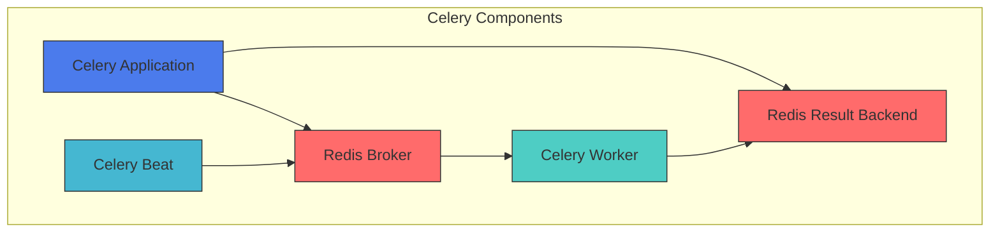
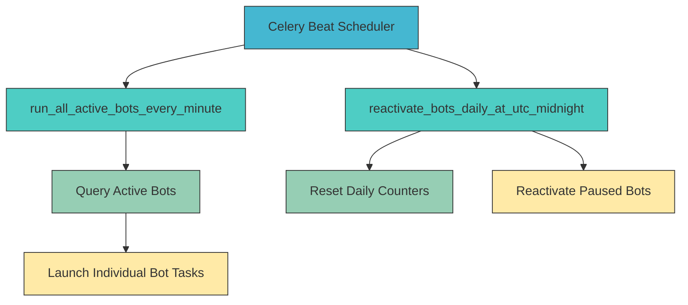
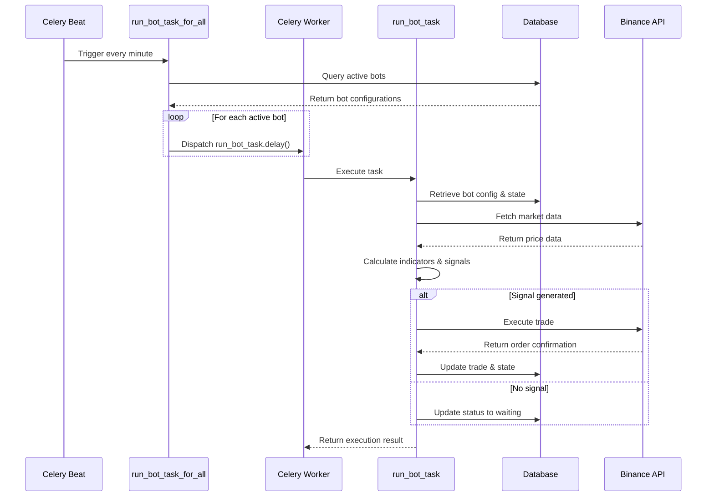
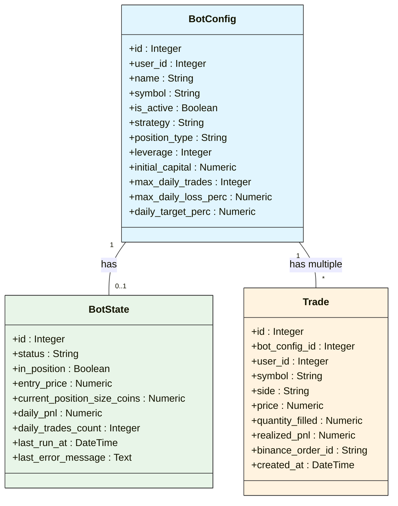
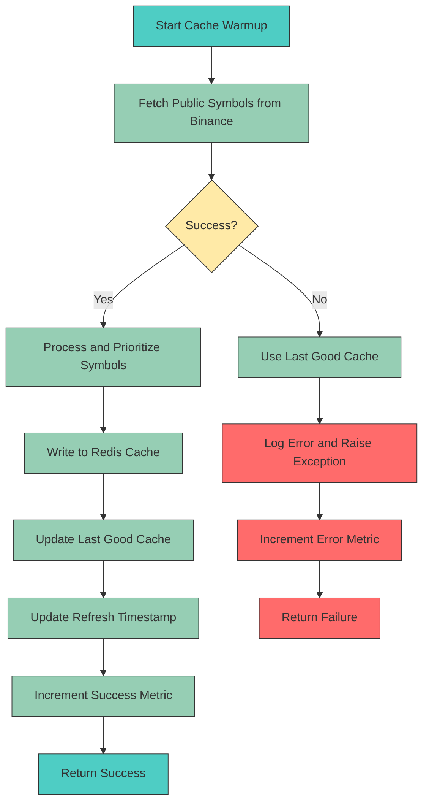

# Task Scheduling and Execution

<cite>
**Referenced Files in This Document**   
- [bot_tasks.py](file://app/core/bot_tasks.py)
- [celery_app.py](file://app/core/celery_app.py)
- [cache_warmup_tasks.py](file://app/core/cache_warmup_tasks.py)
- [redis_client.py](file://app/core/redis_client.py)
- [binance_client.py](file://app/core/binance_client.py)
- [bot_config.py](file://app/models/bot_config.py)
- [bot_state.py](file://app/models/bot_state.py)
- [docker-compose.yml](file://docker-compose.yml)
</cite>

## Table of Contents
1. [Introduction](#introduction)
2. [Celery Application Configuration](#celery-application-configuration)
3. [Periodic and Triggered Task Implementation](#periodic-and-triggered-task-implementation)
4. [Automated Trading Loop Execution](#automated-trading-loop-execution)
5. [Concurrency Control and Database Integration](#concurrency-control-and-database-integration)
6. [Cache Warming and Market Data Management](#cache-warming-and-market-data-management)
7. [Error Handling and Retry Mechanisms](#error-handling-and-retry-mechanisms)
8. [Performance Considerations for High-Frequency Trading](#performance-considerations-for-high-frequency-trading)
9. [Integration with FastAPI and Inter-Process Communication](#integration-with-fastapi-and-inter-process-communication)
10. [Conclusion](#conclusion)

## Introduction
The TradeBot system implements a robust task scheduling and execution framework using Celery for managing automated trading operations. This document provides a comprehensive analysis of the Celery-based architecture, focusing on the implementation of periodic and triggered tasks that power the automated trading loop. The system is designed to handle both scheduled operations and event-driven executions with high reliability and fault tolerance. The core components include the Celery application configuration, task scheduling mechanisms, database integration patterns, and inter-process communication through Redis. The architecture supports high-frequency trading scenarios while maintaining data consistency and operational safety through various concurrency control mechanisms and error handling strategies.

**Section sources**
- [bot_tasks.py](file://app/core/bot_tasks.py#L1-L518)
- [celery_app.py](file://app/core/celery_app.py#L1-L44)

## Celery Application Configuration
The Celery application is configured in `celery_app.py` with Redis serving as both the message broker and result backend. The configuration establishes a distributed task queue system that enables asynchronous execution of trading operations. The broker URL and result backend are sourced from environment variables, with default values pointing to a local Redis instance. The Celery application is initialized with the name "tradebot" and includes two core modules: `app.core.bot_tasks` and `app.core.cache_warmup_tasks`, which contain the business logic for trading operations and market data caching respectively.

The configuration includes several safety-oriented settings to ensure reliable task execution. The `task_acks_late` parameter ensures that tasks are only acknowledged after completion, preventing data loss if a worker crashes during execution. The `worker_prefetch_multiplier` is set to 1 to prevent workers from prefetching too many tasks, which could lead to uneven load distribution. Task rejection on worker loss is enabled to ensure that incomplete tasks are returned to the queue. Time limits are enforced with a soft limit of 150 seconds and a hard limit of 180 seconds, configurable through environment variables.

**Diagram sources**
- [celery_app.py](file://app/core/celery_app.py#L1-L44)
- [docker-compose.yml](file://docker-compose.yml#L29-L48)

**Section sources**
- [celery_app.py](file://app/core/celery_app.py#L1-L44)

## Periodic and Triggered Task Implementation
The system implements both periodic and triggered tasks through Celery Beat, the periodic task scheduler for Celery. Two primary scheduled tasks are configured in the `celery_app.conf.beat_schedule`: `run-all-active-bots-every-minute` and `reactivate-bots-daily-at-utc-midnight`. The first task executes every minute, triggering the automated trading loop for all active bots, while the second runs daily at UTC midnight to reset bot states and reactivate any paused bots.

The `run_all_active_bots-every-minute` task calls the `run_bot_task_for_all` function, which queries the database for all active bot configurations and initiates individual trading tasks for each bot. This design allows for horizontal scaling, as multiple Celery workers can process these tasks in parallel. The daily reset task, `reactivate_bots_after_reset`, serves to clear daily trading counters and re-enable bots that may have been paused due to reaching daily trading limits. This ensures that bots start fresh each day, preventing them from being permanently disabled by temporary conditions.

**Diagram sources**
- [celery_app.py](file://app/core/celery_app.py#L26-L35)
- [bot_tasks.py](file://app/core/bot_tasks.py#L79-L110)

**Section sources**
- [celery_app.py](file://app/core/celery_app.py#L26-L35)
- [bot_tasks.py](file://app/core/bot_tasks.py#L79-L110)

## Automated Trading Loop Execution
The core of the automated trading system is the `run_bot_task_for_all` function, which powers the trading loop by orchestrating the execution of individual bot tasks. This function queries the database for all active bot configurations and launches a separate Celery task for each bot using the `run_bot_task.delay()` method. The use of asynchronous task dispatching allows the system to handle multiple bots concurrently, with each bot's trading logic executed in isolation.

The `run_bot_task` function, decorated with `@celery_app.task`, serves as the entry point for individual bot execution. It delegates to the `_run_bot` function, which contains the core trading logic. This separation allows for easier testing and direct function calls when needed. The trading loop follows a comprehensive sequence: retrieving bot configuration, establishing database connections, initializing the Binance API client, fetching market data, evaluating trading strategies, executing trades, and updating bot state.

The EMA trading strategy implementation demonstrates a sophisticated approach to algorithmic trading. It calculates exponential moving averages and RSI indicators from historical price data to generate trading signals. The system incorporates comprehensive risk management features, including stop-loss, take-profit, and trailing stop mechanisms. Position sizing is dynamically calculated based on user-defined parameters, with additional safeguards to prevent excessive leverage and ensure compliance with exchange-specific order requirements.

**Diagram sources**
- [bot_tasks.py](file://app/core/bot_tasks.py#L111-L119)
- [bot_tasks.py](file://app/core/bot_tasks.py#L121-L124)

**Section sources**
- [bot_tasks.py](file://app/core/bot_tasks.py#L111-L119)
- [bot_tasks.py](file://app/core/bot_tasks.py#L121-L124)

## Concurrency Control and Database Integration
The system implements robust concurrency control mechanisms to prevent race conditions and ensure data consistency during bot execution. The primary mechanism is database row-level locking using the `with_for_update(nowait=True)` method on the `BotState` table. When a bot task starts, it attempts to acquire a lock on its corresponding bot state record. If another worker has already locked the record, the operation fails immediately with an `OperationalError`, causing the task to be skipped. This ensures that only one instance of each bot can run at a time, preventing duplicate trades and state corruption.

Database integration is handled through a synchronous SQLAlchemy engine and session factory, specifically configured for Celery tasks. The `SyncSessionLocal` sessionmaker creates thread-safe database sessions for use in the Celery workers. The system distinguishes between synchronous and asynchronous database URLs through environment variables, allowing for different configurations in development and production environments. The database connection is established at the module level, ensuring that it is available throughout the task execution lifecycle.

The integration between FastAPI and Celery is facilitated through shared database models and configuration. Both the web application and Celery workers use the same SQLAlchemy models defined in the `app.models` package, ensuring consistency in data access patterns. The `BotConfig` and `BotState` models maintain the configuration and runtime state of trading bots, with relationships that enable efficient querying and updates. The system uses a shared Redis instance for inter-process communication, allowing the web interface to monitor bot status and performance metrics in real-time.

**Diagram sources**
- [bot_tasks.py](file://app/core/bot_tasks.py#L133-L144)
- [bot_config.py](file://app/models/bot_config.py#L5-L57)
- [bot_state.py](file://app/models/bot_state.py#L5-L22)

**Section sources**
- [bot_tasks.py](file://app/core/bot_tasks.py#L133-L144)
- [bot_config.py](file://app/models/bot_config.py#L5-L57)
- [bot_state.py](file://app/models/bot_state.py#L5-L22)

## Cache Warming and Market Data Management
The system implements a comprehensive cache warming strategy to optimize market data access and reduce API rate limit consumption. The cache warming tasks are defined in `cache_warmup_tasks.py` and are responsible for periodically refreshing Redis caches with the latest market symbols from Binance. Two separate tasks, `warmup_spot_symbols_cache` and `warmup_futures_symbols_cache`, handle spot and futures market data respectively.

These tasks use the Binance public API endpoints to fetch trading symbols without requiring API keys, making them resilient to authentication issues. The fetched data is processed to filter for USDT pairs and prioritize popular cryptocurrencies like BTC, ETH, and BNB. The processed symbol lists are then stored in Redis with configurable TTL (time-to-live) values, ensuring that the cache is refreshed regularly. The system maintains both a current cache and a "last good" backup, allowing it to fall back to previously successful data if the API call fails.

The cache warming tasks are registered dynamically using the `@celery_app.on_after_configure.connect` decorator, which adds periodic tasks to the Celery Beat scheduler. This approach allows for flexible configuration through environment variables without modifying the static beat schedule. The tasks include comprehensive error handling and retry mechanisms, with automatic retries on failure using exponential backoff. Success and failure metrics are tracked in Redis, providing visibility into cache health and performance.

**Diagram sources**
- [cache_warmup_tasks.py](file://app/core/cache_warmup_tasks.py#L41-L68)
- [cache_warmup_tasks.py](file://app/core/cache_warmup_tasks.py#L87-L114)
- [redis_client.py](file://app/core/redis_client.py#L116-L127)

**Section sources**
- [cache_warmup_tasks.py](file://app/core/cache_warmup_tasks.py#L41-L68)
- [cache_warmup_tasks.py](file://app/core/cache_warmup_tasks.py#L87-L114)
- [redis_client.py](file://app/core/redis_client.py#L116-L127)

## Error Handling and Retry Mechanisms
The system implements comprehensive error handling and retry mechanisms to ensure reliability in the face of network issues, API rate limits, and other transient failures. The Celery task configuration includes built-in retry functionality with exponential backoff, as evidenced by the `autoretry_for`, `retry_backoff`, and `max_retries` parameters in the cache warming tasks. This allows tasks to automatically retry on failure, with increasing delays between attempts to avoid overwhelming external services.

The Binance client wrapper includes a sophisticated retry mechanism in the `_retry` method, which handles specific Binance API exceptions such as rate limiting (-1003), order throttling (-1015), and timestamp errors (-1021). The retry logic implements exponential backoff with jitter to prevent thundering herd problems, where multiple tasks simultaneously retry after a failure. The backoff delay is calculated based on the attempt number and multiplied by a random factor to distribute retry attempts over time.

Application-level error handling is implemented throughout the trading logic, with specific error states recorded in the bot state. For example, if API key decryption fails, the bot state is updated to "error (api key decrypt failed)" with the specific error message. Similarly, failures in Binance client initialization, price fetching, and order execution are captured and reflected in the bot's status. This detailed error reporting enables effective monitoring and troubleshooting.

The system also implements defensive programming practices to handle edge cases and invalid data. For instance, when calculating position sizes, the code includes fallback mechanisms and validation checks to ensure that order quantities meet exchange requirements. The use of `getattr` with default values provides resilience against missing configuration parameters, while explicit type casting ensures data consistency.

**Section sources**
- [bot_tasks.py](file://app/core/bot_tasks.py#L151-L163)
- [bot_tasks.py](file://app/core/bot_tasks.py#L222-L229)
- [binance_client.py](file://app/core/binance_client.py#L74-L96)

## Performance Considerations for High-Frequency Trading
The system incorporates several performance optimizations to support high-frequency trading scenarios. The Celery configuration is tuned for low-latency task processing, with settings like `worker_prefetch_multiplier=1` preventing workers from prefetching too many tasks and potentially causing uneven load distribution. The task time limits (150 seconds soft, 180 seconds hard) ensure that no single task can monopolize worker resources for an extended period.

Database operations are optimized through the use of synchronous connections specifically configured for Celery tasks, avoiding the overhead of asynchronous database adapters. The row-level locking mechanism on the `BotState` table is implemented with `nowait=True` to prevent tasks from blocking indefinitely when a bot is already running. This immediate failure mode allows the system to quickly skip locked bots and process others, improving overall throughput.

Market data access is optimized through the cache warming strategy, which reduces the need for real-time API calls during bot execution. By pre-fetching and caching symbol lists, the system minimizes latency and API rate limit consumption. The Binance client wrapper includes rate limit awareness through the `_respect_rate_limit_from_response` method, which monitors the X-MBX-USED-WEIGHT headers and introduces delays when approaching rate limits.

The trading strategy implementation is designed for efficiency, with indicator calculations performed locally using simple algorithms rather than relying on external services. The EMA and RSI calculations are implemented in pure Python without external dependencies, reducing execution time and eliminating network latency. The system also includes optimizations for order execution, such as normalizing order quantities to meet exchange requirements and using market orders for faster execution.

**Section sources**
- [celery_app.py](file://app/core/celery_app.py#L18-L23)
- [bot_tasks.py](file://app/core/bot_tasks.py#L135-L144)
- [binance_client.py](file://app/core/binance_client.py#L98-L109)

## Integration with FastAPI and Inter-Process Communication
The integration between FastAPI and Celery is facilitated through shared database models, configuration, and Redis-based inter-process communication. Both components use the same SQLAlchemy models defined in the `app.models` package, ensuring data consistency across the application. The shared Redis instance serves as a communication channel, allowing the FastAPI web interface to monitor bot status and performance metrics in real-time.

The system uses environment variables to share configuration between FastAPI and Celery, including database URLs, Redis connection details, and API credentials. This unified configuration approach ensures that both components operate with consistent settings. The `docker-compose.yml` file defines the services with shared environment variables, enabling seamless integration in both development and production environments.

Inter-process communication is primarily achieved through the shared database and Redis cache. The FastAPI application can update bot configurations, which are then read by Celery workers during the next execution cycle. Similarly, bot state updates made by Celery tasks are immediately visible to the FastAPI application, enabling real-time monitoring through the web interface. The Redis cache stores market data that can be accessed by both components, reducing redundant API calls.

The system also supports optional webhook notifications and email alerts, which are triggered by Celery tasks but can be configured through the FastAPI interface. This event-driven notification system allows users to receive trade confirmations through their preferred channels. The webhook functionality demonstrates a loosely coupled integration pattern, where the trading system sends events to external services without requiring direct dependencies.

**Section sources**
- [celery_app.py](file://app/core/celery_app.py#L6-L7)
- [redis_client.py](file://app/core/redis_client.py#L12-L13)
- [docker-compose.yml](file://docker-compose.yml#L59-L62)

## Conclusion
The Celery-based task scheduling system in TradeBot provides a robust foundation for automated trading operations. The architecture effectively balances reliability, performance, and scalability through careful configuration of Celery, strategic use of Redis for both messaging and caching, and thoughtful integration with the FastAPI web application. The system's implementation of periodic and triggered tasks enables both scheduled trading activities and event-driven responses, while comprehensive error handling and retry mechanisms ensure resilience in production environments.

Key strengths of the system include its sophisticated concurrency control, which prevents race conditions through database row locking, and its efficient market data management through proactive cache warming. The integration between FastAPI and Celery is seamless, leveraging shared database models and Redis for real-time communication. For high-frequency trading scenarios, the system's performance optimizations, including tuned Celery settings and efficient database access patterns, provide a solid foundation for low-latency trading operations.

Future enhancements could include more sophisticated monitoring through Celery Flower, additional trading strategies, and enhanced risk management features. The modular design of the system makes it well-suited for such extensions, as new tasks and strategies can be added without disrupting existing functionality.