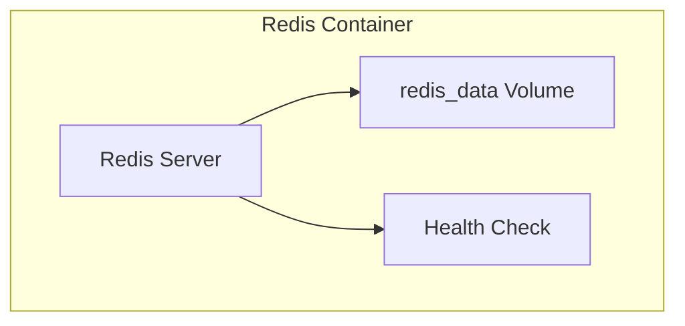
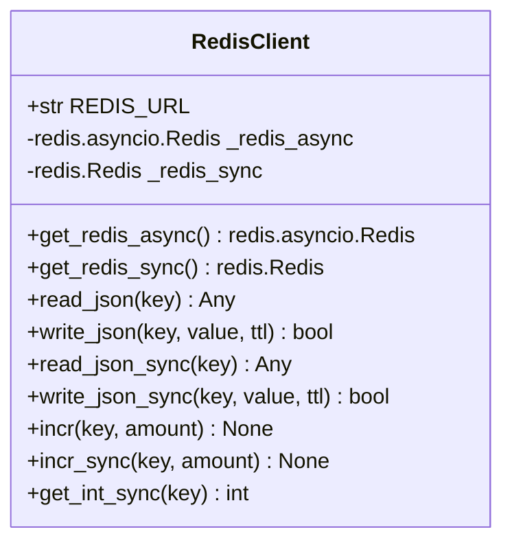
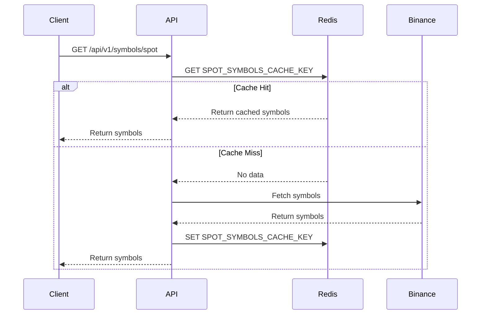
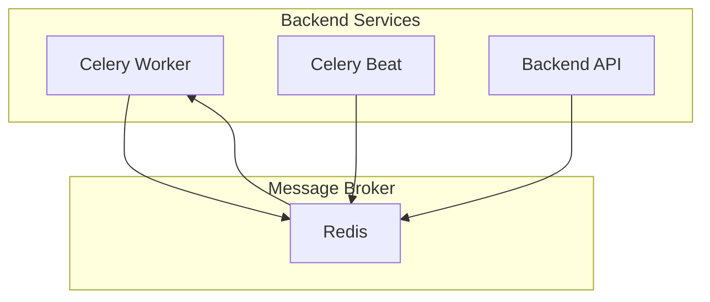
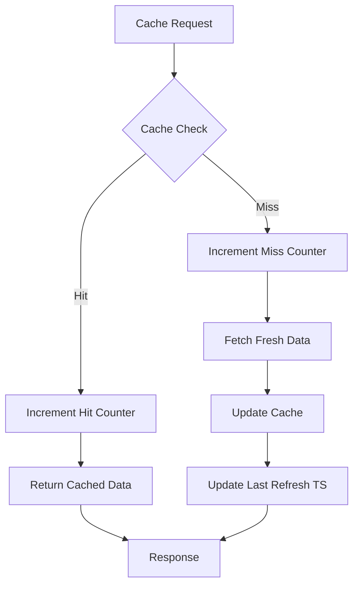

# Cache and Messaging

<cite>
**Referenced Files in This Document**   
- [docker-compose.yml](file://docker-compose.yml)
- [app/core/redis_client.py](file://app/core/redis_client.py)
- [app/core/cache.py](file://app/core/cache.py)
- [app/core/celery_app.py](file://app/core/celery_app.py)
- [app/api/routes/symbols.py](file://app/api/routes/symbols.py)
- [app/core/cache_warmup_tasks.py](file://app/core/cache_warmup_tasks.py)
</cite>

## Table of Contents
1. [Introduction](#introduction)
2. [Redis Container Configuration](#redis-container-configuration)
3. [Redis Client Implementation](#redis-client-implementation)
4. [Cache System Architecture](#cache-system-architecture)
5. [Message Broker Configuration](#message-broker-configuration)
6. [Data Serialization and Management](#data-serialization-and-management)
7. [Performance Monitoring and Metrics](#performance-monitoring-and-metrics)
8. [Error Handling and Resilience](#error-handling-and-resilience)
9. [System Dependencies and Availability](#system-dependencies-and-availability)

## Introduction
The TradeBot system utilizes Redis as a dual-purpose service for caching frequently accessed data and serving as a message broker for distributed task processing. This documentation details the Redis implementation across the application stack, covering container configuration, client patterns, caching strategies, and messaging infrastructure. Redis plays a critical role in enhancing system performance through data caching and enabling asynchronous task execution via Celery.

## Redis Container Configuration

The Redis service is defined in the docker-compose.yml file with specific configuration for production deployment. The container uses the official Redis 7-alpine image and exposes port 6379 for client connections. Data persistence is achieved through a dedicated volume mount at /data, ensuring cache durability across container restarts.

**Diagram sources**
- [docker-compose.yml](file://docker-compose.yml#L29-L47)

**Section sources**
- [docker-compose.yml](file://docker-compose.yml#L29-L47)

## Redis Client Implementation

The Redis client implementation in app/core/redis_client.py provides both synchronous and asynchronous access patterns through singleton patterns. The system uses environment variables to determine the Redis connection URL, with fallback to localhost for development environments. Two global client instances are maintained: one asynchronous client using redis.asyncio.Redis and one synchronous client using redis.Redis.

The implementation includes helper functions for JSON serialization, counter operations, and predefined cache keys for trading symbols. Connection pooling is handled automatically by the Redis client library, with connections established on first access and reused throughout the application lifecycle.

**Diagram sources**
- [app/core/redis_client.py](file://app/core/redis_client.py#L11-L129)

**Section sources**
- [app/core/redis_client.py](file://app/core/redis_client.py#L11-L129)

## Cache System Architecture

Redis serves as the primary cache for frequently accessed trading data, particularly trading symbols for spot and futures markets. The cache system implements a multi-layered approach with primary cache keys, fallback mechanisms, and metadata tracking. The SPOT_SYMBOLS_CACHE_KEY pattern follows a consistent naming convention of "cache:symbols:spot:v1" with versioning for cache invalidation.

Cache operations are integrated into the symbols API routes, where requests first check the Redis cache before falling back to external API calls. The system implements cache hit/miss counters and maintains a "last good" cache state to ensure availability during external service failures. Cache warmup tasks run periodically to pre-populate the cache and reduce latency for subsequent requests.

**Diagram sources**
- [app/core/redis_client.py](file://app/core/redis_client.py#L115-L127)
- [app/api/routes/symbols.py](file://app/api/routes/symbols.py#L52-L134)
- [app/core/cache_warmup_tasks.py](file://app/core/cache_warmup_tasks.py#L41-L68)

**Section sources**
- [app/core/redis_client.py](file://app/core/redis_client.py#L115-L127)
- [app/api/routes/symbols.py](file://app/api/routes/symbols.py#L52-L134)
- [app/core/cache_warmup_tasks.py](file://app/core/cache_warmup_tasks.py#L41-L68)

## Message Broker Configuration

Redis functions as the message broker for Celery task distribution, enabling asynchronous processing of trading operations and periodic tasks. The configuration in app/core/celery_app.py sets both the broker URL and result backend to Redis, creating a unified messaging and state management system. This dual usage allows Celery to distribute tasks through Redis queues and store task results for later retrieval.

The Celery worker and beat services, defined in docker-compose.yml, depend on Redis health checks before starting, ensuring message broker availability. The system configures task acknowledgments, prefetch limits, and time limits to prevent message loss and ensure reliable task processing. Periodic tasks such as bot execution and cache warmup are scheduled through Celery Beat with Redis as the schedule backend.

**Diagram sources**
- [app/core/celery_app.py](file://app/core/celery_app.py#L6-L23)
- [docker-compose.yml](file://docker-compose.yml#L104-L145)

**Section sources**
- [app/core/celery_app.py](file://app/core/celery_app.py#L6-L23)
- [docker-compose.yml](file://docker-compose.yml#L104-L145)

## Data Serialization and Management

The system employs JSON as the primary serialization format for Redis data storage, enabling structured data exchange between services. The redis_client.py module provides dedicated functions for reading and writing JSON data with optional TTL (time-to-live) parameters for automatic cache expiration. This approach allows complex data structures like trading symbol lists to be stored and retrieved efficiently.

Cache invalidation follows a time-based strategy with configurable TTL values controlled by environment variables. The SPOT_SYMBOLS_CACHE_KEY and similar keys are refreshed either through explicit writes from API requests or through periodic cache warmup tasks. The system maintains separate cache keys for different data types and market types (spot vs. futures), preventing conflicts and enabling targeted invalidation.

**Section sources**
- [app/core/redis_client.py](file://app/core/redis_client.py#L36-L85)
- [app/api/routes/symbols.py](file://app/api/routes/symbols.py#L113-L117)

## Performance Monitoring and Metrics

Redis is used to track cache performance metrics through dedicated counter keys. The system maintains separate counters for cache hits and misses using keys like SPOT_SYMBOLS_CACHE_HIT_KEY and SPOT_SYMBOLS_CACHE_MISS_KEY. These metrics provide visibility into cache effectiveness and help identify potential performance issues.

Additional metrics track cache refresh timestamps and warmup task success rates, enabling monitoring of cache freshness and reliability. The metrics system uses Redis atomic increment operations to ensure accurate counting even under high concurrency. These performance indicators can be used for system optimization and capacity planning.

**Diagram sources**
- [app/core/redis_client.py](file://app/core/redis_client.py#L118-L120)
- [app/api/routes/symbols.py](file://app/api/routes/symbols.py#L62-L63)

**Section sources**
- [app/core/redis_client.py](file://app/core/redis_client.py#L118-L120)
- [app/api/routes/symbols.py](file://app/api/routes/symbols.py#L62-L63)

## Error Handling and Resilience

The Redis implementation includes comprehensive error handling to maintain system resilience during cache failures. All Redis operations are wrapped in try-catch blocks that log errors but allow the application to continue functioning. When cache reads fail, the system falls back to direct data retrieval from external sources. For write failures, the application continues with the understanding that future requests may experience cache misses.

A critical resilience feature is the "last good" cache pattern, where successful cache states are preserved in separate keys (e.g., SPOT_SYMBOLS_CACHE_LAST_GOOD_KEY). When both the primary cache and external data sources fail, the system can serve stale but valid data from this fallback cache, ensuring continued operation during external service outages.

**Section sources**
- [app/core/redis_client.py](file://app/core/redis_client.py#L38-L46)
- [app/api/routes/symbols.py](file://app/api/routes/symbols.py#L127-L134)

## System Dependencies and Availability

Redis availability is critical to the overall system functionality, with multiple services depending on its operation. The docker-compose.yml file establishes explicit dependencies between services, requiring Redis to pass health checks before the backend, Celery worker, and Celery beat services start. The health check uses conditional logic to handle both password-protected and unprotected Redis instances, executing a ping command with authentication when a password is configured.

The Redis server is configured with append-only file (AOF) persistence to prevent data loss during restarts. The command configuration includes conditional password protection, ensuring the server only requires authentication when the REDIS_PASSWORD environment variable is set. This design provides security in production environments while maintaining ease of setup in development.

**Section sources**
- [docker-compose.yml](file://docker-compose.yml#L42-L47)
- [app/core/redis_client.py](file://app/core/redis_client.py#L12-L13)