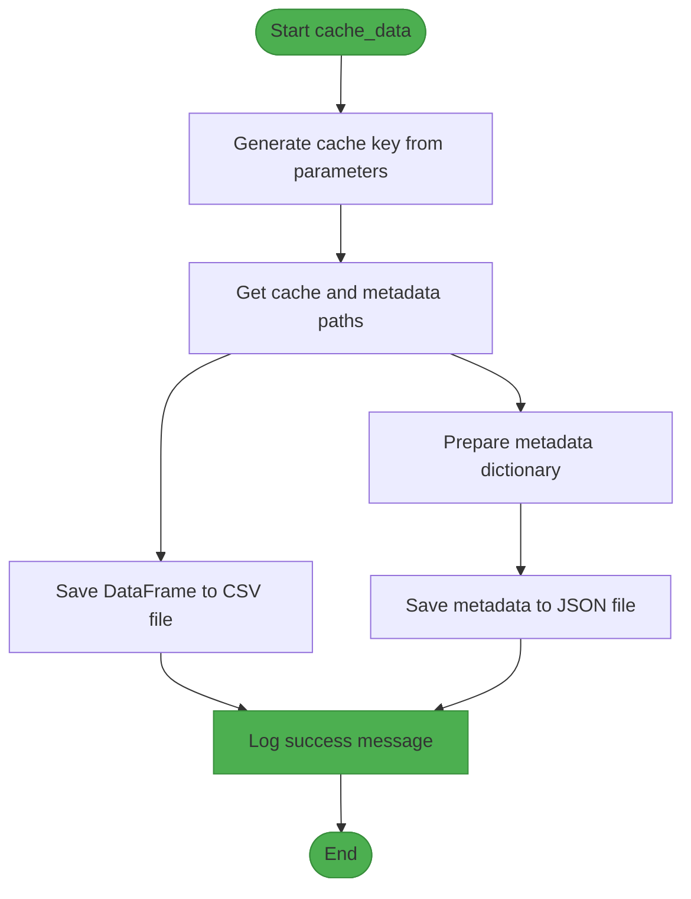
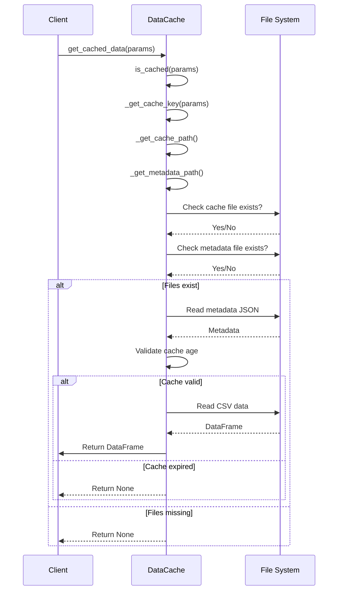
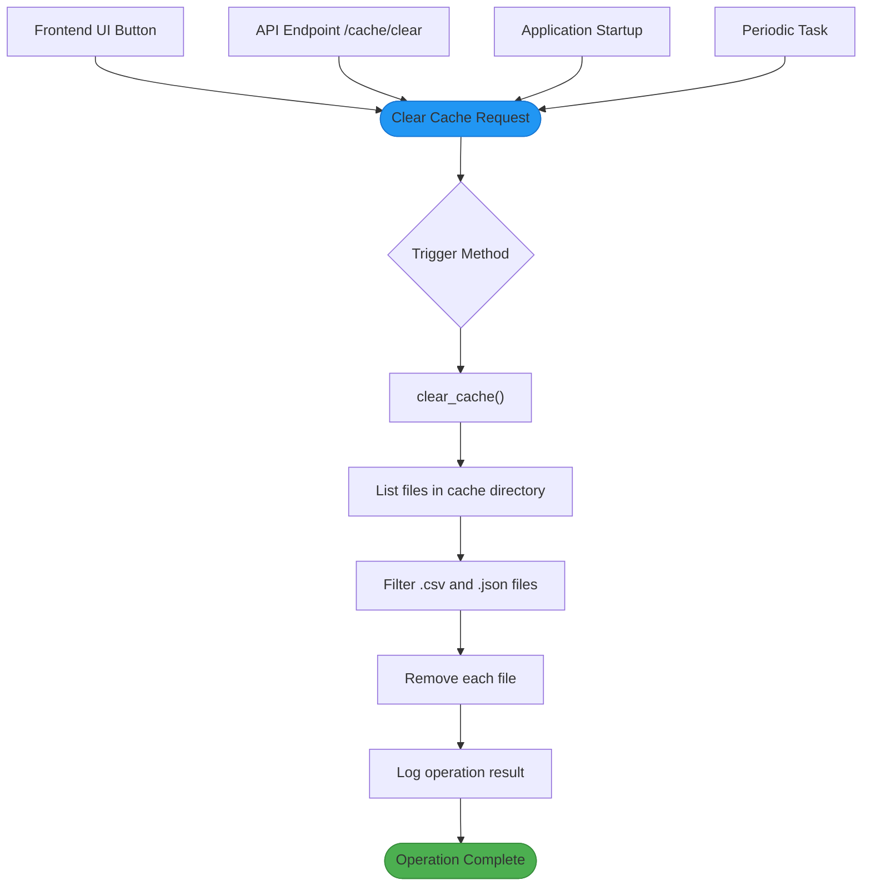
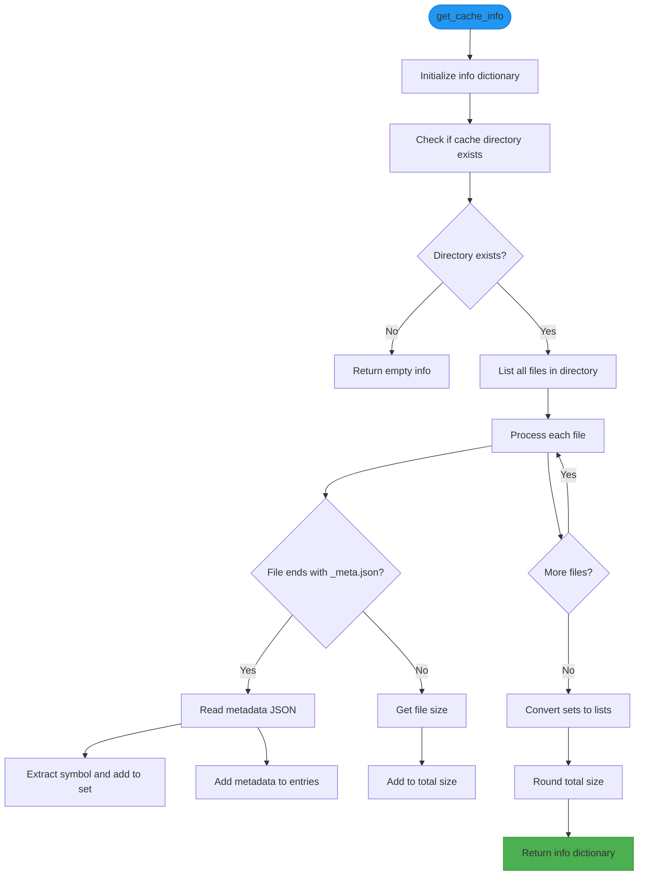

# Cache Lifecycle Management

<cite>
**Referenced Files in This Document**   
- [DataCache](file://app/core/cache.py)
- [BacktestService](file://app/services/backtest_service.py)
- [redis_client.py](file://app/core/redis_client.py)
- [backtest.py](file://app/api/routes/backtest.py)
- [cache_warmup_tasks.py](file://app/core/cache_warmup_tasks.py)
</cite>

## Table of Contents
1. [Introduction](#introduction)
2. [Cache Initialization and Directory Setup](#cache-initialization-and-directory-setup)
3. [Cache Write Process and Data Serialization](#cache-write-process-and-data-serialization)
4. [Cache Read and Validation Process](#cache-read-and-validation-process)
5. [Time-Based Invalidation Rules](#time-based-invalidation-rules)
6. [Cache Clearing Mechanism](#cache-clearing-mechanism)
7. [Cache Metrics and Performance Monitoring](#cache-metrics-and-performance-monitoring)
8. [Administrative Cache Insights](#administrative-cache-insights)
9. [Error Handling and Resilience](#error-handling-and-resilience)
10. [Cache Health Monitoring and Optimization](#cache-health-monitoring-and-optimization)

## Introduction
The TradeBot system implements a comprehensive cache lifecycle management system to optimize performance and reduce redundant data retrieval operations. This document details the complete lifecycle of cached data, from initialization and writing to reading, validation, expiration, and cleanup. The system uses a hybrid approach combining filesystem storage with Redis for metadata and metrics, ensuring both persistence and high-performance access. The cache is primarily used for storing historical market data used in backtesting and trading operations, significantly reducing API calls to external services like Binance.

## Cache Initialization and Directory Setup

The cache system is initialized through the `DataCache` class, which establishes the cache directory structure during instantiation. When a `DataCache` object is created, it accepts an optional `cache_dir` parameter that defaults to "cache/data". The constructor uses `os.makedirs()` with `exist_ok=True` to ensure the directory exists, creating it if necessary. This initialization occurs when the `BacktestService` is instantiated, where the cache directory is set to an absolute path using `os.path.join(os.getcwd(), "cache", "data")`. This ensures consistent cache location regardless of the execution context. The system also performs logging to verify the cache directory's existence and contents during initialization.

**Section sources**
- [cache.py](file://app/core/cache.py#L8-L11)
- [backtest_service.py](file://app/services/backtest_service.py#L23-L38)

## Cache Write Process and Data Serialization

The cache write process is managed by the `cache_data` method of the `DataCache` class, which stores pandas DataFrames to the filesystem in CSV format. The process begins by generating a unique cache key using the `_get_cache_key` method, which creates an MD5 hash from the combination of symbol, interval, start date, end date, and market type (spot/futures). The data is then serialized to CSV using `df.to_csv()` with `index=False` to maintain clean output. Simultaneously, metadata is generated as a JSON object containing key information such as symbol, interval, date range, market type, cache timestamp, row count, and the cache key itself. This metadata is stored in a separate JSON file with the suffix "_meta.json". Both the CSV data file and JSON metadata file are written to the cache directory, ensuring atomic operations through separate file writes.



**Diagram sources **
- [cache.py](file://app/core/cache.py#L93-L121)

**Section sources**
- [cache.py](file://app/core/cache.py#L93-L121)

## Cache Read and Validation Process

The cache read and validation process is implemented through the `is_cached` and `get_cached_data` methods of the `DataCache` class. The `is_cached` method performs comprehensive validation by checking both the existence of the cache file and its associated metadata file. If either file is missing, the method returns false. When both files exist, the method reads the metadata JSON to determine cache validity based on time-based rules. The `get_cached_data` method first calls `is_cached` to validate the cache entry, and only proceeds to read the data if the cache is valid. The CSV file is read using `pd.read_csv()`, and the timestamp column is converted from string to datetime format to ensure proper temporal analysis. This two-step process ensures that only valid, properly formatted data is returned to the calling application.



**Diagram sources **
- [cache.py](file://app/core/cache.py#L25-L72)
- [cache.py](file://app/core/cache.py#L74-L91)

**Section sources**
- [cache.py](file://app/core/cache.py#L25-L91)

## Time-Based Invalidation Rules

The cache system implements sophisticated time-based invalidation rules that differentiate between recent and historical data. For recent data (where the end date is within one day of the current date), the cache has a 24-hour expiration period. This ensures that trading strategies using current market data always have access to up-to-date information. For historical data (where the end date is more than one day in the past), the cache never expires, recognizing that historical market data is immutable. This distinction is implemented in the `is_cached` method, which calculates the number of days between the current date and the end date of the cached data. If this difference is less than or equal to one day, the method checks whether the cache age is less than 24 hours. Otherwise, it returns true immediately, indicating that the historical data remains valid indefinitely.

**Section sources**
- [cache.py](file://app/core/cache.py#L57-L69)

## Cache Clearing Mechanism

The cache clearing mechanism is implemented through the `clear_cache` method of the `DataCache` class, which provides both manual and automated cleanup operations. The method iterates through all files in the cache directory and removes any files with .csv or .json extensions, which correspond to cached data and metadata files. This operation is wrapped in a try-except block to handle potential file system errors gracefully. The clearing mechanism is accessible through multiple interfaces: programmatically via the `DataCache` class, through the backtesting API endpoints, and via the frontend user interface. The API exposes a POST endpoint at `/api/v1/backtest/cache/clear` that calls the `clear_cache` method, allowing users to clear the cache through HTTP requests. Additionally, the system supports automated cache cleanup through periodic tasks and application startup routines.



**Diagram sources **
- [cache.py](file://app/core/cache.py#L123-L131)
- [backtest.py](file://app/api/routes/backtest.py#L105-L119)

**Section sources**
- [cache.py](file://app/core/cache.py#L123-L131)
- [backtest.py](file://app/api/routes/backtest.py#L105-L119)

## Cache Metrics and Performance Monitoring

The TradeBot system implements cache performance monitoring through Redis counters that track cache hits and misses atomically. While the primary data cache uses the filesystem, the system leverages Redis for metrics collection, ensuring high-performance, atomic updates. The `incr_sync` function in `redis_client.py` is used to increment Redis counters for cache hits and misses. These metrics are stored under specific keys such as `metrics:cache_hit:symbols_spot` and `metrics:cache_miss:symbols_futures`. The atomic increment operations ensure accurate counting even under high concurrency. These metrics are updated when the system accesses symbol information from cache, providing valuable insights into cache effectiveness. The system also tracks warm-up operations with success and error counters, allowing administrators to monitor the health of cache population processes.

```mermaid
graph TD
A[Cache Operation] --> B{Cache Hit?}
B --> |Yes| C[incr_sync(cache_hit_key)]
B --> |No| D[incr_sync(cache_miss_key)]
C --> E[Redis Counter Incremented]
D --> E
E --> F[Metrics Available for Monitoring]
G[Application] --> A
H[Redis Server] < --> E
style E fill:#4CAF50,stroke:#388E3C
style H fill:#9C27B0,stroke:#7B1FA2
```

**Diagram sources **
- [redis_client.py](file://app/core/redis_client.py#L97-L102)

**Section sources**
- [redis_client.py](file://app/core/redis_client.py#L97-L102)
- [cache_warmup_tasks.py](file://app/core/cache_warmup_tasks.py)

## Administrative Cache Insights

Administrative insights into cache usage are provided through the `get_cache_info` method of the `DataCache` class and exposed via the `/api/v1/backtest/cache/info` API endpoint. The `get_cache_info` method scans the cache directory and aggregates information about all cached entries, including total file count, cached symbols, total size in megabytes, and detailed metadata for each cache entry. The method processes each metadata file to extract symbol information and calculate the total cache size by summing individual file sizes. This information is returned as a dictionary with standardized keys. The API endpoint wraps this functionality, making cache statistics available to the frontend for display in the administrative interface. The frontend Backtest page includes a cache information panel that shows total cache entries, size, and detailed breakdown of cached data, allowing users to monitor cache utilization.



**Diagram sources **
- [cache.py](file://app/core/cache.py#L133-L190)
- [backtest.py](file://app/api/routes/backtest.py#L72-L88)

**Section sources**
- [cache.py](file://app/core/cache.py#L133-L190)
- [backtest.py](file://app/api/routes/backtest.py#L72-L88)

## Error Handling and Resilience

The cache system implements comprehensive error handling throughout the lifecycle to ensure resilience against various failure modes. Each major operation—cache validation, data reading, data writing, cache clearing, and cache information retrieval—is wrapped in try-except blocks that catch exceptions and return appropriate fallback values or log errors without crashing the application. For example, if metadata reading fails during cache validation, the method returns false, treating the cache as invalid rather than propagating the error. Similarly, if file size calculation fails for a particular file, the system logs the error but continues processing other files. The system also handles missing cache directories gracefully, returning empty information rather than raising exceptions. These error handling mechanisms ensure that cache failures do not disrupt the primary functionality of the trading system, allowing it to continue operating, potentially with reduced performance due to cache misses.

**Section sources**
- [cache.py](file://app/core/cache.py#L43-L72)
- [cache.py](file://app/core/cache.py#L80-L90)
- [cache.py](file://app/core/cache.py#L96-L121)
- [cache.py](file://app/core/cache.py#L126-L131)
- [cache.py](file://app/core/cache.py#L143-L189)

## Cache Health Monitoring and Optimization

Cache health monitoring and optimization in the TradeBot system is achieved through a combination of automated processes, manual controls, and comprehensive metrics. The system implements cache warm-up tasks that periodically refresh symbol caches for both spot and futures markets, ensuring that commonly accessed data is pre-loaded and available. These tasks run at configurable intervals (defaulting to every 300 seconds) and update Redis caches with the latest symbol information. The system also provides multiple avenues for monitoring cache health: real-time logging of cache operations, Redis metrics for hit/miss ratios, and administrative UI components that display cache statistics. For optimization, the system uses appropriate cache expiration policies that balance data freshness with performance, and the hybrid storage approach (filesystem for large data, Redis for metadata) optimizes both storage efficiency and access speed. Users can manually clear the cache when needed, and the system automatically manages cache validity based on data recency.

**Section sources**
- [cache_warmup_tasks.py](file://app/core/cache_warmup_tasks.py)
- [redis_client.py](file://app/core/redis_client.py)
- [main.py](file://app/main.py#L35-L68)
- [backtest.py](file://app/api/routes/backtest.py)
- [BacktestPage.jsx](file://frontend/src/pages/Backtest/BacktestPage.jsx)